.. _ERPyA: http://erpya.com
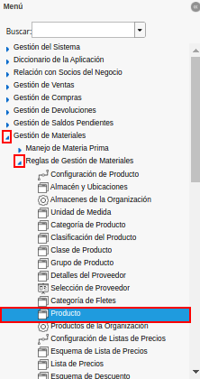
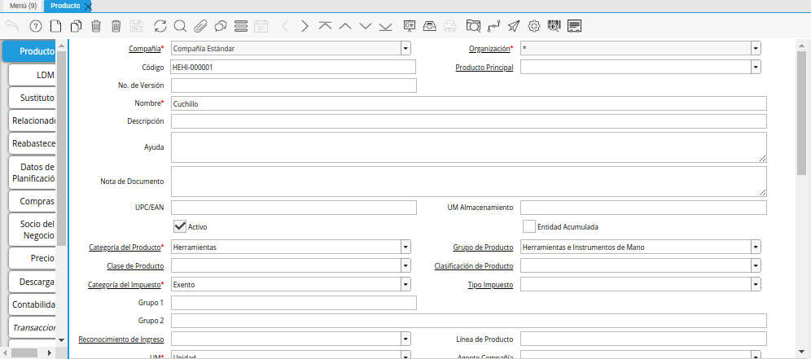

.. |Campo Inventario de Producto| image:: resources/product-inventory-field-from-the-accounting-tab.png
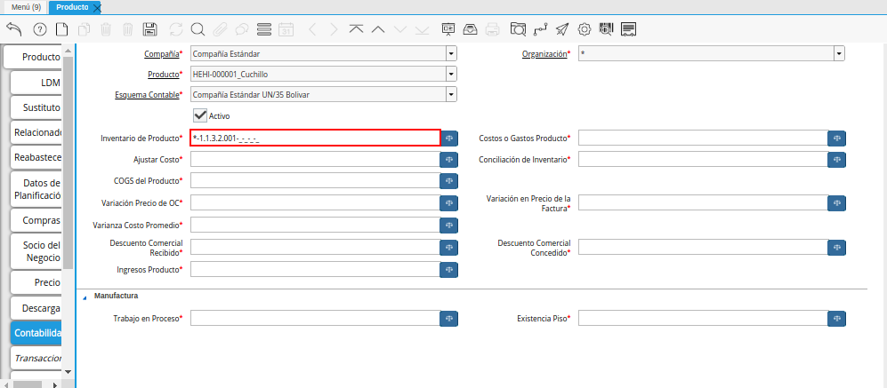

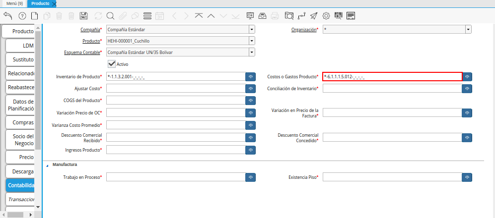

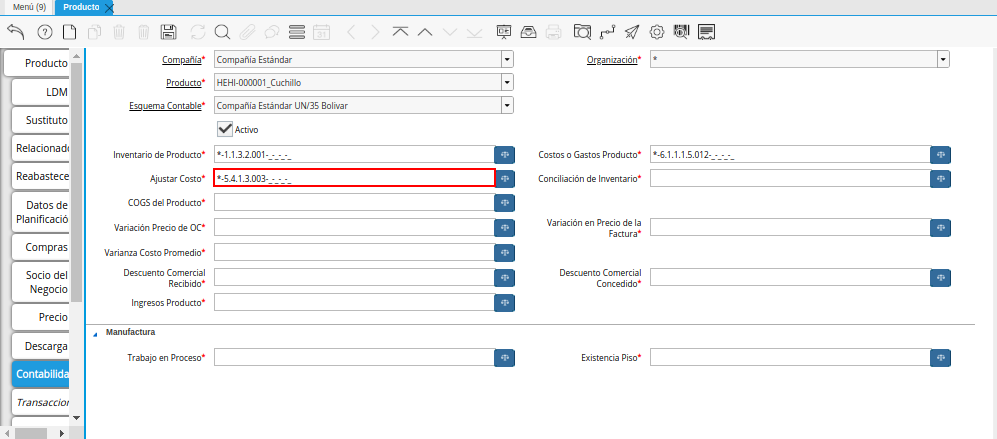
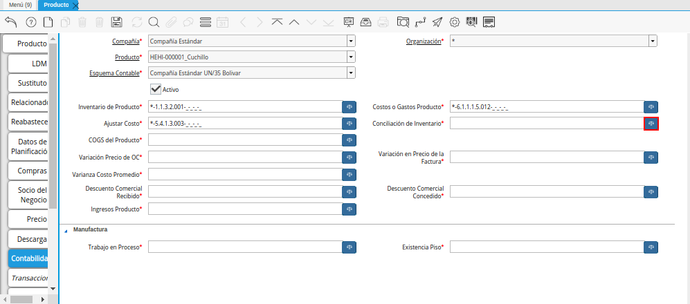
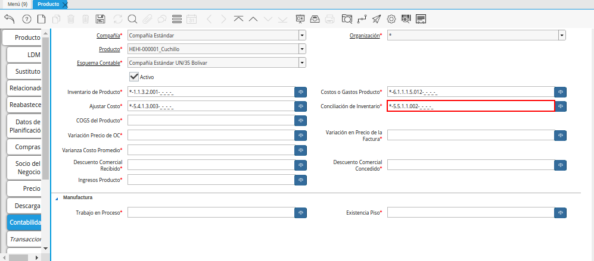
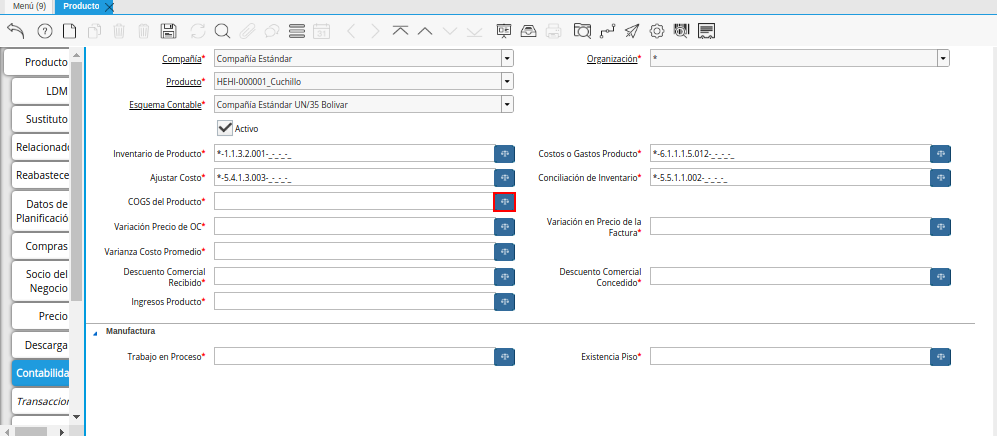
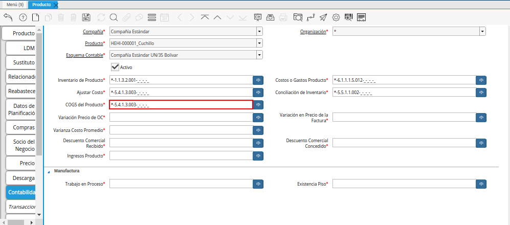
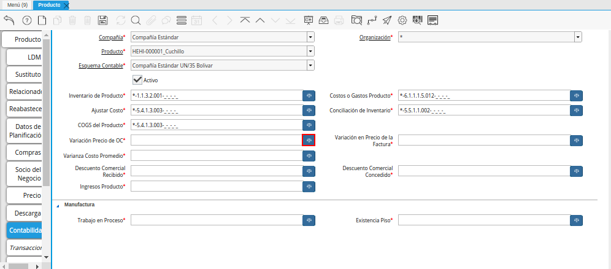
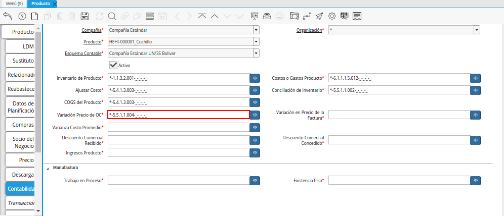
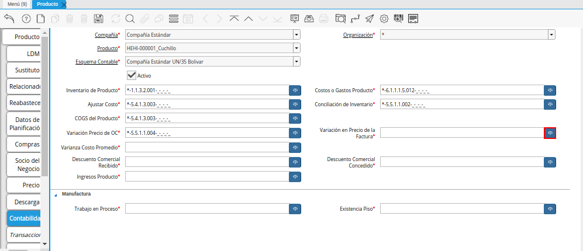
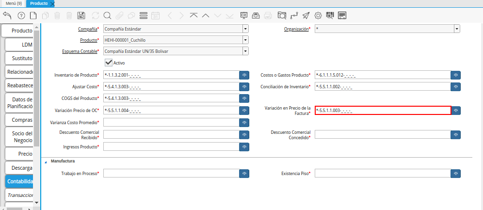
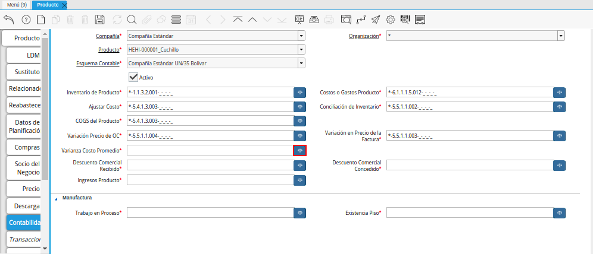
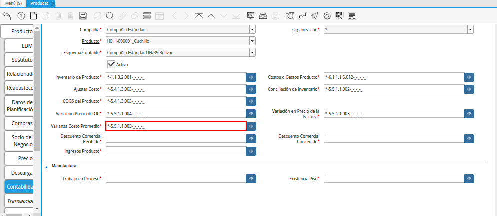
.. |Campo Descuento Comercial Recibido| image:: resources/sales-discount-field-received-from-the-accounting-tab.png
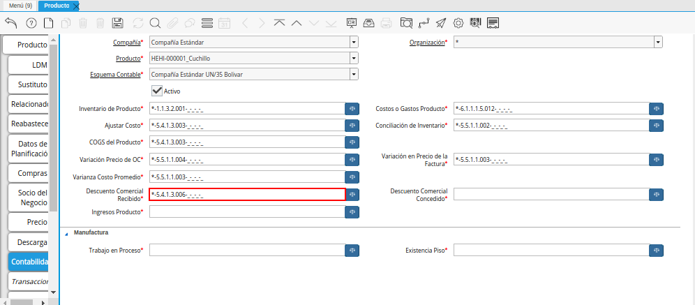
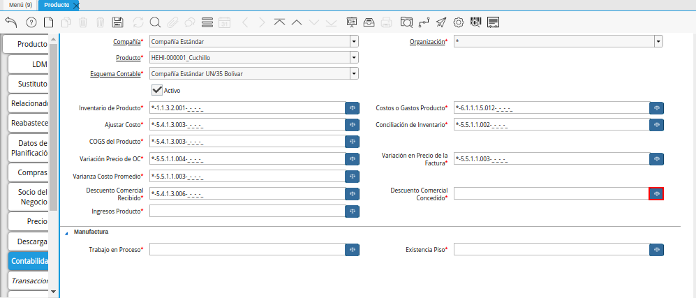
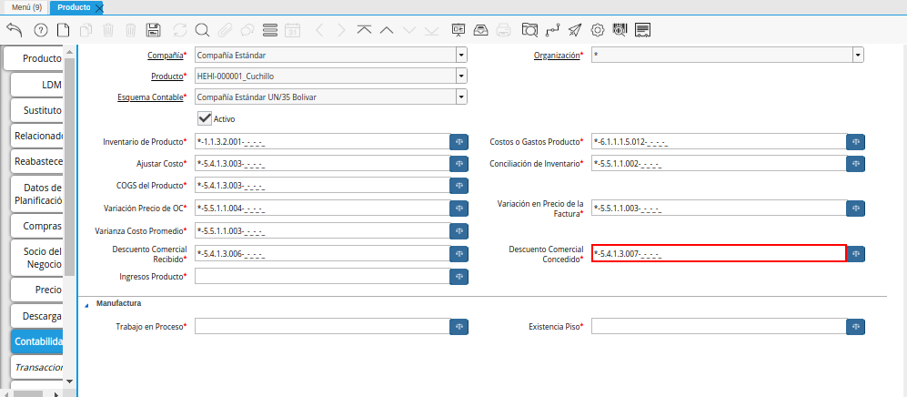
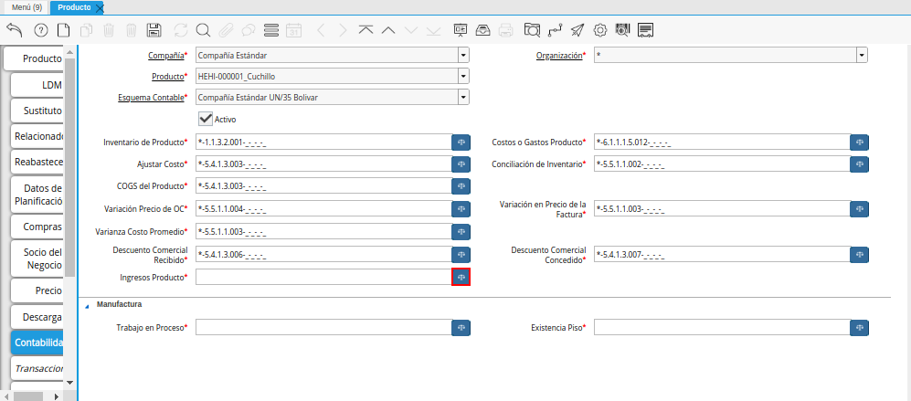
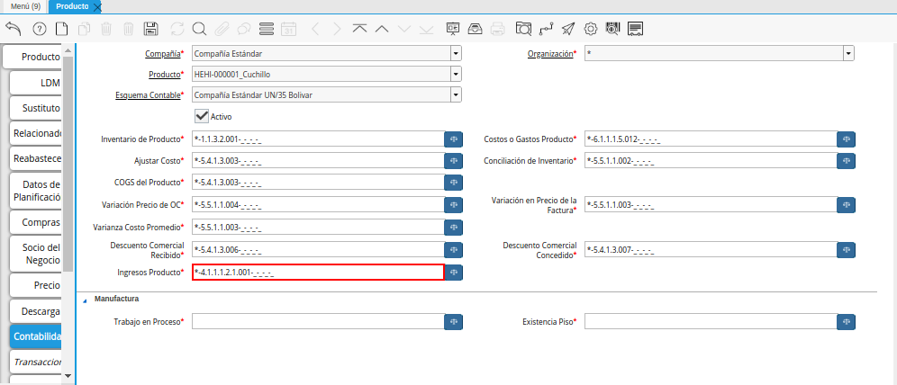
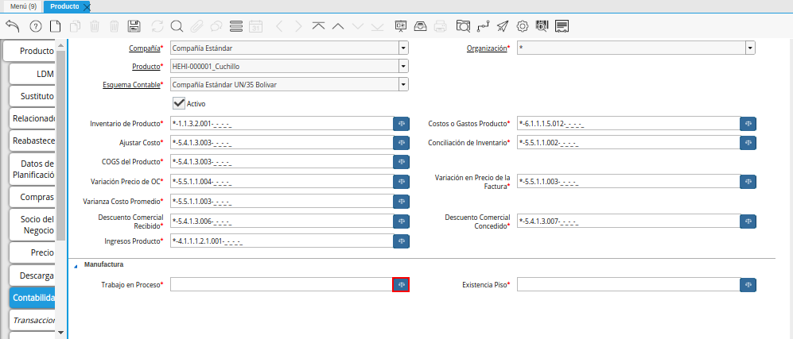
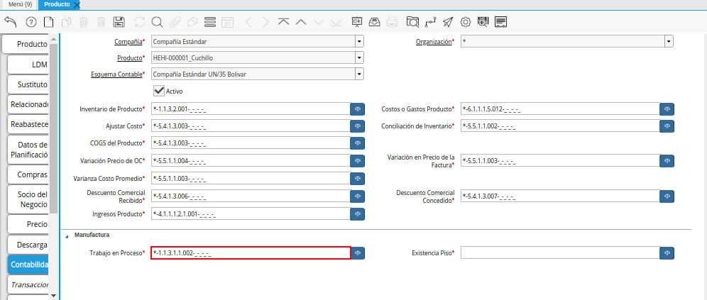

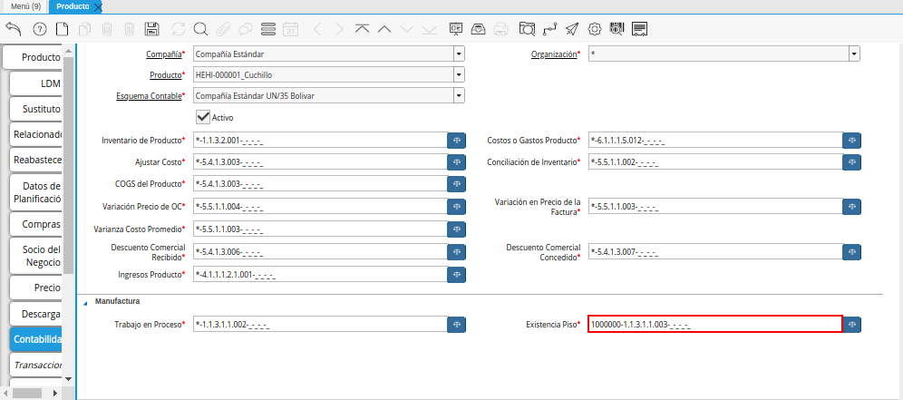
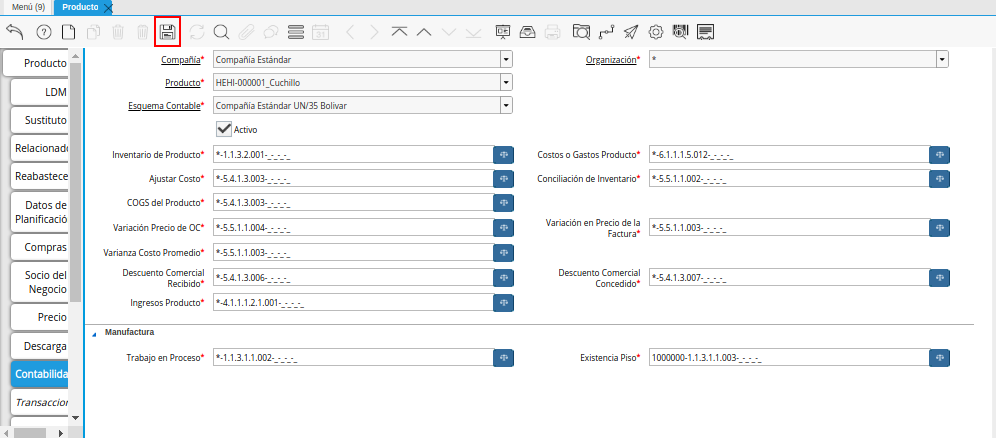

.. _documento/configuración-contable-producto:

**Producto**
============

#. Ubique en el menú de ADempiere, la carpeta "**Gestión de Materiales**", luego seleccione la carpeta "**Reglas de Gestión de Materiales**", por último seleccione la ventana "**Producto**".

    |Menú de ADempiere|

    Imagen 1. Menú de ADempiere

#. Podrá visualizar la ventana "**Producto**" con todos los registros de los productos de la empresa. 

    |Ventana Producto|

    Imagen 2. Ventana Producto

#. Seleccione la pestaña "**Contabilidad**" para definir la configuración contable del producto.

    |Pestaña Contabilidad|

    Imagen 3. Pestaña Contabilidad

    .. note::

        Por defecto, la pestaña "**Contabilidad**", trae precargados los campos "**Compañía**", "**Organización**" y "**Producto**" con la información ingresada en la pestaña "**Producto**". De igual forma, al seleccionar la versión de lista de precios en la pestaña "**Precio**", trae cargado el esquema contable configurado.

#. Seleccione el icono ubicado del lado derecho del campo "**Inventario de Producto**", para seleccionar la combinación contable para el inventario del producto al cual le esta configurando la contabilidad.

    |Campo Inventario de Producto|

    Imagen 4. Campo Inventario de Producto

    #. Realice el procedimiento regular para configurar una combinación contable, el mismo se encuentra explicado en el documento :ref:`documento/combinación-contable` elaborado por `ERPyA`_.

        |Combinación Contable del Campo Inventario de Producto|

        Imagen 5. Combinación Contable del Campo Inventario de Producto

#. Seleccione el icono ubicado del lado derecho del campo "**Costos o Gastos Producto**", para seleccionar la combinación contable para los costos o gastos del producto al cual le esta configurando la contabilidad.

    |Campo Costos o Gastos Producto|

    Imagen 6. Campo Costos o Gastos Producto

    #. Realice el procedimiento regular para configurar una combinación contable, el mismo se encuentra explicado en el documento :ref:`documento/combinación-contable` elaborado por `ERPyA`_.

        |Combinación Contable del Campo Costos o Gastos Producto|

        Imagen 7. Combinación Contable del Campo Costos o Gastos Producto

#. Seleccione el icono ubicado del lado derecho del campo "**Ajustar Costo**", para seleccionar la combinación contable para los ajustes del costo del producto al cual le esta configurando la contabilidad.

    |Campo Ajustar Costo|

    Imagen 8. Campo Ajustar Costo

    #. Realice el procedimiento regular para configurar una combinación contable, el mismo se encuentra explicado en el documento :ref:`documento/combinación-contable` elaborado por `ERPyA`_.

        |Combinación Contable del Campo Ajustar Costo|

        Imagen 9. Combinación Contable del Campo Ajustar Costo

#. Seleccione el icono ubicado del lado derecho del campo "**Conciliación de Inventario**", para seleccionar la combinación contable para la conciliación de inventario del producto al cual le esta configurando la contabilidad.

    |Campo Conciliación de Inventario|

    Imagen 10. Campo Conciliación de Inventario

    #. Realice el procedimiento regular para configurar una combinación contable, el mismo se encuentra explicado en el documento :ref:`documento/combinación-contable` elaborado por `ERPyA`_.

        |Combinación Contable del Campo Conciliación de Inventario|

        Imagen 11. Combinación Contable del Campo Conciliación de Inventario

#. Seleccione el icono ubicado del lado derecho del campo "**COGS del Producto**", para seleccionar la combinación contable para el COGS del producto al cual le esta configurando la contabilidad.

    |Campo COGS del Producto|

    Imagen 12. Campo COGS del Producto

    #. Realice el procedimiento regular para configurar una combinación contable, el mismo se encuentra explicado en el documento :ref:`documento/combinación-contable` elaborado por `ERPyA`_.

        |Combinación Contable del Campo COGS del Producto|

        Imagen 13. Combinación Contable del Campo COGS del Producto

#. Seleccione el icono ubicado del lado derecho del campo "**Variación Precio de OC**", para seleccionar la combinación contable para la variación del precio de orden de compra del producto al cual le esta configurando la contabilidad.

    |Campo Variación Precio de OC|

    Imagen 14. Campo Variación Precio de OC

    #. Realice el procedimiento regular para configurar una combinación contable, el mismo se encuentra explicado en el documento :ref:`documento/combinación-contable` elaborado por `ERPyA`_.

        |Combinación Contable del Campo Variación Precio de OC|

        Imagen 15. Combinación Contable del Campo Variación Precio de OC

#. Seleccione el icono ubicado del lado derecho del campo "**Variación en Precio de la Factura**", para seleccionar la combinación contable para la variación en el precio de la factura del producto al cual le esta configurando la contabilidad.

    |Campo Variación en Precio de la Factura|

    Imagen 16. Campo Variación en Precio de la Factura

    #. Realice el procedimiento regular para configurar una combinación contable, el mismo se encuentra explicado en el documento :ref:`documento/combinación-contable` elaborado por `ERPyA`_.

        |Combinación Contable del Campo Variación en Precio de la Factura|

        Imagen 17. Combinación Contable del Campo Variación en Precio de la Factura

#. Seleccione el icono ubicado del lado derecho del campo "**Varianza Costo Promedio**", para seleccionar la combinación contable para la varianza del costo promedio del producto al cual le esta configurando la contabilidad.

    |Campo Varianza Costo Promedio|

    Imagen 18. Campo Varianza Costo Promedio

    #. Realice el procedimiento regular para configurar una combinación contable, el mismo se encuentra explicado en el documento :ref:`documento/combinación-contable` elaborado por `ERPyA`_.

        |Combinación Contable del Campo Varianza Costo Promedio|

        Imagen 19. Combinación Contable del Campo Varianza Costo Promedio

#. Seleccione el icono ubicado del lado derecho del campo "**Descuento Comercial Recibido**", para seleccionar la combinación contable para el descuento comercial recibido por el producto al cual le esta configurando la contabilidad.

    |Campo Descuento Comercial Recibido|

    Imagen 20. Campo Descuento Comercial Recibido

    #. Realice el procedimiento regular para configurar una combinación contable, el mismo se encuentra explicado en el documento :ref:`documento/combinación-contable` elaborado por `ERPyA`_.

        |Combinación Contable del Campo Descuento Comercial Recibido|

        Imagen 21. Combinación Contable del Campo Descuento Comercial Recibido

#. Seleccione el icono ubicado del lado derecho del campo "**Descuento Comercial Concedido**", para seleccionar la combinación contable para el descuento comercial concedido paran el producto al cual le esta configurando la contabilidad.

    |Campo Descuento Comercial Concedido|

    Imagen 22. Campo Descuento Comercial Concedido

    #. Realice el procedimiento regular para configurar una combinación contable, el mismo se encuentra explicado en el documento :ref:`documento/combinación-contable` elaborado por `ERPyA`_.

        |Combinación Contable del Campo Descuento Comercial Concedido|

        Imagen 23. Combinación Contable del Campo Descuento Comercial Concedido

#. Seleccione el icono ubicado del lado derecho del campo "**Ingresos Producto**", para seleccionar la combinación contable para los ingresos del producto al cual le esta configurando la contabilidad.

    |Campo Ingresos Producto|

    Imagen 24. Campo Ingresos Producto

    #. Realice el procedimiento regular para configurar una combinación contable, el mismo se encuentra explicado en el documento :ref:`documento/combinación-contable` elaborado por `ERPyA`_.

        |Combinación Contable del Campo Ingresos Producto|

        Imagen 25. Combinación Contable del Campo Ingresos Producto

#. Seleccione el icono ubicado del lado derecho del campo "**Trabajo en Proceso**", para seleccionar la combinación contable para el trabajo en proceso del producto al cual le esta configurando la contabilidad.

    |Campo Trabajo en Proceso|

    Imagen 26. Campo Trabajo en Proceso

    #. Realice el procedimiento regular para configurar una combinación contable, el mismo se encuentra explicado en el documento :ref:`documento/combinación-contable` elaborado por `ERPyA`_.

        |Combinación Contable del Campo Trabajo en Proceso|

        Imagen 27. Combinación Contable del Campo Trabajo en Proceso

#. Seleccione el icono ubicado del lado derecho del campo "**Existencia Piso**", para seleccionar la combinación contable para la existencia piso del producto al cual le esta configurando la contabilidad.

    |Campo Existencia Piso|

    Imagen 28. Campo Existencia Piso

    #. Realice el procedimiento regular para configurar una combinación contable, el mismo se encuentra explicado en el documento :ref:`documento/combinación-contable` elaborado por `ERPyA`_.

        |Combinación Contable del Campo Existencia Piso|

        Imagen 29. Combinación Contable del Campo Existencia Piso

#. Seleccione el icono "**Guardar Cambios**", para guardar el registro de los campos de la pestaña "**Contabilidad**".

    |Icono Guardar|

    Imagen 30. Icono Guardar Cambios de la Pestaña Contabilidad