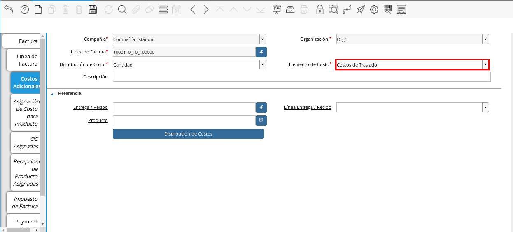
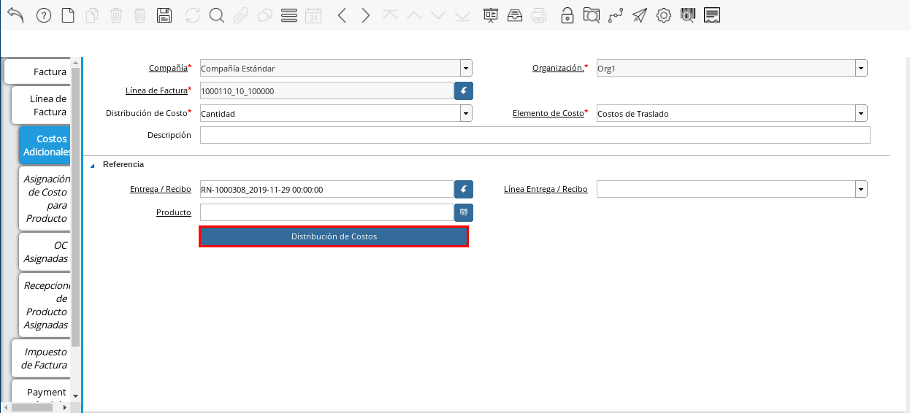
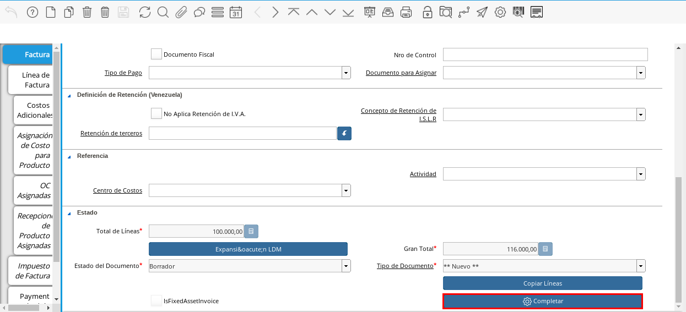
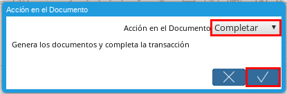
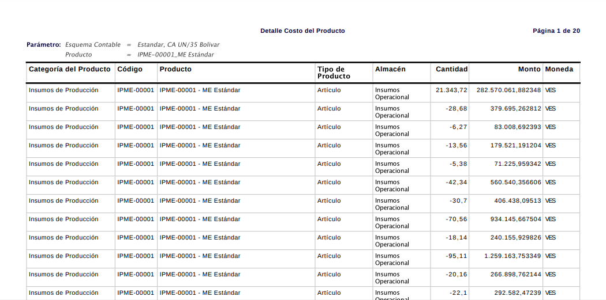

.. _ERPyA: http://erpya.com
.. |Menú de ADempiere| image:: resources/menu1.png
.. |Factura por Pagar| image:: resources/nuevo.png
.. |Pestaña Costos Adicionales| image:: resources/pestcostos1.png
.. |Campo Distribución de Costo| image:: resources/distcosto1.png

.. |Campo Entrega/Recibo| image:: resources/entrega1.png

.. |Ventana Distribución de Costos| image:: resources/distcosto3.png

.. |Menú de ADempiere 2| image:: resources/menu2.png

.. _documento/costos-adicionales:

======================
**Costos Adicionales**
======================

El presente material elaborado por `ERPyA`_ pretende ofrecerle una explicación eficiente a nuestros clientes del procedimiento a seguir para realizar y obtener un resultado exitoso al momento de generar costos adicionales a los productos en la versión 3.9.2 de ADempiere en la localización Venezuela.

Las empresas realizan un estudio sobre el costo de producción de un producto determinado con la finalidad de establecer el precio de venta en base a los resultados obtenidos. Con esto se quiere decir que según el método empleado por la empresa, se toma en cuenta el costo de la materia prima, el costo de la producción, impresión, empaque, flete y cualquier otro servicio o producto necesario para lograr un producto final, para obtener el precio de venta del producto acorde a los costos que implica la producción del mismo.

El proceso de costos adicionales de un producto, es realizado desde la ventana "**Documentos por Pagar**". Al generar una factura por un servicio o producto aplicada a otro producto, se incrementa el costo del mismo para la venta según las tipologías empleadas por la empresa.

Un producto puede tener costos adicionales por flete, servicios de impresión, entre otros casos que son calculados según la tipología empleada por la empresa. Para ejemplificar la definición anterior, se explica el costo adicional que puede tener un producto por flete. 

**Documentos por Pagar**
========================

#. Ubique y seleccione en el menú de ADempiere, la carpeta "**Gestión de Compras**", luego seleccione la ventana "**Documentos por Pagar**".

    |Menú de ADempiere|
    
    Imagen 1. Menú de ADempiere

#. Realice el procedimiento regular para generar una factura de cuentas por pagar, definido en el material :ref:`documento/documento-por-pagar` de la versión 3.9.2 de ADempiere en la localización Venezuela.

    |Factura por Pagar|
    
    Imagen 2. Factura por Pagar

    .. note::

        Es necesario que el documento por pagar no se encuentre en estado completo, de esta manera se pueden aplicar los costos adicionales a los productos.

#. Seleccione la pestaña "**Costos Adicionales**" y proceda al llenado de los campos correspondientes.

    |Pestaña Costos Adicionales| 
    
    Imagen 3. Pestaña Costos Adicionales
        
    #. Podrá apreciar en el campo "**Distribución de Costo**", que por defecto se encuentra seleccionada la opción "**Cantidad**". 

        |Campo Distribución de Costo| 
        
        Imagen 4. Campo Distribución de Costo

        .. note:: 

            Este campo permite establecer con que tipología sera realizada la distribución de costos. ADempiere utiliza cinco (5) tipologías para aplicar la distribución de costo a un producto.
            
            - Cantidad.
            
            - Costos.

            - Línea.

            - Peso.

            - Volumen. 

    #. Seleccione en el campo "**Elemento de Costo**", el costo a aplicar al producto. Para ejemplificar el registro es utilizada la opción "**Costos de Traslado**".

        |Campo Elemento de Costo| 
        
        Imagen 5. Campo Elemento de Costo

    #. Seleccione en el campo "**Entrega/Recibo**", el documento de recepción del producto al cual será aplicado el costo adicional.

        |Campo Entrega/Recibo| 
        
        Imagen 6. Campo Entrega/Recibo

        .. note::

            Este campo define el producto recepcionado al cual se le aplicará la distribución de costo según la tipología seleccionada anteriormente.

            - Si el documento de recepción posee solo una línea de entrega/recibo, no es necesario seleccionar la línea en el campo "**Línea entrega/recibo**".

            - Si el documento de recepción posee más de una línea de entrega/recibo, es necesario seleccionar en el campo "**Línea entrega/recibo**", una línea por registro de la pestaña "**Costos Adicionales**". 

    #. Seleccione la opción "**Distribución de Costos**", para aplicar el costo adicional al producto de la recepción.

        |Opción Distribución de Costos| 
        
        Imagen 7. Distribución de Costos

        .. note::

            Según la tipología seleccionada anteriormente, ADempiere realiza la distribución de costos de la siguiente manera:

            - Cantidad, realiza la distribución dividiendo el costo de la factura entre la cantidad del producto recepcionado.
            
            - Costos, realiza la distribución porcentualmente al costo del producto.

            - Línea, realiza la distribución dividiendo el costo de la factura entre el número de líneas que tenga la factura.

            - Peso, realiza la distribución porcentualmente al peso del producto.

            - Volumen, realiza la distribución porcentualmente al volumen del producto. 

        #. Podrá visualizar la ventana "**Distribución de Costos**", donde debe seleccionar la opción "**OK**" para aplicar el costo adicional al producto.

            |Ventana Distribución de Costos| 
            
            Imagen 8. Ventana Distribución de Costos

#. Regrese a la ventana principal "**Factura**" y seleccione la opción "**Completar**", ubicada en la parte inferior derecha del documento.

    |Opción Completar|
    
    Imagen 9. Opción Completar

    #. Seleccione la acción "**Completar**" y la opción "**OK**", para completar el documento por pagar.

        |Acción Completar| 
        
        Imagen 10. Opción Completar

**Consultar Costos Adicionales**
================================

#. Ubique en el menú de ADempiere, la carpeta "**Análisis de Desempeño**", luego seleccione la carpeta "**Gestión de Costos**", por último seleccione el reporte "**Detalle Costo del Producto**".  

    |Menú de ADempiere 2| 
    
    Imagen 11. Menú de ADempiere

#. Podrá visualizar el reporte "**Detalle Costo del Producto**" de la siguiente manera.

    |Pestaña Costo|
    
    Imagen 12. Pestaña Costo