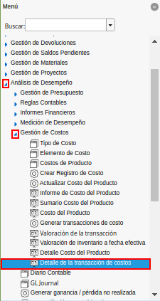
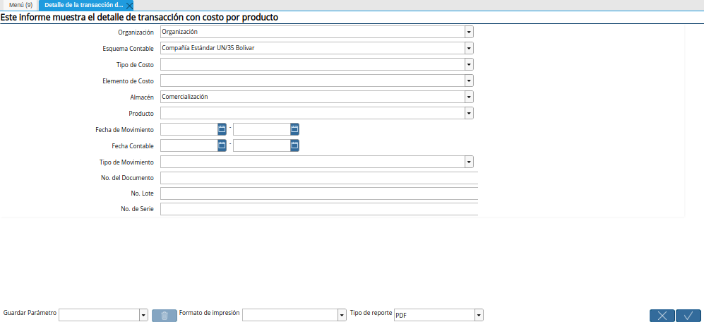
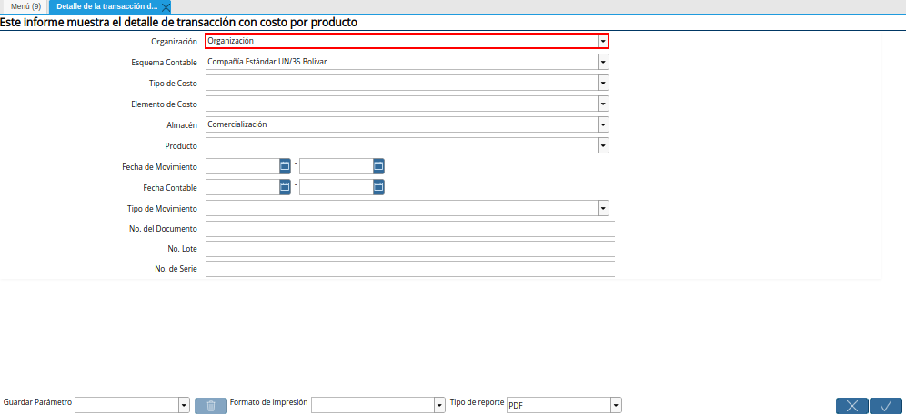
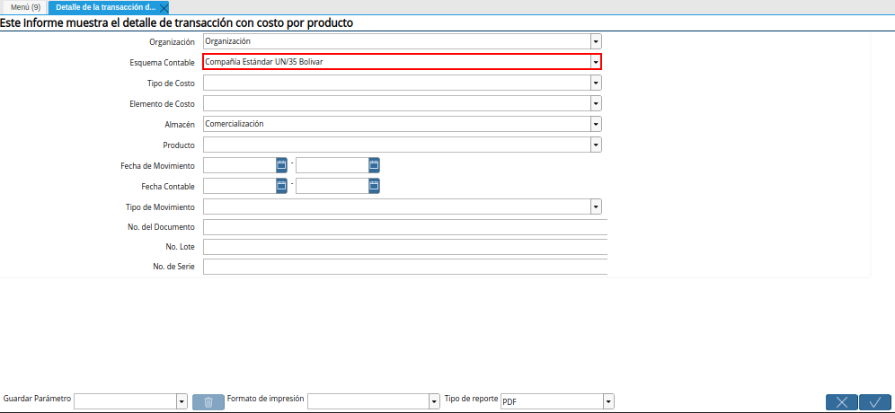
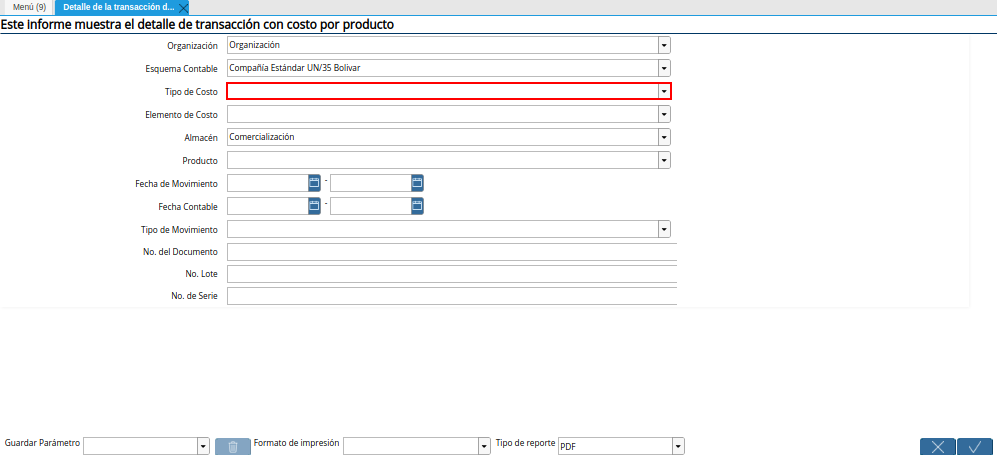
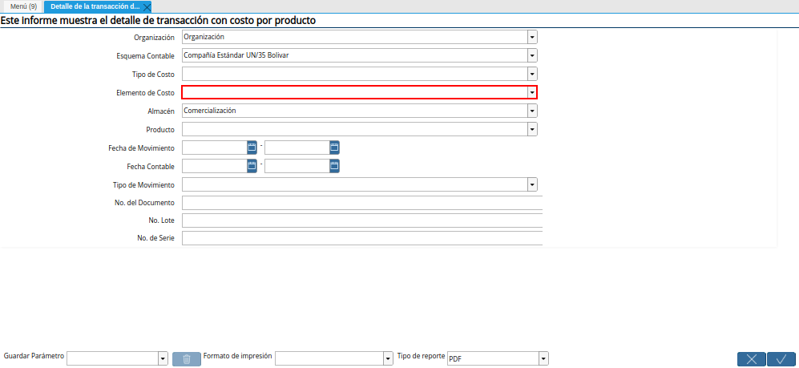
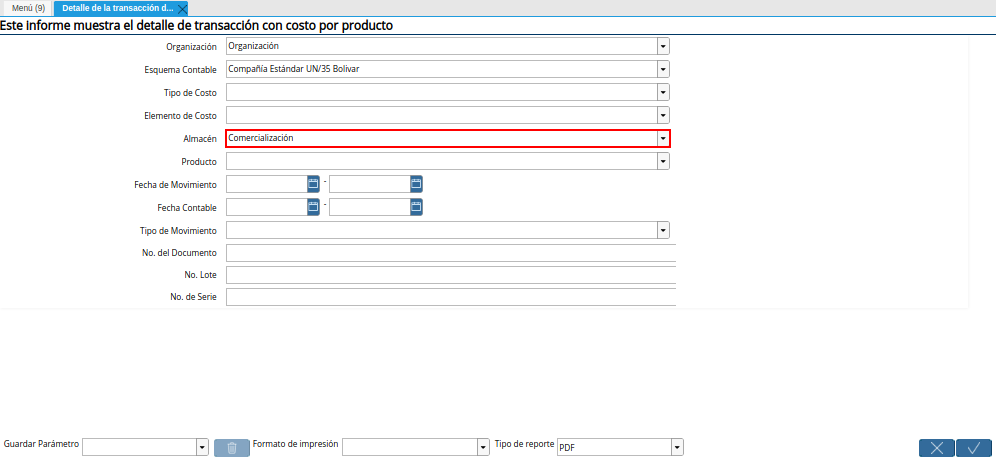
.. |Campo Producto de la Ventana Detalle de la Transacción de Costos| image:: resources/product-field-of-the-cost-transaction-detail-window.png
.. |Campo Fecha de Movimiento de la Ventana Detalle de la Transacción de Costos| image:: resources/date-of-movement-field-of-the-cost-transaction-detail-window.png
.. |Campo Fecha Contable de la Ventana Detalle de la Transacción de Costos| image:: resources/accounting-date-field-of-the-cost-transaction-detail-window.png
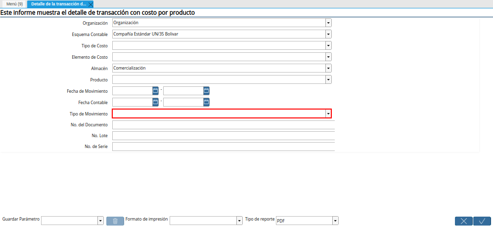
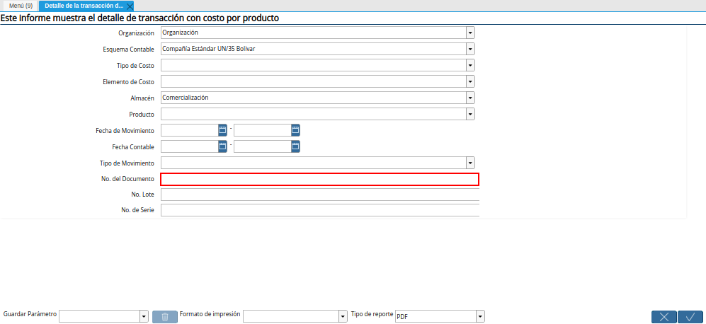
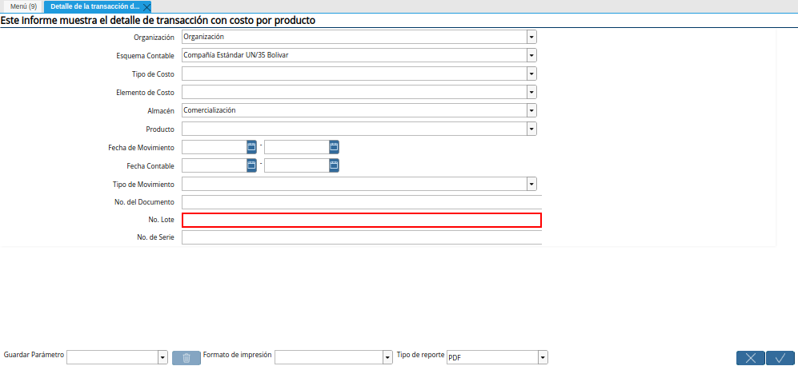
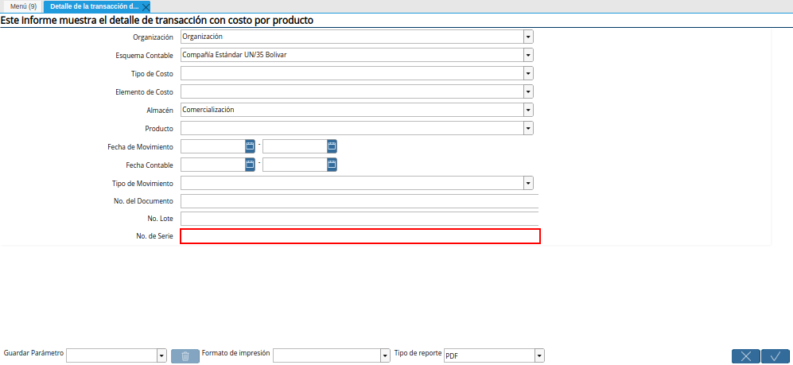
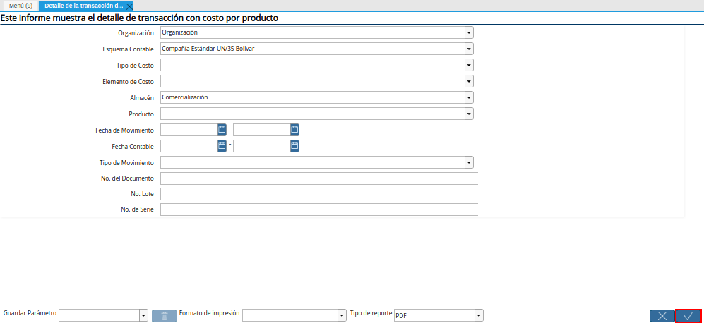
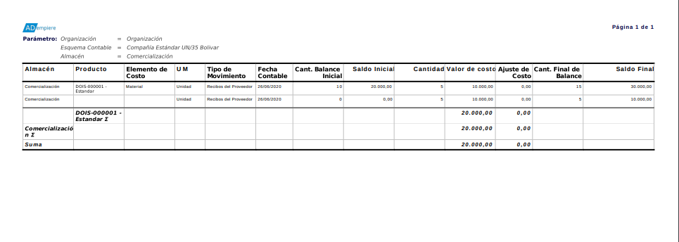

.. _documento/detalle-de-la-transacción-del-costo:

**Detalle de la Transacción del Costo**
=======================================

 Ubique y seleccione en el menú de ADempiere, la carpeta "**Análisis de Desempeño**", luego seleccione la carpeta "**Gestión de Costos**", por último seleccione el reporte "**Detalle de la Transacción de Costos**".

    |Menú de ADempiere|

    Imagen 1. Menú de ADempiere

 Podrá visualizar la ventana "**Detalle de la Transacción de Costos**", con diferentes campos que le permiten al usuario filtrar la búsqueda para generar el reporte "**Detalle de la Transacción de Costos**" según lo requerido.

    |Ventana Detalle de la Transacción de Costos|

    Imagen 2. Ventana Detalle de la Transacción de Costos

 Seleccione en el campo "**Organización**", la organización por la cual requiere filtrar la búsqueda de información.

    |Campo Organización de la Ventana Detalle de la Transacción de Costos|

    Imagen 3. Campo Organización de la Ventana Detalle de la Transacción de Costos

 Seleccione en el campo "**Esquema Contable**", el esquema contable por el cual requiere filtrar la búsqueda de información.

    |Campo Esquema Contable de la Ventana Detalle de la Transacción de Costos|

    Imagen 4. Campo Esquema Contable de la Ventana Detalle de la Transacción de Costos

 Seleccione en el campo "**Tipo de Costo**", el tipo de costo por el cual requiere filtrar la búsqueda de información.

    |Campo Tipo de Costo de la Ventana Detalle de la Transacción de Costos|

    Imagen 5. Campo Tipo de Costo de la Ventana Detalle de la Transacción de Costos

 Seleccione en el campo "**Elemento de Costo**", el elemento de costo por el cual requiere filtrar la búsqueda de información.

    |Campo Elemento de Costo de la Ventana Detalle de la Transacción de Costos|

    Imagen 6. Campo Elemento de Costo de la Ventana Detalle de la Transacción de Costos

 Seleccione en el campo "**Almacén**", el almacén por el cual requiere filtrar la búsqueda de información.

    |Campo Almacén de la Ventana Detalle de la Transacción de Costos|

    Imagen 7. Campo Almacén de la Ventana Detalle de la Transacción de Costos

 Seleccione en el campo "**Producto**", el producto por el cual requiere filtrar la búsqueda de información.

    |Campo Producto de la Ventana Detalle de la Transacción de Costos|

    Imagen 8. Campo Producto de la Ventana Detalle de la Transacción de Costos

 Seleccione en el campo "**Fecha de Movimiento**", la fecha de movimiento por la cual requiere filtrar la búsqueda de información.

    |Campo Fecha de Movimiento de la Ventana Detalle de la Transacción de Costos|

    Imagen 9. Campo Fecha de Movimiento de la Ventana Detalle de la Transacción de Costos

 Seleccione en el campo "**Fecha Contable**", la fecha contable por la cual requiere filtrar la búsqueda de información.

    |Campo Fecha Contable de la Ventana Detalle de la Transacción de Costos|

    Imagen 10. Campo Fecha Contable de la Ventana Detalle de la Transacción de Costos

 Seleccione en el campo "**Tipo de Movimiento**", el tipo de movimiento por el cual requiere filtrar la búsqueda de información.

    |Campo Tipo de Movimiento de la Ventana Detalle de la Transacción de Costos|

    Imagen 11. Campo Tipo de Movimiento de la Ventana Detalle de la Transacción de Costos

 Introduzca en el campo "**No. del Documento**", el número del documento por el cual requiere filtrar la búsqueda de información.

    |Campo No. del Documento de la Ventana Detalle de la Transacción de Costos|

    Imagen 12. Campo No. del Documento de la Ventana Detalle de la Transacción de Costos

 Introduzca en el campo "**No. Lote**", el número de lote por el cual requiere filtrar la búsqueda de información.

    |Campo No. Lote de la Ventana Detalle de la Transacción de Costos|

    Imagen 13. Campo No. Lote de la Ventana Detalle de la Transacción de Costos

 Introduzca en el campo "**No. de Serie**", el número de serie por el cual requiere filtrar la búsqueda de información.

    |Campo No de Serie de la Ventana Detalle de la Transacción de Costos|

    Imagen 14. Campo No de Serie de la Ventana Detalle de la Transacción de Costos

 Seleccione la opción "**OK**", para generar el reporte "**Detalle de la Transacción de Costos**", en base a lo seleccionado en los campos explicados anteriormente.

    |Opción OK de la Ventana Detalle de la Transacción de Costos|

    Imagen 15. Opción OK de la Ventana Detalle de la Transacción de Costos

 Podrá visualizar de la siguiente manera el reporte "**Detalle de la Transacción de Costos**".

    |Reporte Detalle de la Transacción de Costos|

    Imagen 16. Reporte Detalle de la Transacción de Costos