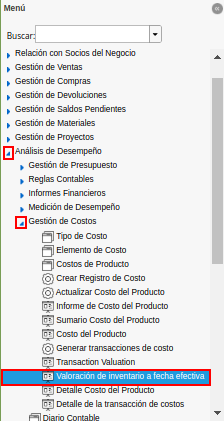
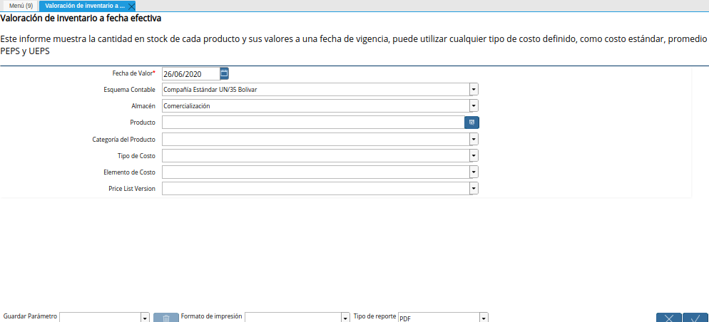
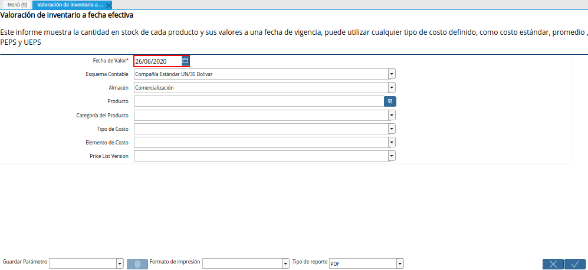
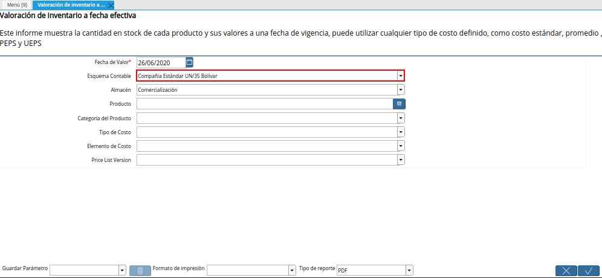
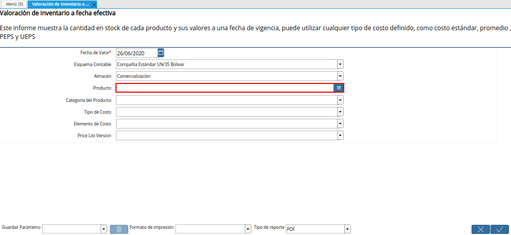
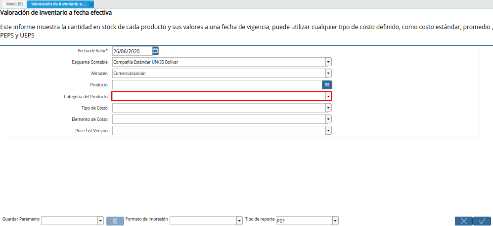
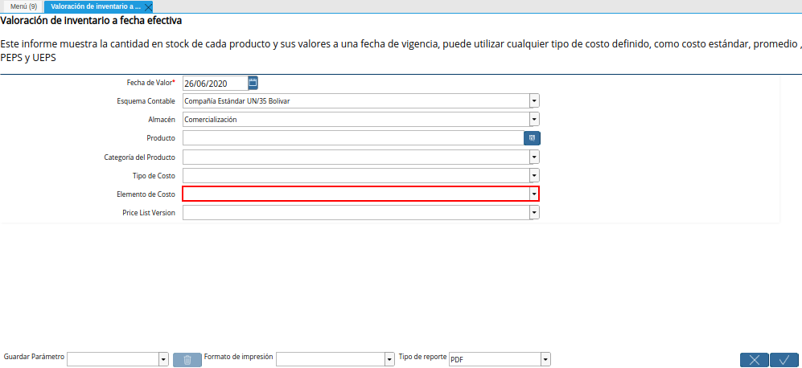
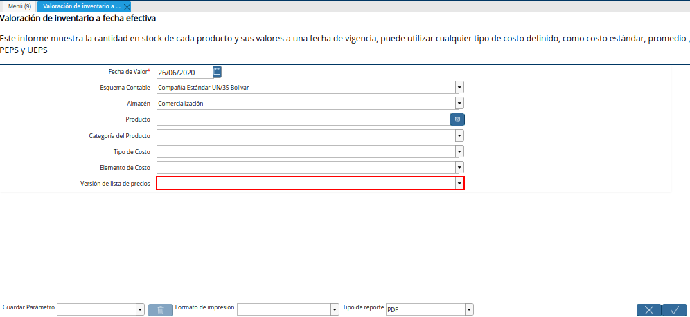
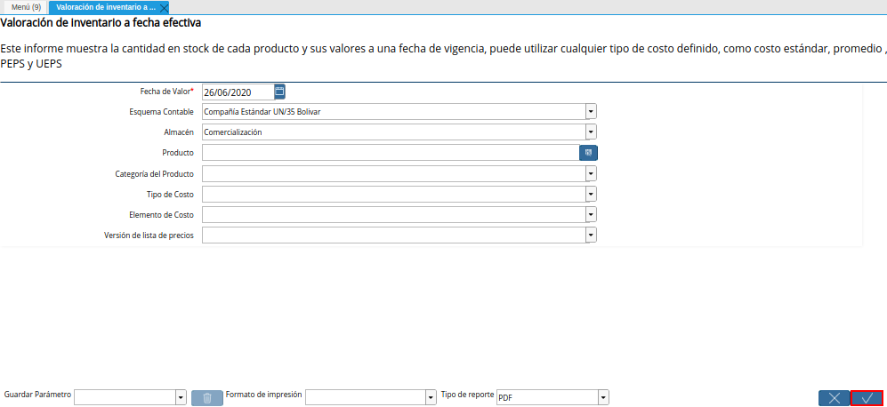

.. |Campo Almacén de la Ventana Valoración de Inventario a Fecha Efectiva| image:: resources/warehouse-field-of-the-inventory-valuation-window-to-effective-date.png

.. |Campo Tipo de Costo de la Ventana Valoración de Inventario a Fecha Efectiva| image:: resources/cost-type-field-of-the-inventory-valuation-window-at-effective-date.png

.. |Reporte Valoración de Inventario a Fecha Efectiva| image:: resources/inventory-valuation-report-to-effective-date.png

.. _documento/valoración-de-inventario-a-fecha-efectiva:

**Valoración de Inventario a Fecha Efectiva**
=============================================

 Ubique y seleccione en el menú de ADempiere, la carpeta "**Análisis de Desempeño**", luego seleccione la carpeta "**Gestión de Costos**", por último seleccione el reporte "**Valoración de Inventario a Fecha Efectiva**".

    |Menú de ADempiere|

    Imagen 1. Menú de ADempiere

 Podrá visualizar la ventana "**Valoración de Inventario a Fecha Efectiva**", con diferentes campos que le permiten al usuario filtrar la información en base a lo seleccionado en los mismos.

    |Ventana Valoración de Inventario a Fecha Efectiva|

    Imagen 2. Ventana Valoración de Inventario a Fecha Efectiva

 Seleccione en el campo "**Fecha de Valor**", la fecha de valor por la cual requiere filtrar la búsqueda de información.

    |Campo Fecha de Valor de la Ventana Valoración de Inventario a Fecha Efectiva|

    Imagen 3. Campo Fecha de Valor de la Ventana Valoración de Inventario a Fecha Efectiva

 Seleccione en el campo "**Esquema Contable**", el esquema contable por el cual requiere filtrar la búsqueda de información.

    |Campo Esquema Contable de la Ventana Valoración de Inventario a Fecha Efectiva|

    Imagen 4. Campo Esquema Contable de la Ventana Valoración de Inventario a Fecha Efectiva

 Seleccione en el campo "**Almacén**", el almacén por el cual requiere filtrar la búsqueda de información.

    |Campo Almacén de la Ventana Valoración de Inventario a Fecha Efectiva|

    Imagen 5. Campo Almacén de la Ventana Valoración de Inventario a Fecha Efectiva

 Seleccione en el campo "**Producto**", el producto por el cual requiere filtrar la búsqueda de información.

    |Campo Producto de la Ventana Valoración de Inventario a Fecha Efectiva|

    Imagen 6. Campo Producto de la Ventana Valoración de Inventario a Fecha Efectiva

 Seleccione en el campo "**Categoría del Producto**", la catedoría del producto por la cual requiere filtrar la búsqueda de información.

    |Campo Categoría del Producto de la Ventana Valoración de Inventario a Fecha Efectiva|

    Imagen 7. Campo Categoría del Producto de la Ventana Valoración de Inventario a Fecha Efectiva

 Seleccione en el campo "**Tipo de Costo**", el tipo de costo por el cual requiere filtrar la búsqueda de información.

    |Campo Tipo de Costo de la Ventana Valoración de Inventario a Fecha Efectiva|

    Imagen 8. Campo Tipo de Costo de la Ventana Valoración de Inventario a Fecha Efectiva

 Seleccione en el campo "**Elemento de Costo**", el elemento de costo por el cual requiere filtrar la búsqueda de información.

    |Campo Elemento de Costo de la Ventana Valoración de Inventario a Fecha Efectiva|

    Imagen 9. Campo Elemento de Costo de la Ventana Valoración de Inventario a Fecha Efectiva

 Seleccione en el campo "**Versión de Lista de Precios**", la versión de lista de precios por la cual requiere filtrar la búsqueda de información.

    |Campo Versión de Lista de Precios de la Ventana Valoración de Inventario a Fecha Efectiva|

    Imagen 10. Campo Versión de Lista de Precios de la Ventana Valoración de Inventario a Fecha Efectiva

 Seleccione la opción "**OK**", para generar el reporte "**Valoración de Inventario a Fecha Efectiva**" en base a lo seleccionado en los campos explicados anteriormente.

    |Opción OK de la Ventana Valoración de Inventario a Fecha Efectiva|

    Imagen 11. Opción OK de la Ventana Valoración de Inventario a Fecha Efectiva

 Podrá visualizar de la siguiente manera el reporte "**Valoración de Inventario a Fecha Efectiva**".

    |Reporte Valoración de Inventario a Fecha Efectiva|

    Imagen 12. Reporte Valoración de Inventario a Fecha Efectiva