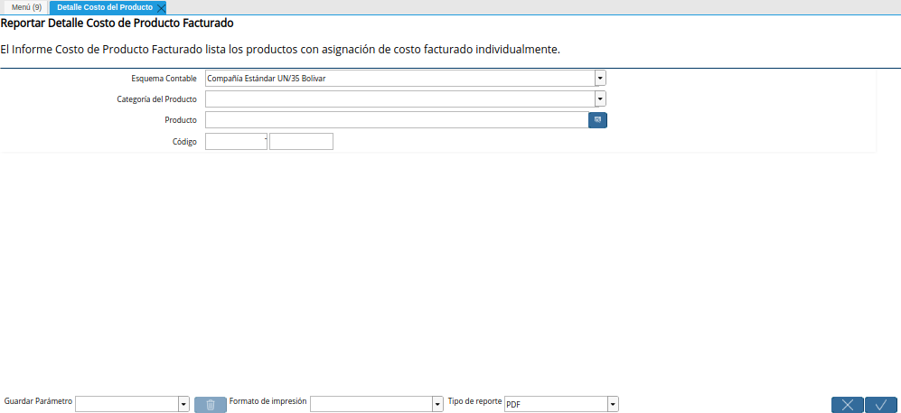
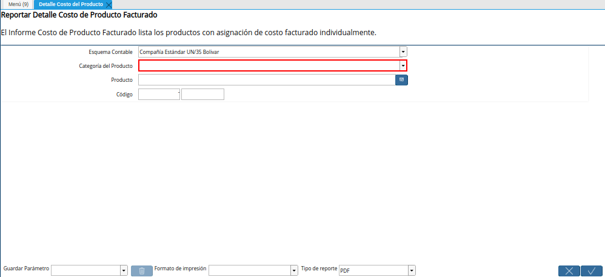
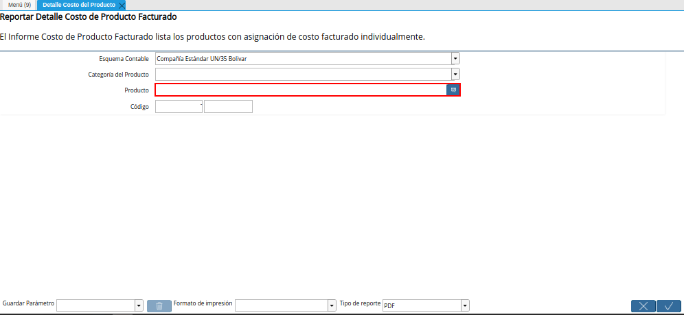
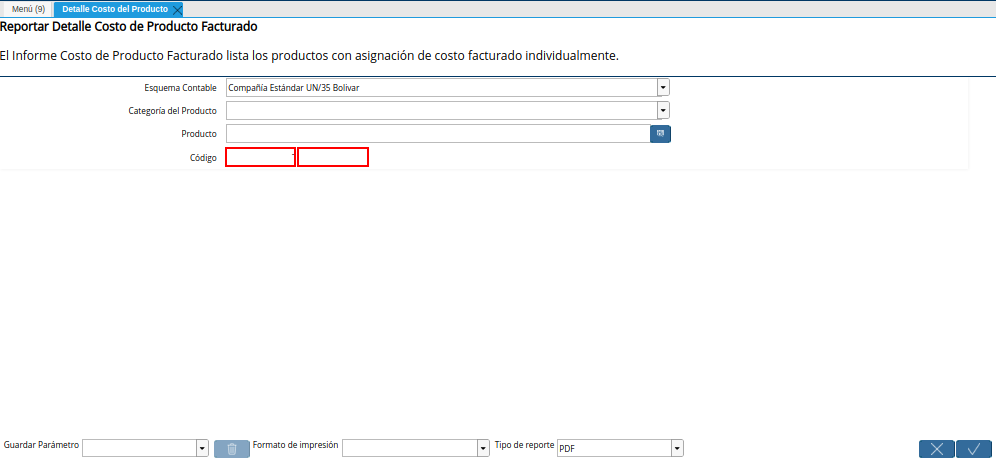
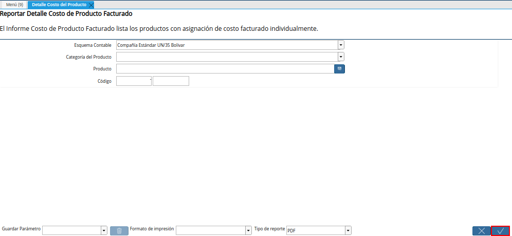
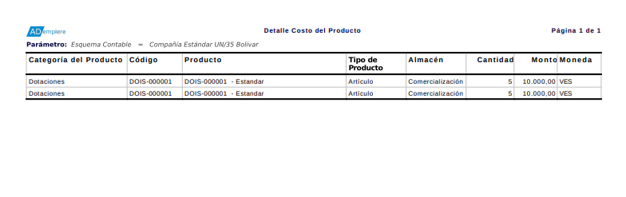

.. |Menú de ADempiere| image:: resources/product-cost-detail-menu.png

.. |Campo Esquema Contable de la Ventana Detalle Costo del Producto| image:: resources/accounting-scheme-field-of-the-product-cost-detail-window.png

.. _documento/detalle-de-costos-del-producto:

**Detalle de Costos del Producto**
==================================

 Ubique y seleccione en el menú de ADempiere, la carpeta "**Análisis de Desempeño**", luego seleccione la carpeta "**Gestión de Costos**", por último seleccione el reporte "**Detalle Costo del Producto**".

    |Menú de ADempiere|

    Imagen 1. Menú de ADempiere

 Podrá visualizar la ventana "**Detalle Costo del Producto**", con diferentes campos que le permiten al usuario filtrar la información según lo requerido por el mismo.

    |Ventana Detalle Costo del Producto|

    Imagen 2. Ventana Detalle Costo del Producto

 Seleccione en el campo "**Esquema Contable**", el esquema contable por el cual requiere filtrar la búsqueda de información.

    |Campo Esquema Contable de la Ventana Detalle Costo del Producto|

    Imagen 3. Campo Esquema Contable de la Ventana Detalle Costo del Producto

 Seleccione en el campo "**Categoría del Producto**", la categoría del producto por la cual requiere filtrar la búsqueda de información.

    |Campo Categoría del Producto de la Ventana Detalle Costo del Producto|

    Imagen 4. Campo Categoría del Producto de la Ventana Detalle Costo del Producto

 Seleccione en el campo "**Producto**", el producto por el cual requiere filtrar la búsqueda de información.

    |Campo Producto de la Ventana Detalle Costo del Producto|

    Imagen 5. Campo Producto de la Ventana Detalle Costo del Producto

 Introduzca en el campo "**Código**", el código por el cual requiere filtrar la búsqueda de información.

    |Campo Código de la Ventana Detalle Costo del Producto|

    Imagen 6. Campo Código de la Ventana Detalle Costo del Producto

 Seleccione la opción "**OK**", para generar el reporte "**Detalle Costo del Producto**", en base a lo seleccionado en los campos explicados anteriormente.

    |Opción OK de la Ventana Detalle Costo del Producto|

    Imagen 7. Opción OK de la Ventana Detalle Costo del Producto

 Podrá visualizar de la siguiente manera el reporte "**Detalle Costo del Producto**".

    |Reporte Detalle Costo del Producto|

    Imagen 8. Reporte Detalle Costo del Producto