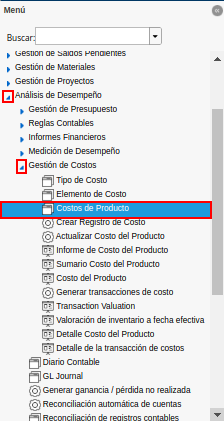
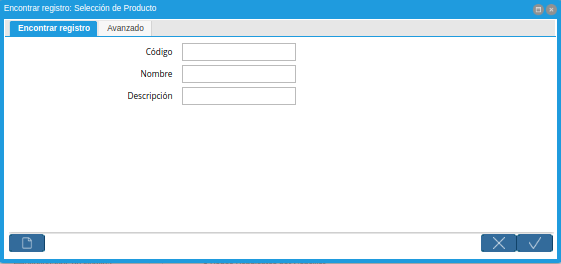
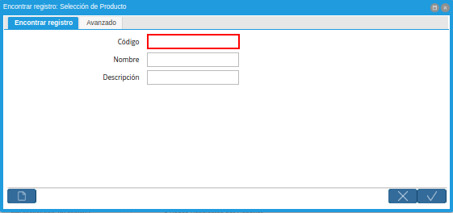
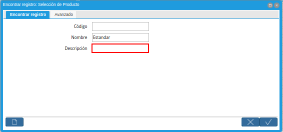
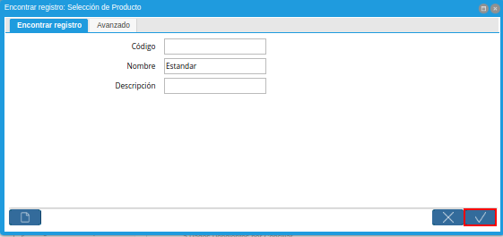
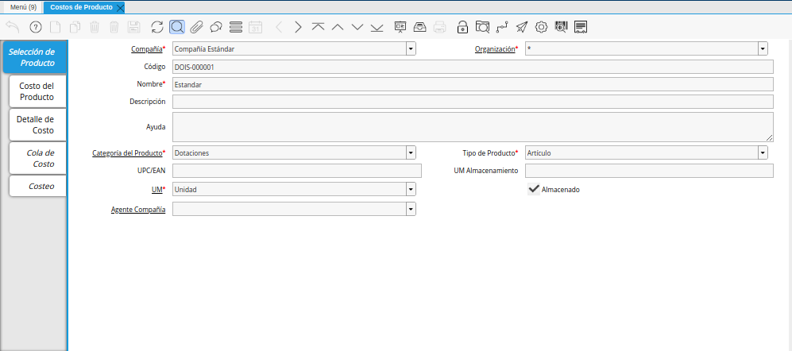
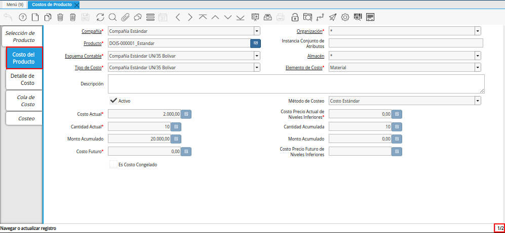
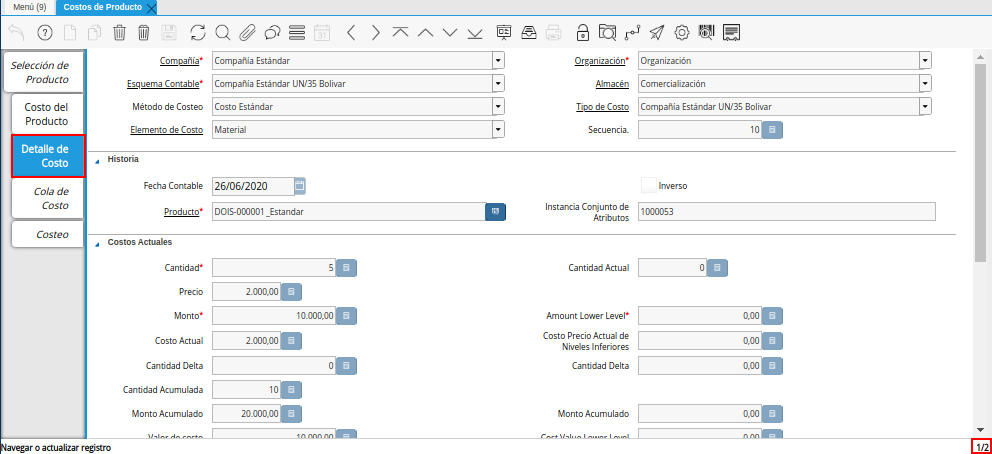

.. |Campo Nombre de la Ventana Encontrar Registro Selección de Producto| image:: resources/window-name-field-find-record-product-selection.png

.. _documento/consulta-de-costo-del-producto:

**Consulta de Costo del Producto**
==================================

- Ubique y seleccione en el menú de ADempiere, la carpeta "**Análisis de Desempeño**", luego seleccione la carpeta "**Gestión de Costos**", por último seleccione la ventana "**Costos del Producto**".

    |Menú de ADempiere|

    Imagen 1. Menú de ADempiere

- Podrá visualizar la ventana "**Encontrar Registro: Selección de Producto**", con campos que permiten filtrar la búsqueda del producto.

    |Ventana Encontrar Registro Selección de Producto|

    Imagen 2. Ventana Encontrar Registro Selección de Producto

- Introduzca en el campo "**Código**", el código del producto por el cual requiere filtrar la búsqueda del producto.

    |Campo Código de la Ventana Encontrar Registro Selección de Producto|

    Imagen 3. Campo Código de la Ventana Encontrar Registro Selección de Producto

- Introduzca en el campo "**Nombre**", el nombre del producto por el cual requiere filtrar la búsqueda del producto.

    |Campo Nombre de la Ventana Encontrar Registro Selección de Producto|

    Imagen 4. Campo Nombre de la Ventana Encontrar Registro Selección de Producto

- Introduzca en el campo "**Descripción**", la descripción del producto por el cual requiere filtrar la búsqueda del producto.

    |Campo Descripción de la Ventana Encontrar Registro Selección de Producto|

    Imagen 5. Campo Descripción de la Ventana Encontrar Registro Selección de Producto

- Luego de ingresar lo requerido en los campos por los cuales desea filtrar la búsqueda del producto, seleccione la opción "**OK**", para realizar la búsqueda.

    |Opción OK de la Ventana Encontrar Registro Selección de Producto|

    Imagen 6. Opción OK de la Ventana Encontrar Registro Selección de Producto

- Podrá visualizar la ventana "**Costos del Producto**", con el registro buscado del producto y su información principal.

    |Ventana Costos del Producto|

    Imagen 7. Ventana Costos del Producto

- Seleccione la pestaña "**Costo del Producto**", para visualizar los registros de costos del producto según el tipo de costo configurado en ADempiere.

    |Pestaña Costo del Producto de la Ventana Costos del Producto|

    Imagen 8. Pestaña Costo del Producto de la Ventana Costos del Producto

- Seleccione la pestaña "**Detalle de Costo**", para visualizar de manera detallada los registros del costo del producto según el tipo de costo configurado en ADempiere.

    |Pestaña Detalle de Costo de la Ventana Costos del Producto|

    Imagen 9. Pestaña Detalle de Costo de la Ventana Costos del Producto