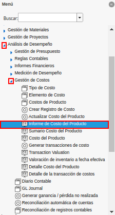
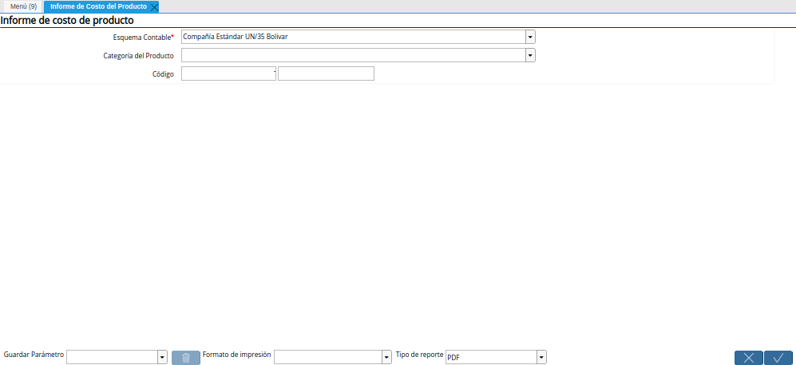
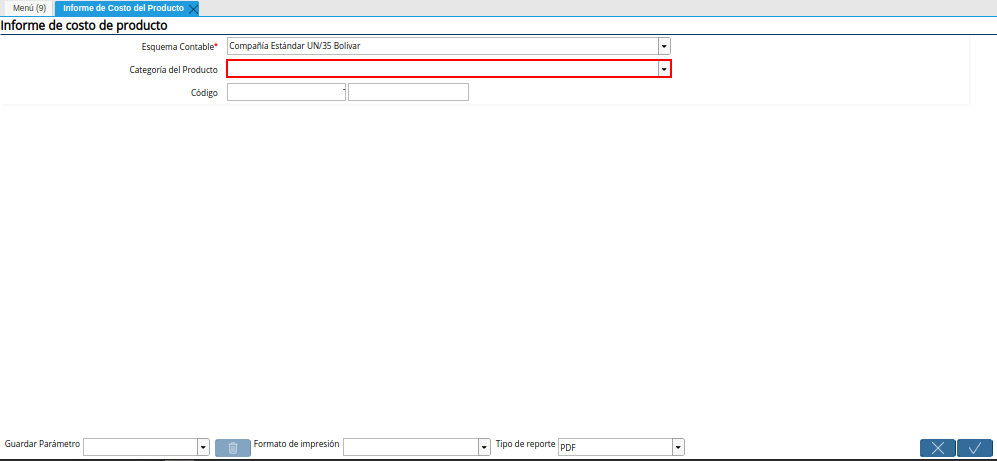
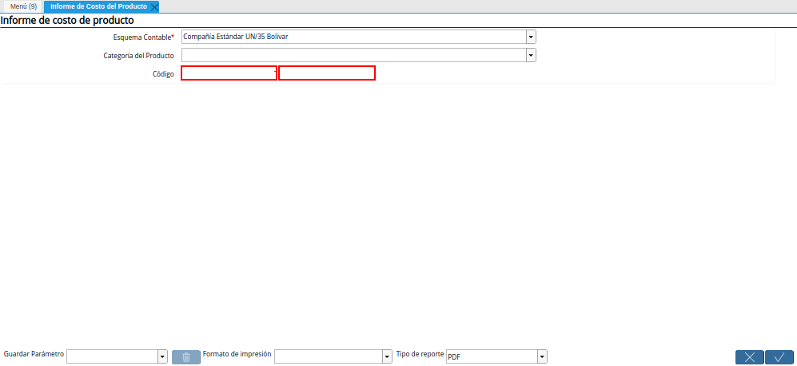
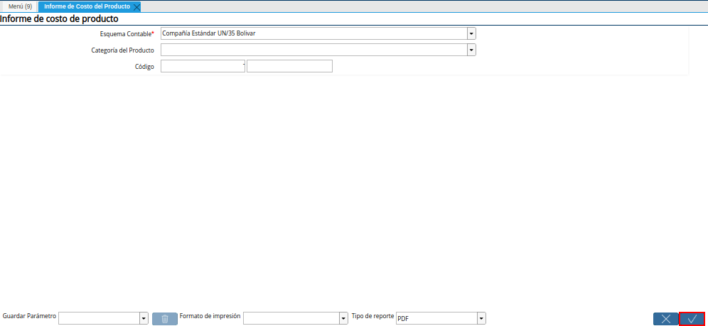

.. |Campo Esquema Contable de la Ventana del Reporte para Generar el Informe de Costo del Producto| image:: resources/accounting-scheme-field-of-the-report-window-to-generate-the-product-cost-report.png

.. _documento/informe-de-costos-del-producto:

**Informe de Costos del Producto**
==================================

 Ubique y seleccione en el menú de ADempiere, la carpeta "**Análisis de Desempeño**", luego seleccione la carpeta "**Gestión de Costos**", por último seleccione el reporte "**Informe de Costo del Producto**".

    |Menú de ADempiere|

    Imagen 1. Menú de ADempiere

 Podrá visualizar la ventana del reporte para generar el "**Informe de Costo del Producto**", con diferentes campos que le permiten al usuario filtrar la búsqueda de información para generar el informe de acuerdo a lo requerido por el mismo.

    |Ventana del Reporte para Generar el Informe de Costo del Producto|

    Imagen 2. Ventana del Reporte para Generar el Informe de Costo del Producto

 Seleccione en el campo "**Esquema Contable**", el esquema contable por el cual requiere filtrar la búsqueda de información.

    |Campo Esquema Contable de la Ventana del Reporte para Generar el Informe de Costo del Producto|

    Imagen 3. Campo Esquema Contable de la Ventana del Reporte para Generar el Informe de Costo del Producto

 Seleccione en el campo "**Categoría del Producto**", la categoría del producto por el cual requiere filtrar la búsqueda de información.

    |Campo Categoría del Producto de la Ventana del Reporte para Generar el Informe de Costo del Producto|

    Imagen 4. Campo Categoría del Producto de la Ventana del Reporte para Generar el Informe de Costo del Producto

 Introduzca en el campo "**Código**", el código por el cual requiere filtrar la búsqueda de información.

    |Campo Código de la Ventana del Reporte para Generar el Informe de Costo del Producto|

    Imagen 5. Campo Código de la Ventana del Reporte para Generar el Informe de Costo del Producto

 Seleccione la opción "**OK**", para generar el informe en base a lo seleccionado en los campos de la ventana "**Informe de Costo del Producto**".

    |Opción OK de la Ventana del Reporte para Generar el Informe de Costo del Producto|

    Imagen 6. Opción OK de la Ventana del Reporte para Generar el Informe de Costo del Producto

