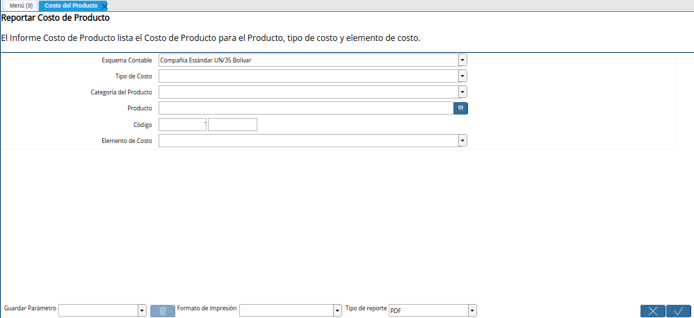
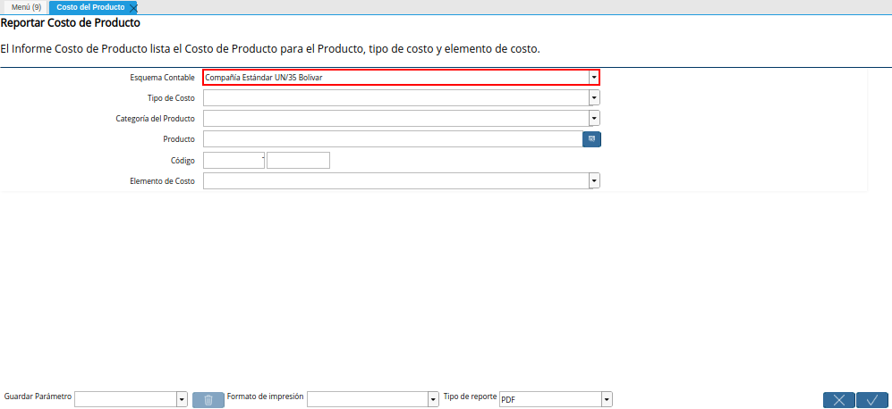
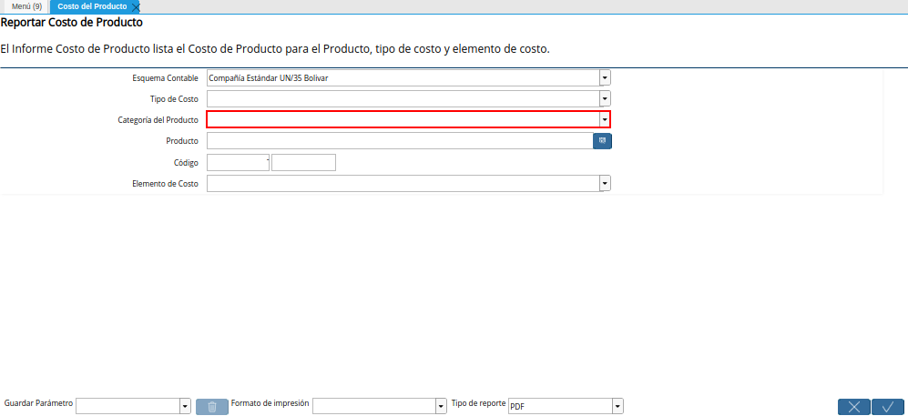
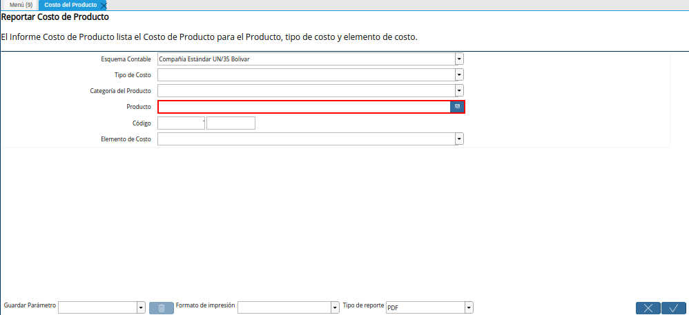
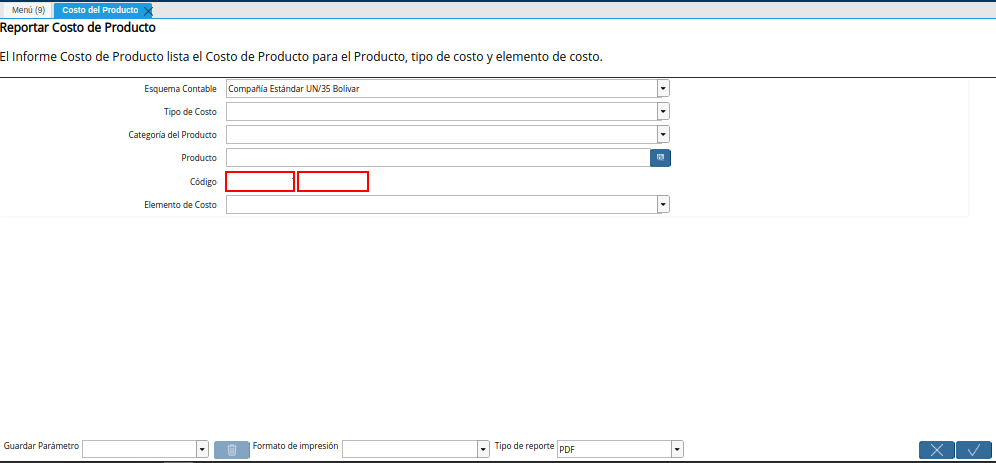
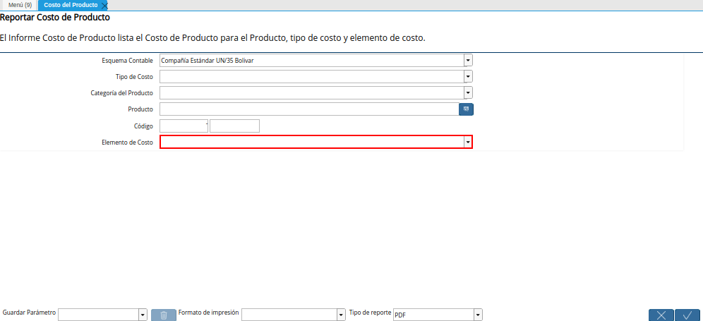

.. |Menú de ADempiere| image:: resources/product-cost-report-menu.png

.. |Campo Tipo de Costo de la Ventana del Reporte Costo del Producto| image:: resources/cost-type-field-of-the-product-cost-report-window.png

.. _documento/reporte-de-costo-del-producto:

**Reporte de Costo del Producto**
=================================

- Ubique y seleccione en el menú de ADempiere, la carpeta "**Análisis de Desempeño**", luego seleccione la carpeta "**Gestión de Costos**", por último seleccione la ventana "**Costo del Producto**".

    |Menú de ADempiere|

    Imagen 1. Menú de ADempiere

- Podrá visualizar la ventana del reporte "**Costo del Producto**", con diferentes campos que le permiten al usuario filtrar la búsqueda de la información y generar el reporte en base a lo seleccionado en dichos campos.

    |Ventana del Reporte Costo del Producto|

    Imagen 2. Ventana del Reporte Costo del Producto

- Seleccione en el campo "**Esquema Contable**", el esquema contable por el cual requiere filtrar la búsqueda de información.

    |Campo Esquema Contable de la Ventana del Reporte Costo del Producto|

    Imagen 3. Campo Esquema Contable de la Ventana del Reporte Costo del Producto

- Seleccione en el campo "**Tipo de Costo**", el tipo de costo por el cual requiere filtrar la búsqueda de información.

    |Campo Tipo de Costo de la Ventana del Reporte Costo del Producto|

    Imagen 4. Campo Tipo de Costo de la Ventana del Reporte Costo del Producto

- Seleccione en el campo "**Categoría del Producto**", la categoría el producto por la cual requiere filtrar la búsqueda de información.

    |Campo Categoría del Producto de la Ventana del Reporte Costo del Producto|

    Imagen 5. Campo Categoría del Producto de la Ventana del Reporte Costo del Producto

- Seleccione en el campo "**Producto**", el producto por el cual requiere filtrar la búsqueda de información.

    |Campo Producto de la Ventana del Reporte Costo del Producto|

    Imagen 6. Campo Producto de la Ventana del Reporte Costo del Producto

- Introduzca en el campo "**Código**", el código por el cual requiere filtrar la búsqueda de información.

    |Campo Código de la Ventana del Reporte Costo del Producto|

    Imagen 7. Campo Código de la Ventana del Reporte Costo del Producto

- Seleccione en el campo "**Elemento de Costo**", el elemento de costo por el cual requiere filtrar la búsqueda de información.

    |Campo Elemento de Costo de la Ventana del Reporte Costo del Producto|

    Imagen 8. Campo Elemento de Costo de la Ventana del Reporte Costo del Producto

- Seleccione la opción "**OK**", para generar el reporte de costo del producto en base a lo seleccionado en los campos anteriormente explicados.

    |Opción OK de la Ventana del Reporte Costo del Producto|

    Imagen 9. Opción OK de la Ventana del Reporte Costo del Producto

