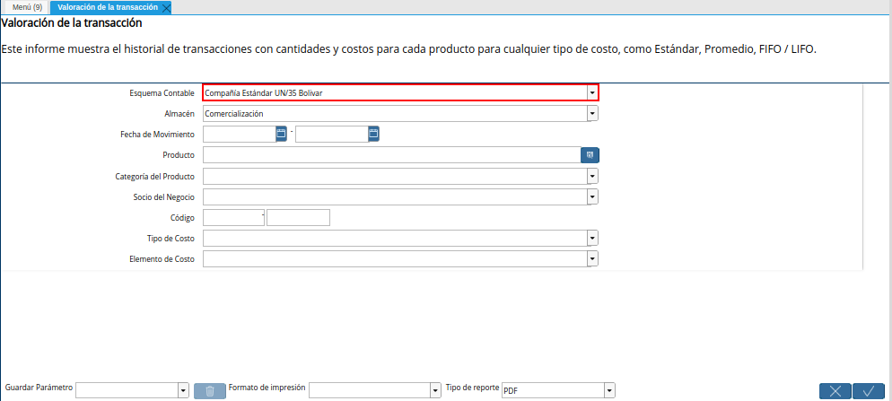
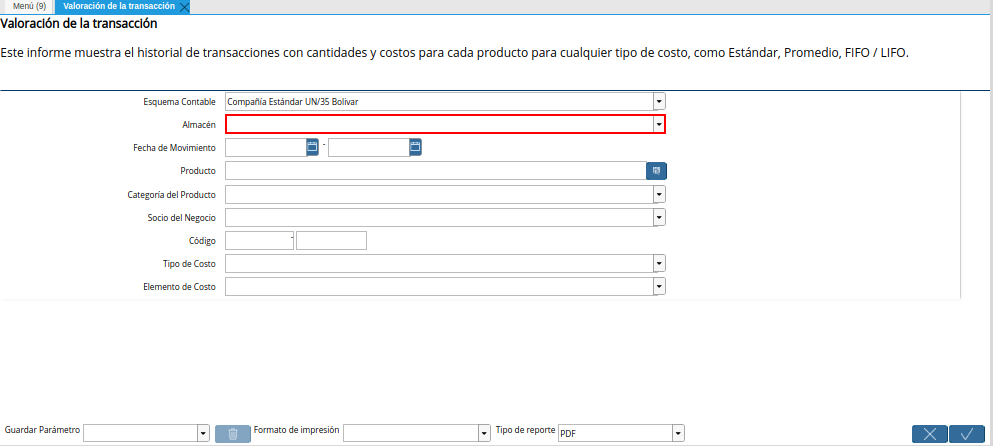
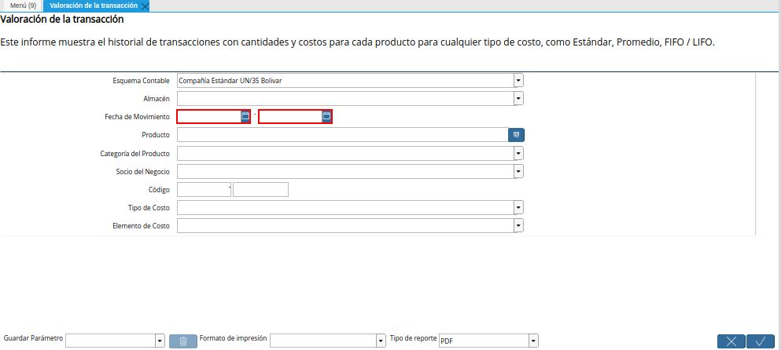
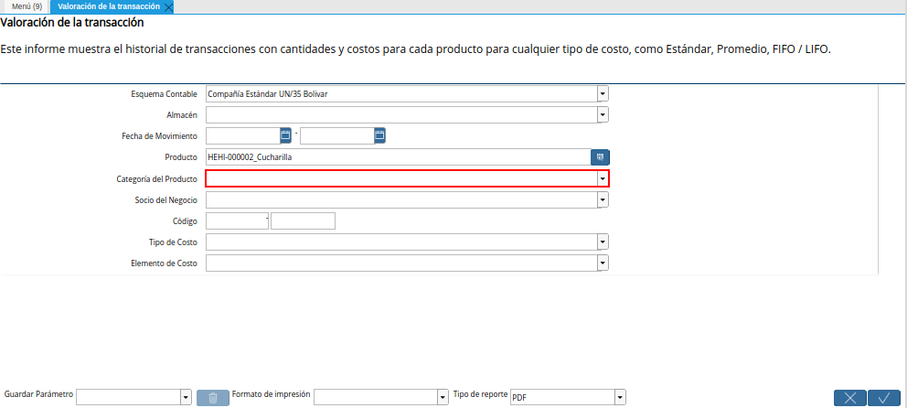
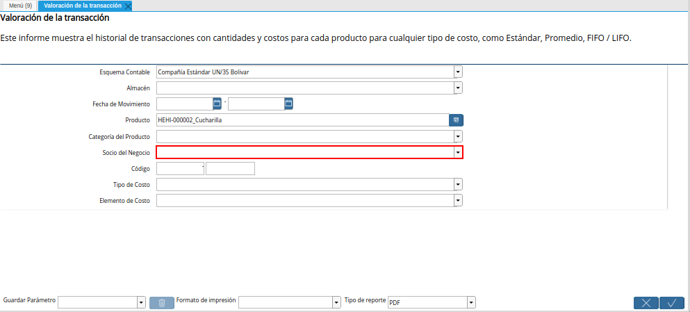
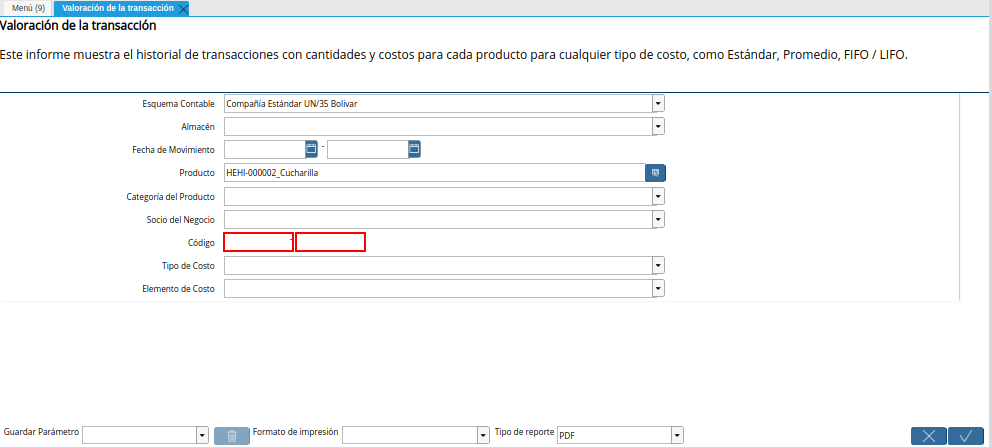
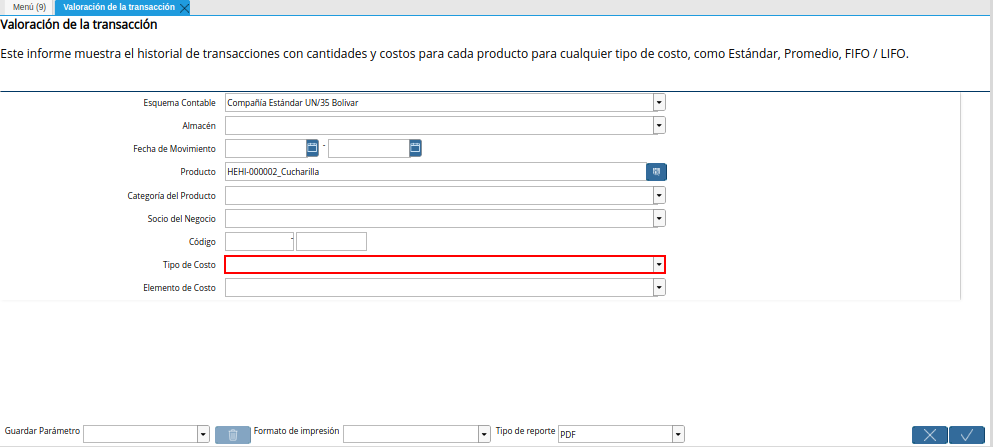
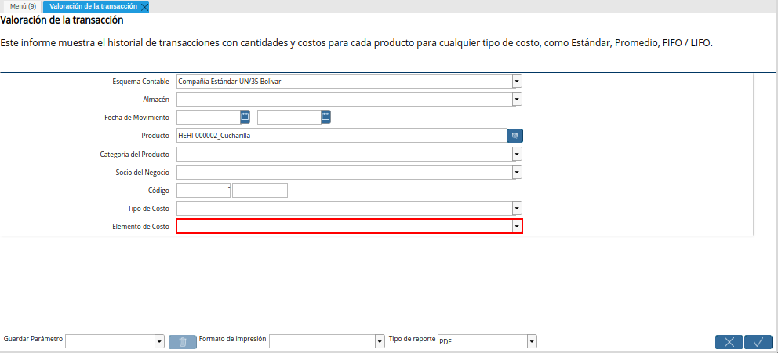
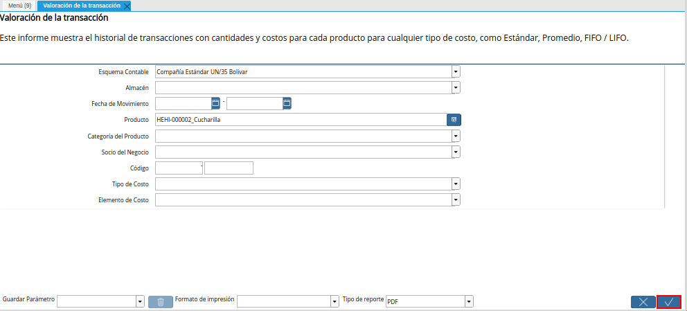
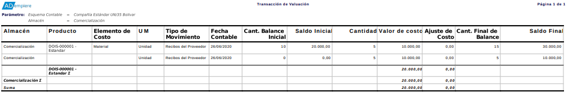

.. |Menú de ADempiere| image:: resources/transaction-valuation-menu.png
.. |Ventana Valoración de la Transacción| image:: resources/transaction-assessment-window.png

.. |Campo Producto de la Ventana Valoración de la Transacción| image:: resources/product-field-of-the-transaction-valuation-window.png

.. _documento/valoración-de-inventario:

**Valoración de Inventario**
============================

#. Ubique y seleccione en el menú de ADempiere, la carpeta "**Análisis de Desempeño**", luego seleccione la carpeta "**Gestión de Costos**", por último seleccione el reporte "**Valoración de Inventario**"

    |Menú de ADempiere|

    Imagen 1. Menú de ADempiere

#. Podrá visualizar la ventana "**Valoración de la Transacción**", con diferentes campos que permiten filtrar la búsqueda de la información para generar el reporte de acuerdo a lo requerido.

    |Ventana Valoración de la Transacción|

    Imagen 2. Ventana Valoración de la Transacción

#. Seleccione en el campo "**Esquema Contable**", el esquema contable por el cual el usuario requiere filtrar la información.

    |Campo Esquema Contable de la Ventana Valoración de la Transacción|

    Imagen 3. Campo Esquema Contable de la Ventana Valoración de la Transacción

#. Seleccione en el campo "**Almacén**", el almacén por el cual el usuario requiere filtrar la información.

    |Campo Almacén de la Ventana Valoración de la Transacción|

    Imagen 4. Campo Almacén de la Ventana Valoración de la Transacción

    .. note::

        Para simular el proceso y generar el reporte de valoración de inventario, se deja el campo "**Almacén**" en blanco, indicando de esta manera que la búsqueda de la información se debe realizar en todos los almacenes registrados en ADempiere.

#. Seleccione en el campo "**Fecha de Movimiento**", el rango de fechas en el que se realizó el movimiento del producto y por el cual el usuario requiere filtrar la información.

    |Campo Fecha de Movimiento de la Ventana Valoración de la Transacción|

    Imagen 5. Campo Fecha de Movimiento de la Ventana Valoración de la Transacción

#. Seleccione en el campo "**Producto**", el producto por el cual el usuario requiere filtrar la información.

    |Campo Producto de la Ventana Valoración de la Transacción|

    Imagen 6. Campo Producto de la Ventana Valoración de la Transacción

    .. note::

        Para simular el proceso y generar el reporte de valoración de inventario, se selecciona como ejemplo el producto "**Cucharilla**".

#. Seleccione en el campo "**Categoría del Producto**", la categoría a la que pertenece el producto seleccionado y por la cual el usuario requiere filtrar la información.

    |Campo Categoría del Producto de la Ventana Valoración de la Transacción|

    Imagen 7. Campo Categoría del Producto de la Ventana Valoración de la Transacción

#. Seleccione en el campo "**Socio del Negocio**", el socio del negocio por el cual el usuario requiere filtrar la información.

    |Campo Socio del Negocio de la Ventana Valoración de la Transacción|

    Imagen 8. Campo Socio del Negocio de la Ventana Valoración de la Transacción

Introduzca en el campo "**Código**", el código por el cual el usuario requiere filtrar la información.

    |Campo Código de la Ventana Valoración de la Transacción|

    Imagen 9. Campo Código de la Ventana Valoración de la Transacción

#. Seleccione en el campo "**Tipo de Costo**", el tipo de costo por el cual el usuario requiere filtrar la información.

    |Campo Tipo de Costo de la Ventana Valoración de la Transacción|

    Imagen 10. Campo Tipo de Costo de la Ventana Valoración de la Transacción

#. Seleccione en el campo "**Elemento de Costo**", el elemento de costo por el cual requiere filtrar la información.

    |Campo Elemento de Costo de la Ventana Valoración de la Transacción|

    Imagen 11. Campo Elemento de Costo de la Ventana Valoración de la Transacción

#. Seleccione la opción "**OK**" para generar el reporte de valoración de la transacción.

    |Opción OK Ventana Valoración de la Transacción|

    Imagen 12. Opción OK Ventana Valoración de la Transacción

#. Luego de culminado el proceso, podrá visualizar el reporte de la siguiente manera.

    |Reporte Valoración de la Transacción|

    Imagen 13. Reporte Valoración de la Transacción
