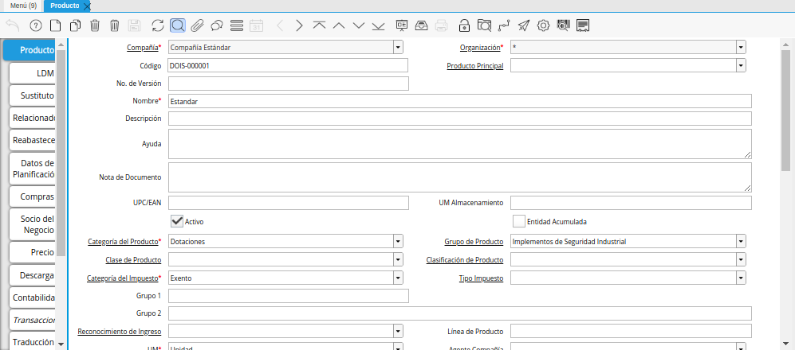
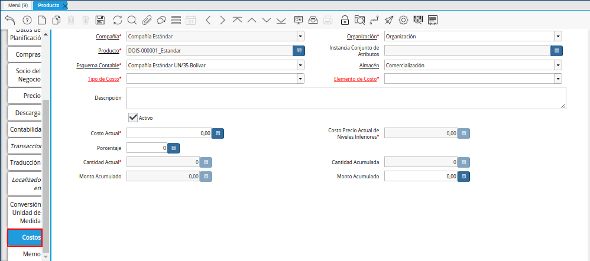
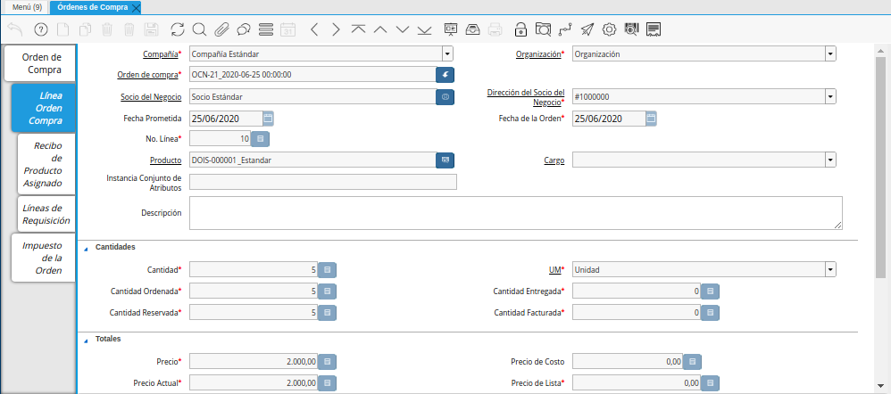
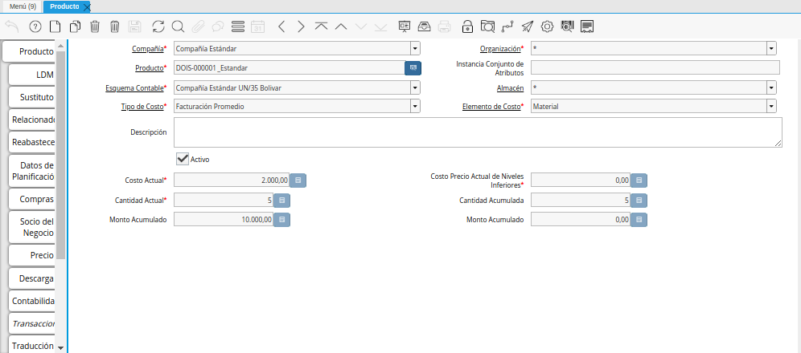

.. |Ventana Orden de Compra| image:: resources/purchase-order.png

.. |Recepción de Producto| image:: resources/reception.png
.. |Pestaña Línea del Recibo| image:: resources/reception-line-tab.png
.. |Tipo de Costo Estándar| image:: resources/standard-cost-type-of-product-window-cost-tab.png

.. _documento/costos-de-material:

**Costos de Material**
======================

#. Para explicar el proceso de registro automático de costo de un producto y que el usuario pueda entender el mismo, es ubicado un producto sin relación con alguna transacción en ADempiere. Para este caso, es ubicado el producto "**Estandar**", con código "**DOIS-000001**".

    |Ventana Producto|

    Imagen 1. Ventana Producto

#. Seleccione la pestaña "**Costo**" para verificar si el mismo posee algún registro, es decir, si ha sido utilizado en alguna transacción en ADempiere.

    |Pestaña Costo|

    Imagen 2. Pestaña Costo

#. Luego se procede a realizar y completar una "**Orden de Compra**", utilizando el producto anteriormente mostrado.

    |Ventana Orden de Compra|

    Imagen 3. Ventana Orden de Compra

#. Podrá visualizar en la pestaña "**Línea Orden de Compra**", el producto, la cantidad y el precio ingresado.

    |Pestaña Línea de la Orden de Compra|

    Imagen 4. Pestaña Línea de la Orden de Compra

#. Para finalizar el proceso es realizada una "**Recepción**", la misma es creada desde la orden de compra realizada anteriormente.

    |Recepción de Producto|

    Imagen 5. Recepción de Producto

#. En la pestaña "**Línea del Recibo**", puede visualizar el producto y la cantidad recepcionada.

    |Pestaña Línea del Recibo|

    Imagen 6. Pestaña Línea del Recibo

#. Puede consultar el resultado del proceso realizado anteriormente, ubicando el producto "**Estandar**", con código "**DOIS-000001**" utilizado en el ejemplo expuesto.

    |Ventana Producto|

    Imagen 7. Ventana Producto

#. Como resultado del proceso realizado, se tienen dos (2) registros de tipos de costo en la pestaña "**Costos**" de la ventana "**Producto**":

    - Tipo de Costo Estándar

        |Tipo de Costo Estándar|

        Imagen 8. Tipo de Costo Estándar

    - Tipo de Costo Facturación Promedio

        |Tipo de Costo Facturación Promedio|

        Imagen 9. Tipo de Costo Facturación Promedio