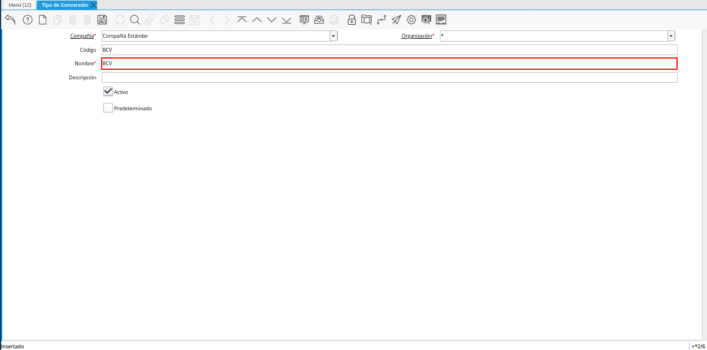
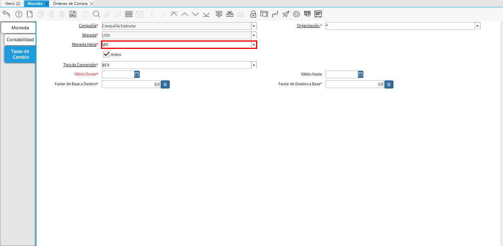
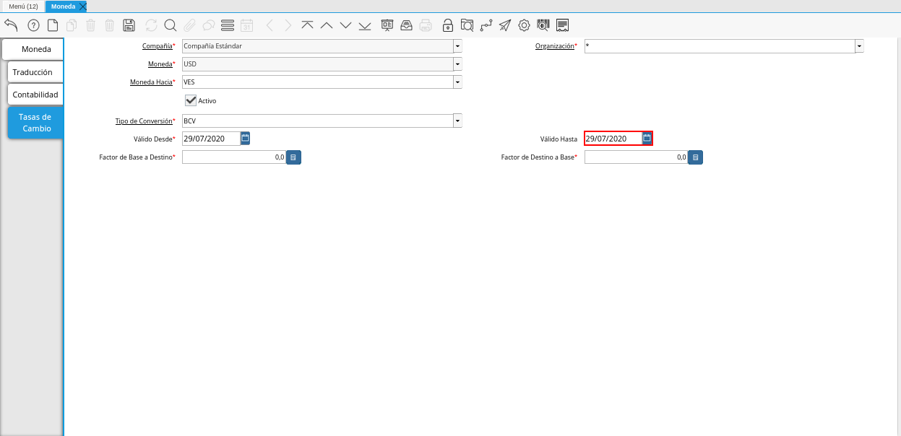
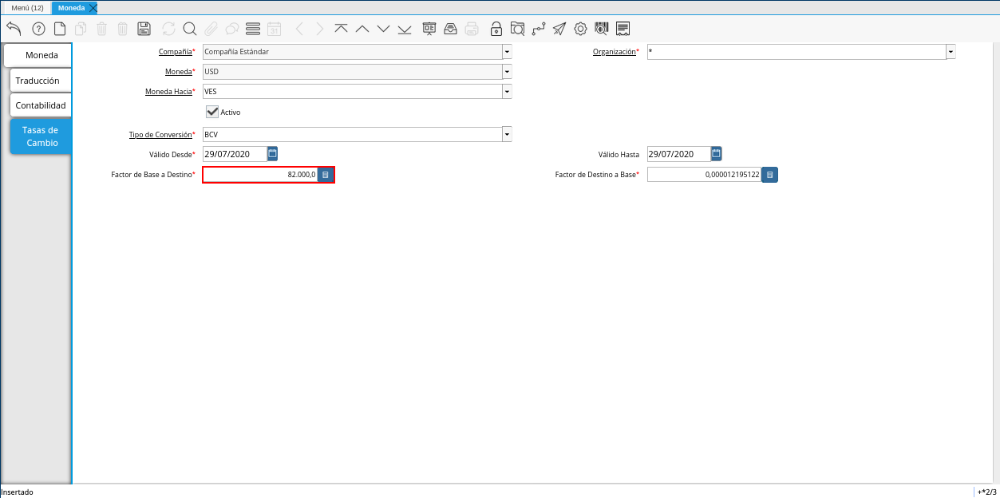

.. |Menú de ADempiere 2| image:: resources/conversion-type-menu.png
.. |Ventana Tipo de Conversión| image:: resources/conversion-type-window.png
.. |Icono Registro Nuevo| image:: resources/new-record-icon-in-the-conversion-type-window.png
.. |Campo Organización| image:: resources/organization-field-of-the-conversion-type-window.png
.. |Campo Código| image:: resources/conversion-type-window-code-field.png

.. |Campo Descripción| image:: resources/conversion-type-window-description-field.png
.. |Checklist Activo| image:: resources/active-checklist-the-conversion-type-window.png
.. |Checklist Predeterminado| image:: resources/default-checklist-conversion-type-window.png
.. |Menú de ADempiere| image:: resources/conversion-rate-menu.png
.. |Ventana Moneda| image:: resources/coin-window.png
.. |Pestaña Tasas de Cambio| image:: resources/exchange-rates-tab.png
.. |Icono Registro Nuevo| image:: resources/new-registration-icon-from-the-exchange-rates-tab.png

.. |Campo Tipo de Conversión| image:: resources/conversion-rate-field-of-the-exchange-rates-tab.png
.. |Campo Válido Desde| image:: resources/field-valid-from-the-exchange-rates-tab.png

.. _documento/conversión-monetaria:

**Conversión Monetaria**
========================

.. _paso/crear-conversión:

**Tipo de Conversión**
----------------------

#. Ubique y seleccione en el menú de ADempiere, la carpeta "**Análisis de Desempeño**", luego seleccione la carpeta "**Reglas Contables**", por último seleccione la ventana "**Tipo de Conversión**".

    |Menú de ADempiere 2|

    Imagen 1. Menú de ADempiere

#. Podrá visualizar la ventana "**Tipo de Conversión**", con los diferentes registros que contiene dicha ventana.

    |Ventana Tipo de Conversión|

    Imagen 2. Ventana Tipo de Conversión

#. Seleccione el icono "**Registro Nuevo**", ubicado en la barra de herramientas de ADempiere.

    |Icono Registro Nuevo|

    Imagen 3. Icono Registro Nuevo de la Ventana Tipo de Conversión

    #. Seleccione en el campo "**Organización**", la organización para la cual esta creando el registro de tipo de conversión.

        |Campo Organización|

        Imagen 4. Campo Organización de la Ventana Tipo de Conversión

    #. Introduzca en el campo "**Código**", el código correspondiente al registro de tipo de conversión que se encuentra realizando, para este caso es utilizado el código "**BCV**".

        |Campo Código|
        
        Imagen 5. Campo Código de la Ventana Tipo de Conversión

    #. Introduzca en el campo "**Nombre**" el nombre correspondiente al registro de tipo de conversión que se encuentra realizando, para este caso es utilizado el nombre de conversión "**BCV**".

        |Campo Nombre|

        Imagen 6. Campo Nombre de la Ventana Tipo de Conversión

    #. Introduzca en el campo "**Descripción**", una breve descripción correspondiente al registro de tipo de conversión que se encuentra realizando.

        |Campo Descripción|

        Imagen 7. Campo Descripción de la Ventana Tipo de Conversión

    #. El checklist "**Activo**", indica que el registro se encuentra activo y puede ser utilizado en cualquier transacción que lo requiera.

        |Checklist Activo|

        Imagen 8. Checklist Activo de la Ventana Tipo de Conversión

    #. Seleccione el checklist "**Predeterminado**", para indicar como predeterminado el registro que se encuentra realizando.

        |Checklist Predeterminado|

        Imagen 9. Checklist Predeterminado de la Ventana Tipo de Conversión

.. note:: 

    Recuerde guardar los cambios realizados seleccionando el icono "**Guardar Cambios**", ubicado en la barra de herramientas de ADempiere.

.. _paso/crear-tasa:

**Tasa de Conversión**
----------------------

La tasa de conversión se crea unicamente cuando se conoce el monto, el mismo se extrae de la planilla que emite la aduana.

#. Ubique y seleccione en el menú de ADempiere, la carpeta "**Análisis de Desempeño**", luego seleccione la carpeta "**Reglas Contables**", por último seleccione la ventana "**Moneda**".

    |Menú de ADempiere|

    Imagen 10. Menú de ADempiere

#. Seleccione el registro de la moneda para la cual requiere registrar una tasa de conversión. Para ejemplificar el registro es utilizada la moneda "**USD**".

    |Ventana Moneda|

    Imagen 11. Registro de Moneda USD en ADempiere

    #. Seleccione la pestaña "**Tasas de Cambio**" para navegar entre los diferentes registros de tasas de cambio correspondientes a la moneda "**USD**".

        |Pestaña Tasas de Cambio|

        Imagen 12. Pestaña Tasas de Cambio de la Ventana Moneda

    #. Seleccione el icono "**Registro Nuevo**" para crear un nuevo registro de tasas de cambio.

        |Icono Registro Nuevo|

        Imagen 13. Icono Registro Nuevo de la Pestaña Tasas de Cambio

        .. warning::

            La tasa de cambio se debe crear de dólares a bolívares y de bolívares a dólares.

        #. Seleccione en el campo "**Moneda Hacia**", la moneda para la cual requiere convertir el dinero. Para ejemplificar el registro es utilizada la moneda "**VES**".

            |Campo Moneda Hacia|

            Imagen 14. Campo Moneda Hacia de la Pestaña Tasas de Cambio

        #. Seleccione en el campo "**Tipo de Conversión**", el tipo de conversión a utilizar. Para este caso es utilizado el tipo de conversión "**BCV**", creado anteriormente.

            |Campo Tipo de Conversión|

            Imagen 15. Campo Tipo de Conversión de la Pestaña Tasas de Cambio

        #. Seleccione en el campo "**Válido Desde**", la fecha desde la cual es válida la tasa de conversión que se encuentra realizando.

            |Campo Válido Desde|

            Imagen 16. Campo Válido Desde de la Pestaña Tasas de Cambio

        #. Seleccione en el campo "**Válido Hasta**", la fecha hasta la cual es válida la tasa de conversión que se encuentra realizando.

            |Campo Válido Hasta|

            Imagen 17. Campo Válido Hasta de la Pestaña Tasas de Cambio

        #. Introduzca en el campo "**Factor de Base a Destino**", la tasa por la que serán multiplicados los montos de las transacciones donde sea utilizado el tipo de conversión seleccionado anteriormente. Para ejemplificar el registro es utilizada la tasa "**82.000,0**".

            |Campo Factor de Base a Destino|

            Imagen 12. Campo Factor de Base a Destino de la Pestaña Tasas de Cambio

.. note:: 

    Recuerde guardar los cambios realizados seleccionando el icono "**Guardar Cambios**", ubicado en la barra de herramientas de ADempiere.
