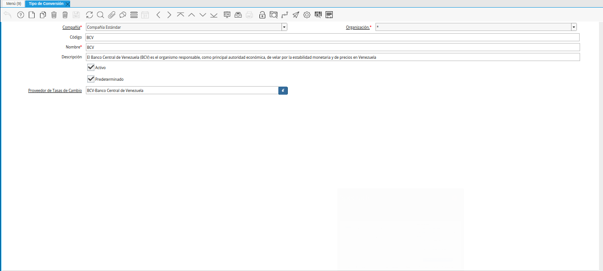
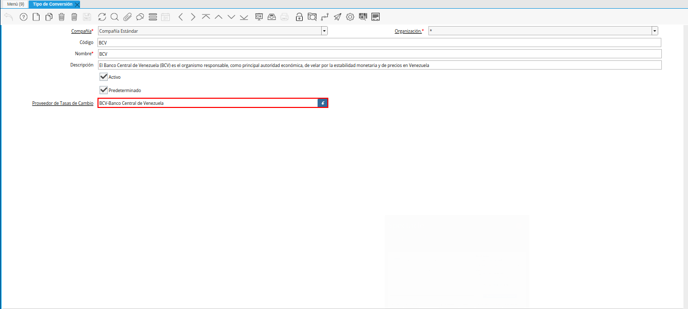
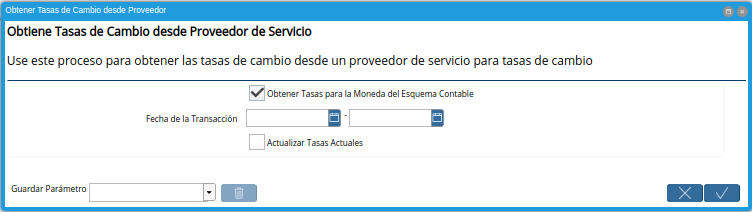
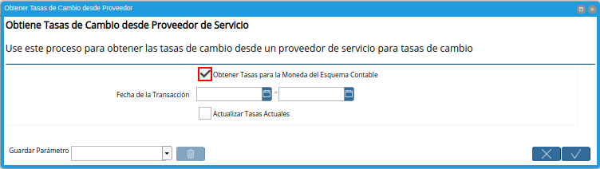
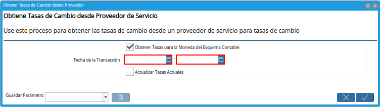
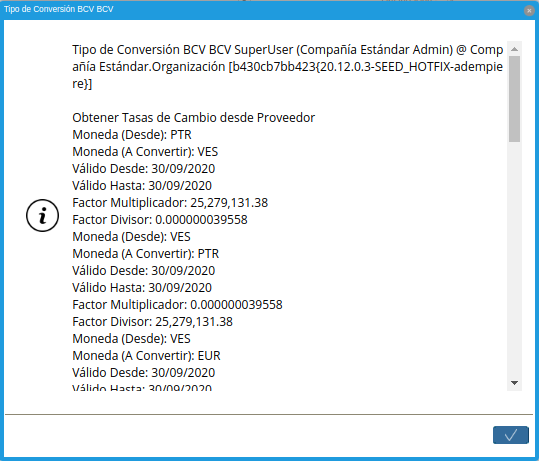

.. |menú de adempiere| image:: resources/conversion-type-menu.png

.. |tipo de converción bcv| image:: resources/bcv-conversion-rate.png

.. |opción obtener tasas de cambio desde proveedor| image:: resources/option-to-obtain-exchange-rates-from-provider.png

.. |checklist actualizar tasas actuales| image:: resources/checklist-update-current-rates.png
.. |opción ok del proceso obtener tasas| image:: resources/ok-option-of-the-process-get-rates.png

    
.. _documento/conversión-automática-por-tipo-conversión:

**Conversión Automática por Tipo de Conversión**
================================================

- Ubique y seleccione en el mené de ADempiere, la carpeta "**Análisis de Desempeño**", luego seleccione la carpeta "**Reglas Contables**", por último seleccione la ventana "**Tipo de Conversión**".

    |menú de adempiere|

    Imagen 1. Menú de ADempiere

- Podrá visualizar la ventana "**Tipo de Conversión**", con los registros de tipos de conversión que contiene ADempiere.

    |ventana tipo de conversión desde proveedor|

    Imagen 2. Ventana Tipo de Conversión

- Ubique el registro correspondiente al tipo de conversión desde el cual requiere obtener las tasas de cambio. Para el presente caso, se utiliza el tipo de conversión "**BCV**".

    |tipo de converción bcv|

    Imagen 3. Tipo de Conversión BCV

- Verifique que el registro de tipo de conversión seleccionado, tenga asociado el proveedor en el campo "**Proveedor de Tasas de Cambio**".

    |campo proveedor de tasas de cambio|

    Imagen 4. Campo Proveedor de Tasas de Cambio

- Seleccione la opción "**Obtener Tasas de Cambio desde Proveedor**", desplegada al seleccionar el icono "**Proceso**", ubicado en la barra de herramientas de ADempiere.

    |opción obtener tasas de cambio desde proveedor|

    Imagen 5. Opción Obtener Tasas de Cambio desde Proveedor

- Podrá visualizar la ventana "**Obtener Tasas de Cambio desde Proveedor**", con diferentes campos que permiten obtener las tasas de cambio dependiendo de la selección de los mismos.

    |ventana del proceso|

    Imagen 6. Ventana del Proceso

- El checklist "**Obtener Tasas para la Moneda del Esquema Contable**", se encuentra tildado para filtrar la búsqueda de tasas de cambio a la moneda del esquema.

    |checklist obtener tasas para la moneda del esquema contable|

    Imagen 7. Checklist Obtener Tasas para la Moneda del Esquema Contable

- Seleccione en el campo "**Fecha de la Transacción**", el rango de fecha para filtrar la búsqueda de tasas de cambio.

    |campo fecha de transacción del proceso|

    Imagen 8. Campo Fecha de la Transacción

- El checklist "**Actualizar Tasas Actuales**", permite atualizar las tasas actuales si coinciden con la fecha.

    |checklist actualizar tasas actuales|

    Imagen 9. Checklist Actualizar Tasas Actuales

- Seleccione la opción "**OK**", para ejecutar el proceso "**Obtener Tasas de Cambio desde Proveedor**" en base a lo seleccionado en los campos explicados anteriormente.

    |opción ok del proceso obtener tasas|

    Imagen 10. Opción OK

- Al ejecutar el proceso "**Obtener Tasas de Cambio desde Proveedor**", podrá visualizar las tasas de cambio de la siguiente manera.

    |tasas de cambio obtenidas|

    Imagen 11. Tasas de Cambio Obtenidas del Proveedor