.. |Menú de ADempiere 2| image:: resources/conversion-type-menu.png
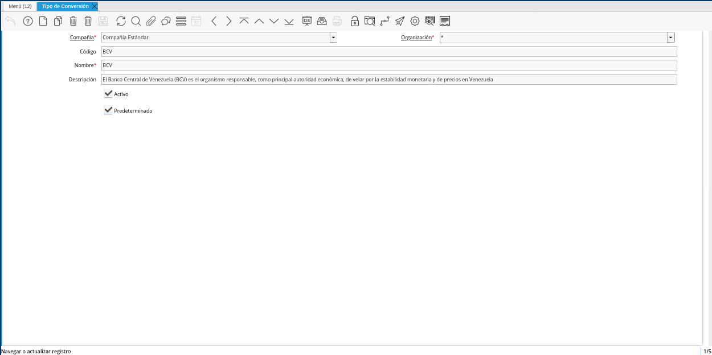
.. |Icono Registro Nuevo| image:: resources/new-record-icon-in-the-conversion-type-window.png
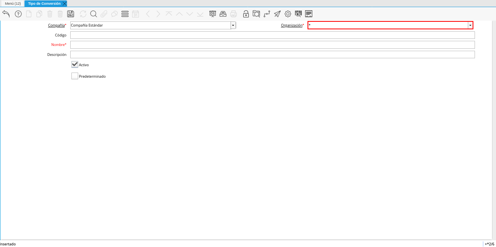
.. |Campo Código| image:: resources/conversion-type-window-code-field.png
.. |Campo Nombre| image:: resources/conversion-type-window-name-field.png
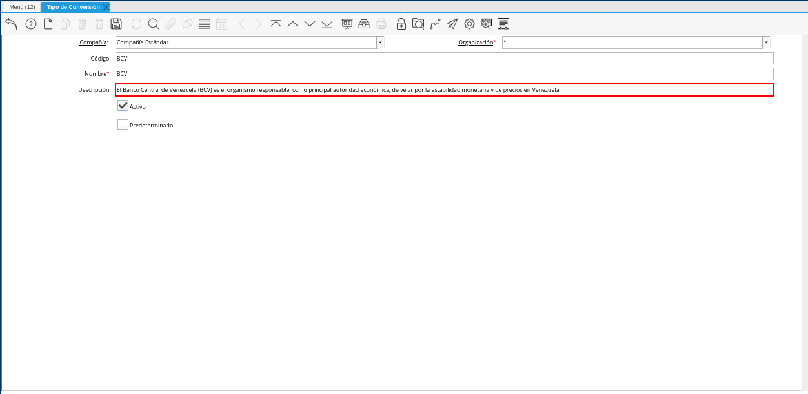
.. |Checklist Activo| image:: resources/active-checklist-the-conversion-type-window.png
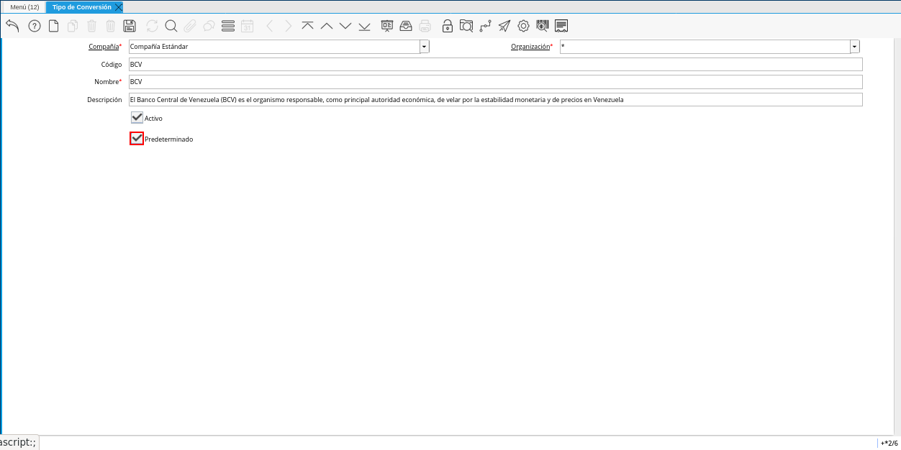
.. |Menú de ADempiere| image:: resources/conversion-rate-menu.png
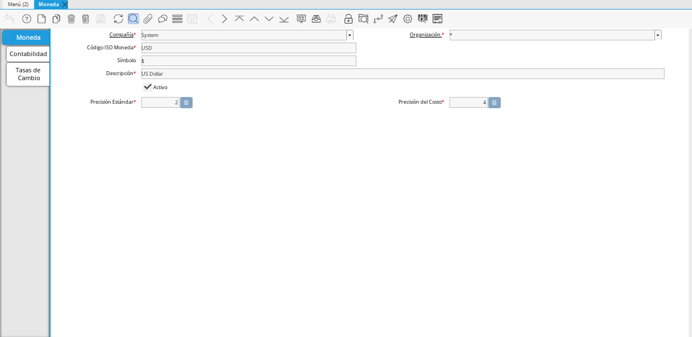
.. |Pestaña Tasas de Cambio| image:: resources/exchange-rates-tab.png
.. |Icono Registro Nuevo Tasas| image:: resources/new-registration-icon-from-the-exchange-rates-tab.png
.. |Campo Moneda Hacia| image:: resources/currency-field-towards-the-exchange-rates-tab.png
.. |Campo Tipo de Conversión| image:: resources/conversion-rate-field-of-the-exchange-rates-tab.png
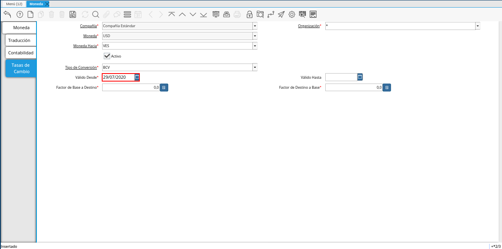
.. |Campo Válido Hasta| image:: resources/field-valid-up-to-the-exchange-rates-tab.png
.. |Campo Factor de Base a Destino| image:: resources/base-factor-to-destination-field-of-the-exchange-rates-tab.png
.. |menú de tasa de cambio| image:: resources/exchange-rate-menu.png
.. |ventana tasa de cambio| image:: resources/exchange-rate-window.png
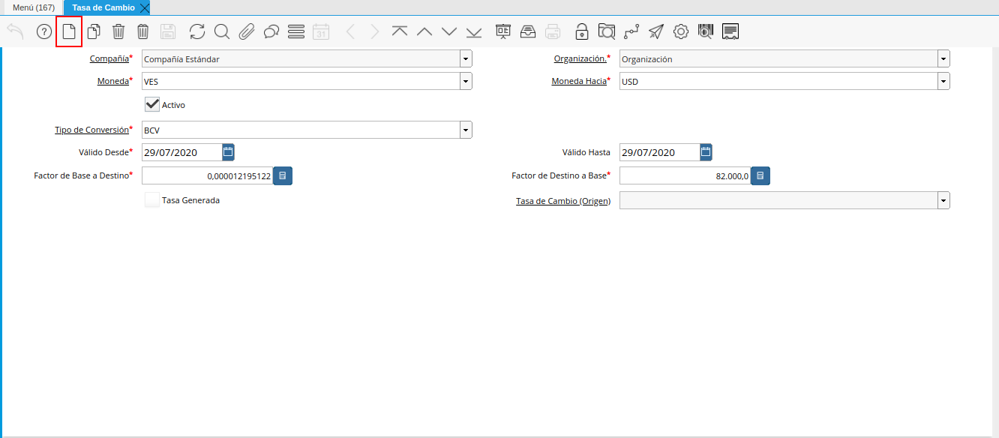
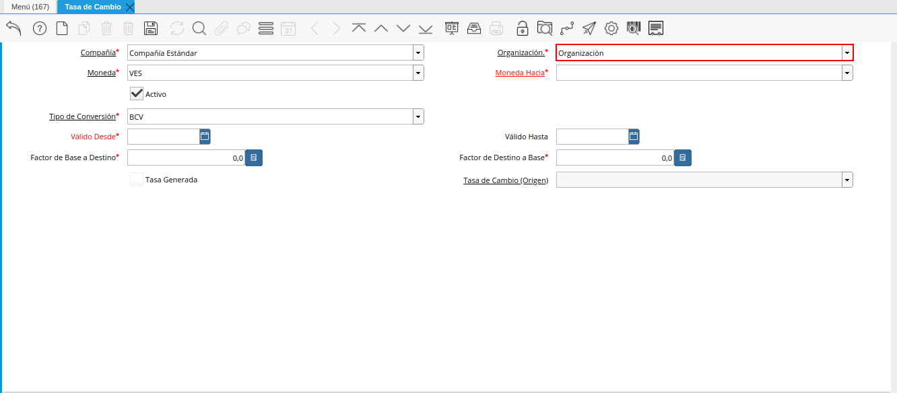
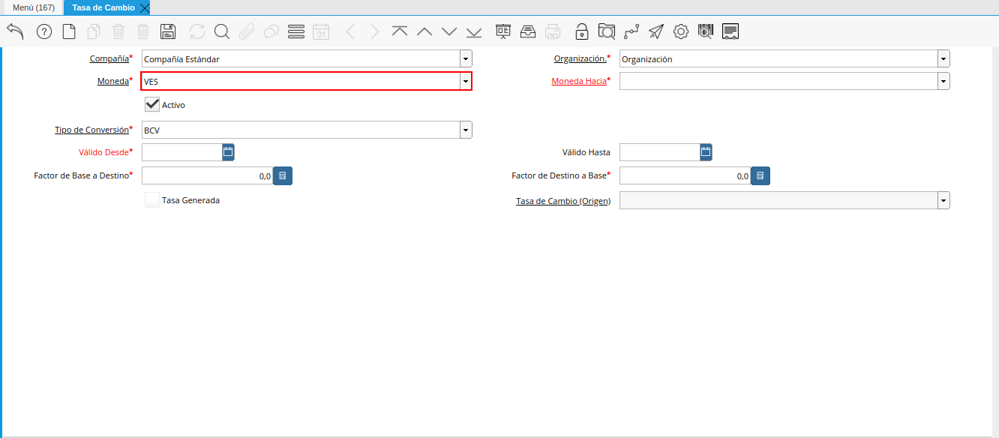
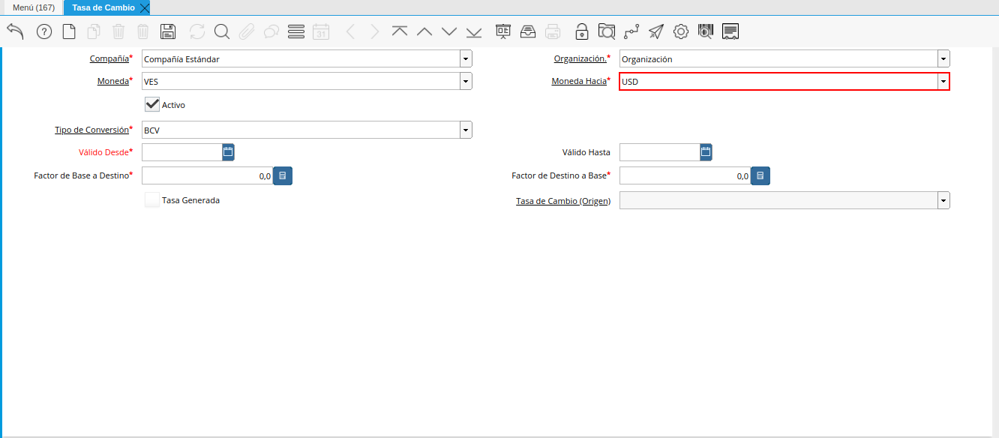
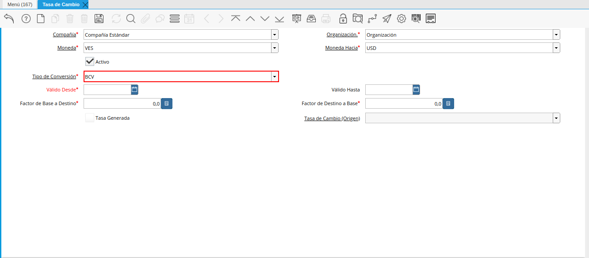
.. |campo válido desde de la tasa de cambio| image:: resources/field-valid-from-exchange-rate.png
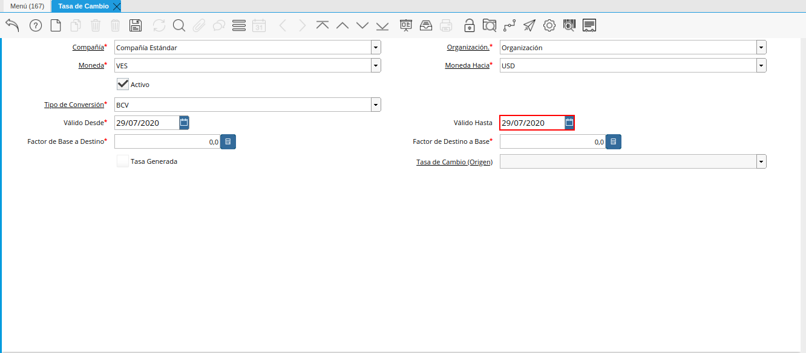
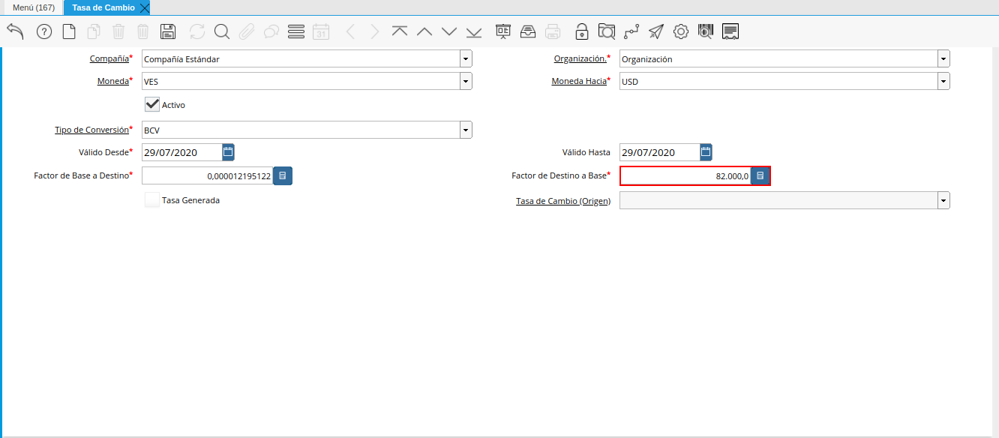

.. _documento/conversión-monetaria:

**Conversión Manual**
=====================

La conversión manual consiste en crear en ADempiere los tipos de conversión con los cuales va a trabajar la empresa. Esta funcionalidad permite lo siguiente:

- **Tasa de Conversión Diaria:** Al trabajar con diferentes monedas en los procesos de compra/venta de la organización, se vuelve obligatoría la creación de las tasas de cambio diariamente en los diferentes tipos de conversión con los que trabaja dicha organización. Adicional a ello, la fecha final del rango o periodo de la tasa de cambio, siempre debe ser igual a la fecha de inicio de dicho rango o periodo. 

En el caso de que el usuario intente crear una tasa de cambio con el mismo tipo de conversión y moneda utilizado previamente el mismo día, al intentar guardar el registro existirá una validación que no permitirá completar el proceso.

    |caso de coincidencia de tasas a la fecha| image:: resources/rate-coincidence-case-to-date.png

    Imagen 1. Ejemplo de Validación

- **Crear Tasa Recíproca:** Esta funcionalidad permite que al guardar el registro sea creada de manera automática una tasa de cambio como reverso.

.. note::

    Un ejemplo de este caso puede ser cuando el usuario crea una tasa de cambio de moneda "**VES**" a moneda "**USD**" con una tasa multiplicadora 2 entonces automáticamente se creará una tasa de cambio de moneda "**USD**" a "**VES**" con la tasa multiplicadora 0.5

.. only:: html

    .. figure:: resources/tasa-cambio-reciproca.gif

    Video 1. Tasa de Cambio

En el siguiente enlace puede descargar un ejemplo del mismo para visualizarlo mejor :download:`Convert Video <tasa-cambio-reciproca.gif>`

.. _paso/crear-conversión:

**Tipo de Conversión**
----------------------

#. Ubique y seleccione en el menú de ADempiere, la carpeta "**Análisis de Desempeño**", luego seleccione la carpeta "**Reglas Contables**", por último seleccione la ventana "**Tipo de Conversión**".

    |Menú de ADempiere 2|

    Imagen 2. Menú de ADempiere

#. Podrá visualizar la ventana "**Tipo de Conversión**", con los diferentes registros que contiene dicha ventana.

    |Ventana Tipo de Conversión|

    Imagen 3. Ventana Tipo de Conversión

#. Seleccione el icono "**Registro Nuevo**", ubicado en la barra de herramientas de ADempiere.

    |Icono Registro Nuevo|

    Imagen 4. Icono Registro Nuevo de la Ventana Tipo de Conversión

    #. Seleccione en el campo "**Organización**", la organización para la cual esta creando el registro de tipo de conversión.

        |Campo Organización|

        Imagen 5. Campo Organización de la Ventana Tipo de Conversión

    #. Introduzca en el campo "**Código**", el código correspondiente al registro de tipo de conversión que se encuentra realizando, para este caso es utilizado el código "**BCV**".

        |Campo Código|
        
        Imagen 6. Campo Código de la Ventana Tipo de Conversión

    #. Introduzca en el campo "**Nombre**" el nombre correspondiente al registro de tipo de conversión que se encuentra realizando, para este caso es utilizado el nombre de conversión "**BCV**".

        |Campo Nombre|

        Imagen 7. Campo Nombre de la Ventana Tipo de Conversión

    #. Introduzca en el campo "**Descripción**", una breve descripción correspondiente al registro de tipo de conversión que se encuentra realizando.

        |Campo Descripción|

        Imagen 8. Campo Descripción de la Ventana Tipo de Conversión

    #. El checklist "**Activo**", indica que el registro se encuentra activo y puede ser utilizado en cualquier transacción que lo requiera.

        |Checklist Activo|

        Imagen 9. Checklist Activo de la Ventana Tipo de Conversión

    #. Seleccione el checklist "**Predeterminado**", para indicar como predeterminado el registro que se encuentra realizando.

        |Checklist Predeterminado|

        Imagen 10. Checklist Predeterminado de la Ventana Tipo de Conversión

.. note:: 

    Recuerde guardar los cambios realizados seleccionando el icono "**Guardar Cambios**", ubicado en la barra de herramientas de ADempiere.

.. _paso/crear-tasa-desde-ventana-moneda:

**Tasa de Conversión desde la Ventana Moneda**
----------------------------------------------

#. Ubique y seleccione en el menú de ADempiere, la carpeta "**Análisis de Desempeño**", luego seleccione la carpeta "**Reglas Contables**", por último seleccione la ventana "**Moneda**".

    |Menú de ADempiere|

    Imagen 11. Menú de ADempiere

#. Seleccione el registro de la moneda para la cual requiere registrar una tasa de conversión. Para ejemplificar el registro es utilizada la moneda "**USD**".

    |Ventana Moneda|

    Imagen 12. Registro de Moneda USD en ADempiere

    #. Seleccione la pestaña "**Tasas de Cambio**" para navegar entre los diferentes registros de tasas de cambio correspondientes a la moneda "**USD**".

        |Pestaña Tasas de Cambio|

        Imagen 13. Pestaña Tasas de Cambio de la Ventana Moneda

    #. Seleccione el icono "**Registro Nuevo**" para crear un nuevo registro de tasas de cambio.

        |Icono Registro Nuevo Tasas|

        Imagen 14. Icono Registro Nuevo de la Pestaña Tasas de Cambio

        .. warning::

            La tasa de cambio se debe crear de dólares a bolívares y de bolívares a dólares.

        #. Seleccione en el campo "**Moneda Hacia**", la moneda para la cual requiere convertir el dinero. Para ejemplificar el registro es utilizada la moneda "**VES**".

            |Campo Moneda Hacia|

            Imagen 15. Campo Moneda Hacia de la Pestaña Tasas de Cambio

        #. Seleccione en el campo "**Tipo de Conversión**", el tipo de conversión a utilizar. Para este caso es utilizado el tipo de conversión "**BCV**", creado anteriormente.

            |Campo Tipo de Conversión|

            Imagen 16. Campo Tipo de Conversión de la Pestaña Tasas de Cambio

        #. Seleccione en el campo "**Válido Desde**", la fecha desde la cual es válida la tasa de conversión que se encuentra realizando.

            |Campo Válido Desde|

            Imagen 17. Campo Válido Desde de la Pestaña Tasas de Cambio

        #. Seleccione en el campo "**Válido Hasta**", la fecha hasta la cual es válida la tasa de conversión que se encuentra realizando.

            |Campo Válido Hasta|

            Imagen 18. Campo Válido Hasta de la Pestaña Tasas de Cambio

        #. Introduzca en el campo "**Factor de Base a Destino**", la tasa por la que serán multiplicados los montos de las transacciones donde sea utilizado el tipo de conversión seleccionado anteriormente. Para ejemplificar el registro es utilizada la tasa "**82.000,0**".

            |Campo Factor de Base a Destino|

            Imagen 19. Campo Factor de Base a Destino de la Pestaña Tasas de Cambio

.. note:: 

    Recuerde guardar los cambios realizados seleccionando el icono "**Guardar Cambios**", ubicado en la barra de herramientas de ADempiere.

.. _paso/crear-tasa-desde-ventana-moneda:

**Tasa de Conversión desde la Ventana Tasa de Cambio**
------------------------------------------------------

#. Ubique y seleccione en el menú de ADempiere, la carpeta "**Análisis de Desempeño**", luego seleccione la carpeta "**Reglas Contables**", por último seleccione la ventana "**Tasa de Cambio**".

    |menú de tasa de cambio|

    Imagen 20. Menú de ADempiere

#. Podrá visualizar la ventana "**Tasa de Cambio**", con diferentes campos que permiten registrar las tasas de cambio según el tipo de conversión.

    |ventana tasa de cambio|

    Imagen 21. Ventana Tasa de Cambio

#. Seleccione el icono "**Registro Nuevo**", para crear un nuevo registro de tasa de cambio según el tipo de conversión.

    |icono registro nuevo de la tasa de cambio|

    Imagen 22. Icono Registro Nuevo

#. Seleccione en el campo "**Organización**", la organización para la cual se encuentra realizando el registro de tasa de cambio.

    |campo organización de la tasa de cambio|

    Imagen 23. Campo Organización

#. Seleccione en el campo "**Moneda**", la moneda origen de la conversión.

    |campo moneda de la tasa de cambio|

    Imagen 24. Campo Moneda

#. Seleccione en el campo "**Moneda Hacia**", la moneda destino de la conversión.

    |campo moneda hacia de la tasa de cambio|

    Imagen 25. Campo Moneda Hacia

#. Seleccione en el campo "**Tipo de Conversión**", el tipo de conversion de la tasa de cambio que se encuentra registrando.

    |campo tipo de conversión de la tasa de cambio|

    Imagen  26. Campo Tipo de Conversión

#. Seleccione en el campo "**Válido Desde**", la fecha de inicio del periodo de validez de la tasa de cambio.

    |campo válido desde de la tasa de cambio|

    Imagen 27. Campo Válido Desde

#. Seleccione en el campo "**Válido Hasta**", la fecha final del periodo de validez de la tasa de cambio.

    |campo válido hasta de la tasa de cambio|

    Imagen 28. Campo Válido Hasta

#. Introduzca en el campo "**Factor de Destino a Base**", la tasa por la que serán multiplicados los montos de las transacciones donde sea utilizado el tipo de conversión seleccionado anteriormente. Para ejemplificar el registro es utilizada la tasa "**82.000,0**".

    |campo factor de destino a base de la tasa de cambio|

    Imagen 29. Campo Factor de Destino a Base

.. note:: 

    Recuerde guardar los cambios realizados seleccionando el icono "**Guardar Cambios**", ubicado en la barra de herramientas de ADempiere.
