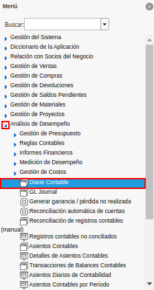
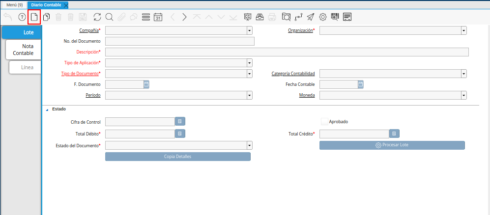
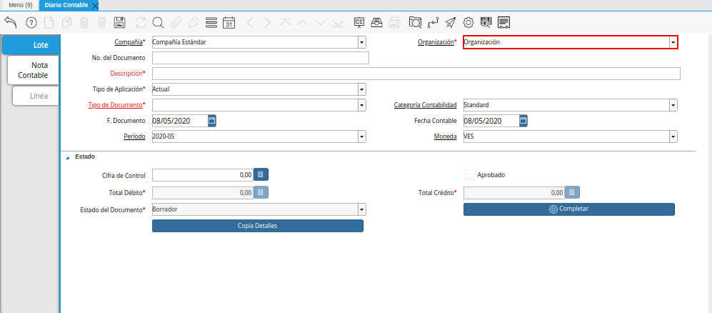
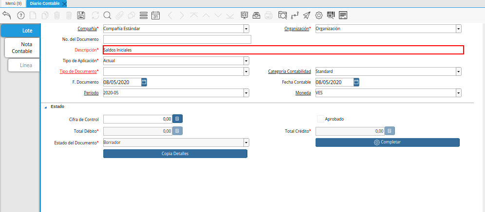
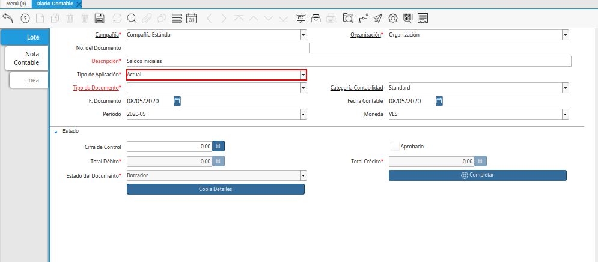
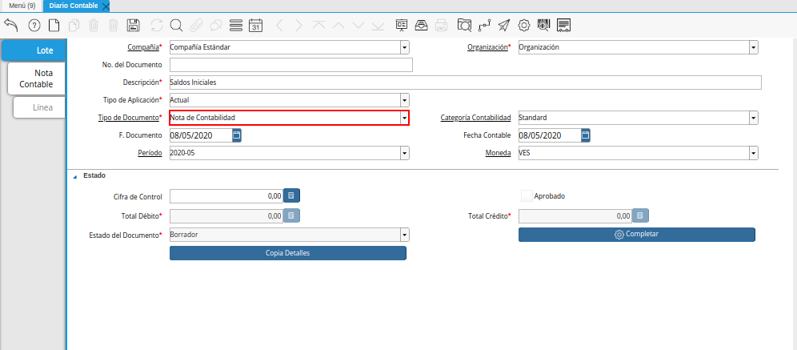
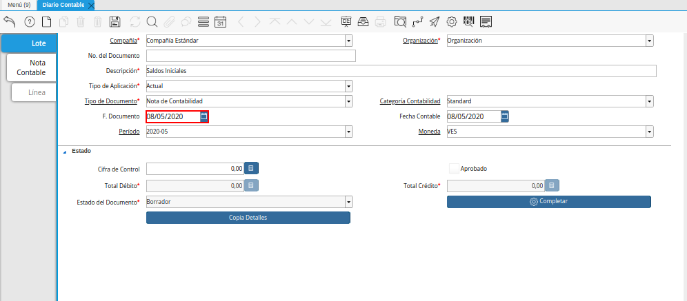
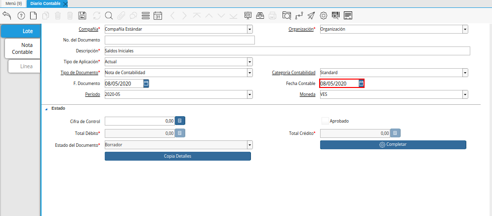
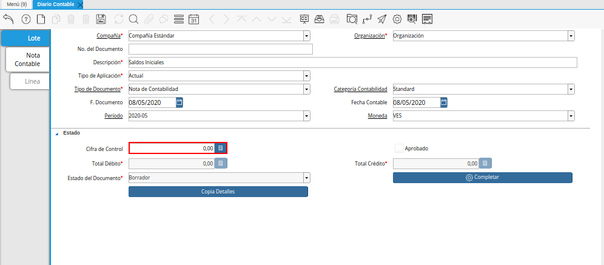
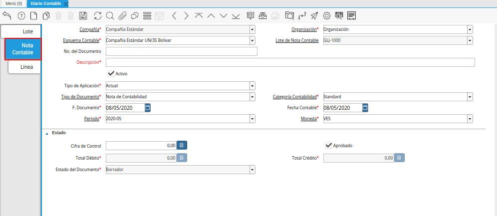
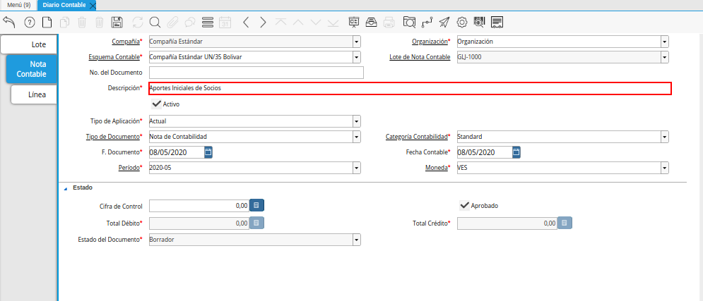
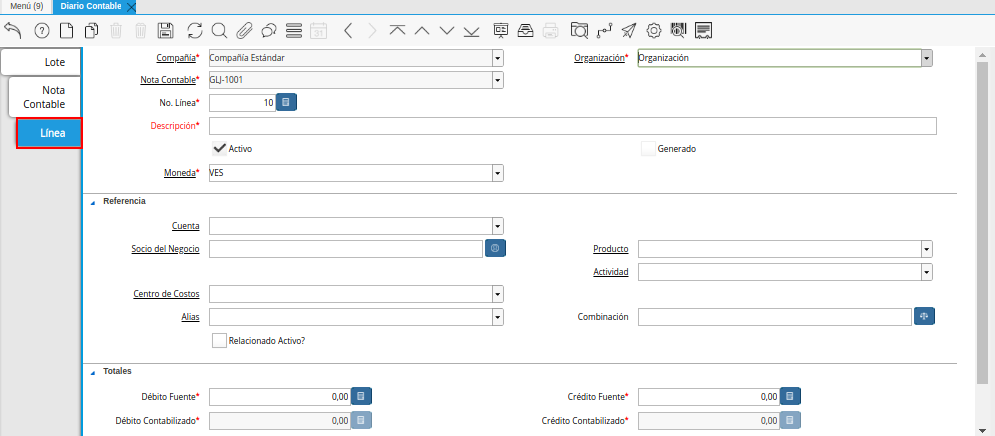
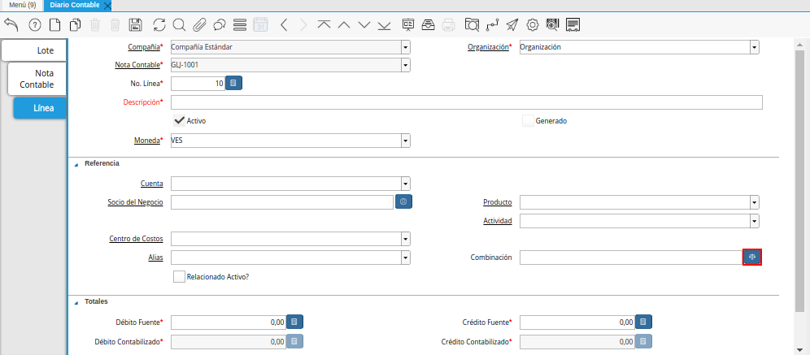
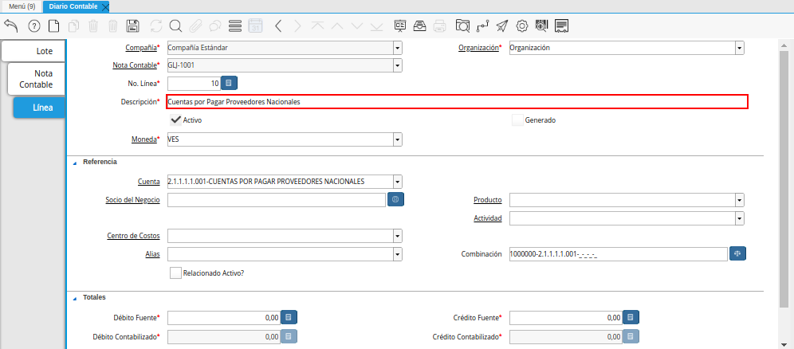
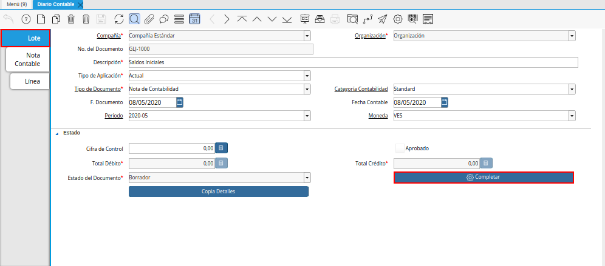
.. |Acción Completar y Opción OK| image:: resources/accion-completar.png

.. _ERPyA: http://erpya.com
.. _documento/nota-de-contabilidad:

========================
**Nota de Contabilidad**
========================

#. Ubique y seleccione en el menú de ADempiere, la carpeta "**Análisis de Desempeño**", luego seleccione la ventana "**Diario Contable**".

    |Menú de ADempiere|

    Imagen 1. Menú de ADempiere

#. Podrá visualizar la siguiente ventana.

    |Ventana Diario Contable y Icono Registro Nuevo|

-----------------
**Lote Contable**
-----------------

#. Seleccione el icono "**Registro Nuevo**", para crear un nuevo registro de diario contable en ADempiere.

    |Ventana Diario Contable y Icono Registro Nuevo|

    Imagen 2. Ventana Diario Contable y Icono Registro Nuevo

    #. Seleccione la organización en el campo "**Organización**".

        La organización es un campo obligatorio, le permite determinar, a que organización corresponde el lote contable, para dimensionar o clasificar el asiento contable por organización, para profundizar más este tema vaya a el documento: :ref:`documento/dimensiones-contable`.

        |Campo Organización|

        Imagen 3. Campo Organización

    #. Introduzca una descripción clara en el campo "**Descripción**".

        La descripción es un campo obligatorio, que le ayudará a determinar en reportes detallados el motivo o justificación por el cual existe el asiento, es por ello que recomendamos definir una descripción clara y precisa del lote contable, ya que la misma será mostrada en reportes de auditorias.

        |Campo Descripción|

        Imagen 4. Campo Descripción

    #. Seleccione un tipo de aplicación en el campo "**Tipo de Aplicación**".

        El tipo de aplicación es un campo obligatorio, le permite clasificar el lote contable por tipo de aplicación, este es establecido actual por defecto, para profundizar más este tema vaya a el documento: :ref:`documento/tipo-de-aplicación`

        |Campo Tipo de Aplicación|

        Imagen 5. Campo Tipo de Aplicación

    #. Seleccione un tipo de documento en el campo "**Tipo de Documento**".

        El tipo de documento es un campo obligatorio, que  define el comportamiento del documento que se esta elaborando, para profundizar más este tema vaya a el documento: :ref:`documento/tipo-documento`.

        |Campo Tipo de Documento|

        Imagen 6. Campo Tipo de Documento

    #. Seleccione la fecha en el campo "**F. Documento**".

        La fecha de documento es un campo obligatorio, que  le permite filtrar por rango de fecha los lotes contables realizados.

        |Campo Fecha del Documento|

        Imagen 7. Campo Fecha del Documento

    #. Seleccione la fecha en el campo "**Fecha Contable**".

        La fecha contable es un campo obligatorio, que le permite establecer un limite contable para las notas contables dependientes de este lote contable.

        |Campo Fecha Contable|

        Imagen 8. Campo Fecha Contable

    #. Introduzca un monto en el campo "**Cifra de Control**".

        La cifra control no es un campo obligatorio, sin embargo le permite validar que el monto total del débito sea igual a la cifra control, esta validación es ejecutada cuando el monto es diferente a cero.

        |Campo Cifra de Control|

        Imagen 9. Campo Cifra de Control

    .. note::

        Recuerde guardar el registro de los campos con ayuda del icono "**Guardar Cambios**", ubicado en la barra de herramientas de ADempiere.

#. Seleccione la pestaña "**Nota Contable**".

-----------------
**Nota Contable**
-----------------

#. Proceda al llenado de los campos correspondientes para especificar una descripción para cada movimiento.

    |Pestaña Nota Contable|

    Imagen 10. Pestaña Nota Contable

    #. Introduzca una descripción clara en el campo "**Descripción**".

        La descripción es un campo obligatorio, que le ayudará a determinar en reportes detallados el motivo o justificación por el cual existe el asiento, es por ello que recomendamos definir una descripción clara y precisa de la nota contable, ya que la misma será mostrada en reportes de auditorias.

        |Campo Descripción de la Pestaña Nota Contable|

        Imagen 11. Campo Descripción de la Pestaña Nota Contable

    .. note::

        Recuerde guardar el registro de los campos con ayuda del icono "**Guardar Cambios**", ubicado en la barra de herramientas de ADempiere.

#. Seleccione la pestaña "**Línea**".

-----------------
**Línea**
-----------------

#. Seleccione la pestaña "**Línea**" y proceda al llenado de los campos correspondientes para definir cada uno de los movimientos.

    |Pestaña Línea|

    Imagen 12. Pestaña Línea

    #. Seleccione en en el campo "**Combinanción**", la combinación contable correspondiente al procedimiento que esta realizando, la misma puede ser seleccionada con ayuda del identificador del campo "**Combinación**".

        |Icono del Campo Combinación|

        Imagen 13. Icono del Campo Combinación

        #. Realice el procedimiento para regular para crear una combinación contable, explicado en el documento :ref:`documento/combinación-contable`, elaborado por `ERPyA`_.

    #. Introduzca en el campo "**Descripción**", el nombre descriptivo del movimiento a realizar.

        |Campo Descripción de la Pestaña Línea|

        Imagen 14. Campo Descripción de la Pestaña Línea

#. Regrese a la pestaña principal "**Lote**" y seleccione la opción "**Completar**", ubicado en la parte inferior derecha de la ventana.

    |Pestaña Lote y Opción Completar|

    Imagen 15. Pestaña Lote y Opción Completar

#. Seleccione la acción "**Completar**" y la opción "**OK**" para completar el documento "**Nota de Contabilidad**".

    |Acción Completar y Opción OK|

    Imagen 16. Acción Completar y Opción OK 
