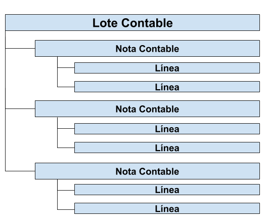
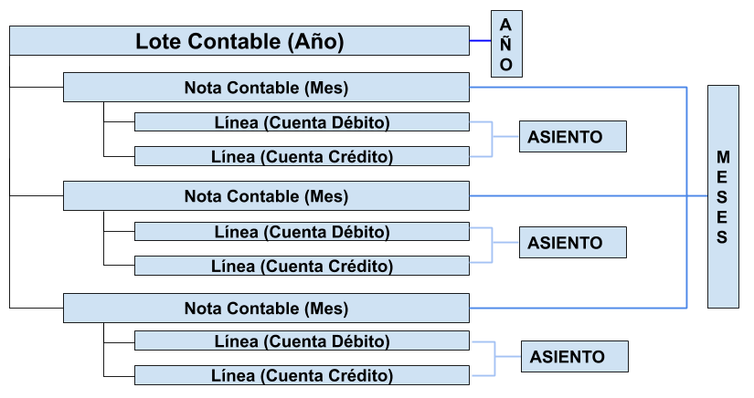

.. _ERPyA: http://erpya.com

.. _src/adempiere/performance-analysis/gl-journal-batch:

===================
**Diario Contable**
===================

En contabilidad una nota contable simboliza un documento que se origina internamente en la empresa, y sustituye los hechos contables que no provienen de transacciones comunes dentro de la empresa.

Generalmente estos registros carecen de soportes administrativos que justifiquen su origen o procedencia, en consecuencia, se hace necesario la realización de asientos contables que corrijan o ajusten los créditos y débitos faltantes en los balances.

ADempiere por ser un software **ERP** no apoya la realización de notas contables, puesto que ofrece una gama amplia de procesos administrativos que a su vez generan hechos contables que sustituyen esta práctica.

Sin embargo, ADempiere cuenta con una solución llamada "**Diario Contable**" que permite la creación de registros contables en lotes, es decir, usted podrá esquematizar más de un periodo contable con asientos en un solo diario de contabilidad, para entenderlo mejor veamos el siguiente ejemplo:

    Imaginemos que una empresa requiere reconocer contablemente la inflación ocurrida durante un año y el impacto causado en el valor de sus activos, o lo que contablemente se conoce como una revaluación de activos o un ajuste por inflación (API).

    Sabiendo que la inflación representa una variación de precios con respecto a los bienes tangibles o intangible, entonces tenemos, que la inflación fue variable a través de los meses durante el año fiscal, quedando de la siguiente forma:

    +-----------+-----------+
    | Mes       | Variación |
    +===========+===========+
    | Enero     | 1,5       |
    +-----------+-----------+
    | Febrero   | 2,8       |
    +-----------+-----------+
    | Marzo     | 1,4       |
    +-----------+-----------+
    | Abril     | 4,6       |
    +-----------+-----------+
    | Mayo      | 2,9       |
    +-----------+-----------+
    | Junio     | 2,8       |
    +-----------+-----------+
    | Julio     | 6,5       |
    +-----------+-----------+
    | Agosto    | 4,7       |
    +-----------+-----------+
    | Septiembre| 2,5       |
    +-----------+-----------+
    | Octubre   | 3,5       |
    +-----------+-----------+
    | Noviembre | 5,1       |
    +-----------+-----------+
    | Diciembre | 4,7       |
    +-----------+-----------+

    Si se desea registrar el asiento amortizando mes a mes el impacto económico que tuvo el activo, se debe realizar una nota contable por mes con el siguiente asiento contable:

    +------------------------+-----------+-----------+
    | Cuenta                 | Débito    | Crédito   |
    +========================+===========+===========+
    | Cuenta API             |      xxxx |           |
    +------------------------+-----------+-----------+
    | Diferencia Cambiaria   |           |      xxxx |
    +------------------------+-----------+-----------+
    |              **Total** |      xxxx |      xxxx |
    +------------------------+-----------+-----------+

ADempiere ofrece la posibilidad de crear un lote contable, donde agrupará los asientos de todos los meses en un diario contable, por esa razón su estructura es la siguiente:

    |Estructura de Diario Contable|

    Imagen 1. Estructura de Diario Contable

Si se aplica el ejemplo anterior en un diario contable en ADempiere quedará de la siguiente forma:

    |Estructura de Diario Contable Ejemplo|

    Imagen 1. Estructura de Diario Contable Aplicando el Ejemplo

De esta manera tendríamos un lote contable, con doce notas contables y las líneas necesarias realizando los asientos correspondientes a cada mes, en las que se cargan y abonan las cuentas correspondientes para balancear la nota contable, cabe acotar, que si no se encuentra balanceada la nota contable no podrá completar el registro.

Pese a que usted cuenta con esta bondad, no se recomienda la realización de notas contables para procesos contemplados en ADempiere, puesto cada transacción administrativa registra los hechos contables de forma automática, en consecuencia se sugiere sea utilizado solo en casos excepcionales.

`ERPyA`_  quiere ofrecerle un instructivo paso a paso con el cual podrá alcanzar un registro exitoso como diario contable en ADempiere ERP & CRM,.

.. toctree::
    :maxdepth: 2

    gl-journal-batch
