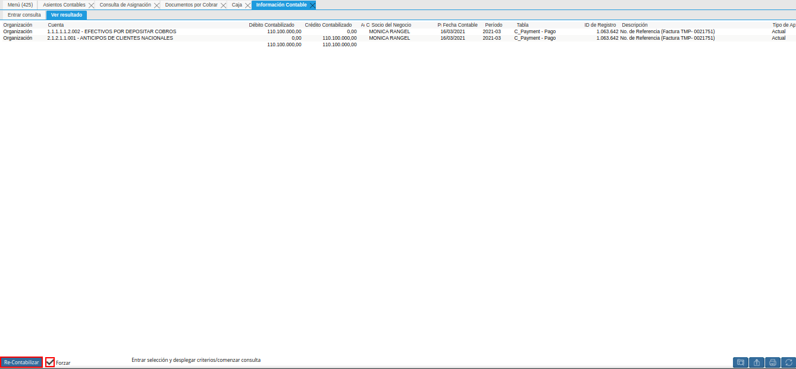

.. |menú de asientos contables| image:: resources/accounting-entries-menu.png
.. |registro de hecho contable en la ventana asientos contables| image:: resources/record-of-accounting-fact-in-the-accounting-entries-window.png

.. |pestaña asignaciones de la ventana consulta de asignación| image:: resources/assignments-tab-of-the-assignment-query-window.png

.. |registro de factura en la ventana documentos por cobrar| image:: resources/invoice-posting-in-the-documents-receivable-window.png
.. |tipo de conversión y tasa a la fecha de la factura| image:: resources/conversion-rate-and-rate-on-invoice-date.png

.. |pestaña facturas pagadas de la ventana documentos por cobrar| image:: resources/paid-invoices-tab-of-the-documents-receivable-window.png
.. |registro del cobro en la ventana caja| image:: resources/payment-record-in-the-cash-window.png

.. _documento/re-contabilizar-datos-contables-de-cuentas-de-ganancia-y-perdida:

**Re-contabilizar Datos Contables de Cuentas de Ganancia y Perdida**
====================================================================

Ubique y seleccione en el menú de ADempiere, la carpeta "**Análisis de Desempeño**", luego seleccione la ventana "**Asientos Contables**".

    |menú de asientos contables|

    Imagen 1. Menú de ADempiere

Una vez visualizada la ventana "**Asientos Contables**", se procede a ubicar el registro del asiento contable que requiere actualizar. Esta búsqueda se puede realizar seleccionando el filtro "**Hecho Contable**" e ingresando el "**ID**" del mismo. Como ejemplo se tiene el hecho contable "**5726493**".

    .. note::

        De igual manera, se puede realizar la búsqueda utilizando los filtros "**Cuenta**", "**Fecha Contable**", "**Fecha de la Transacción**", entre otros que van a depender de lo que requiera el usuario en su momento.

    |registro de hecho contable en la ventana asientos contables|

    Imagen 2. Registro de Hecho Contable

Luego de ubicar el hecho contable, se debe seleccionar la opción "**ID de Registro**", para acercar de manera rápida el registro de la asignación en la ventana "**Consulta de Asignación**".

    |asignación entre factura y cobro de la ventana consulta de asignación|

    Imagen 3. Asignación entre Factura y Cobro

Una vez en el registro de la asignación entre el cobro y la factura, se debe seleccionar la pestaña "**Asignaciones**" de la ventana "**Consulta de Asignación**", para acceder desde allí al registro de la factura asociada a dicha asignación.

    |pestaña asignaciones de la ventana consulta de asignación|

    Imagen 4. Pestaña Asignaciones

Para acercar de manera rápida el registro de la factura asociada, se debe hacer clic contrario sobre el campo "**Factura**" y seleccionar la opción "**Acercar**".

    |opción acercar del campo factura de la pestaña asignaciones|

    Imagen 5. Opción Acercar del campo Factura

Podrá visualizar la ventana "**Documentos por Cobrar**" con el registro de la factura asociada. 

    |registro de factura en la ventana documentos por cobrar|

    Imagen 6. Registro de Factura

En la misma se debe verificar el tipo de conversión que esta posee, ya que este debe ser a la tasa del día de la factura. Es decir, si la factura tiene fecha "**16/03/2021**", el tipo de conversión de la factura debe ser "**BCV 16/03/2021**". De no tener el tipo de conversión indicado antes, se debe crear un tipo de conversión y su respectiva tasa de cambio, donde la fecha de inicio de la tasa debe ser la fecha de la factura y la fecha final de la tasa debe ser la fecha que tiene el último cobro realizado en relación a dicha factura. Ejemplo: 

- Tipo de conversión "**BCV 16/03/2021**"
- Tasa de cambio "**1.835.000,0**"
- Válido Desde "**16/03/2021**"
- Válido Hasta "**16/03/2021**"

    |tipo de conversión y tasa a la fecha de la factura|

    Imagen 7. Tipo de Conversión y Tasa de Cambio a la Fecha de la Factura

Cuando se tenga el tipo de conversión y tasa de cambio a la fecha de la factura, se debe cambiar el valor que se encuentra en el campo "**Tipo de Conversión**" de la factura y seleccionar el tipo de conversión creado. Continuando con el ejemplo, el tipo de conversión a seleccionar sería "**BCV 16/03/2021**".

    .. note::

        Si el tipo de conversión no puede ser visualizado, debe hacer clic contario sobre el campo y selecionar la opción "**Refrescar**", para actualizar los valores que muestra el mismo.

    |nuevo tipo de conversión en la factura de la ventana documentos por cobrar|

    Imagen 8. Nuevo Tipo de Conversión

Luego se debe guardar el registro y seleccionar la pestaña "**Facturas Pagadas**" de la ventana "**Documentos por Cobrar**", para visualizar los cobros asociados a la factura.

    |pestaña facturas pagadas de la ventana documentos por cobrar|

    Imagen 9. Pestaña Facturas Pagadas

Se debe copiar el valor que se encuentra en el campo "**Pago**" y ubicarlo en la ventana "**Caja**".

    |registro del cobro en la ventana caja|

    Imagen 10. Registro del Cobro 

Una vez ubicado el registro del cobro asociado a la factura, se debe cambiar el tipo de conversión que tiene el mismo y asociar el tipo de conversión creado para luego guardar el registro.

    .. note::

        Si el tipo de conversión no puede ser visualizado, debe hacer clic contario sobre el campo y selecionar la opción "**Refrescar**", para actualizar los valores que muestra el mismo.

    |nuevo tipo de conversión en el cobro de la ventana caja|

    Imagen 11. Nuevo Tipo de Conversión

El cobro debe ser re-contabilizado, para ello se debe seleccionar la opción "**Contabilizado**" ubicada en la parte inferior derecha del cobro.

    |opción contabilizado en la ventana caja|

    Imagen 12. Opción Contabilizado del Cobro

Al visualizar la ventana "**Información Contable**", se activa el check "**Forzar**" y se selecciona la opción "**Re-Contabilizar**".

    |check forzar y opción re-contabilizar cobro|

    Imagen 13. Check Forzar y Opción Re-Contabilizar Cobro

.. note::

    En la ventana emergente de confirmación, se debe seleccionar la opción "**OK**" para ejecutar el proceso.

Finalmente, se debe ubicar de nuevo el registro de la asignación entre el cobro y la factura en la ventana "**Consulta de Asignación**", en la cual se debe seleccionar la pestaña principal "**Asignación**" y la opción "**Contabilizado**".

    |pestaña principal asignación de la ventana consulta de asignación|

    Imagen 14. Pestaña Principal Asignación de la Ventana Consulta de Asignación

Luego de visualizar la ventana "**Información Contable**", se debe activar el check "**Forzar**" y seleccionar la opción "**Re-Contabilizar**".

    |check forzar y opción re-contabilizar asignación|

    Imagen 15. Check Forzar y Opción Re-Contabilizar Asignación

Este proceso se debe repetir por cada uno de los cobros que tenga asociado la factura.

Por último, se ubica nuevamente el hecho contable de la ventana "**Asientos Contables**" y se selecciona el icono "**Refrescar**", para actualizar el registro de la ventana y confirmar que el proceso fue realizado de manera exitosa. De ser así, podrá visualizar la ventana "**Asientos Contables**" sin ningún registro.

    |resultado del proceso re-contabilizar datos contables|

    Imagen 16. Resultado del Proceso Re-Contabilizar Datos Contables