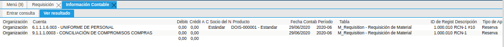
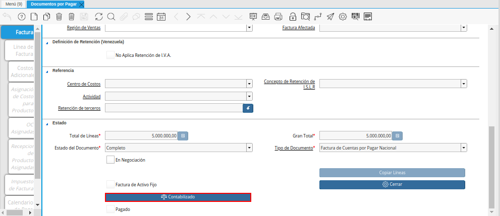
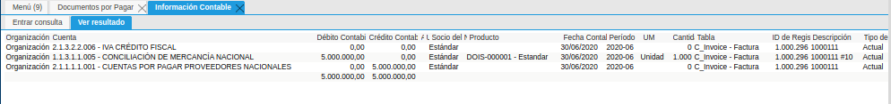
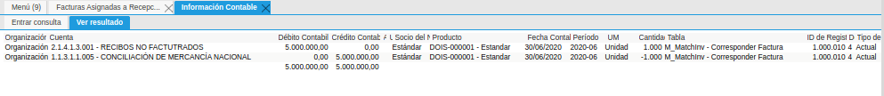
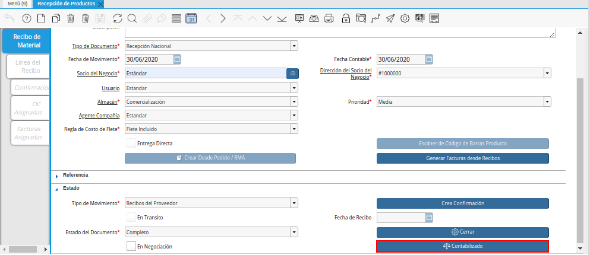
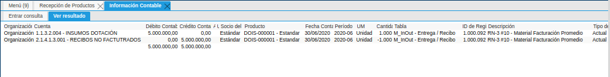
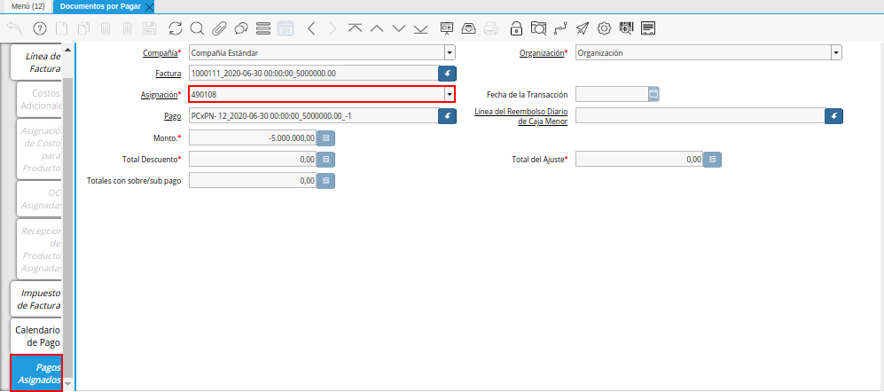
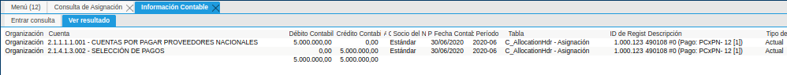

.. _ERPyA: http://erpya.com

.. |Opción Contabilizado de la Ventana Requisición| image:: resources/option-posted-from-the-requisition-window.png

.. |Opción Contabilizado de la Ventana Ordenes de Compra| image:: resources/option-posted-from-the-purchase-orders-window.png
.. |Asiento Contable de la Ventana Ordenes de Compra| image:: resources/window-entry-window-purchase-orders.png

.. |Opción Contabilizado de la Ventana Facturas Asignadas a Recepciones| image:: resources/option-posted-from-the-invoices-assigned-to-receipts-window.png

.. |Opción Contabilizado de la Ventana Pago Cobro| image:: resources/option-posted-from-the-payment-payment-window.png
.. |Asiento Contable de la Ventana Pago Cobro| image:: resources/window-accounting-window-payment-collection.png

.. |Opción Contabilizado de la Ventana Consulta de Asignación| image:: resources/posted-option-from-the-assignment-query-window.png

.. |Opción Contabilizado de la Ventana Estado de Cuentas Bancario| image:: resources/option-posted-from-the-bank-account-status-window.png
.. |Asiento Contable de la Ventana Estado de Cuentas Bancario| image:: resources/accounting-entry-in-the-bank-statement-window.png

.. _documento/contabilidad-de-transacciones-del-proceso-de-egreso:

**Proceso de Egreso**
=====================

**Requisición**
---------------

 Realice el procedimiento regular para generar una requisición en ADempiere, el mismo es explicado en el documento :ref:`documento/requisición-compra`, elaborado por `ERPyA`_.

 Luego de que el documento de requisición se encuentre en estado "**Completo**", seleccione la opción "**Contabilizado**", ubicada en la parte inferior de la ventana "**Requisición**".

    |Opción Contabilizado de la Ventana Requisición|

    Imagen 1. Opción Contabilizado de la Ventana Requisición

 Podrá visualizar el asiento contable generado por la transacción anteriormente realizada en la ventana "**Requisición**".

    |Asiento Contable de la Ventana Requisición|

    Imagen 2. Asiento Contable de la Ventana Requisición

**Orden de Compra**
-------------------

 Realice el procedimiento regular para generar una orden de compra directa en ADempiere, el mismo es explicado en el documento :ref:`documento/orden-de-compra`, elaborado por `ERPyA`_.

 Luego de que el documento de orden de compra se encuentre en estado "**Completo**", seleccione la opción "**Contabilizado**", ubicada en la parte inferior de la ventana "**Órdenes de Compra**".

    |Opción Contabilizado de la Ventana Ordenes de Compra|

    Imagen 3. Opción Contabilizado de la Ventana Órdenes de Compra

 Podrá visualizar el asiento contable generado por la transacción anteriormente realizada en la ventana "**Órdenes de Compra**".

    |Asiento Contable de la Ventana Ordenes de Compra|

    Imagen 4. Asiento Contable de la Ventana Órdenes de Compra

**Factura de Cuentas por Pagar**
--------------------------------

 Realice el procedimiento regular para generar un documento por pagar en ADempiere, el mismo es explicado en el documento :ref:`documento/documento-por-pagar`, elaborado por `ERPyA`_.

 Luego de que el documento de factura por pagar se encuentre en estado "**Completo**", seleccione la opción "**Contabilizado**", ubicada en la parte inferior de la ventana "**Documentos por Pagar**".

    |Opción Contabilizado de la Ventana Documentos por Pagar|

    Imagen 5. Opción Contabilizado de la Ventana Documentos por Pagar

 Podrá visualizar el asiento contable generado por la transacción anteriormente realizada en la ventana "**Documentos por Pagar**".

    |Asiento Contable de la Ventana Documentos por Pagar|

    Imagen 6. Asiento Contable de la Ventana Documentos por Pagar

**Asignación Factura/Recepción**
--------------------------------

 Realice el procedimiento regular para generar una asignación en ADempiere, el mismo es explicado en el documento :ref:`documento/asignar-orden-de-compra-recepción-factura`, elaborado por `ERPyA`_.

 Luego de realizar por completo el procedimiento de asignación, seleccione la opción "**Contabilizado**", ubicada en la parte inferior de la ventana "**Facturas Asignadas a Recepciones**".

    |Opción Contabilizado de la Ventana Facturas Asignadas a Recepciones|

    Imagen 7. Opción Contabilizado de la Ventana Facturas Asignadas a Recepciones

 Podrá visualizar el asiento contable generado por la transacción anteriormente realizada en la ventana "**Asignar OC-Recibo-Factura**".

    |Asiento Contable de la Ventana Facturas Asignadas a Recepciones|

    Imagen 8. Asiento Contable de la Ventana Facturas Asignadas a Recepciones

**Recepción**
-------------

 Realice el procedimiento regular para generar una recepción de productos en ADempiere, el mismo es explicado en el documento :ref:`documento/recepción-productos`, elaborado por `ERPyA`_.

 Luego de que el documento de recepción de productos se encuentre en estado "**Completo**", seleccione la opción "**Contabilizado**", ubicada en la parte inferior de la ventana "**Recepción de Productos**".

    |Opción Contabilizado de la Ventana Recepción de Productos|

    Imagen 9. Opción Contabilizado de la Ventana Recepción de Productos

 Podrá visualizar el asiento contable generado por la transacción anteriormente realizada en la ventana "**Recepción de Productos**".

    |Asiento Contable de la Ventana Recepción de Productos|

    Imagen 10. Asiento Contable de la Ventana Recepción de Productos

**Pago**
--------

 Realice el procedimiento regular para generar un pago en ADempiere, el mismo es explicado en el documento :ref:`documento/pago`, elaborado por `ERPyA`_.

 Luego de que el documento pago se encuentre en estado "**Completo**", seleccione la opción "**Contabilizado**", ubicada en la parte inferior de la ventana "**Pago/Cobro**".

    |Opción Contabilizado de la Ventana Pago Cobro|

    Imagen 11. Opción Contabilizado de la Ventana Pago Cobro

 Podrá visualizar el asiento contable generado por la transacción anteriormente realizada en la ventana "**Pago/Cobro**".

    |Asiento Contable de la Ventana Pago Cobro|

    Imagen 12. Asiento Contable de la Ventana Pago Cobro

**Asignación de Factura/Pago**
------------------------------

 Ubique el documento de factura por pagar asociado al pago y seleccione la pestaña "**Pagos Asignados**" para visualizar la asignación generada por la transacción realizada entre la factura y el pago.

    |Asignación Factura Pago|

    Imagen 13. Asignación Factura Pago

    .. note::

        La asignación "**Factura/Pago**", es generada automáticamente después de completar el documento "**Pago**", asociado a la factura.

 Al hacer clic contrario sobre el campo "**Asignación**" en la pestaña "**Pagos Asignados**" de la ventana "**Documentos por Pagar**" y seleccionar la opción "**Acercar**", podrá visualizar el documento de asignación donde debe seleccionar la opción "**Contabilizado**", ubicado en la parte inferior de la ventana "**Consulta de Asignación**".

    |Opción Contabilizado de la Ventana Consulta de Asignación|

    Imagen 14. Opción Contabilizado de la Ventana Consulta de Asignación

 Podrá visualizar el asiento contable generado por la transacción anteriormente explicada.

    |Asiento Contable de la Asignación Factura Pago|

    Imagen 15. Asiento Contable de la Asignación Factura/Pago 

**Conciliación**
----------------

 Realice el procedimiento regular para generar una conciliación en ADempiere, el mismo es explicado en el documento :ref:`documento/conciliacion-automatica`, elaborado por `ERPyA`_.

 Luego de que el documento de conciliación automática se encuentre en estado "**Completo**", seleccione la opción "**Contabilizado**", ubicada en la parte inferior de la ventana "**Estado de Cuentas Bancario**".

    |Opción Contabilizado de la Ventana Estado de Cuentas Bancario|

    Imagen 16. Opción Contabilizado de la Ventana Estado de Cuentas Bancario

 Podrá visualizar el asiento contable generado por la transacción anteriormente realizada en la ventana "**Estado de Cuentas Bancario**".

    |Asiento Contable de la Ventana Estado de Cuentas Bancario|

    Imagen 17. Asiento Contable de la Ventana Estado de Cuentas Bancario