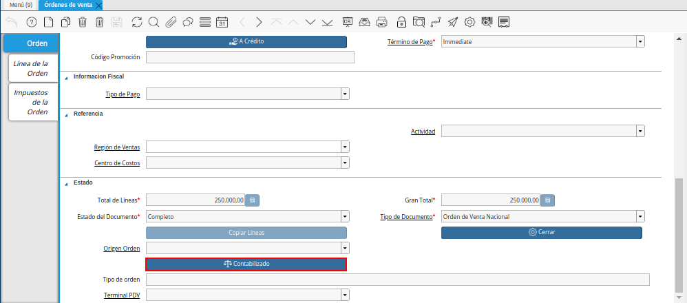
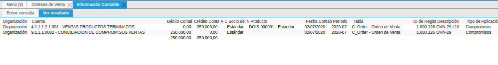
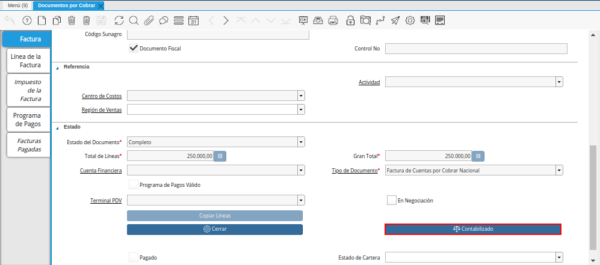
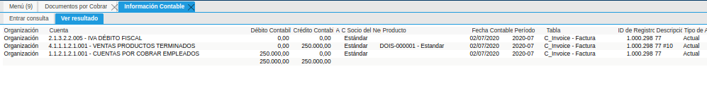
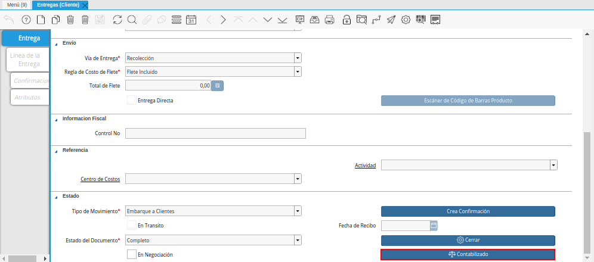
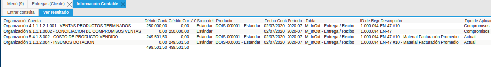
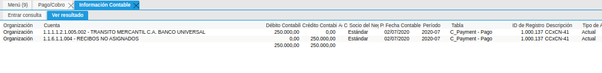
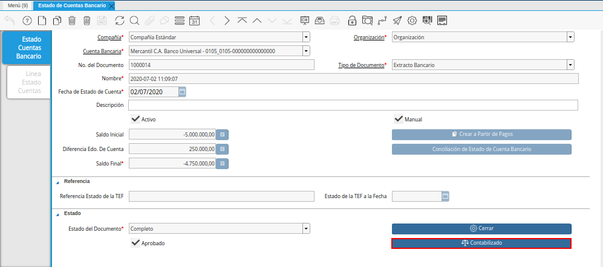
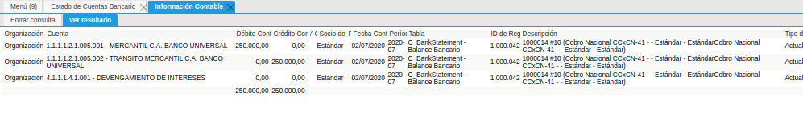

.. _ERPyA: http://erpya.com

.. |Opción Contabilizado de la Ventana Pago Cobro del Proceso de Ingreso| image:: resources/option-posted-from-the-payment-payment-window-of-the-entry-process.png

.. _documento/contabilidad-de-transacciones-del-proceso-de-ingreso:

**Proceso de Ingreso**
======================

**Orden de Venta**
------------------

#. Realice el procedimiento regular para generar una orden de venta en ADempiere, el mismo es explicado en el documento :ref:`documento/orden-de-venta`, elaborado por `ERPyA`_.

#. Luego de que el documento de orden de venta se encuentre en estado "**Completo**", seleccione la opción "**Contabilizado**", ubicada en la parte inferior de la ventana "**Órdenes de Venta**".

    |Opción Contabilizado de la Ventana Órdenes de Venta|

    Imagen 1. Opción Contabilizado de la Ventana Órdenes de Venta

#. Podrá visualizar el asiento contable generado por la transacción anteriormente realizada en la ventana "**Órdenes de Venta**".

    |Asiento Contable de la Ventana Órdenes de Venta|

    Imagen 2. Asiento Contable de la Ventana Órdenes de Venta

**Factura de Cuentas por Cobrar**
---------------------------------

#. Realice el procedimiento regular para generar una factura por cobrar en ADempiere, el mismo es explicado en el documento :ref:`documento/documento-por-cobrar`, elaborado por `ERPyA`_.

#. Luego de que el documento por cobrar se encuentre en estado "**Completo**", seleccione la opción "**Contabilizado**", ubicada en la parte inferior de la ventana "**Documentos por Cobrar**".

    |Opción Contabilizado de la Ventana Documentos por Cobrar|

    Imagen 3. Opción Contabilizado de la Ventana Documentos por Cobrar

#. Podrá visualizar el asiento contable generado por la transacción anteriormente realizada en la ventana "**Documentos por Cobrar**".

    |Asiento Contable de la Ventana Documentos por Cobrar|

    Imagen 4. Asiento Contable de la Ventana Documentos por Cobrar

**Entrega**
-----------

#. Realice el procedimiento regular para generar una entrega en ADempiere, el mismo es explicado en el documento :ref:`documento/entregas-cliente`, elaborado por `ERPyA`_.

#. Luego de que el documento de entrega se encuentre en estado "**Completo**", seleccione la opción "**Contabilizado**", ubicada en la parte inferior de la ventana "**Entregas (Cliente)**".

    |Opción Contabilizado de la Ventana Entregas Cliente|

    Imagen 5. Opción Contabilizado de la Ventana Entregas (Cliente)

#. Podrá visualizar el asiento contable generado por la transacción anteriormente realizada en la ventana "**Entregas (Cliente)**".

    |Asiento Contable de la Ventana Entregas Cliente|

    Imagen 6. Asiento Contable de la Ventana Entregas (Cliente)

**Cobro**
---------

#. Realice el procedimiento regular para generar un cobro en ADempiere, el mismo es explicado en el documento :ref:`documento/cobro`, elaborado por `ERPyA`_.

#. Luego de que el documento de cobro se encuentre en estado "**Completo**", seleccione la opción "**Contabilizado**", ubicada en la parte inferior de la ventana "**Pago/Cobro**".

    |Opción Contabilizado de la Ventana Pago Cobro del Proceso de Ingreso|

    Imagen 7. Opción Contabilizado de la Ventana Pago/Cobro

#. Podrá visualizar el asiento contable generado por la transacción anteriormente realizada en la ventana "**Pago/Cobro**".

    |Asiento Contable de la Ventana Pago Cobro del Proceso de Ingreso|

    Imagen 8. Asiento Contable de la Ventana Pago/Cobro

**Conciliación**
----------------

#. Realice el procedimiento regular para generar una conciliación en ADempiere, el mismo es explicado en el documento :ref:`documento/conciliacion-automatica`, elaborado por `ERPyA`_.

#. Luego de que el documento de conciliación automática se encuentre en estado "**Completo**", seleccione la opción "**Contabilizado**", ubicada en la parte inferior de la ventana "**Estado de Cuentas Bancario**".

    |Opción Contabilizado de la Ventana Estado de Cuentas Bancario del Proceso de Ingreso|

    Imagen 9. Opción Contabilizado de la Ventana Estado de Cuentas Bancario

#. Podrá visualizar el asiento contable generado por la transacción anteriormente realizada en la ventana "**Estado de Cuentas Bancario**".

    |Asiento Contable de la Ventana Estado de Cuentas Bancario del Proceso de Ingreso|

    Imagen 10. Asiento Contable de la Ventana Estado de Cuentas Bancario