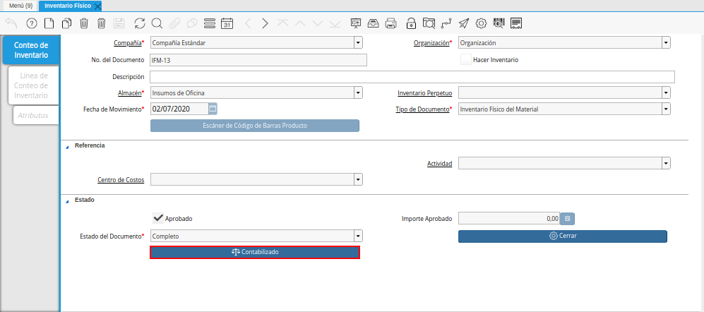
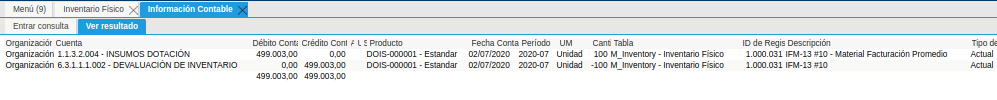
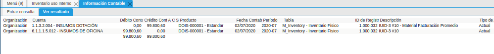
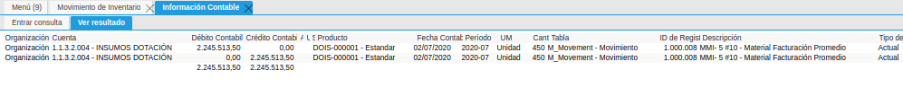
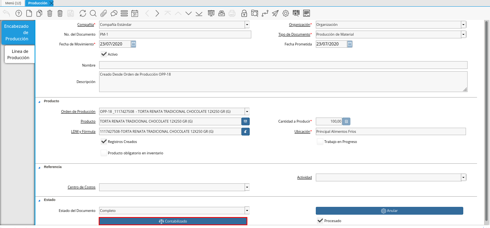
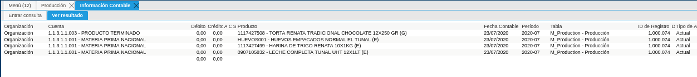

.. _ERPyA: http://erpya.com

.. |Opción Contabilizado de la Ventana Inventario Uso Interno| image:: resources/option-posted-from-the-inventory-window-internal-use.png

.. |Opción Contabilizado de la Ventana Movimiento de Inventario| image:: resources/inventory-movement-window-posted-option.png

.. _documento/contabilidad-de-transacciones-del-proceso-de-inventario:

**Proceso de Inventario**
=========================

**Inventario Físico**
---------------------

#. Realice el procedimiento regular para generar un inventario físico en ADempiere, el mismo es explicado en el documento :ref:`documento/inventario-físico`, elaborado por `ERPyA`_.

#. Luego de que el documento de inventario físico se encuentre en estado "**Completo**", seleccione la opción "**Contabilizado**", ubicada en la parte inferior de la ventana "**Inventario Físico**".

    |Opción Contabilizado de la Ventana Inventario Físico|

    Imagen 1. Opción Contabilizado de la Ventana Inventario Físico

#. Podrá visualizar el asiento contable generado por la transacción anteriormente realizada en la ventana "**Inventario Físico**".

    |Asiento Contable de la Ventana Inventario Físico|

    Imagen 2. Asiento Contable de la Ventana Inventario Físico

**Inventario Uso Interno**
--------------------------

#. Realice el procedimiento regular para generar un inventario de uso interno en ADempiere, el mismo es explicado en el documento :ref:`documento/inventario-uso-interno`, elaborado por `ERPyA`_.

#. Luego de que el documento de inventario de uso interno se encuentre en estado "**Completo**", seleccione la opción "**Contabilizado**", ubicada en la parte inferior de la ventana "**Inventario Uso Interno**".

    |Opción Contabilizado de la Ventana Inventario Uso Interno|

    Imagen 3. Opción Contabilizado de la Ventana Inventario Uso Interno

#. Podrá visualizar el asiento contable generado por la transacción anteriormente realizada en la ventana "**Inventario Uso Interno**".

    |Asiento Contable de la Ventana Inventario Uso Interno|

    Imagen 4. Asiento Contable de la Ventana Inventario Uso Interno

**Movimiento de Inventario**
----------------------------

#. Realice el procedimiento regular para generar un movimiento de inventario en ADempiere, el mismo es explicado en el documento :ref:`documento/movimiento-inventario`, elaborado por `ERPyA`_.

#. Luego de que el documento de movimiento de inventario se encuentre en estado "**Completo**", seleccione la opción "**Contabilizado**", ubicada en la parte inferior de la ventana "**Movimiento de Inventario**".

    |Opción Contabilizado de la Ventana Movimiento de Inventario|

    Imagen 5. Opción Contabilizado de la Ventana Movimiento de Inventario

#. Podrá visualizar el asiento contable generado por la transacción anteriormente realizada en la ventana "**Movimiento de Inventario**".

    |Asiento Contable de la Ventana Movimiento de Inventario|

    Imagen 6. Asiento Contable de la Ventana Movimiento de Inventario

**Producción**
--------------

#. Realice el procedimiento regular para generar una producción en ADempiere, el mismo es explicado en el documento :ref:`documento/producción`, elaborado por `ERPyA`_.

#. Luego de que el documento de producción se encuentre en estado "**Completo**", seleccione la opción "**Contabilizado**", ubicada en la parte inferior de la ventana "**Producción**".

    |Opción Contabilizado de la Ventana Producción|

    Imagen 7. Opción Contabilizado de la Ventana Producción

#. Podrá visualizar el asiento contable generado por la transacción anteriormente realizada en la ventana "**Producción**".

    |Asiento Contable de la Ventana Producción|

    Imagen 8. Asiento Contable de la Ventana Producción