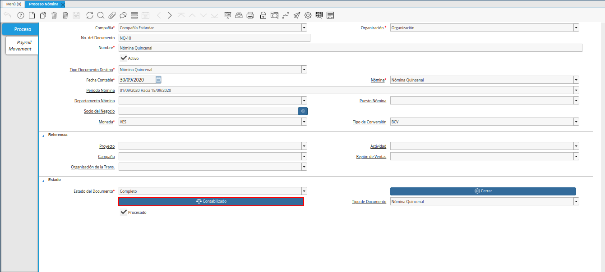
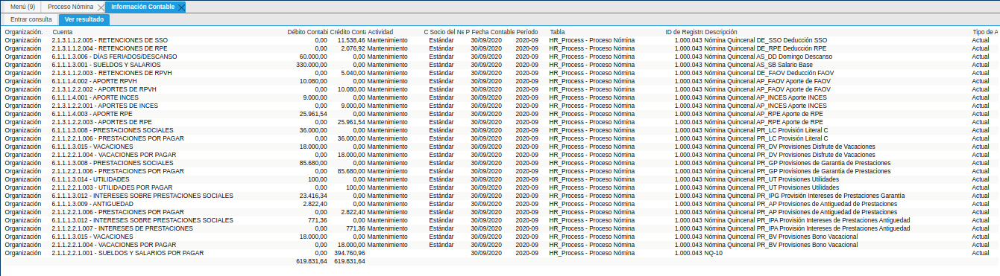
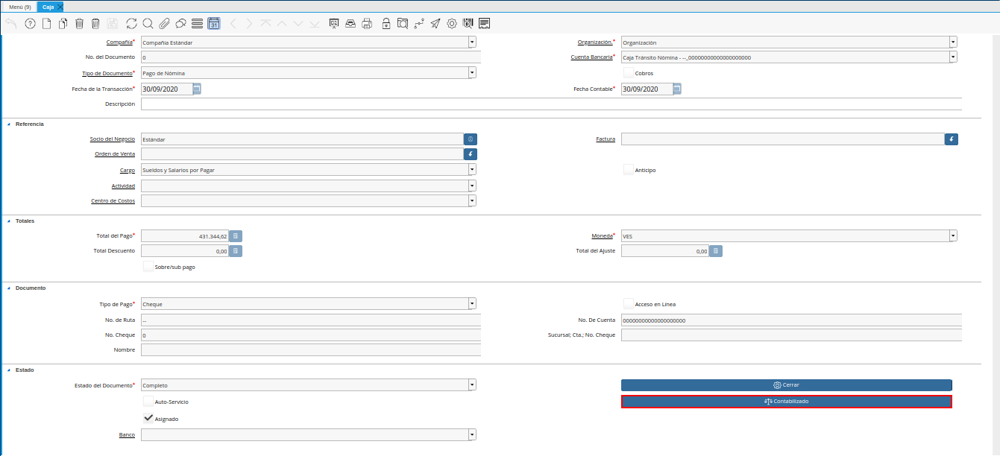
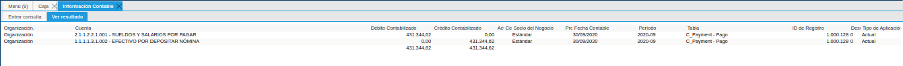
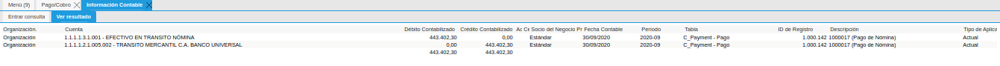
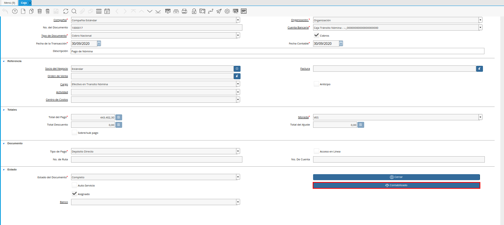
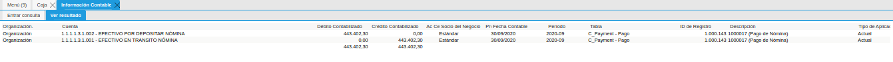
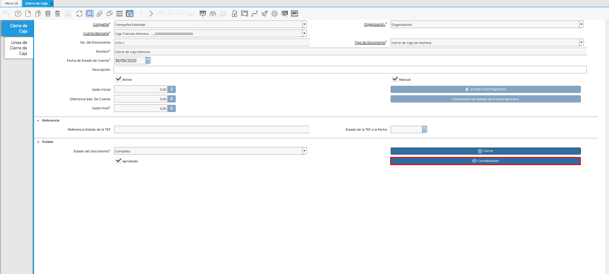
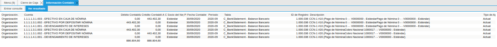

.. _ERPyA: http://erpya.com

.. |opción contabilizado de la ventana pago cobro nómina| image:: resources/posted-option-of-the-payroll-payment-window.png

.. _documento/contabilidad-de-transacciones-del-proceso-de-nómina:

**Proceso de Nómina Regular**
=============================

**Proceso Nómina**
------------------

- Realice el procedimiento regular para procesar las nóminas en ADempiere, el mismo se encuentra explicado en el documento :ref:`documento/procedimiento-para-procesar-nómina`, elaborado por `ERPyA`_.

- Luego de que se encuentren procesadas las nóminas, seleccione la opción "**Contabilizado**", ubicada en la parte inferior de la ventana "**Proceso Nómina**".

    |Opción Contabilizado de la Ventana Proceso Nómina|

    Imagen 1. Opción Contabilizado de la Ventana Proceso Nómina

- Podrá visualizar el asiento contable generado por la transacción anteriormente realizada en la ventana "**Poceso Nómina**".

    |Asiento Contable de la Nómina|

    Imagen 2. Asiento Contable de la Nómina

**Pago de Nómina**
------------------

- Realice el procedimiento regular para reflejar en ADempiere el pago de la nómina por empleado, el mismo se encuentra explicado en el documento :ref:`documento/pago-de-nómina`, elaborado por `ERPyA`_. 

    .. note::
    
        El pago de nómina que se genera al cumplir con todos los procesos que indica el documento, rebaja el pasivo.

- Al culminar los procesos de selección de pagos e imprimir/exportar pagos, que indica el documento :ref:`documento/pago-de-nómina`, se genera un "**Pago de Nómina**" en caja. Seleccione la opción "**Contabilizado**", ubicada en la parte inferior de la ventana "**Caja**". 

    |opción contabilizado de la ventana caja nómina|

    Imagen 3. Opción Contabilizado de la Ventana Caja

- Podrá visualizar el asiento contable que se genera por la selección de pagos e imprimir/exportar pagos anteriormente realizados. 

    |Asiento Contable del Pago de la Nómina|

    Imagen 4. Asiento Contable del Pago de la Nómina

- Adicional a ello, al culminar el proceso de transferencia bancaria que indica el documento :ref:`documento/pago-de-nómina`, se genera un "**Pago Nacional**" en banco y a su vez un "**Cobro Nacional**" en caja.

- Seleccione la opción "**Contabilizado**", ubicada en la parte inferior de la ventana "**Pago/Cobro**".

    |opción contabilizado de la ventana pago cobro nómina|

    Imagen 5. Opción Contabilizado de la Ventana Pago/Cobro

- Podrá visualizar el asiento contable que se genera por el egreso de la transferencia bancaria anteriormente realizada. 

    |asiento contable del egreso de la transferencia nómina|

    Imagen 6. Asiento Contable por el Egreso de la Transferencia Bancaria

- Seleccione la opción "**Contabilizado**", ubicada en la parte inferior de la ventana "**Caja**".

    |opción contabilizado de la caja nómina|

    Imagen 7. Opción Contabilizado de la Ventana Caja

- Podrá visualizar el asiento contable que se genera por el ingreso de la transferencia bancaria anteriormente realizada. 

    |asiento contable por el ingreso de la transferencia nómina|

    Imagen 8. Asiento Contable por el Ingreso de la Transferencia Bancaria

- Finalmente, al culminar el proceso de cierre de caja que indica el documento :ref:`documento/pago-de-nómina`, con la finalidad de conciliar los egresos e ingresos generados en caja y llevar la misma a su saldo inicial nuevamente, se obtiene un asiente contable que refleja dicha transacción, seleccionando la opción "**Contabilizado**", ubicada en la parte inferior de la ventana "**Cierre de Caja**".

    |opción contabilizado de la ventana cierre de caja nómina|

    Imagen 9. Opción Contabilizado de la Ventana Cierre de Caja

- Podrá visualizar el asiento contable que se genera por la transacción anteriormente realizada.

    |asiento contable por el cierre de caja nómina|

    Imagen 10. Asiento Contable por el Cierre de Caja