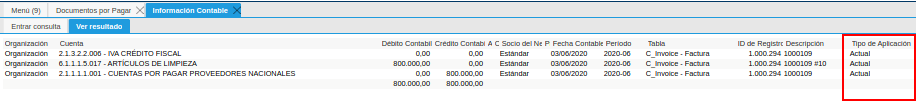
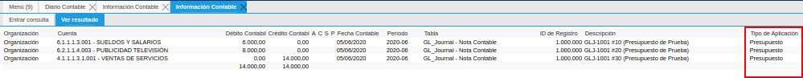
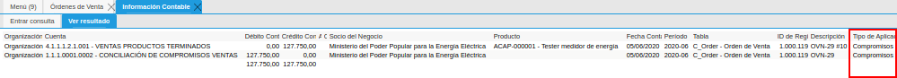
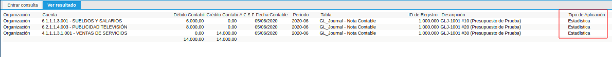
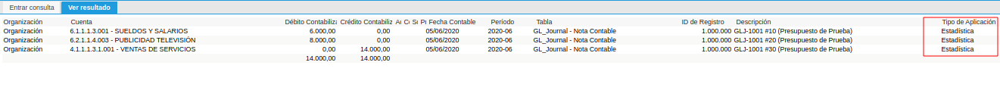

.. _ERPyA: http://erpya.com

.. _documento/tipo-de-aplicación:

**Tipo de Aplicación**
======================

Administrar la contabilidad de una empresa es una labor costosa, que requiere un gran número de recursos en gestión humana y habilidades que permita un eficiente manejo de técnicas en materia financiera, puesto que genera gran demanda en la organización del contador a cargo.

Por esta razón, **ADempiere** ha desarrollado una estructura especialmente pensada para entidades contables y financieras, bajo la modalidad de manejo multi-contable. Para esto se implementa el tipo de aplicación que define el comportamiento contable de cada transacción agrupando por tipo de contabilidad.

Cuando hablamos de tipo de aplicación en gestión contable, se refiere a la forma en la que los asientos contables son aplicado en balances, dicho de otro modo, esta figura define la categoría de la contabilidad, por ejemplo, contabilidad presupuestaria o contabilidad de reservas, de esta manera se puede determinar si un asiento por ejemplo pertenece al presupuesto contable o a una reserva contable, para explicarlo se plantea el siguiente ejemplo:

    Imaginemos una empresa, en la cual se realiza la planificación operativa anual, presupuestando los ingresos, costos y gastos que se estiman obtener durante el ejercicio fiscal.

    Seguramente, la empresa querrá conocer en qué medida se acercan o se alejan del presupuesto, los resultados obtenidos durante la operatividad, para ello se requerirá comparar la contabilidad real con la estimación realizada.

    La contabilidad real es generada de forma predeterminada al ejecutar una factura de cuenta por pagar que es justificada con un gasto o un costo, afectando la contabilidad de gasto y costo respectivamente, o bien, al generar una factura de cuentas por cobrar, afectando la contabilidad de ingresos.

    Con base en el ejemplo anterior, con la utilización del tipo de aplicación el contador podrá establecer porcentualmente cuanto es la proximidad a la estimación con respecto a los resultados, puesto que **ADempiere** le permite generar informes financieros comparativos por tipo de aplicación.

Los tipos de aplicación de los cuales **ADempiere** le permite disponer, son los siguientes:

#. **Actual:** Se refiere a la contabilidad de gestión o real, su principal objetivo es medir resultados en tiempo real, y de esta forma se conoce el estado financiero actual de la empresa, esto garantiza la toma de decisiones acertadas.

    Este tipo de aplicación se base en la exposición del desempeño desde los registros transaccionales que causan los hechos contables de la empresa, como lo es:

    #. **Documento por Pagar**

    #. **Documento por Cobrar**

    #. **Pagos**

    #. **Cobros**

    #. **Entregas**

    #. **Recibos**

    #. **Conciliaciones Bancarias**

    #. **Nóminas**

    #. **Inventarios Físicos**

    #. **Movimientos Contables**

    #. **Producción**

    #. **Inventario de Uso Interno**

    #. **Asignaciones de Pagos**

    #. **Asignaciones de Inventario**

    #. **Notas Contables**

    El resultado con este tipo de aplicación, sería el siguiente:

    |Información Contable Actual|

    Imagen 1. Información Contable Actual

    .. note::

        El tipo de aplicación **actual**, es predeterminado en toda transacción realizada y reportes generados desde **ADempiere**.

#. **Compromiso:** Se refiere a compromisos mutuos que asume o genera la empresa, generalmente asociados a un contrato o un documento que avala el mismo, como una orden de venta (**adquiere un compromiso con el cliente**) u orden de compra (**genera un compromiso con el proveedor**).

    De esta manera al generar un documento que compromete el inventario por precios convenidos, se refleja en balance los activos o pasivos derivados de los registros transaccionales, como lo es:

    #. **Orden de Compra**

    #. **Orden de Venta**

    El resultado con este tipo de aplicación, sería el siguiente:

    |Información Contable Compromiso|

    Imagen 2. Información Contable Compromisos

#. **Estadística:** Se refiere a registros contables basados en cálculos estadísticos, que establecen un análisis de criterios económicos predictivo y confiable, generalmente es utilizada para medir varianza de costos en producción.

    Permite comparar resultados del pasado en la empresa con los obtenidos en la actualidad, como por ejemplo, comparar ingresos obtenidos en una estadística anual, también, establece resultados que ayudan a :ref:`documento/informe-financiero` para toma de decisiones.

    Este tipo de aplicación no compromete cuentas reales, ni cuentas nominales, **genera hechos contables referenciales** derivados de los registros transaccionales, como lo es:

    #. **Nota Contable**

    El resultado con este tipo de aplicación sería el siguiente asiento:

    |Información Contable Estadística|

    Imagen 3. Información Contable Estadística

#. **Presupuesto:** Se refiere a registros contables basados en una predicción de los resultados y el flujo de caja que se espera obtener en el futuro periodo fiscal.

    Este tipo de aplicación estima generalmente cuentas reales y nominales, emitiendo una visión con respecto a la utilidad o perdida del periodo fiscal venidero, se convierte entonces en el objetivo que la empresa espera cumplir.

    Este tipo de aplicación no compromete cuentas reales, ni cuentas nominales, **genera hechos contables referenciales** derivados de los registros transaccionales, como lo es:

    #. **Nota Contable**

    El resultado con este tipo de aplicación sería el siguiente asiento:

    |Información Contable Presupuesto|

    Imagen 4. Información Contable Presupuesto

#. **Reserva:** Se refiere a reservas realizadas previendo contingencias en contabilidad, este tipo de pasivos es una posible obligación y es considerada un provisión que tiene fundamentos en experiencias pasadas.

    La contabilidad en esta aplicación genera incertidumbre porque alude a una advertencia en la operatividad, un ejemplo de ello podría ser, estimar la compra de un inventario que funge como insumo para la producción.

    Estos pasivos son generados como una provisión, generando un hecho contable que estima una compra derivada del registro transaccional:

    #. **Requisión a Compra**

    El resultado con este tipo de aplicación sería el siguiente asiento:

    |Información Contable Reserva|

    Imagen 5. Información Contable Reserva

Esta funcionalidad complementa a **ADempiere**, permitiendo a la directiva de la empresa establecer una visión versátil, emitiendo resultados con múltiples escenarios, si quieres conocer más de :ref:`src/adempiere/performance-analysis`, visita nuestra plataforma de aprendizaje.
