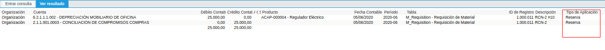

.. _ERPyA: http://erpya.com
.. |Información Contable Actual| image:: resources/Info-Accounting01.png
.. |Información Contable Presupuesto| image:: resources/Info-Accounting02.png
.. |Información Contable Compromiso| image:: resources/Info-Accounting03.png

.. _documento/tipo-de-aplicación:

======================
**Tipo de Aplicación**
======================

Administrar la contabilidad de una empresa es una labor  a la vez, es una tarea costosa si no se cuenta con la herramienta adecuada, requiere un gran número de recursos, tanto humano, como habilidades que permita un eficiente manejo de técnicas en materia financiera, puesto que genera una gran demanda de la organización del contador a cargo.

Por esta razón, **ADempiere** ha desarrollado una estructura especialmente pensada para entidades contables y financieras, bajo la modalidad de manejo multi-contable. Para esto se implementa el tipo de aplicación que define el comportamiento contable de cada transacción agrupando por tipo de contabilidad cada una.

Cuando hablamos de tipo de aplicación en gestión contable, se refiere a la forma en la que los asientos contables son aplicado en balances, dicho de otro modo, esta figura define la categoria de la contabilidad, por ejemplo, contabilidad presupuestaria o contabilida de reservas, de esta manera se puede determinar si un asiento por ejemplo pertenece al presupuesto contable o a una reserva contable. Para entenderlo hemos querido plantear el siguiente ejemplo:

    Imaginemos una empresa, en la cual se realiza la planificación operativa anual, presupuestando los ingresos, los costos y gastos que se estiman obtener durante el ejercicio fiscal, el mismo genera los siguientes resultados:

    +------------+------------+-----------+
    | Ingresos   | Costos     | Gastos    |
    +============+============+===========+
    | 1000.000   | 800        | 1200      |
    +------------+------------+-----------+

    Sin embargo, la empresa querrá conocer en que medida se acerca o se aleja del presupuesto, para ello se requerirá comparar la contabilidad real con la estimación realizada, esta contabilidad real es generada de forma predeterminada al ejecutar una factura de cuenta por pagar que sea justificada con un gasto o un costo, afectando la contabilida de gasto y costo respectivamente, o bien, al generar una factura de cuentas por cobrar, afectando la contabilida de ingresos.

Con base en el ejemplo anterior, con la utilización del tipo de aplicación el contador podrá establecer porcentualmente cuanto es la proximidad a la estimación, puesto que ADempiere le permite generar informes financieros comparativo con la contabilidad actual y la contabilidad presupuestaria.

Los tipos de aplicación de los que ADempiere le permite disponer, son los siguientes:

    #. **Actual:** Se refiere a la contabilidad de gestión, su principal objetivo es medir resultados en tiempo real, y de esta forma se conoce el estado financiero actual de la empresa, esto garantiza la toma de decisiones acertivas.

    Este tipo de aplicación se base en la exposición del desempeño desde los registros transaccionales que causan los hechos contables de la empresa, como lo es:

        #. Documento por Pagar
        #. Documento por Cobrar
        #. Pagos
        #. Cobros
        #. Entregas
        #. Recibos
        #. Conciliaciones Bancarias
        #. Nóminas
        #. Inventarios Fisicos
        #. Movimientos Contables
        #. Producción
        #. Inventario de Uso Interno
        #. Asignaciones de Pagos
        #. Asignaciones de Inventario
        #. Notas Contables

    El resultado con este tipo de aplicación sería el siguiente asiento:

    |Información Contable Actual|

    Imagen 1. Información Contable Actual

    .. note::

    El tipo de aplicación **actual** es predeterminado en toda transacción realizada y reportes generados desde ADempiere.

    #. **Compromisos:** Se refiere a compromisos mutuos que asume o genera la empresa, generalmente asociados a un contrato o un documento que avala el mismo, como una orden de venta (**adquiere un compromiso con el cliente**) u orden de compra (**genera un compromiso con el proveedor**).

    De esta manera al generar un documento que compromete el inventario por precios convenidos, se reflejará en balance los activos o pasivos derivados de los registros transaccionales, como lo es:

        #. Orden de Compra
        #. Orden de Venta

    El resultado con este tipo de aplicación sería el siguiente asiento:

    |Información Contable Compromiso|

    Imagen 1. Información Contable Compromisos

    #. **Estadística:** Se refiere a registros contables basados en cálculos estadisticos, que establecen un análisis de criterios economicos predictivo y confiable, generalmente es utilizada para medir varianza de costos en producción.

    Permite comparar resultados del pasado en la empresa con los obtenidos en la actualidad, con respecto a los ingresos obtenidos en una estadistica anual, establece resultados que ayudan a :ref:`_documento/informe-financiero` para toma de decisiones.

    Este tipo de aplicación no compromete cuentas reales, ni cuentas nominales, genera hechos contables referenciales derivados de los registros transaccionales, como lo es:

        #. Nota Contable

    El resultado con este tipo de aplicación sería el siguiente asiento:

    |Información Contable Estadistica|

    Imagen 2. Información Contable Estadistica

    #. **Presupuesto:** Se refiere a registros contables basados en un predicción de los resultados y el flujo de caja que se espera obtener en el futuro periodo fiscal.

    Este tipo de aplicación estima generalmente cuentas reales y nominales, emitiendo una visión con respecto a la utilidad o perdida del periodo fiscal venidero, se convierte entonces en el objetivo que la empresa espera cumplir.

    Este tipo de aplicación no compromete cuentas reales, ni cuentas nominales, genera hechos contables referenciales derivados de los registros transaccionales, como lo es:

        #. Nota Contable

    El resultado con este tipo de aplicación sería el siguiente asiento:

    |Información Contable Presupuesto|

    Imagen 2. Información Contable Presupuesto

    #. **Reserva:** Se refiere a reservas realizadas preveendo contingencias en contabilidad, este tipo de pasivos es una posible obligación, es considerada un provisión que tiene fundamentos en experiencias pasadas.

    La contabilidad en esta aplicación genera incertidumbre porque alude a una advertencia en la operatividad, un ejemplo de ello podría ser, estimar la compra de un inventario que funge como insumo para la producción.

    Estos pasivos son generados como una provisión, generando un hecho contable que estima una compra derivado de registros transaccionales, como lo es:

        #. Requisión a Compra

     El resultado con este tipo de aplicación sería el siguiente asiento:

    |Información Contable Reserva|

    Imagen 2. Información Contable Reserva

    
