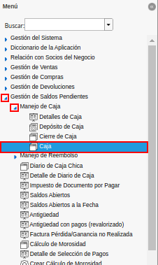
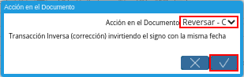

.. |cobro asociado a la factura para anular| image:: resources/charge-associated-with-the-invoice-to-cancel.png
.. |opción cerrar de la ventana caja| image:: resources/option-close-window-box.png

.. |menú del proceso autorizar documento fiscal| image:: resources/process-menu-authorize-tax-document.png
.. |ventana del proceso autorizar documento fiscal| image:: resources/process-window-authorize-tax-document.png
.. |campo factura del proceso autorizar documento fiscal| image:: resources/invoice-field-of-the-process-authorize-fiscal-document.png
.. |opción anulación en el campo tipo de autorización del proceso autorizar documento fiscal| image:: resources/cancellation-option-in-the-authorization-type-field-of-the-process-authorize-tax-document.png
.. |opción ok para ejecutar el proceso autorizar documento fiscal| image:: resources/option-ok-to-execute-the-process-authorize-fiscal-document.png
.. |menú de ventana órdenes de venta para anular| image:: resources/window-menu-sales-orders-to-void.png
.. |orden de venta para anular| image:: resources/sell-order-to-void.png
.. |opción cerrar de la ventana órdenes de venta| image:: resources/close-option-of-the-sales-orders-window.png

.. _documento/anular-facturas-fiscales:

**Anular Factura Fiscal**
=========================

Suponiendo que el día "**10/02/2021**", se tiene la orden de venta "**OPOS-5186**" y la factura asociada a dicha orden es la "**TMP- 0004912**". Adicional a ello, el cobro correspondiente a las mismas es el "**AC465**". En ADempiere cuando por algún motivo se requiere anular una factura fiscal cuando la misma no fue impresa en su momento. Se debe realizar el siguiente procedimiento.

**Reversar Cobros**
-------------------

#. Ubique en el menú de ADempiere, la carpeta "**Gestión de Saldos Pendientes**", luego seleccione la carpeta "**Diario de Caja**", por último seleccione la ventana "**Caja**".

    |menú de ventana caja para anular cobros|

    Imagen 1. Menú de ADempiere

#. Con ayuda del número de documento, ubique el cobro asociado a la factura que requiere anular.

    |cobro asociado a la factura para anular|

    Imagen 2. Ubicar Cobro

#. Seleccione la opción "**Cerrar**", ubicada en la parte inferior derecha de la ventana "**Caja**".

    |opción cerrar de la ventana caja|

    Imagen 3. Opciónb Cerrar de la Ventana Caja

#. Seleccione la acción "**Reversar-Corregir**" y la opción "**OK**", para ejecutar el proceso de reverso del cobro.

    |acción reversar y opción ok|

    Imagen 4. Acción Reversar-Corregir y Opción OK 

.. note::

    El procedimiento explicado anteriormente, debe ser realizado con los diferentes cobros que tiene asociado la factura.

**Anular Factura**
------------------

#. Unique en el menú de ADempiere, la carpeta "**Gestión de Sistema**", luego seleccione la carpeta "**Reglas Generales**", por último seleccione la carpeta "**Impresora Fiscal**". Finalmente, seleccione el proceso "**Autorizar Documento Fiscal**".

    |menú del proceso autorizar documento fiscal|

    Imagen 5. Menú de ADempiere

#. Podrá visualizar la ventana del proceso "**Autorizar Documento Fiscal**", con los campos necesarios para ejecutar el proceso requerido por el usuario.

    |ventana del proceso autorizar documento fiscal|

    Imagen 6. Ventana Autorizar Documento Fiscal

#. Seleccione en el campo "**Factura**", la factura involucrada en el proceso que requiere ejecutar.

    |campo factura del proceso autorizar documento fiscal|

    Imagen 7. Campo Factura 

#. Seleccione en el campo "**Tipo de Autorización**", la opción "**Anulación**", para anular la factura seleccionada en el campo "**Factura**".

    |opción anulación en el campo tipo de autorización del proceso autorizar documento fiscal|

    Imagen 8. Campo Tipo de Autorización

#. Seleccione la opción "**OK**", para ejecutar el proceso "**Autorizar Documento Fiscal**", en base a lo seleccionado en los campos explicados anteriormente.

    |opción ok para ejecutar el proceso autorizar documento fiscal|

    Imagen 9. Opción OK

**Anular Orden de Venta**
-------------------------

#. Ubique en el menú de ADempiere, la carpeta "**Gestión de Ventas**", luego seleccione la carpeta "**Órdenes de Venta**", por último seleccione la ventana "**Órdenes de Venta**".

    |menú de ventana órdenes de venta para anular|

    Imagen 10. Menú de ADempiere

#. Con ayuda del número de documento, ubique la orden de venta asociada a la factura anulada.

    |orden de venta para anular|

    Imagen 11. Ubicar Orden de Venta

#. Seleccione la opción "**Cerrar**", ubicada en la parte inferior derecha de la ventana "**Órdenes de Venta**".

    |opción cerrar de la ventana órdenes de venta|

    Imagen 12. Opciónb Cerrar de la Ventana Órdenes de Venta

#. Seleccione la acción "**Anular**" y la opción "**OK**", para ejecutar el proceso de anular orden.

    |acción anular y opción ok|

    Imagen 13. Acción Anular y Opción OK 