.. _ERPyA: http://erpya.com
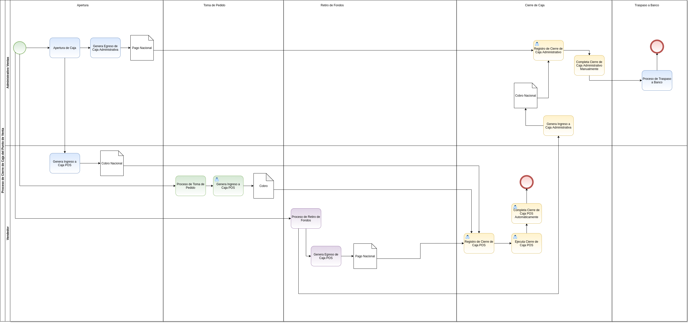
.. |Menú de ADempiere| image:: resources/point-of-sale-menu.png
.. |Opción Cerrar Caja del Punto de Venta| image:: resources/option-close-point-of-sale-box.png
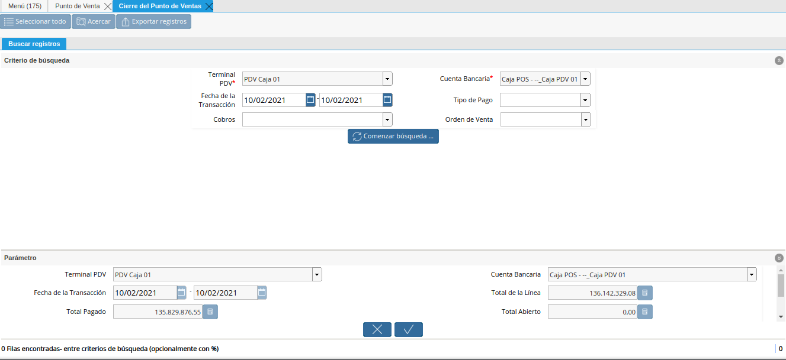
.. |Campo Terminal PDV del Filtro de Búsqueda de la Ventana Cierre de Caja del Punto de Venta| image:: resources/pos-terminal-search-filter-field-field-close-checkout-window.png
.. |Campo Cuenta Bancaria del Filtro de Búsqueda de la Ventana Cierre de Caja del Punto de Venta| image:: resources/bank-account-field-of-the-search-filter-of-the-cash-register-window-of-the-point-of-sale.png
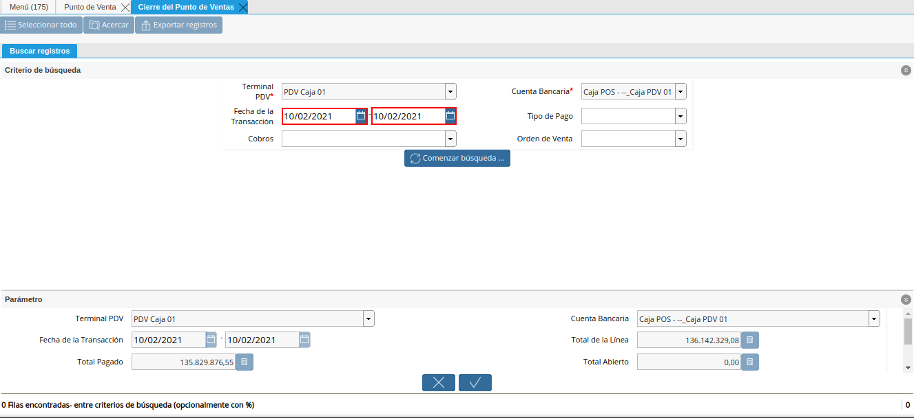
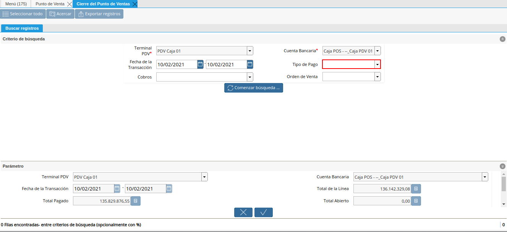
.. |Campo Cobros del Filtro de Búsqueda de la Ventana Cierre de Caja del Punto de Venta| image:: resources/charges-field-of-the-search-filter-of-the-window-closing-box-of-the-point-of-sale.png

.. |Campo Terminal PDV de la Ventana Cierre de Caja del Punto de Venta| image:: resources/pos-terminal-window-field-pos-box-closure.png
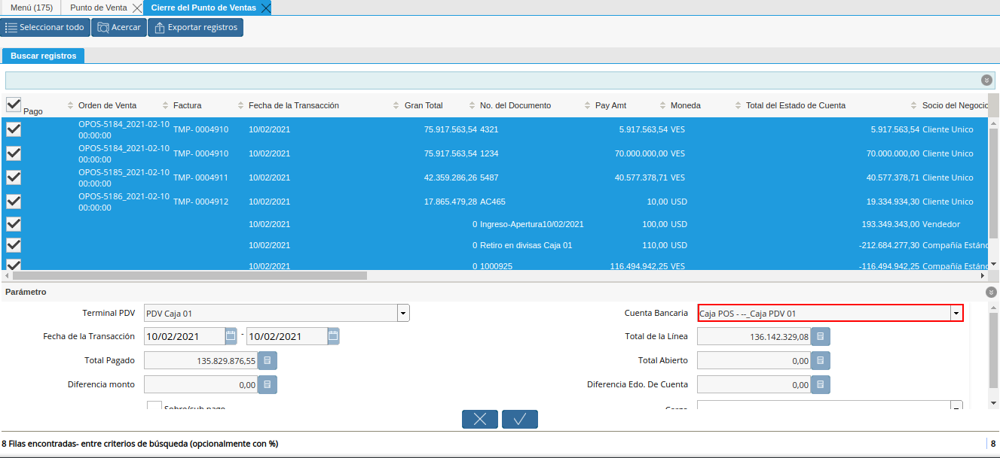
.. |Campo Fecha de la Transacción de la Ventana Cierre de Caja del Punto de Venta| image:: resources/transaction-date-field-of-the-point-of-sale-cash-closing-window.png
.. |Campo Total de la Línea de la Ventana Cierre de Caja del Punto de Venta| image:: resources/total-field-of-the-line-of-the-point-of-sale-cashier-window.png
.. |Campo Total Pagado de la Ventana Cierre de Caja del Punto de Venta| image:: resources/total-paid-field-of-the-point-of-sale-cashier-closing-window.png
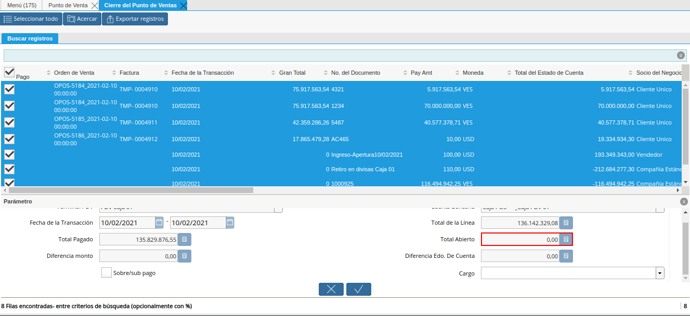
.. |Campo Diferencia Monto de la Ventana Cierre de Caja del Punto de Venta| image:: resources/field-difference-amount-of-window-closing-cash-point-of-sale.png

.. |Campo Cargo de la Ventana Cierre de Caja del Punto de Venta| image:: resources/field-charge-of-the-point-of-sale-cashier-window.png
.. |Opción OK de la Ventana Cierre de Caja del Punto de Venta| image:: resources/ok-option-of-the-point-of-sale-cashier-window.png
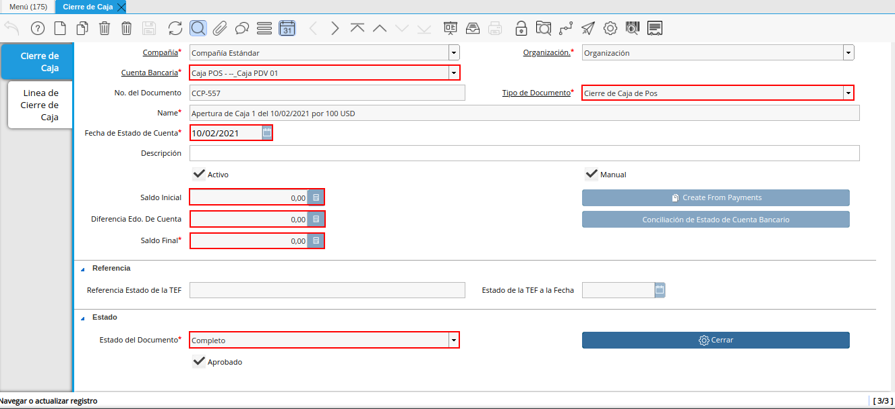
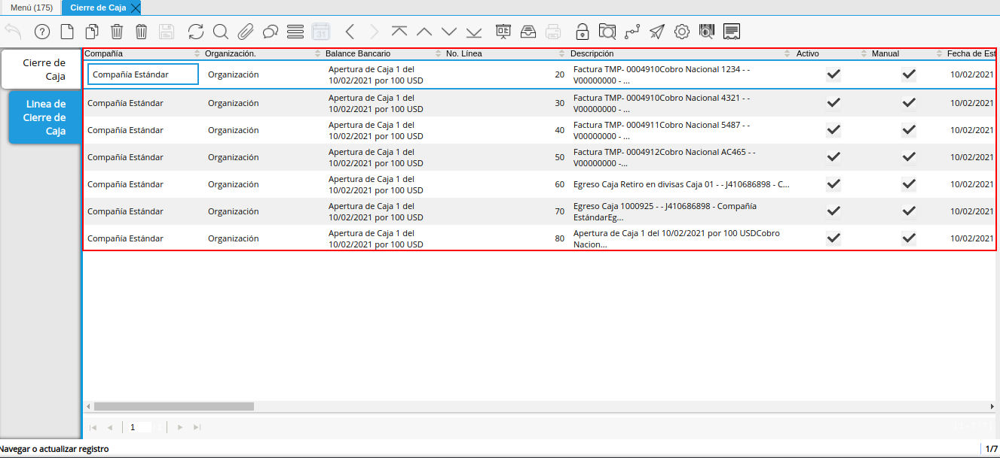
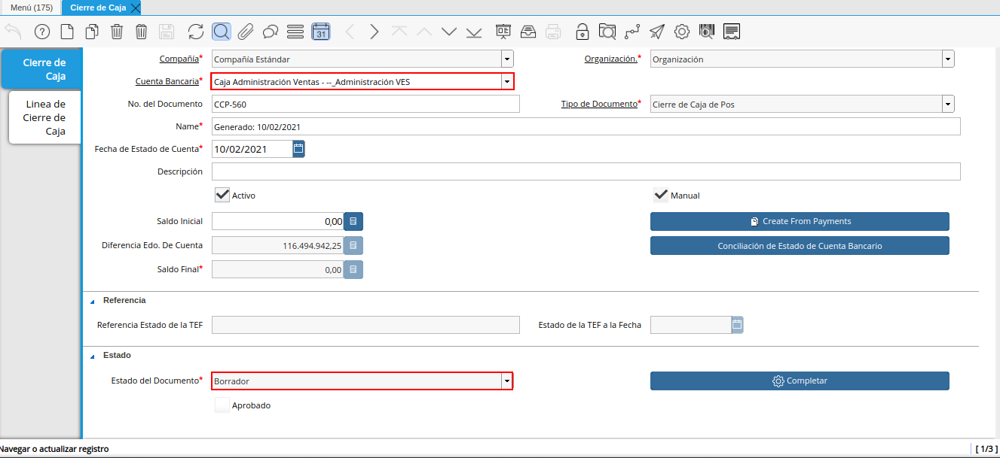
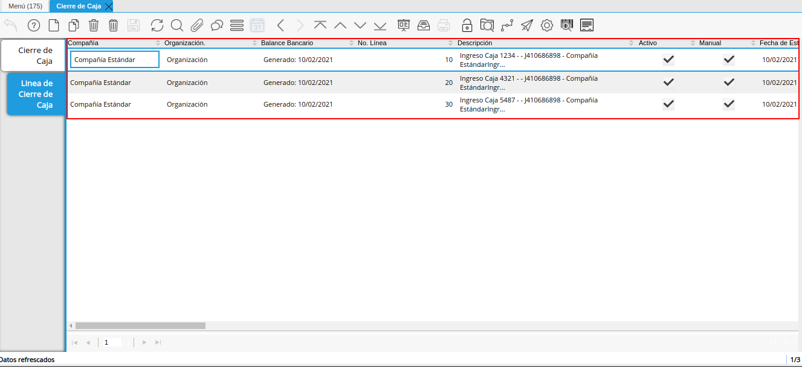
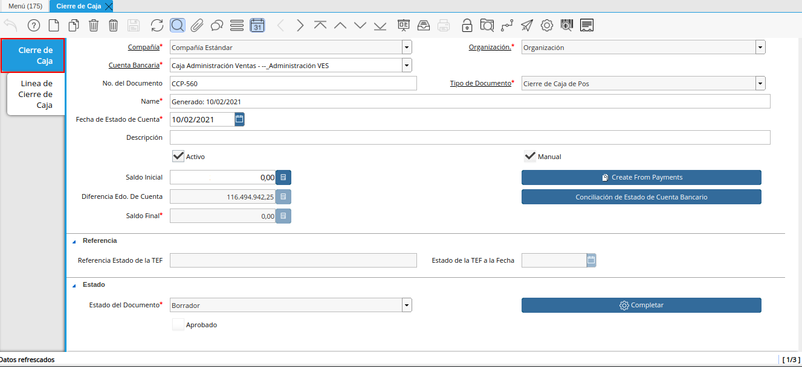
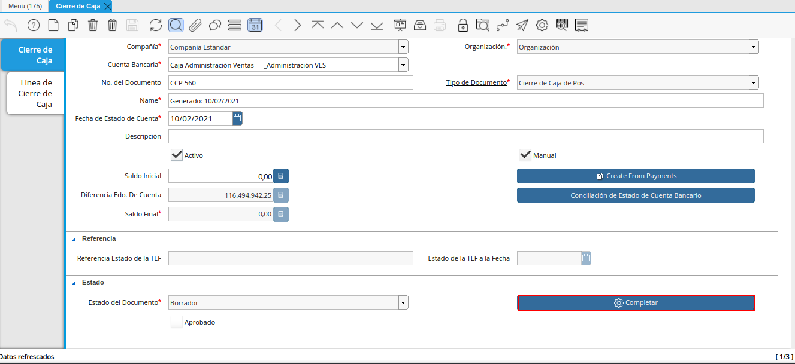

.. _documento/cierre-de-caja-punto-de-venta:

**Cierre de Caja del Punto de Venta**
=====================================

El proceso cierre de caja del punto de venta consiste en ejecutar el mismo desde la ventana "**Punto de Venta**". Su finalidad es completar el registro de cierre de caja creado con la cuenta "**Caja POS**" en la que fueron realizadas las transacciones de venta, dejando la cuenta en su saldo inicial. Para ello, es necesario que se realice el flujo de trabajo regular establecido para el punto de venta, es decir, se deben realizar los siguientes procesos:

    - La apertura de caja desde el proceso de punto de venta
    - La venta de los productos desde el punto de venta
    - El retiro de fondos desde el punto de venta

Cada uno de los procesos anteriormente nombrados, generan documentos que se asocian de manera automática a la línea de los registros creados en la ventana "**Cierre de Caja**", con las cuentas "**Caja POS**" y "**Caja Administrativa**".

Adicional a ello, al ejecutar el proceso cierre de caja del punto de venta, ADempiere deja el cierre de caja creado con la cuenta "**Caja Administrativa**", en estado "**Borrador**", para que este sea completado de forma manual.

Para mejor referencia de lo explicado anteriormente, se presenta a continuación el diagrama del proceso "**Cierre de Caja**", con la finalidad dar a conocer el comportamiento de ADempiere ante dicho proceso.

    |diagrama de cierre de caja pos|

    Imagen 1. Diagrama de Cierre de Caja POS

A continuación, se específica el procedimiento que se debe realizar para ejecutar correctamente el cierre de caja POS.

**Ejecución del Proceso**
-------------------------

#. Ubique y seleccione en el menú de ADempiere, la carpeta "**Gestión de Ventas**", luego seleccione la carpeta "**Órdenes de Venta**", por último seleccione la carpeta "**Punto de Venta**". Para finalizar, seleccione la ventana "**Punto de Venta**".

    |Menú de ADempiere|

    Imagen 2. Menú de ADempiere

#. Luego de realizar desde el punto de venta todas las tomas de pedido del día, seleccione la opción "**Cerrar Caja del Punto de Venta**", ubicada en el menú desplegado por el icono "**Proceso**" de la barra de herramientas de la ventana "**Punto de Venta**", explicada en el documento :ref:`documento/paso-barra-de-herramientas` elaborado por `ERPyA`_.

    |Opción Cerrar Caja del Punto de Venta|

    Imagen 3. Opción Cerrar Caja del Punto de Venta

#. Podrá visualizar la ventana "**Cerrar Caja del Punto de Venta**", con diferentes campos que permiten filtrar la búsqueda de información según lo requerido por el socio del negocio vendedor que esta realizando el cierre de caja.

    |Ventana Cierre de Caja del Punto de Venta|

    Imagen 4. Ventana Cierre de Caja del Punto de Venta

    #. En el campo "**Terminal PDV**", podrá visualizar el terminal configurado para el socio del negocio vendedor.

        |Campo Terminal PDV del Filtro de Búsqueda de la Ventana Cierre de Caja del Punto de Venta|

        Imagen 5. Campo Terminal PDV del Filtro de Búsqueda de la Ventana Cierre de Caja del Punto de Venta

    #. En el campo "**Cuenta Bancaria**", podrá visualizar la cuenta caja asociada al socio del negocio vendedor en la configuración del terminal PDV.

        |Campo Cuenta Bancaria del Filtro de Búsqueda de la Ventana Cierre de Caja del Punto de Venta|

        Imagen 6. Campo Cuenta Bancaria del Filtro de Búsqueda de la Ventana Cierre de Caja del Punto de Venta

    #. Seleccione en el campo "**Fecha de la Transacción**", el rango de fecha en el cual fue realizada la toma de pedido por medio del punto de venta.

        |Campo Fecha de la Transacción del Filtro de Búsqueda de la Ventana Cierre de Caja del Punto de Venta|

        Imagen 7. Campo Fecha de la Transacción del Filtro de Búsqueda de la Ventana Cierre de Caja del Punto de Venta

    #. Seleccione en el campo "**Tipo de Licitación**", el tipo de pago por el cual requiere filtrar las tomas de pedido realizadas.

        |Campo Tipo de Pago del Filtro de Búsqueda de la Ventana Cierre de Caja del Punto de Venta|

        Imagen 8. Campo Tipo de Licitación del Filtro de Búsqueda de la Ventana Cierre de Caja del Punto de Venta

    #. Indique en el campo "**Cobros**", si las tomas de pedido realizadas fueron cobradas o no.

        |Campo Cobros del Filtro de Búsqueda de la Ventana Cierre de Caja del Punto de Venta|

        Imagen 9. Campo Cobros del Filtro de Búsqueda de la Ventana Cierre de Caja del Punto de Venta

    #. Seleccione la opción "**Comenzar Búsqueda**", para realizar la búsqueda de todas las tomas de pedido realizadas por el socio del negocio vendedor, según lo seleccionado en los campos anteriormente explicados.

        |Opción Comenzar Búsqueda para Filtrar la Búsqueda de la Ventana Cierre de Caja del Punto de Venta|

        Imagen 10. Opción Comenzar Búsqueda para Filtrar la Búsqueda de la Ventana Cierre de Caja del Punto de Venta

    #. Podrá visualizar el listado de todos los cobros realizados por las órdenes de ventas POS generadas desde el punto de venta. Así como también, las transacciones de apertura y retiros de fondos que se realicen en la caja durante el día, para realizar el cierre de caja debe seleccionar todos los registros de transacciones que contiene la misma.

        |Listado de Todos los Cobros Realizados por las Órdenes de Ventas del Punto de Venta|

        Imagen 11. Listado de Todos los Cobros Realizados por las Órdenes de Ventas del Punto de Venta

    #. En el grupo de campos "**Parámetros**", podrá visualizar los siguientes campos:

        #. En el campo "**Terminal PDV**", podrá visualizar el terminal configurado para el socio del negocio vendedor.

            |Campo Terminal PDV de la Ventana Cierre de Caja del Punto de Venta|

            Imagen 12. Campo Terminal PDV de la Ventana Cierre de Caja del Punto de Venta

        #. En el campo "**Cuenta Bancaria**", podrá visualizar la cuenta caja asociada al socio del negocio vendedor en la configuración del terminal PDV.

            |Campo Cuenta Bancaria de la Ventana Cierre de Caja del Punto de Venta|

            Imagen 13. Campo Cuenta Bancaria de la Ventana Cierre de Caja del Punto de Venta

        #. En el campo "**Fecha de la Transacción**", el rango de fecha en el cual fue realizada la toma de pedido por medio del punto de venta.

            |Campo Fecha de la Transacción de la Ventana Cierre de Caja del Punto de Venta|

            Imagen 14. Campo Fecha de la Ventana Cierre de Caja del Punto de Venta

        #. Para calcular el valor correspondiente a los siguientes campos, ADempiere realiza la conversión de todos los montos de los pagos y cobros de la caja, a la moneda de la caja para luego realizar los respectivos cálculos y obtener el valor de cada uno.

            #. En el campo "**Total de la Línea**", la cantidad total de la línea con impuestos incluidos.

                |Campo Total de la Línea de la Ventana Cierre de Caja del Punto de Venta|

                Imagen 15. Campo Total de la Línea de la Ventana Cierre de Caja del Punto de Venta

                .. note::

                    El valor de este campo proviene de la sumatoria del gran total de todas las órdenes de venta.

            #. En el campo "**Total Pagado**", la monto total pagado de las órdenes de venta realizadas desde el punto de venta.

                |Campo Total Pagado de la Ventana Cierre de Caja del Punto de Venta|

                Imagen 16. Campo Total Pagado de la Ventana Cierre de Caja del Punto de Venta

                .. note::

                    El valor de este campo proviene de la sumatoria de todos los cobros y pagos realizados en la caja, convertidos a la moneda de la caja, (Cobros Convertidos a la Moneda de la Caja + Pagos Convertidos a la Moneda de la Caja).

            #. En el campo "**Total Abierto**", el monto total abierto de las órdenes de venta realizadas desde el punto de venta.

                |Campo Total Abierto de la Ventana Cierre de Caja del Punto de Venta|

                Imagen 17. Campo Total Abierto de la Ventana Cierre de Caja del Punto de Venta

                .. note::

                    Este valor proviene de la sumatoria de todos los montos pendientes por cobrar cuando las ordenes de ventas son a crédito.

            #. En el campo "**Diferencia Monto**", podrá visualizar el monto resultante de la sumatoria del monto total de la apertura más el resultado del total cobrado menos el total de los retiros. 

                |Campo Diferencia Monto de la Ventana Cierre de Caja del Punto de Venta|

                Imagen 18. Campo Diferencia Monto de la Ventana Cierre de Caja del Punto de Venta

                .. note::

                    El valor de este campo proviene de la sumatoria de todos los montos pendientes por cobrar de las órdenes de venta, para el cálculo del mismo se emplea la fórmula (Total de la Apertura + (Total de los Cobros - Total de los Retiros)).

            #. El campo "**Diferencia Edo. de Cuenta**", muestra el saldo que posee la cuenta caja en la que se encuentra realizando el proceso "**Cierre de Caja**".

                |campo diferentes estado de cuenta de la ventana cierre de caja|

                Imagen 19. Campo Diferencia Edo. de Cuenta

        #. Tilde el checklist "**Sobre/Sub Pago**", para indicar que existe un sobre pago (no contabilizado) o un sub pago (pago parcial).

            |Checklist Sobre Sub Pago de la Ventana Cierre de Caja del Punto de Venta|

            Imagen 19. Checklist Sobre/Sub Pago de la Ventana Cierre de Caja del Punto de Venta

            .. note::

                Si el punto de venta tuvo pagos de más (Sobre) o de menos (Sub), ADempiere calcula la diferencia. Para el caso expuesto en el presente material, no es necesario seleccionar el checklist.

        #. Seleccione en el campo "**Cargo**", el cargo correspondiente al cierre de caja que se encuentra realizando desde el punto de venta.

            |Campo Cargo de la Ventana Cierre de Caja del Punto de Venta|

            Imagen 20. Campo Cargo de la Ventana Cierre de Caja del Punto de Venta

            .. note::

                Cuando existen pagos de más (Sobre) o de menos (Sub), se selecciona un cargo y ADempiere genera una linea en el cierre contra el cargo seleccionado, permitiendo cuadrar la caja del día. Para el caso expuesto en el presente material, no es necesario seleccionar ningún cargo.

    #. Seleccione la opción "**OK**", para realizar el cierre de caja del punto de venta con los cobros seleccionados y generar el documento pertinente en la ventana "**Cierre de Caja**".

        |Opción OK de la Ventana Cierre de Caja del Punto de Venta|

        Imagen 21. Opción OK de la Ventana Cierre de Caja del Punto de Venta

**Consultar Registro en Cierre de Caja**
----------------------------------------

#. Al ejecutar el proceso "**Cerrar de Caja del Punto de Venta**", se completa el registro con la cuenta "**Caja 04**", creado en la ventana "**Cierre de Caja**", llevando la misma a cero (0) nuevamente.
    
    |Cierre de Caja 04 Completada|

    Imagen 22. Cierre de Caja 04 Completada

#. Podrá visualizar en la pestaña "**Línea de Cierre de Caja**", los registros que fueron creados automáticamente a lo largo del día según las transacciones que fueron realizadas en la caja. Basicamente estos son:

    - **Apertura**: Crea el registro de cierre de caja (Caja 04), asociando en la línea del mismo el documento de ingreso generado en caja.
    - **Cobros**: Crea en la línea de cierre de caja (Caja 04), un registro por cada documento de cobro generado en caja, asociando el documento a la línea.
    - **Retiro de Fondos**: Crea en la línea de cierre de caja (Caja 04), un registro por cada documento de egreso generado en caja, asociando el documento a la línea.
    
    |Pestaña Línea de Cierre de Caja 04 Completada|
    
    Imagen 23. Pestaña Línea de Cierre de Caja 04 Completada

**Completar Registro en Cierre de Caja**
----------------------------------------

#. Ubique el registro de la "**Caja Administrativa**" generado en la ventna "**Cierre de Caja**", el cual se encuentra en estado "**Borrador**".

    |Cierre de Caja Administrativa en Borrador|

    Imagen 24. Cierre de Caja Administrativa en Estado Borrador

#. Al seleccionar la pestaña "**Línea de Cierre de Caja**", podrá visualizar las líneas creadas con los registros asociados de apertura si fue utilizada la caja para realizar apertura y retiro si fueron realizados retiros en la moneda de la caja en la que se encuentra.

    |Pestaña Línea de Cierre de Caja Administrativa en Borrador|

    Imagen 25. Pestaña Línea de Cierre de Caja

#. Regrese a la pestaña principal "**Cierre de Caja**", para ejecutar el cierre de la misma.

    |Pestaña Principal Cierre de Caja|

    Imagen 26. Pestaña Principal Cierre de Caja

#. Seleccione la opción "**Completar**", para completar el cierre de caja de la "**Caja Administrativa**".

    |Opción Completar del Cierre de Caja Administrativa|

    Imagen 27. Opción Completar del Cierre de Caja

#. Seleccione la acción "**Completar**" y la opción "**OK**", para completar el registro.

    |Acción Completar y Opción OK del Cierre de Caja|

    Imagen 28. Acción Completar y Opción OK del Cierre de Caja