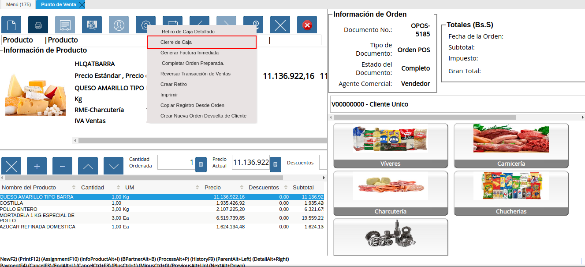
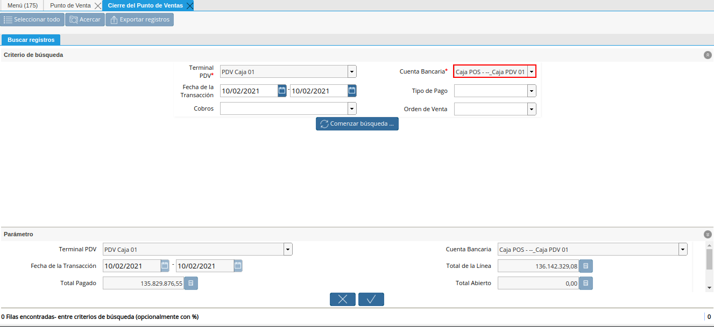
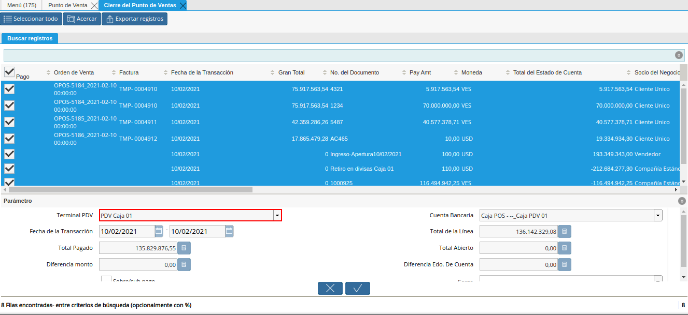
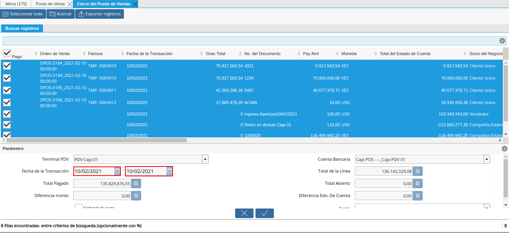
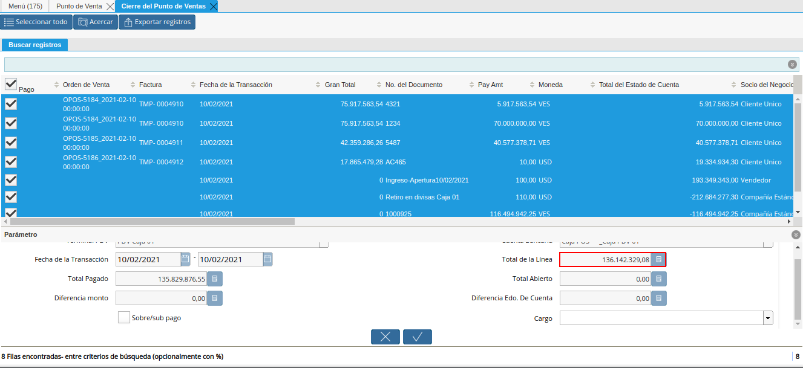
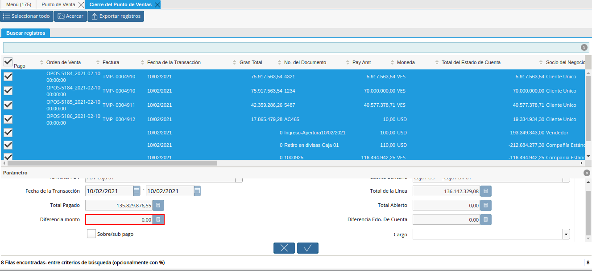
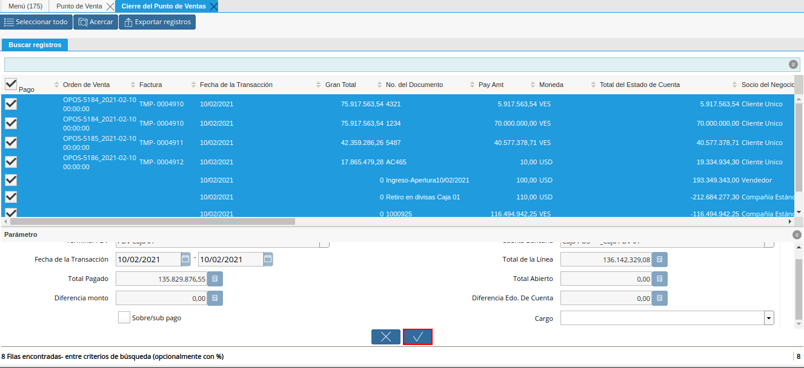

.. |Menú de ADempiere| image:: resources/point-of-sale-menu.png

.. |Ventana Cierre de Caja del Punto de Venta| image:: resources/point-of-sale-box-closing-window.png

.. |Campo Fecha de la Transacción del Filtro de Búsqueda de la Ventana Cierre de Caja del Punto de Venta| image:: resources/transaction-date-field-of-the-search-filter-of-the-point-of-sale-checkout-window.png
.. |Campo Tipo de Pago del Filtro de Búsqueda de la Ventana Cierre de Caja del Punto de Venta| image:: resources/payment-type-field-of-the-point-of-sale-window-closing-box-filter.png

.. |Opción Comenzar Búsqueda para Filtrar la Búsqueda de la Ventana Cierre de Caja del Punto de Venta| image:: resources/option-start-search-to-filter-the-search-of-the-point-of-sale-box-closing-window.png

.. |Listado de Todos los Cobros Realizados por las Órdenes de Ventas del Punto de Venta| image:: resources/listing-of-all-collections-made-by-sales-orders-from-the-point-of-sale.png

.. |Campo Cuenta Bancaria de la Ventana Cierre de Caja del Punto de Venta| image:: resources/bank-account-field-of-the-point-of-sale-cashier-window.png

.. |Campo Total Abierto de la Ventana Cierre de Caja del Punto de Venta| image:: resources/full-window-open-field-cashier-point-of-sale.png

.. |Checklist Sobre Sub Pago de la Ventana Cierre de Caja del Punto de Venta| image:: resources/checklist-about-sub-payment-of-the-window-cashier-closing-of-the-point-of-sale.png

.. _documento/cierre-de-caja-punto-de-venta:

**Cierre de Caja del Punto de Venta**
=====================================

#. Ubique y seleccione en el menú de ADempiere, la carpeta "**Gestión de Ventas**", luego seleccione la carpeta "**Órdenes de Venta**", por último seleccione la carpeta "**Punto de Venta**". Para finalizar, seleccione la ventana "**Punto de Venta**".

    |Menú de ADempiere|

    Imagen 1. Menú de ADempiere

#. Luego de realizar desde el punto de venta todas las tomas de pedido del día, seleccione la opción "**Cerrar Caja del Punto de Venta**", ubicada en el menú desplegado por el icono "**Proceso**" de la barra de herramientas de la ventana "**Punto de Venta**".

    |Opción Cerrar Caja del Punto de Venta|

    Imagen 2. Opción Cerrar Caja del Punto de Venta

#. Podrá visualizar la ventana "**Cerrar Caja del Punto de Venta**", con diferentes campos que permiten filtrar la búsqueda de información según lo requerido por el socio del negocio vendedor que esta realizando el cierre de caja.

    |Ventana Cierre de Caja del Punto de Venta|

    Imagen 3. Ventana Cierre de Caja del Punto de Venta

    #. En el campo "**Terminal PDV**", podrá visualizar el terminal configurado para el socio del negocio vendedor.

        |Campo Terminal PDV del Filtro de Búsqueda de la Ventana Cierre de Caja del Punto de Venta|

        Imagen 4. Campo Terminal PDV del Filtro de Búsqueda de la Ventana Cierre de Caja del Punto de Venta

    #. En el campo "**Cuenta Bancaria**", podrá visualizar la cuenta caja asociada al socio del negocio vendedor en la configuración del terminal PDV.

        |Campo Cuenta Bancaria del Filtro de Búsqueda de la Ventana Cierre de Caja del Punto de Venta|

        Imagen 5. Campo Cuenta Bancaria del Filtro de Búsqueda de la Ventana Cierre de Caja del Punto de Venta

    #. Seleccione en el campo "**Fecha de la Transacción**", el rango de fecha en el cual fue realizada la toma de pedido por medio del punto de venta.

        |Campo Fecha de la Transacción del Filtro de Búsqueda de la Ventana Cierre de Caja del Punto de Venta|

        Imagen 6. Campo Fecha de la Transacción del Filtro de Búsqueda de la Ventana Cierre de Caja del Punto de Venta

    #. Seleccione en el campo "**Tipo de Pago**", el tipo de pago por el cual requiere filtrar las tomas de pedido realizadas.

        |Campo Tipo de Pago del Filtro de Búsqueda de la Ventana Cierre de Caja del Punto de Venta|

        Imagen 7. Campo Tipo de Pago del Filtro de Búsqueda de la Ventana Cierre de Caja del Punto de Venta

    #. Indique en el campo "**Cobros**", si las tomas de pedido realizadas fueron cobradas o no.

        |Campo Cobros del Filtro de Búsqueda de la Ventana Cierre de Caja del Punto de Venta|

        Imagen 8. Campo Cobros del Filtro de Búsqueda de la Ventana Cierre de Caja del Punto de Venta

    #. Seleccione la opción "**Comenzar Búsqueda**", para realizar la búsqueda de todas las tomas de pedido realizadas por el socio del negocio vendedor, según lo seleccionado en los campos anteriormente explicados.

        |Opción Comenzar Búsqueda para Filtrar la Búsqueda de la Ventana Cierre de Caja del Punto de Venta|

        Imagen 9. Opción Comenzar Búsqueda para Filtrar la Búsqueda de la Ventana Cierre de Caja del Punto de Venta

    #. Podrá visualizar el listado de todos los cobros realizados por las órdenes de ventas POS generadas desde el punto de venta, donde debe seleccionar las órdenes ya canceladas por el cliente.

        |Listado de Todos los Cobros Realizados por las Órdenes de Ventas del Punto de Venta|

        Imagen 10. Listado de Todos los Cobros Realizados por las Órdenes de Ventas del Punto de Venta

    #. En el grupo de campos "**Parámetros**", podrá visualizar los siguientes campos:

        #. En el campo "**Terminal PDV**", podrá visualizar el terminal configurado para el socio del negocio vendedor.

            |Campo Terminal PDV de la Ventana Cierre de Caja del Punto de Venta|

            Imagen 11. Campo Terminal PDV de la Ventana Cierre de Caja del Punto de Venta

        #. En el campo "**Cuenta Bancaria**", podrá visualizar la cuenta caja asociada al socio del negocio vendedor en la configuración del terminal PDV.

            |Campo Cuenta Bancaria de la Ventana Cierre de Caja del Punto de Venta|

            Imagen 12. Campo Cuenta Bancaria de la Ventana Cierre de Caja del Punto de Venta

        #. En el campo "**Fecha de la Transacción**", el rango de fecha en el cual fue realizada la toma de pedido por medio del punto de venta.

            |Campo Fecha de la Ventana Cierre de Caja del Punto de Venta|

            Imagen 13. Campo Fecha de la Ventana Cierre de Caja del Punto de Venta

        #. En el campo "**Total de la Línea**", la cantidad total de la línea con impuestos incluidos.

            |Campo Total de la Línea de la Ventana Cierre de Caja del Punto de Venta|

            Imagen 14. Campo Total de la Línea de la Ventana Cierre de Caja del Punto de Venta

        #. En el campo "**Total Pagado**", la monto total pagado de las órdenes de venta realizadas desde el punto de venta.

            |Campo Total Pagado de la Ventana Cierre de Caja del Punto de Venta|

            Imagen 15. Campo Total Pagado de la Ventana Cierre de Caja del Punto de Venta

        #. En el campo "**Total Abierto**", el monto total abierto de las órdenes de venta realizadas desde el punto de venta.

            |Campo Total Abierto de la Ventana Cierre de Caja del Punto de Venta|

            Imagen 16. Campo Total Abierto de la Ventana Cierre de Caja del Punto de Venta

        #. En el campo "**Diferencia Monto**", 

            |Campo Diferencia Monto de la Ventana Cierre de Caja del Punto de Venta|

            Imagen 17. Campo Diferencia Monto de la Ventana Cierre de Caja del Punto de Venta

        #. Tilde el checklist "**Sobre/Sub Pago**", para indicar que existe un sobre pago (no contabilizado) o un sub pago (pago parcial).

            |Checklist Sobre Sub Pago de la Ventana Cierre de Caja del Punto de Venta|

            Imagen 18. Checklist Sobre/Sub Pago de la Ventana Cierre de Caja del Punto de Venta

        #. Seleccione en el campo "**Cargo**", el cargo correspondiente al cierre de caja que se encuentra realizando desde el punto de venta.

            |Campo Cargo de la Ventana Cierre de Caja del Punto de Venta|

            Imagen 19. Campo Cargo de la Ventana Cierre de Caja del Punto de Venta

    #. Seleccione la opción "**OK**", para realizar el cierre de caja del punto de venta con los cobros seleccionados y generar el documento pertinente en la ventana "**Cierre de Caja**".

        |Opción OK de la Ventana Cierre de Caja del Punto de Venta|

        Imagen 20. Opción OK de la Ventana Cierre de Caja del Punto de Venta