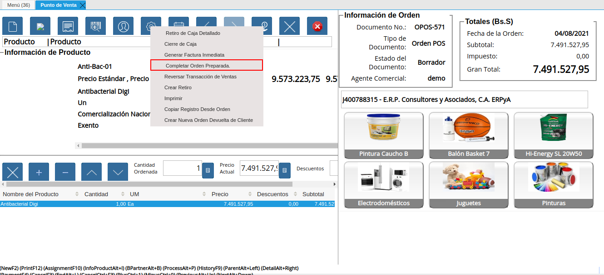
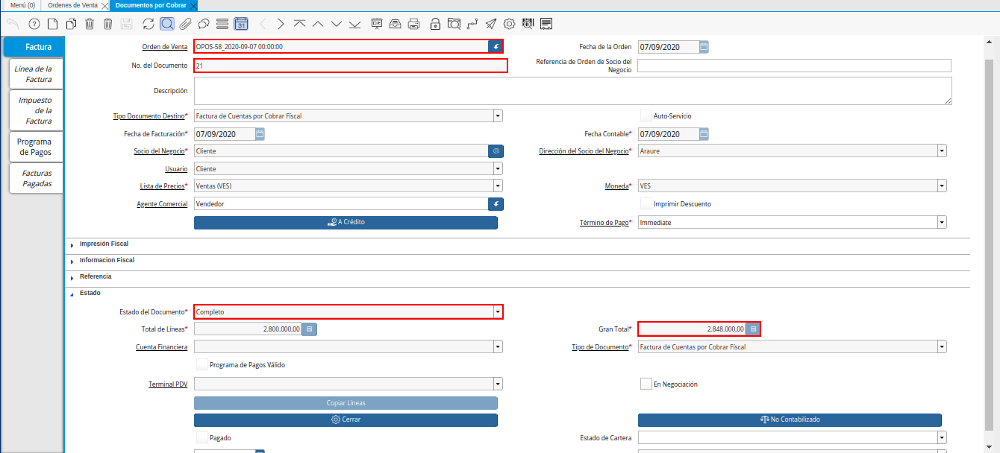
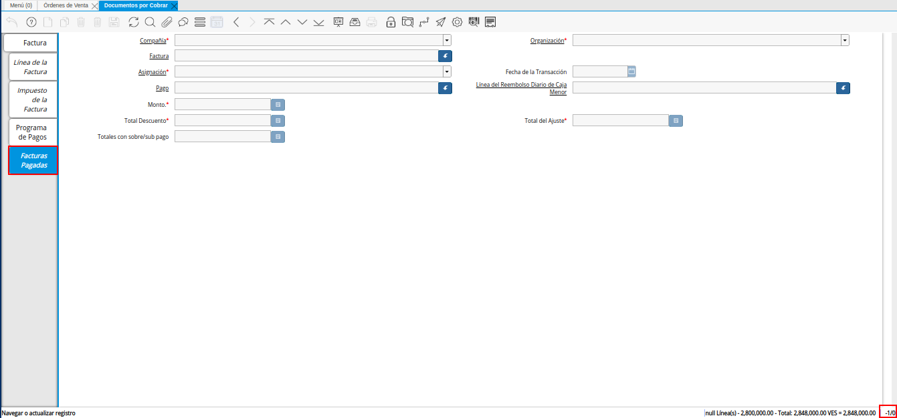
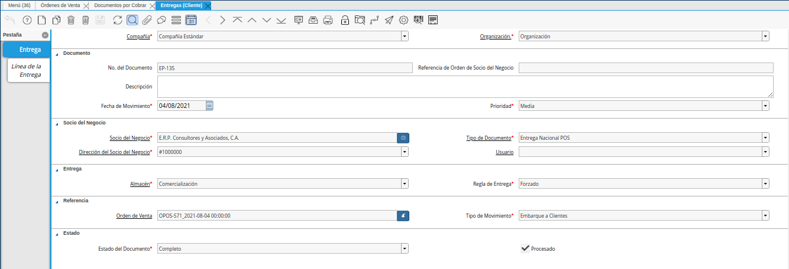

.. _ERPyA: http://erpya.com
.. |diagrama de completar orden preparada pos| image:: resources/complete-ready-order.png
.. |Menú de ADempiere| image:: resources/point-of-sale-menu.png

.. |consulta de orden de venta generada| image:: resources/generated-sales-order-query.png

.. _documento/completar-orden-preparada:

**Completar Orden Preparada**
=============================

El proceso completar orden preparada permite completar la orden de venta generando automáticamente en estado "**Completo**", su respectiva factura y entrega. Esta opción se utiliza luego de concluir con la toma de pedido en la ventana "**Punto de Venta**", permitiendo realizar el proceso de venta sin un cobro.

Para mejor referencia de lo explicado anteriormente, se presenta a continuación el diagrama del proceso "**Completar Orden Preparada**", con la finalidad dar a conocer el comportamiento de ADempiere ante dicho proceso.

    |diagrama de completar orden preparada pos|

    Imagen 1. Diagrama de Completar Orden Preparada POS

Para ejecutar correctamente el proceso completar orden preparada, se debe realizar el siguiente procedimiento.

**Ejecución del Proceso**
-------------------------

#. Ubique y seleccione en el menú de ADempiere, la carpeta "**Gestión de Ventas**", luego seleccione la carpeta "**Órdenes de Venta**", por último seleccione la carpeta "**Punto de Venta**". Para finalizar, seleccione la ventana "**Punto de Venta**".

    |Menú de ADempiere|

    Imagen 2. Menú de ADempiere

#. La interfaz de la ventana "**Punto de Venta**", se encuentra definida de forma específica en el documento :ref:`documento/interfaz-del-punto-de-venta`, elaborado por `ERPyA`_. Realice cada uno de los procesos explicados a continuación para obtener un resultado exitoso en la completación de una orden preparada por el punto de venta.

#. Luego de realizar desde el punto de venta la toma de pedido, seleccione la opción "**Completar Orden Preparada**", ubicada en el menú desplegado por el icono "**Proceso**" de la barra de herramientas de la ventana "**Punto de Venta**", explicada en el documento :ref:`documento/paso-barra-de-herramientas` elaborado por `ERPyA`_.

    |Opción Completar Orden Preparada|

    Imagen 3. Opción Completar Orden Preparada

**Consulta de Documentos Generados**
------------------------------------

#. En la ventana "**Orden Venta**", se puede visualizar el registro de la orden de venta con ayuda del número de documento "**OPOS-58**" mostrado en el grupo de campos :ref:`documento/paso-información-de-la-orden`, de la ventana "**Punto de Venta**".
    
    |consulta de orden de venta generada|

    Imagen 4. Consulta de Orden de Venta Generada 

#. Al seleccionar en el registro de la orden de venta generada, el icono "**Visualiza Detalle**" ubicado en la barra de herramientas de ADempiere y la opción "**Documentos por Cobrar**", ADempiere muestra el registro de la factura generada desde el punto de ventan, en la ventana "**Documentos por Cobrar**".

    |consulta de factura generada|

    Imagen 5. Consulta de Factura Generada

#. Al seleccionar la pestaña "**Facturas Pagadas**", de la ventana "**Documentos por Cobrar**", podrá visualizar que efectivamente no fue creado ni asociado a la factura ningún tipo de pago.

    |consulta de pagos asignados a la factura generada|

    Imagen 6. Consulta de Pagos Asignados a la Factura Generada

#. Adicional a ello, se genera en la ventana "**Entrega (Cliente)**", el documento de entrega de los productos cargados a la orden de venta desde el punto de venta. Este se puede visualizar seleccionando el icono "**Visualiza Detalle**" ubicado en la barra de herramientas de ADempiere y la opción "**Entregas (Cliente)**".

    |consulta de entrega generada|

    Imagen 7. Consulta de Entrega Generada