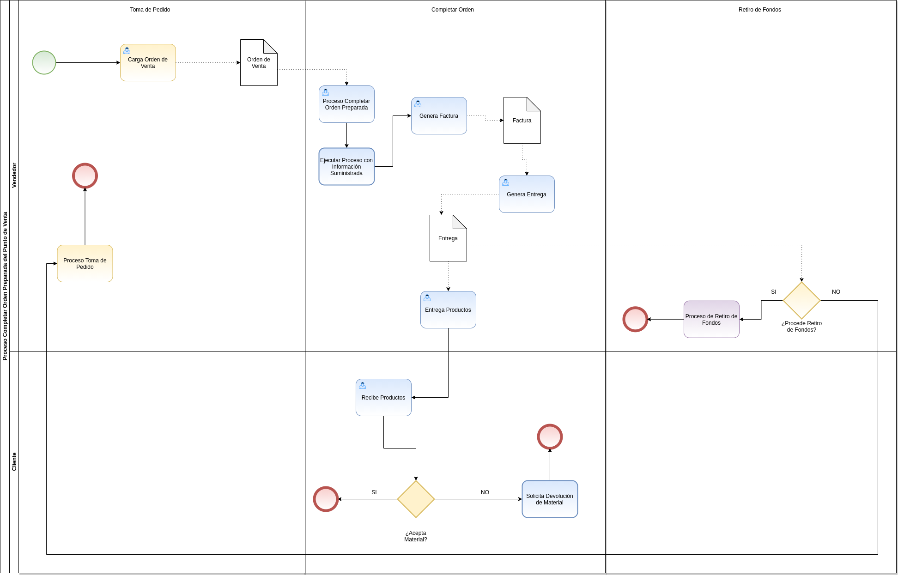
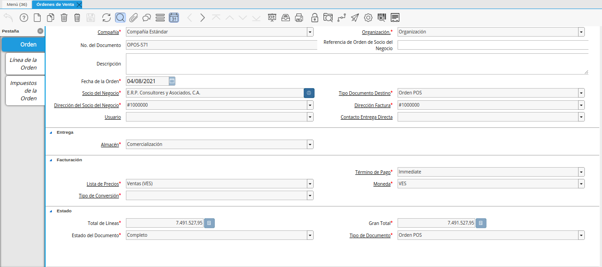

.. _ERPyA: http://erpya.com

.. |Menú de ADempiere| image:: resources/point-of-sale-menu.png
.. |Opción Completar Orden Preparada| image:: resources/complete-ready-order-option.png

.. |consulta de factura generada| image:: resources/generated-invoice-query.png
.. |icono visualiza detalle de la factura por completar orden preparada| image:: resources/icon-displays-detail-of-the-invoice-to-complete-the-prepared-order.png

.. _documento/completar-orden-preparada:

**Completar Orden Preparada**
=============================

El proceso completar orden preparada permite completar la orden de venta generando automáticamente en estado "**Completo**", su respectiva factura y entrega. Esta opción se utiliza luego de concluir con la toma de pedido en la ventana "**Punto de Venta**", permitiendo realizar el proceso de venta sin un cobro.

Para mejor referencia de lo explicado anteriormente, se presenta a continuación el diagrama del proceso "**Completar Orden Preparada**", con la finalidad dar a conocer el comportamiento de ADempiere ante dicho proceso.

    |diagrama de completar orden preparada pos|

    Imagen 1. Diagrama de Completar Orden Preparada POS

Para ejecutar correctamente el proceso completar orden preparada, se debe realizar el siguiente procedimiento.

**Ejecución del Proceso**
-------------------------

Ubique y seleccione en el menú de ADempiere, la carpeta "**Gestión de Ventas**", luego seleccione la carpeta "**Órdenes de Venta**", por último seleccione la carpeta "**Punto de Venta**". Para finalizar, seleccione la ventana "**Punto de Venta**".

    |Menú de ADempiere|

    Imagen 2. Menú de ADempiere

La interfaz de la ventana "**Punto de Venta**", se encuentra definida de forma específica en el documento :ref:`documento/interfaz-del-punto-de-venta`, elaborado por `ERPyA`_. Realice cada uno de los procesos explicados a continuación para obtener un resultado exitoso en la completación de una orden preparada por el punto de venta.

Luego de realizar desde el punto de venta la toma de pedido, seleccione la opción "**Completar Orden Preparada**", ubicada en el menú desplegado por el icono "**Proceso**" de la barra de herramientas de la ventana "**Punto de Venta**", explicada en el documento :ref:`documento/paso-barra-de-herramientas` elaborado por `ERPyA`_.

    |Opción Completar Orden Preparada|

    Imagen 3. Opción Completar Orden Preparada

    .. note::

        En el caso de que el terminal del punto de venta con el cual se encuentra trabajando, este configurado para que requiera PIN al momento de ejecutar ciertas transacciones, se mostrará la ventana "**PIN de Usuario**" luego de seleccionar la opción "**Completar Orden Preparada**". En dicha ventana se debe ingresar el PIN del usuario establecido como supervisor en el terminal y finalmente seleccionar la opción "**OK**" para ejecutar el proceso.

        Para el presente ejemplo, el terminal con el cual se esta realizando la transacción, no se encuentra configurado para que solicite el PIN.

**Consulta de Documentos Generados**
------------------------------------

En la ventana "**Orden Venta**", se puede visualizar el registro de la orden de venta con ayuda del número de documento "**OPOS-571**" mostrado en el grupo de campos :ref:`documento/paso-información-de-la-orden`, de la ventana "**Punto de Venta**".
    
    |consulta de orden de venta generada|

    Imagen 4. Consulta de Orden de Venta Generada 

Al seleccionar en el registro de la orden de venta generada, el icono "**Visualiza Detalle**" ubicado en la barra de herramientas de ADempiere, se pueden visualizar las opciones para acercar los registros asociados a la orden de venta.

Para consultar la factura asociada a la orden, se debe seleccionar la opción "**Documentos por Cobrar**". ADempiere muestra el registro de la factura generada desde el punto de ventan, en la ventana "**Documentos por Cobrar**".

    |consulta de factura generada|

    Imagen 5. Consulta de Factura Generada

    Para verificar que la factura asociada a la orden no posea ningún tipo de cobro, se debe seleccionar el icono "**Visualiza Detalle**" ubicado en la bara de herramientas de ADempiere. Cuando una factura posee cobros asociados será visualizada la opción "**Consultar Asignación**" en el menú desplegado por la selección del icono. Como podrá apreciar, al ejecutar el proceso "**Completar Orden Preparada**", se completa la orden de venta, generando la factura en estado completo y sin cobros asociados.

        |icono visualiza detalle de la factura por completar orden preparada|

        Imagen 6. icono visualiza detalle de la factura

Adicional a ello, se genera en la ventana "**Entrega (Cliente)**", el documento de entrega de los productos cargados a la orden de venta desde el punto de venta. Este registro se puede visualizar seleccionando la opción "**Entregas (Cliente)**", desplegada por la selección del icono "**Visualiza Detalle**", ubicado en la barra de herramientas de ADempiere de la ventana "**Orden de Venta**". De igual manera, se puede acceder a la entrega, realizando esta misma acción en la ventana "**Documentos por Cobrar**".

    |consulta de entrega generada|

    Imagen 7. Consulta de Entrega Generada