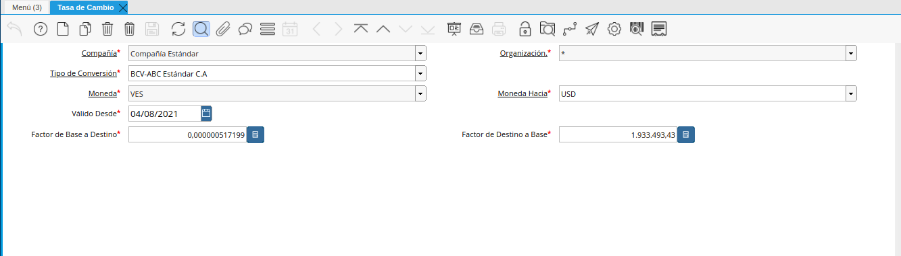
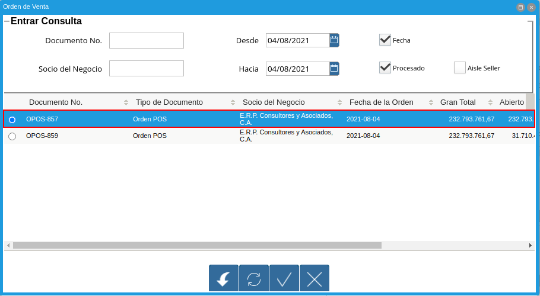
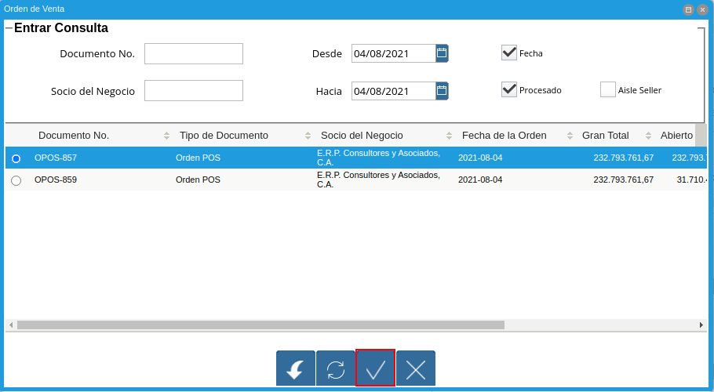
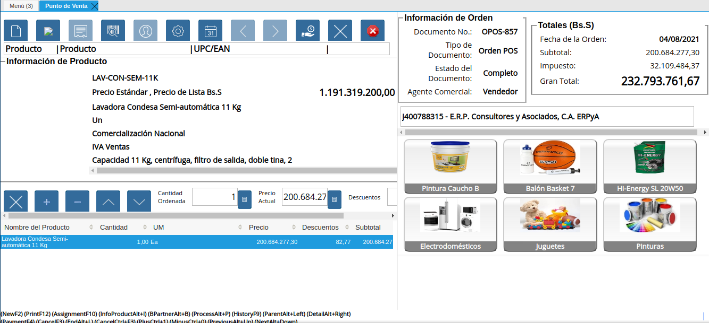
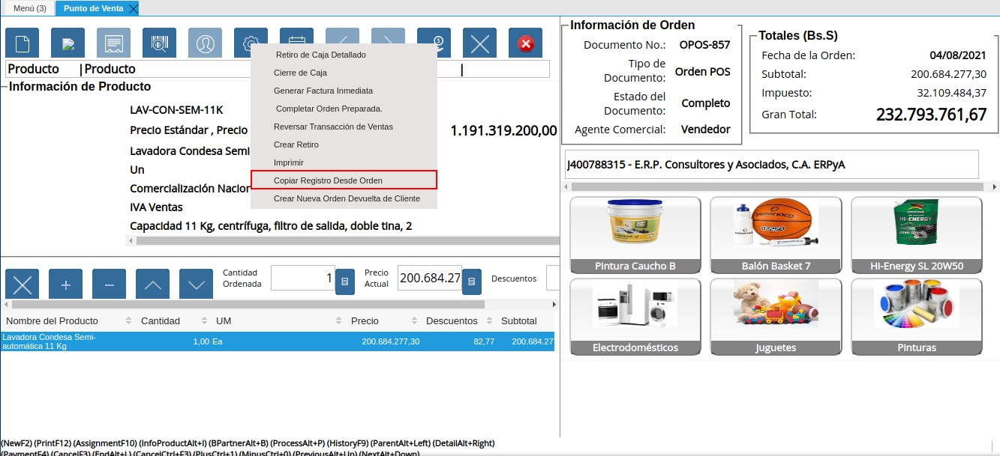
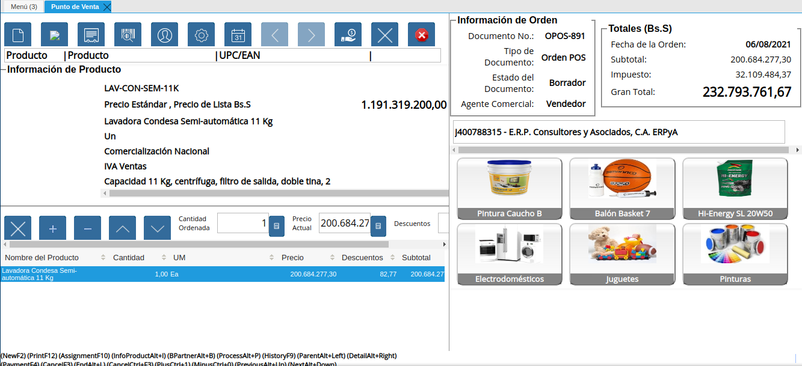

.. _ERPyA: http://erpya.com

.. |Menú de ADempiere| image:: resources/point-of-sale-menu.png

.. |nueva orden de venta del proceso copiar orden desde otra| image:: resources/new-sales-order-of-the-process-copy-order-from-another.png

.. _documento/copiar-orden-desde-otra:

**Copiar Orden Desde Otra**
===========================

El proceso de "**Copiar Orden Desde Otra**", pemite realizar una copia exacta de una orden determinada, repestando los precios que tienen los productos en la misma, así como la tasa de cambio con la que fue generada. 

Para explicar de manera detallada el procedimiento y la funcionalidad del proceso se presenta el siguiente escenario: 

- En una determinada tienda se realiza una venta el día "**04/08/2021**". Fecha en la cual se encuentra la tasa de cambio del "**BCV-ABC Estándar C.A**" en "**1.933.493,43**". 

    |tasa de cambio del bcv del día 04|

    Imagen 1. Tasa de Cambio del BCV-ABC Estándar C.A del día 04/08/2021

- Transacción de la cual se obtiene como resultado la siguiente factura impresa:

    +--------------------------------------------------------+
    |**SENIAT**                                              |
    +========================================================+
    |RIF/C.I.: V00000000                                     |
    +--------------------------------------------------------+
    |RAZON SOCIAL: Cliente Unico                             |
    +--------------------------------------------------------+
    |Araure - Portuguesa                                     |
    +--------------------------------------------------------+
    |Orden OPOS-857                                          |
    +--------------------------------------------------------+
    |Empleado Vendedor                                       |
    +--------------------------------------------------------+
    |**FACTURA**                                             |
    +---------------------------+----------------------------+
    |FACTURA:                   |                    00000654|
    +---------------------------+----------------------------+
    |FECHA: 21-12-2020          |                 HORA: 11:59|
    +---------------------------+----------------------------+
    |1908                                                    |
    +---------------------------+-----------+----------------+
    |PICO PARA AIRE LARGO TRUPER|\(G)       | Bs 8.068.152.07|
    +---------------------------+-----------+----------------+
    |SUBTTL                     |             Bs 8.068.152.07|
    +---------------------------+-----------+----------------+
    |BI G16.00% Bs 8.068.152.07 |IVA G16.00%| Bs 1.290.904.33|
    +---------------------------+-----------+----------------+
    |TOTAL                      |             Bs 9.359.056.40|
    +---------------------------+----------------------------+
    |EFECTIVO 1                 |             Bs 9.359.056.40|
    +---------------------------+----------------------------+
    |Cant. Articulos: 1                                      |
    +--------------------------------------------------------+
    |Empleado Vendedor                                       |
    +--------------------------------------------------------+
    |Terminal PDV Caja 01 Vendedor                           |
    +---------------------------+----------------------------+
    |MH                         |                  Z7C0001234|
    +---------------------------+----------------------------+

Un registro de orden de compra puede ser copiado cuando el mismo se encuentre en estado "**Completo**". La unica condición que tiene el proceso para su ejecución, es que el registro de la orden que requiere copiar, no se encuentre en estado "**Cerrado**". Si la orden a copiar se encuentra en estado "**Cerrado**", el proceso no se ejecuta.

Para continuar con el ejemplo planteado anteriormente en el presente documento, se tiene lo siguiente:

- El día "**06/08/2021**", se presenta el cliente de la factura "**00000654**", asociada a la orden "**OPOS-857**", realizando la devolución del producto "**PICO PARA AIRE LARGO TRUPER**". Dicho cliente indica que requiere que el mismo sea cambiado porque se encuentra dañado. 

    |tasa de cambio del bcv del día 06|

    Imagen 2. Tasa de Cambio del BCV-ABC Estándar C.A del día 06/08/2021

- Antes de ejecutar el proceso :ref:`documento/anular-transacción-de-venta`, se requiere copiar el registro de la orden "**OPOS-857**", generada el día "**04/08/2021**", con la tasa de cambio "**1.933.493,43**" del "**BCV-ABC Estándar C.A**", para mantener los valores de la misma.

.. note::

    Mayormente las órdenes son copiadas desde el punto de venta para mantener la tasa de cambio de la misma y generar una orden con fecha actual, en la cual se mantengan los mismos precios. Este proceso se debe utilizar cuando se va a generar una nota de crédito desde el punto de venta, ya que permite crear una orden bajo la misma tasa de cambio.

Para copiar una orden de venta desde el punto de venta, se debe realizar el siguiente procedimiento:

Ubique y seleccione en el menú de ADempiere, la carpeta "**Gestión de Ventas**", luego seleccione la carpeta "**Órdenes de Venta**", por último seleccione la carpeta "**Punto de Venta**". Para finalizar, seleccione la ventana "**Punto de Venta**".

    |Menú de ADempiere|

    Imagen 3. Menú de ADempiere

La interfaz de la ventana "**Punto de Venta**", se encuentra definida de forma específica en el documento :ref:`documento/interfaz-del-punto-de-venta`, elaborado por `ERPyA`_.

Realice la búsqueda de registros de órdenes de venta generadas desde el punto de venta, seleccionando el icono "**Registros Históricos**" de la barra de herramientas de la ventana "**Punto de Venta**", dicho proceso se encuentra explicado en el documento :ref:`documento/paso-barra-de-herramientas`, elaborado por `ERPyA`_.

    Seleccione en la ventana "**Orden de Venta**", generada del icono "**Registros Históricos**", la orden de venta que requiere copiar.

        |selección de orden de venta a copiar|

        Imagen 4. Selección de Orden de Venta a Copiar

    Por último, seleccione la opción "**OK**" para ubicar en la ventana "**Punto de Venta**", el registro de la orden de venta realizada desde el punto de venta.

        |selección de la opción ok de la orden de venta a copiar|

        Imagen 5. Selección de la Opción OK de la Orden de Venta a Copiar

Podrá visualizar que el registro de la orden de venta ubicada se encuentra en estado "**Completo**".

    |orden ubicada en estado completo|

    Imagen 6. Orden de Venta en Estado Completo

    .. warning::

        Es importante resaltar que cuando se presenta una devolución, la orden debe ser copiada antes de ejecutar el proceso de devolución ya que al generarse la nota de crédito, la orden pasa de estado "**Completo**" a estado "**Cerrado**".

Seleccione la opción "**Copiar Orden Desde Otra**", ubicada en el menú desplegado por el icono "**Proceso**" de la barra de herramientas de la ventana "**Punto de Venta**", explicada en el documento :ref:`documento/paso-barra-de-herramientas` elaborado por `ERPyA`_.

    |opción copiar orden desde otra|

    Imagen 7. Opción Copiar Orden Desde Otra

    .. note::

        En el caso de que el terminal del punto de venta con el cual se encuentra trabajando, este configurado para que requiera PIN al momento de ejecutar ciertas transacciones, se mostrará la ventana "**PIN de Usuario**" luego de seleccionar la opción "**Copiar Orden Desde Otra**". En dicha ventana se debe ingresar el PIN del usuario establecido como supervisor en el terminal y finalmente seleccionar la opción "**OK**" para ejecutar el proceso.

        Para el presente ejemplo, el terminal con el cual se esta realizando la transacción, no se encuentra configurado para que solicite el PIN.

Al seleccionar la opción "**Copiar Orden Desde Otra**", se ejecuta el proceso de manera automática y podrá visualizar en la ventana "**Punto de Venta**", el nuevo registro de la orden de venta en estado "**Borrador**" y con fecha actual "**06/08/2021**".

    |nueva orden de venta del proceso copiar orden desde otra|

    Image 8. Nueva Orden Creada con el Proceso Copiar Orden Desde Otra

Adicionalmente, puede visualizar que la orden contiene todos los productos y precios de la orden copiada.

    |productos y precios de la nueva orden|

    Imagen 9. Productos y Precios de la Nueva Orden