.. _ERPyA: http://erpya.com
.. |Menú de ADempiere| image:: resources/point-of-sale-menu.png
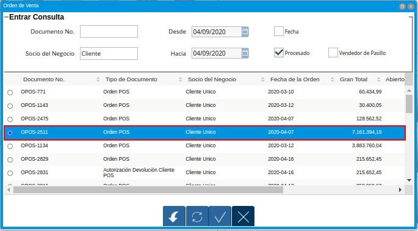
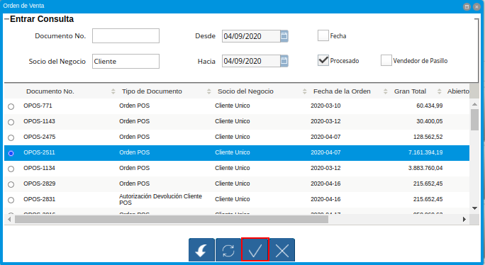
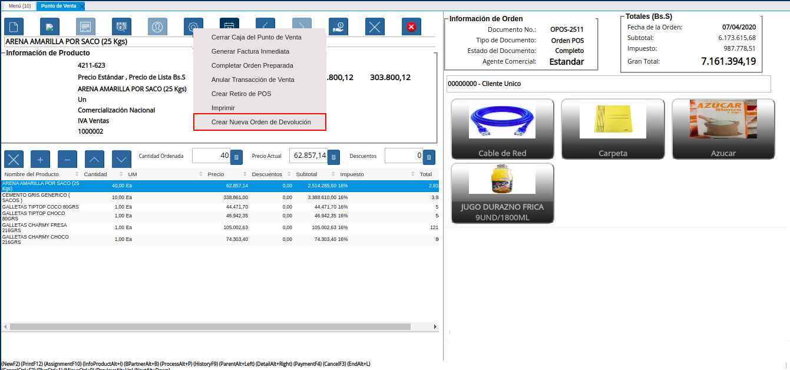
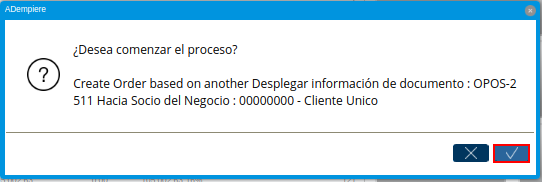
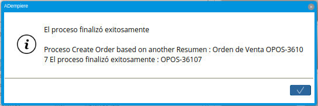
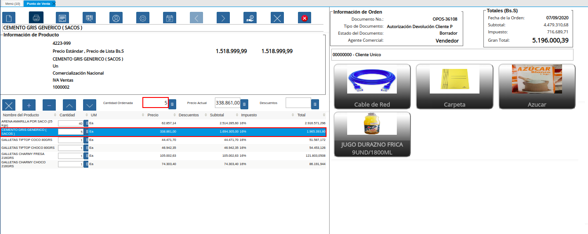
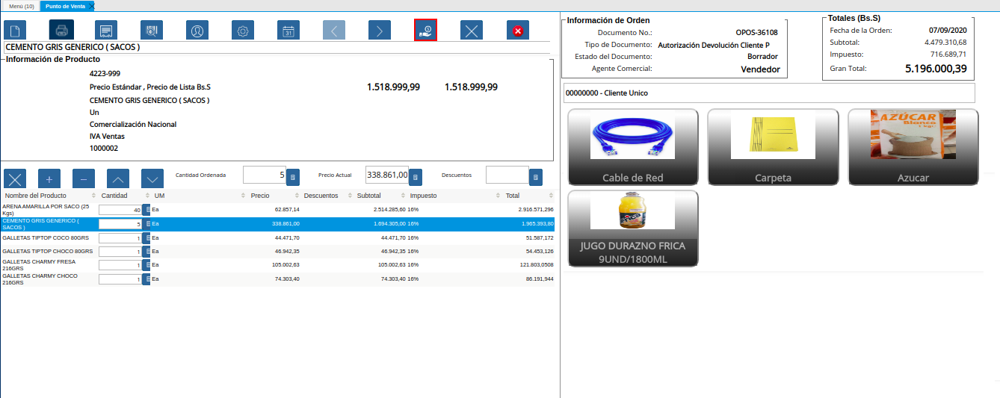
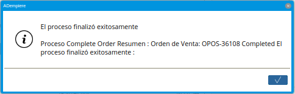
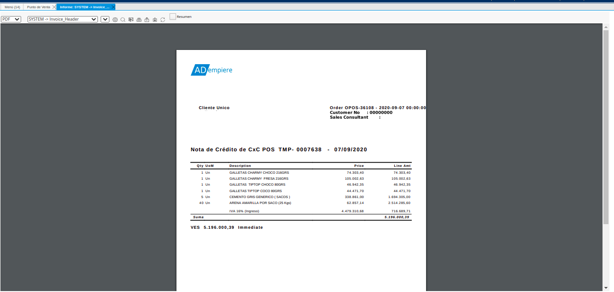

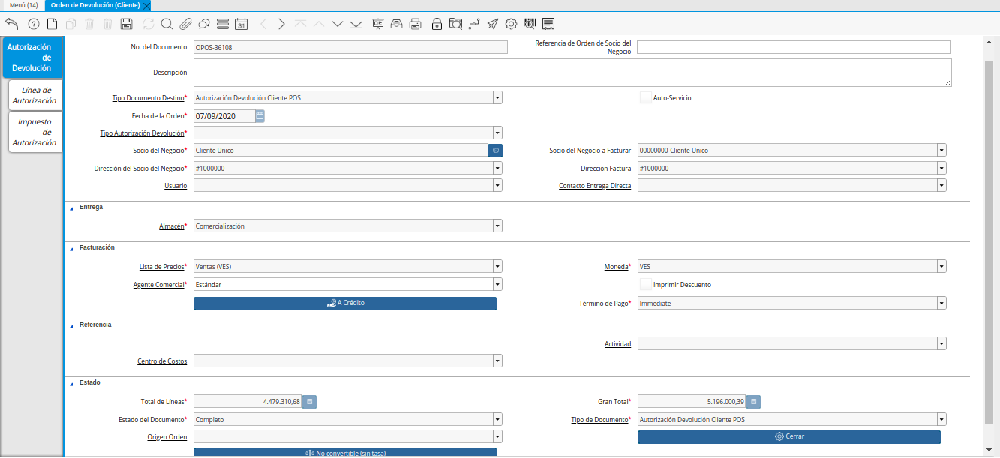
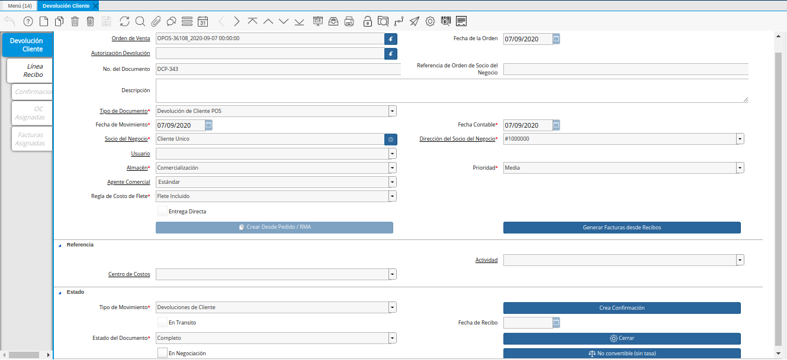
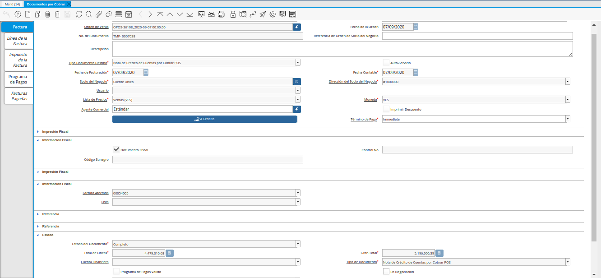
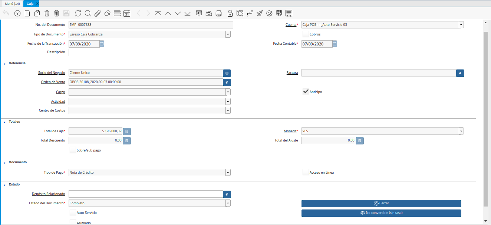

.. _documento/crear-nueva-orden-de-devolución:

**Crear Nueva Orden de Devolución**
===================================

El proceso "**Crear Nueva Orden de Devolución**" del punto de venta, se utiliza para las devoluciones parciales de productos. Dicho proceso genera una autorización de devolución que permite elegir los productos que se van a devolver y su cantidad.

Adicional a ello, los documentos "**Orden de Devolución**", "**Devolución**" y "**Nota de Crédito**" son generados automáticamente en estado "**Completo**", al seleccionar el icono "**Pagar**", ubicado en la barra de herramientas de la ventana "**Punto de Venta**".

Para ejecutar correctamente el proceso "**Crear Nueva Orden de Devolución**", se debe realizar el siguiente procedimiento.

#. Ubique y seleccione en el menú de ADempiere, la carpeta "**Gestión de Ventas**", luego seleccione la carpeta "**Órdenes de Venta**", por último seleccione la carpeta "**Punto de Venta**". Para finalizar, seleccione la ventana "**Punto de Venta**".

    |Menú de ADempiere|

    Imagen 1. Menú de ADempiere

#. La interfaz de la ventana "**Punto de Venta**", se encuentra definida de forma específica en el documento :ref:`documento/interfaz-del-punto-de-venta`, elaborado por `ERPyA`_. Realice cada uno de los procesos explicados a continuación para obtener un resultado exitoso en la creación de una nueva orden de devolución por el punto de venta.

#. Realice la búsqueda de registros de órdenes de venta generadas desde el punto de venta, seleccionando el icono "**Registros Históricos**" de la barra de herramientas de la ventana "**Punto de Venta**", dicho proceso se encuentra explicado en el documento :ref:`documento/paso-barra-de-herramientas`, elaborado por `ERPyA`_.

    #. Seleccione en la ventana "**Orden de Venta**", generada del icono "**Registros Históricos**", la orden de venta que requiere crearle una nueva orden de devolución.

        |Selección de Orden de Venta para Devolución|

        Imagen 2. Selección de Orden de Venta para Devolución

    #. Por último, seleccione la opción "**OK**" para ubicar en la ventana "**Punto de Venta**", el registro de la orden de venta realizada desde el punto de venta.

        |Selección de la Opción OK de la Orden de Venta para Devolución|

        Imagen 3. Selección de la Opción OK de la Orden de Venta para Devolución

#. Luego de ubicar la orden de venta que requiere crearle una nueva orden de devolución, seleccione la opción "**Crear Nueva Orden de Devolución**", ubicada en el menú desplegado por el icono "**Proceso**" de la barra de herramientas de la ventana "**Punto de Venta**", explicada en el documento :ref:`documento/paso-barra-de-herramientas` elaborado por `ERPyA`_.

    |Opción Crear Nueva Orden de Devolución|

    Imagen 4. Opción Crear Nueva Orden de Devolución

#. Al seleccionar el proceso "**Crear Nueva Orden de Devolución**", ADempiere muestra el mensaje para la confirmación de la ejecución del proceso, en el cual se debe seleccionar la opción "**OK**", para ejecutar el mismo.

    |Mensaje de Confirmación de la opción Crear Nueva Orden de Devolución|
    
    Imagen 5. Mensaje para Confirmación de Proceso

#. Luego de ejecutar la acción anteriormente explicada, ADempiere muestra un mensaje con el resultado del proceso.

    |Resultado del Proceso Crear Nueva Orden de Devolución|

    Imagen 6. Resultado del Proceso Crear Nueva Orden de Devolución

#. Podrá visualizar el registro de la orden de devolución creada, donde debe ubicar el registro de la línea del producto a modificar e ingresar en el campo "**Cantidad Ordenada**", la cantidad de producto que realmente se ve a vender. Si el caso amerita eliminar el producto con todas sus cantidades, también se puede realizar.
    
    |Modificación de Producto a Devolver|

    Imagen 7. Modificación de Producto a Devolver

    .. note::

        Para el ejemplo expuesto en el presente caso, se tenia vendida la cantidad de "**10**" unidades del producto "**CEMENTO GRIS GENERICO ( SACOS )**" y se esta realizando la devolución de "**5**" unidades.

#. Luego de ingresar y verificar las modificaciones de los productos a vender y su cantidad correspondiente, se debe seleccionar el icono "**Pagar**", ubicado en la barra de herramientas de la ventana "**Punto de Venta**", explicada en el documento :ref:`documento/paso-barra-de-herramientas` elaborado por `ERPyA`_. 

    |Selección de Opción Pagar Completar la Orden de Devolución|

    Imagen 8. Selección de Opción Pagar Completar la Orden de Devolución

    .. note::

        La presente acción completa el documento "**Orden de Devolución Cliente**", y genera automáticamente en estado "**Completo**", los documentos "**Devolución**" y "**Nota de Crédito**".

#. Luego de seleccionar el icono "**Pagar**", ADempiere muestra un mensaje de confirmación que indica que el proceso a finalizado.

    |Mensaje de Proceso Finalizado|

    Imagen 9. Mensaje de Proceso Finalizado

#. Por último, se muestra el reporte del documento "**Nota de Crédito de CxC**" generada automáticamente desde el proceso "**Crear Nueva Orden de Devolución**".

    |Nota de Crédito Generada del proceso Crear Nueva Orden de Devolución|

    Imagen 10. Nota de Crédito Generada del proceso Crear Nueva Orden de Devolución

**Consulta de Documentos Generados**
------------------------------------

#. En la ventana "**Orden de Devolución (Cliente)**", se puede visualizar el registro de la orden de devolución con ayuda del número de documento "**OPOS-36108**" generado en el reporte de la nota de crédito mostrada anteriormente.
    
    |consulta de orden de devolución generada del proceso Crear Nueva Orden de Devolución|

    Imagen 11. Consulta de Orden de Devolución Generada 

#. De igual manera, se puede visualizar en la ventana "**Devolución Cliente**", el registro generado desde el proceso anteriormente explicado.

    |consulta de devolución generada del proceso Crear Nueva Orden de Devolución|

    Imagen 12. Consulta de Devolución Generada

#. Finalmente, se puede visualizar en la ventana "**Documentos por Cobrar**", el registro de la nota de crédito generado automáticamente desde el proceso anteriormente explicado.

    |consulta de nota de crédito generada del proceso Crear Nueva Orden de Devolución|

    Imagen 13. Consulta de Nota de Crédito Generada

#. Adicional a ello, se genera un egreso en caja con el tipo de documento "**Egreso Caja Cobranza**", para reflejar el movimiento de egreso realizado automáticamente al ejecutar el proceso "**Crear Nueva Orden de Devolución**".

    |consulta de pago nacional generado en caja del proceso Crear Nueva Orden de Devolución|

    Imagen 14. Consulta de Pago Nacional Generado en Caja