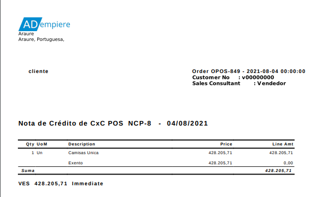
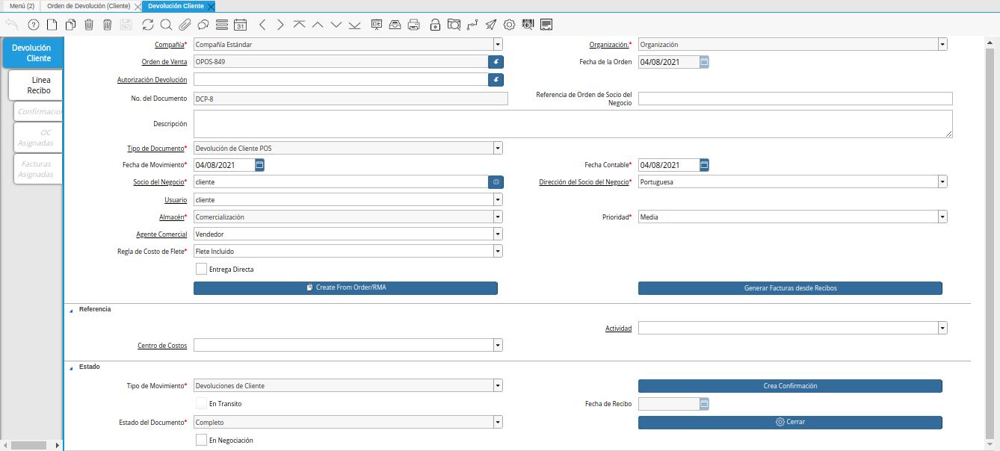
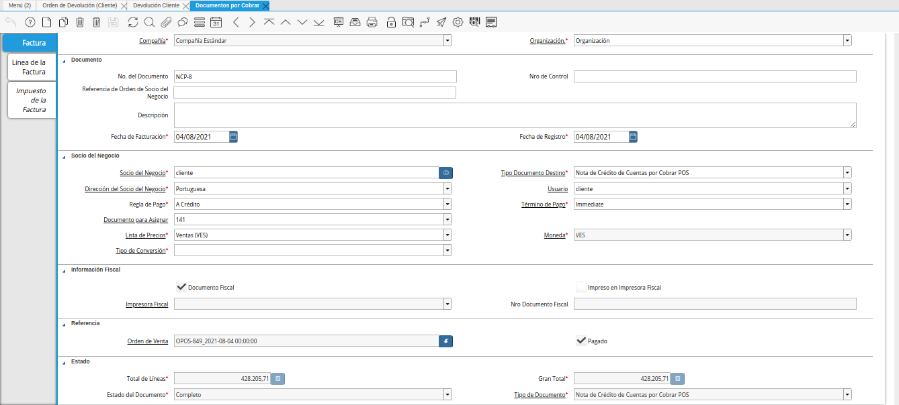
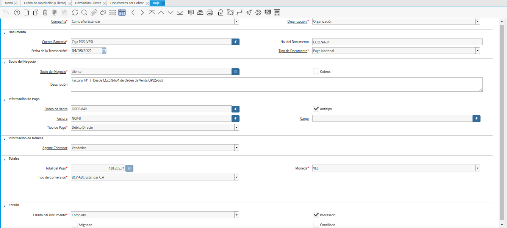

.. _ERPyA: http://erpya.com
.. |Menú de ADempiere| image:: resources/point-of-sale-menu.png
.. |Selección de Orden de Venta para Devolución| image:: resources/sales-order-selection-for-return.png
.. |Selección de la Opción OK de la Orden de Venta para Devolución| image:: resources/selection-of-the-ok-option-of-sales-order-for-return.png
.. |Opción Crear Nueva Orden de Devolución| image:: resources/option-create-new-return-order.png

.. |Mensaje de Confirmación de la opción Crear Nueva Orden de Devolución| image:: resources/confirmation-message-of-the-option-create-new-return-order.png
.. |Resultado del Proceso Crear Nueva Orden de Devolución| image:: resources/result-of-the-create-new-return-order-process.png

.. |Modificación de Producto a Devolver| image:: resources/

.. |consulta de orden de devolución generada del proceso Crear Nueva Orden de Devolución| image:: resources/return-order-query-generated.png

.. _documento/crear-nueva-orden-de-devolución:

**Crear Nueva Orden de Devolución**
===================================

El proceso "**Crear Nueva Orden de Devolución**" del punto de venta, se utiliza para las devoluciones parciales de productos. Dicho proceso genera una autorización de devolución que permite eñlegir los productos que se van a devolver y su cantidad.

Adicional a ello, los documentos "**Orden de Devolución**", "**Devolución**" y "**Nota de Crédito**" son generados automáticamente en estado "**Completo**".

Para ejecutar correctamente el proceso "**Crear Nueva Orden de Devolución**", se debe realizar el siguiente procedimiento.

#. Ubique y seleccione en el menú de ADempiere, la carpeta "**Gestión de Ventas**", luego seleccione la carpeta "**Órdenes de Venta**", por último seleccione la carpeta "**Punto de Venta**". Para finalizar, seleccione la ventana "**Punto de Venta**".

    |Menú de ADempiere|

    Imagen 1. Menú de ADempiere

#. La interfaz de la ventana "**Punto de Venta**", se encuentra definida de forma específica en el documento :ref:`documento/interfaz-del-punto-de-venta`, elaborado por `ERPyA`_. Realice cada uno de los procesos explicados a continuación para obtener un resultado exitoso en la anulación de la transacción de venta por el punto de venta.

#. Realice la búsqueda de registros de órdenes de venta generadas desde el punto de venta, seleccionando el icono "**Registros Históricos**" de la barra de herramientas de la ventana "**Punto de Venta**", dicho proceso se encuentra explicado en el documento :ref:`documento/paso-barra-de-herramientas`, elaborado por `ERPyA`_.

    #. Seleccione en la ventana "**Orden de Venta**", generada del icono "**Registros Históricos**", la orden de venta que requiere anular.

        |Selección de Orden de Venta para Devolución|

        Imagen 2. Selección de Orden de Venta para Devolución

    #. Por último, seleccione la opción "**OK**" para ubicar en la ventana "**Punto de Venta**", el registro de la orden de venta realizada desde el punto de venta.

        |Selección de la Opción OK de la Orden de Venta para Devolución|

        Imagen 3. Selección de la Opción OK de la Orden de Venta para Devolución

#. Luego de ubicar la orden de venta que requiere anular, seleccione la opción "**Crear Nueva Orden de Devolución**", ubicada en el menú desplegado por el icono "**Proceso**" de la barra de herramientas de la ventana "**Punto de Venta**", explicada en el documento :ref:`documento/paso-barra-de-herramientas` elaborado por `ERPyA`_.

    |Opción Crear Nueva Orden de Devolución|

    Imagen 4. Opción Crear Nueva Orden de Devolución

#. Al seleccionar el proceso "**Crear Nueva Orden de Devolución**", ADempiere muestra el mensaje para la confirmación de la ejecución del proceso, en el cual se debe seleccionar la opción "**OK**", para ejecutar el mismo.

    |Mensaje de Confirmación de la opción Crear Nueva Orden de Devolución|
    
    Imagen 5. Mensaje para Confirmación de Proceso

#. Luego de ejecutar la acción anteriormente explicada, ADempiere muestra un mensaje con el resultado del proceso.

    |Resultado del Proceso Crear Nueva Orden de Devolución|

    Imagen 6. Resultado del Proceso Crear Nueva Orden de Devolución

#. Por último, se muestra el reporte del documento "**Nota de Crédito de CxC**" generada automáticamente desde el proceso "**Crear Nueva Orden de Devolución**".

    |Nota de Crédito Generada del proceso Crear Nueva Orden de Devolución|

    Imagen 7. Nota de Crédito de CxC Generada Automáticamente