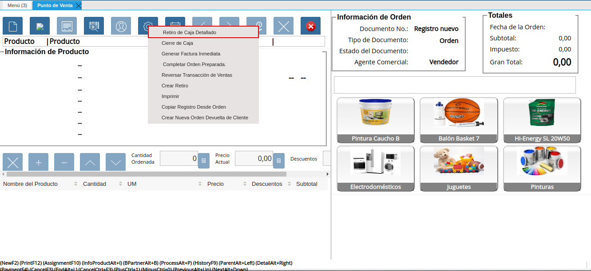
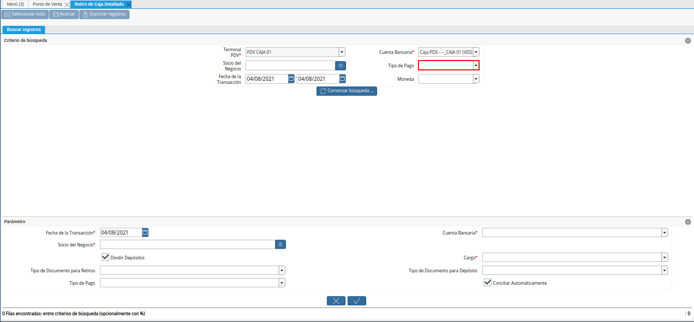
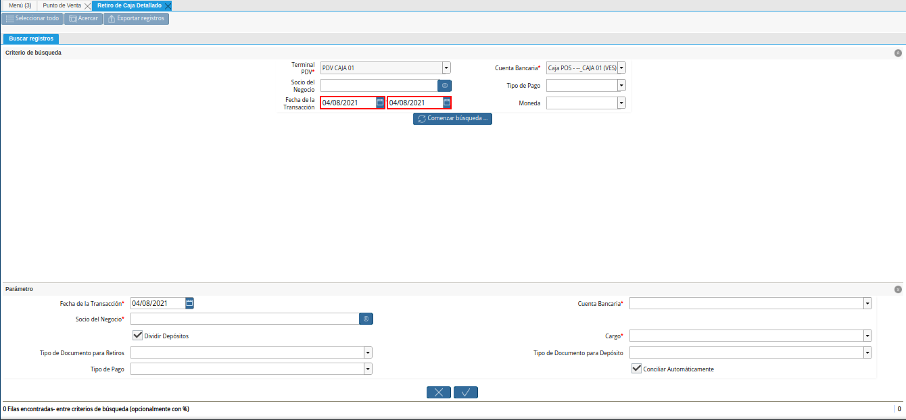
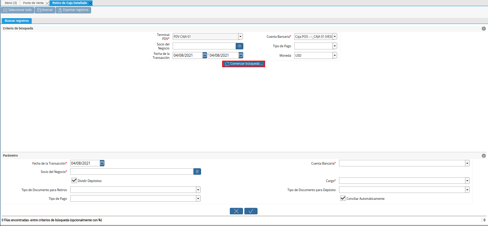
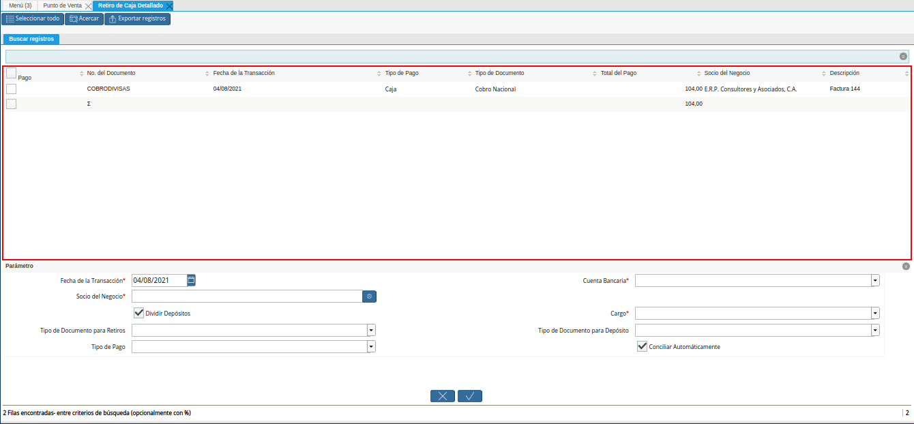
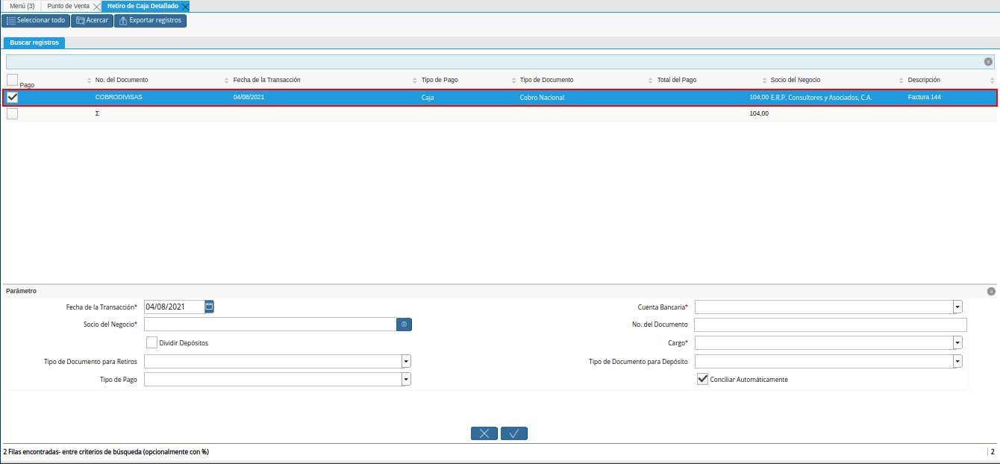
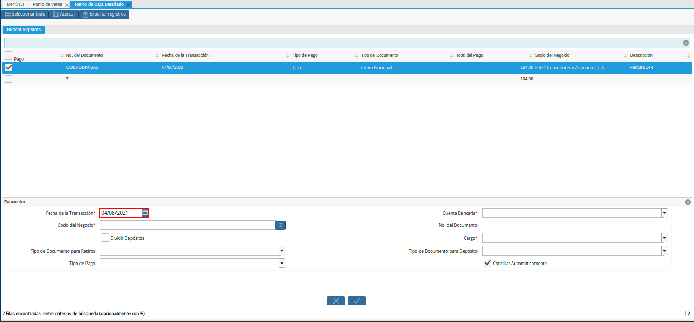

.. _ERPyA: http://erpya.com
.. |Menú de ADempiere| image:: resources/point-of-sale-menu.png

.. |campo cuenta bancaria del retiro detallado| image:: resources/bank-account-field-of-the-detailed-withdrawal.png

.. |campo cargo del retiro detallado| image:: resources/detailed-withdrawal-charge-field.png
.. |campo tipo de documento para retiros del retiro detallado| image:: resources/document-type-field-for-detailed-withdrawal-withdrawals.png

.. |Documento de Pago Generado en Caja| image:: resources/payment-document-generated-in-cash.png

.. _documento/retiro-detallado-punto-de-venta:

**Retiro Detallado de Punto de Venta**
======================================

Un retiro de fondos es realizado cuando por algún motivo se saca dinero de alguna de las cajas donde es realizado el proceso de venta de productos, la mayoria de las veces suele suceder por un alivio de caja, cancelación de un gasto, entre otros. A continuación es explicado el procedimiento regular para reflejar en ADempiere, un retiro de fondos.

A continuación, se específica el procedimiento que se debe realizar para retirar correctamente los fondos de caja POS.

**Ejecución del Proceso**
-------------------------

#. Ubique y seleccione en el menú de ADempiere, la carpeta "**Gestión de Ventas**", luego seleccione la carpeta "**Órdenes de Venta**", por último seleccione la carpeta "**Punto de Venta**". Para finalizar, seleccione la ventana "**Punto de Venta**".

    |Menú de ADempiere|

    Imagen 1. Menú de ADempiere

#. Si en el transcurso del día, se presenta un retiro de fondos en alguna de las cajas en la cual se encuentran realizando transacciones desde el punto de venta, seleccione la opción "**Retiro de Caja (Detallado)**", ubicada en el menú desplegado por el icono "**Proceso**" de la barra de herramientas de la ventana "**Punto de Venta**", explicada en el documento :ref:`documento/paso-barra-de-herramientas` elaborado por `ERPyA`_.

    |Opción Crear Retiro Detallado de POS|

    Imagen 2. Opción Crear Retiro Detallado de POS

#. Podrá visualizar la ventana "**Retiro de Caja (Detallado)**", con diferentes campos que permiten filtrar la información en base a lo requerido por el usuario para reflejar el retiro de fondos de la caja donde se encuentra realizando sus operaciones de venta.

    |Ventana Retiro de Caja Detallado|

    Imagen 3. Ventana Retiro de Caja (Detallado)

    .. note::

        Como ejemplo del proceso de retiro de fondos desde el punto de venta se tienen las siguientes transacciones en "**Caja 01**":

        - Transacciones del punto de venta del día "**10/02/2021**".
            - **Apertura de Caja**
                - 100,00 en Moneda "**USD**"
            - **Formas de Pago Recibidas por Ventas**
                - Efectivo en Moneda "**USD**"
                    - 10,00
                - Transferencia en Moneda "**VES**"
                    - 5.917.563,54
                - Pago Móvil en Moneda "**VES**"
                    - 70.000.000,00
                - Débito Directo en Moneda "**VES**"
                    - 40.577.378,71
  
    El retiro detallado de la caja, se debe realizar por moneda. Para el caso de la moneda "**VES**", se debe tildar de manera **Obligatoria**, el check "**Dividir Depósitos**", para que ADempiere genere un egreso de caja POS por el total de los movimientos con dicha moneda y un ingreso a caja administrativa por cada uno de los movimientos de cobro de dicha moneda.

    #. En el campo "**Terminal PDV**", podrá visualizar el terminal asociado al punto de venta desde el que accedió al proceso.

        |campo terminal pdv del retiro detallado|

        Imagen 4. Campo Terminal PDV

    #. En el campo "**Cuenta Bancaria**", podrá visualizar la cuenta bancaria de la caja POS asociada al punto de venta desde el que accedió al proceso.

        |campo o filtro cuenta bancaria del retiro detallado|

        Imagen 5. Campo Cuenta Bancaria

    #. Seleccione en el campo "**Socio del Negocio**", el socio del negocio vendedor por el cual requiere filtrar la información.

        |campo o filtro socio del negocio del retiro detallado|

        Imagen 6. Campo Socio del Negocio

    #. Seleccione en el campo "**Tipo de Pago**", el tipo de pago por el cual requiere filtrar la información.

        |campo tipo de pago del retiro detallado|

        Imagen 7. Campo Tipo de Pago

    #. Seleccione en el campo "**Fecha de la Transacción**", el rango de fecha por la cual requiere filtrar la información.

        |campo o filtro fecha de la transacción del retiro detallado|

        Imagen 8. Campo Fecha de la Transacción

    #. Seleccione en el campo "**Moneda**", la moneda por la cual requiere filtrar la información.

        |campo moneda del retiro detallado|

        Imagen 9. Campo Moneda

    #. Seleccione la opción "**Comenzar Búsqueda**", para filtrar la información en base a lo seleccionado anteriormente.

        |opción comenzar búsqueda del retiro detallado|

        Imagen 10. Opción Comenzar Búsqueda

    #. Podrá visualizar los diferentes movimientos de la caja en base a lo seleccionado.

        |resultado de búsqueda del retiro detallado|

        Imagen 11. Resultado de Búsqueda

    #. Seleccione los movimientos correspondientes al retiro que requiere realizar.

        |selección de movimientos del retiro detallado|

        Imagen 12. Selección de Movimientos

    #. Seleccione en el campo "**Fecha de la Transacción**", la fecha con la que serán generados los documento.

        |campo fecha de la transacción del retiro detallado|

        Imagen 13. Campo Fecha de la Transacción

    #. Seleccione en el campo "**Cuenta Bancaria**", la cuenta bancaria en la cual ingresarán los movimientos seleccionados.

        |campo cuenta bancaria del retiro detallado|

        Imagen 14. Campo Cuenta Bancaria

    #. Seleccione en el campo "**Socio del Negocio**", el socio del negocio correspondiente para el ingreso.

        |campo socio del negocio del retiro detallado|

        Imagen 15. Campo Socio del Negocio

    #. Introduzca en el campo "**No. del Documento**", el número de documento para los documentos de egreso e ingreso.

        |campo número del documento del retiro detallado|

        Imagen 16. Campo No. del Documento

    #. En el caso de los retiros en moneda "**VES**", tilde el check "**Dividir Depósitos**", para generar un documento de egreso de la caja POS con la suma de todos los cobros y tantos documentos de ingreso a la caja administrativos como movimientos seleccionados en el proceso.

        |check dividir depósitos del retiro detallado|

        Imagen 17. Check Dividir Depósitos

    #. Seleccione en el campo "**Cargo**", el cargo que justifica el retiro de fondos del dinero de la caja. Para este caso, es utilizado como ejemplo el cargo "**Efectivo en Tránsito Administración Ventas**".

        |campo cargo del retiro detallado|

        Imagen 18. Campo Cargo 

    #. Seleccione en el campo "**Tipo de Documento para Retiros**", el tipo de documento con el cual será generado el egreso. Para este caso, se utiliza el tipo de documento "**Egreso Caja**".

        |campo tipo de documento para retiros del retiro detallado|

        Imagen 19. Campo Tipo de Documento para Retiros 

    #. Seleccione en el campo "**Tipo de Documento para Depósito**", el tipo de documento con el cual será generado el ingreso. Para este caso, se utiliza el tipo de documento "**Ingreso Caja**".

        |campo tipo de documento para depósito del retiro detallado|

        Imagen 20. Campo Tipo de Documento para Depósito

    #. El check "**Conciliar Automáticamente**", permite la conciliación automática de los movimientos seleccionados.

        |check conciliar automáticamente del retiro detallado|

        Imagen 21. Check Conciliar Automáticamente

    #. Seleccione la opción "**OK**", para ejecutar el proceso.

        |opción ok para ejecutar el proceso|

        Imagen 22. Opción OK

.. note::

    Por cada retiro de fondo realizado desde el punto de venta, ADempiere crea en la ventana "**Caja**" los siguientes documentos:
    
        - Un documento de pago asociando en el campo "**Cuenta**", la caja POS desde la cual se ejecuta el proceso. Dicho documento se puede visualizar en la ventana "**Caja**".

        - De igual manera crea un documento de cobro asociando en el campo "**Cuenta**", la caja adiministrativa seleccionada en el campo "**Cuenta Bancaria**" del proceso "**Retiro de Caja (Detallado)**". Dicho documento se puede visualizar en la ventana "**Caja**".

**Consulta de Pago y Cobro Generados en Caja**
----------------------------------------------

#. Ubique los registros creados por el retiro de fondos en la ventana "**Caja**", con ayuda del número de documento ingresado en el campo "**No. del Documento**", de la ventana "**Retiro de Caja (Detallado)**".

    |Número de Documento del Retiro de Fondos|

    Imagen 23. Número de Documento del Retiro de Fondos

#. Podrá visualizar en la parte inferior derecha de la ventana "**Caja**", el número de registros creados con el valor ingresado en el campo "**No. del Documento**", de la ventana "**Retiro de Caja (Detallado)**".

    |Documento de Pago Generado en Caja|

    Imagen 24. Documento de Pago Generado en Caja

#. Podrá visualizar el registro de "**Pago**" creado desde la ventana "**Retiro de Caja (Detallado)**".

    |Pago Creado desde la Ventana Retiros de Puntos de Venta|

    Imagen 25. Pago Creado desde la Ventana Retiros de Puntos de Venta

#. Seleccione el icono "**Próximo Registro**", ubicado en la barra de herramientas para visualizar el registro de "**Cobro**" creado desde la ventana "**Retiro de Caja (Detallado)**".

    |Cobro Creado desde la Ventana Retiros de Puntos de Venta|

    Imagen 26. Cobro Creado desde la Ventana Retiros de Puntos de Venta

**Consultar Registro en Cierre de Caja**
----------------------------------------

#. Cada forma de pago y moneda por la que se realiza un retiro de fondos, se genera un documento de egreso y uno de ingreso en la ventana "**Caja**". Por cada documento generado se crea una línea con el mismo asociado, en la pestaña "**Línea de Cierre de Caja**", de la ventana "**Cierre de Caja**" correspondiente a los registros creados en estado "**Borrador** al realizar la apertura de caja. 

    #. Registro de "**Caja Administrativa**" en la ventana "**Cierre de Caja**".

        |Registro de Retiro Generado en Caja Administrativa|

        Imagen 27. Registro de Retiro Generado en Caja Administrativa

    #. Registro de "**Caja 01**" en la ventana "**Cierre de Caja**".

        |Registro de Retiro Generado en Caja 01|

        Imagen 28. Registro de Retiro Generado en Caja 01
