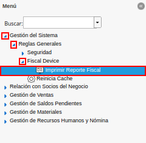
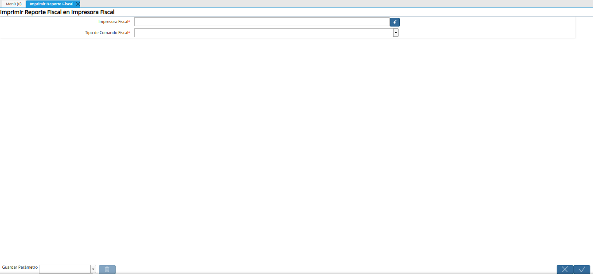
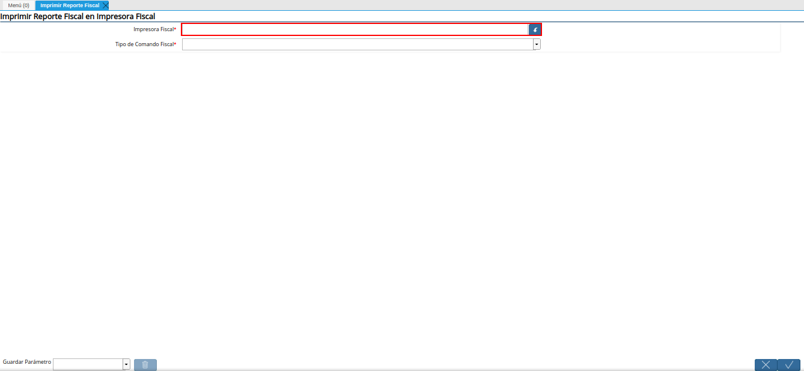
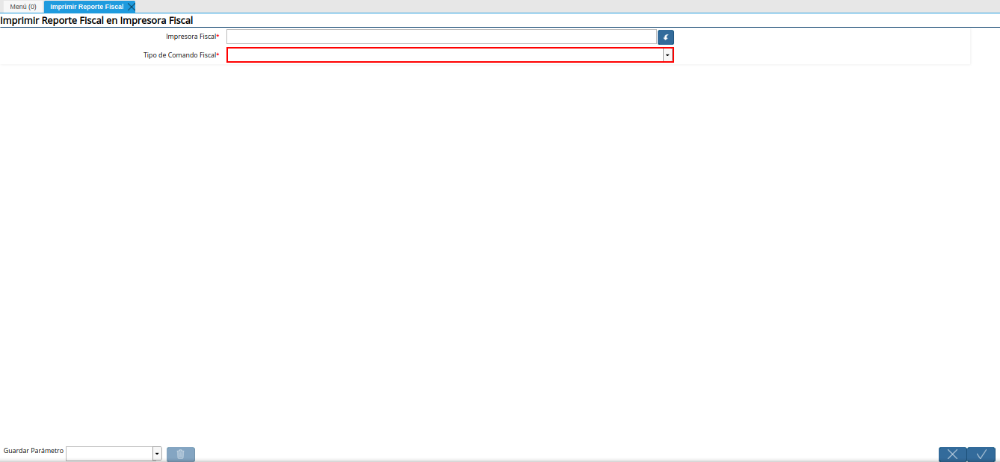
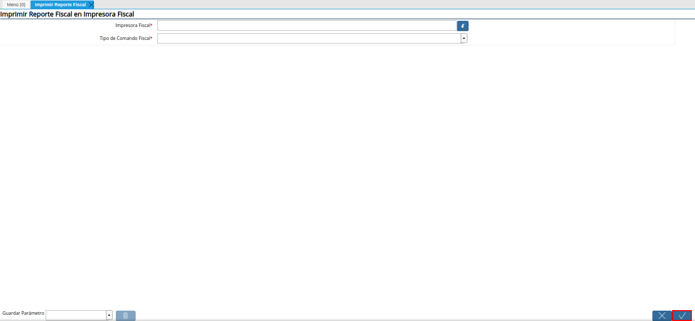

.. _documento/generar-reporte-x-y:

**Imprimir Reporte X y Z**
==========================

#. Ubique y seleccione en el menú de ADempiere, la carpeta "**Gestión de Sistema**", luego seleccione la carpeta "**Reglas Generales**", por último seleccione la carpeta "**Fiscal Device**". Finalmenete seleccione el reporte "**Imprimir Reporte Fiscal**".

    |menú de reporte fiscal|

    Imagen 1. Menú de ADempiere

#. Podrá visualizar la ventana "**Imprimir Reporte Fiscal**", con los campos necesarios para generar los reportes "**X**" y "**Z**" de la impresora fiscal.

    |ventana imprimir reporte fiscal|

    Imagen 2. Ventana Imprimir Reporte Fiscal

#. Seleccione en el campo "**Impresora Fiscal**", la impresora fiscal en la cual requiere generar el reporte.

    |campo impresora fiscal de la ventana imprimir reporte fiscal|

    Imagen 3. Campo Impresora Fiscal de la Ventana Imprimir Reporte Fiscal

#. Seleccione en el campo "**Tipo de Comando Fiscal**", el tipo de reporte que requiere generar en la impresora seleccionada anteriormente.

    |campo tipo de comando fiscal de la ventana imprimir reporte fiscal|

    Imagen 4. Campo Tipo de Comando Fiscal de la Ventana Imprimir Reporte Fiscal

#. Seleccione la opción "**OK**", para generar el reporte requerido en la impresora fiscal.

    |opción ok de la ventana imprimir reporte fiscal|

    Imagen 5. Opción

.. warning::

    Recuerde que el reporte "**X**", debe ser generado todos los días antes de realizar alguna transacción en el punto de venta, ya que este indica el inicio del día en la impresora.

    Adicional a ello, el reporte "**Z**" debe ser generado todos los días al culminar todas las transacciones que se deban realizar en el punto de venta. Este indica el cierre del día en la impresora.
