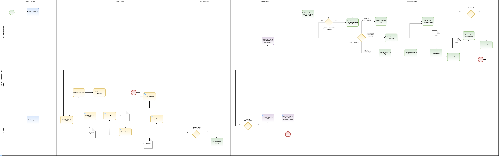

===============
**Gestión PDV**
===============

ADempiere ofrece una solución a pequeñas empresas que requieran manejar transacciones con sus clientes de manera agil y eficiente, y a su vez proporcionar un buen servicio al cliente.

Esta funcionalidad evita que los usuarios deban realizar una orden de venta, una factura, un cobro y una entrega para cumplir el proceso de venta, este punto de venta reduce estos cuatro pasos en dos pasos. Al generar una orden de venta y ser cobrada desde el punto de venta, ADempiere de forma automatica generará una factura y una entrega.

    |Diagrama de Proceso Punto de Venta|

    Imagen 1. Proceso de Punto de Venta

De esta forma ADempiere agilizará notablemente las operaciones regulares al permitir administrar todas sus transacciones desde un terminal. Adicional a la automatización cuenta con la integración de los procesos alternos como contabilidad, inventarios y otros.

Esta solución pasa a ser entonces un potente **Quick Service** por estar integrado con un **ERP** y está diseñado para ser utilizado en la indutria retail o restaurantes permitiendo un control total de sus resultados sin restar rendimiento en tiempo. Es por esto, que el enfoque de esta solución está en negocios que manejan cajas registradoras en la cual los clientes acuden a ejecutar un pedido y cancelarlo, para finalmente retirar sus productos.

.. toctree::
    :maxdepth: 2

    point-of-sale-terminal
    generate-report-x-y
    opening-cash
    point-of-sale-interface
    pos
    void-sales-transaction
    complete-ready-order
    withdrawal-of-funds-from-the-point-of-sale
    closing-cash
    transfer-to-bank
