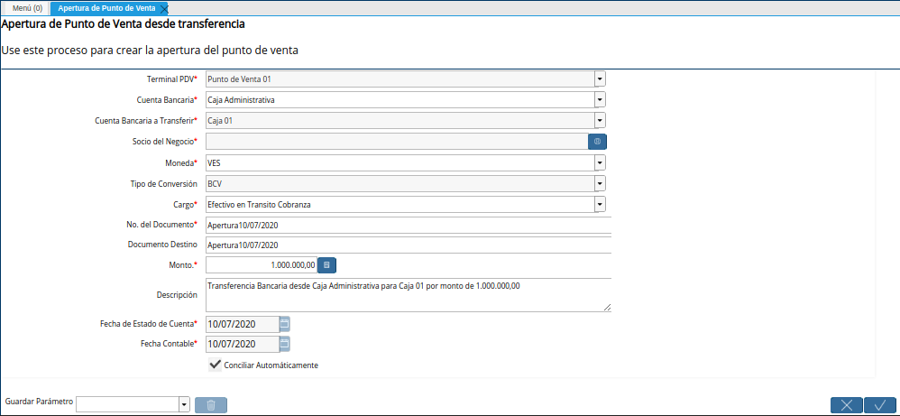
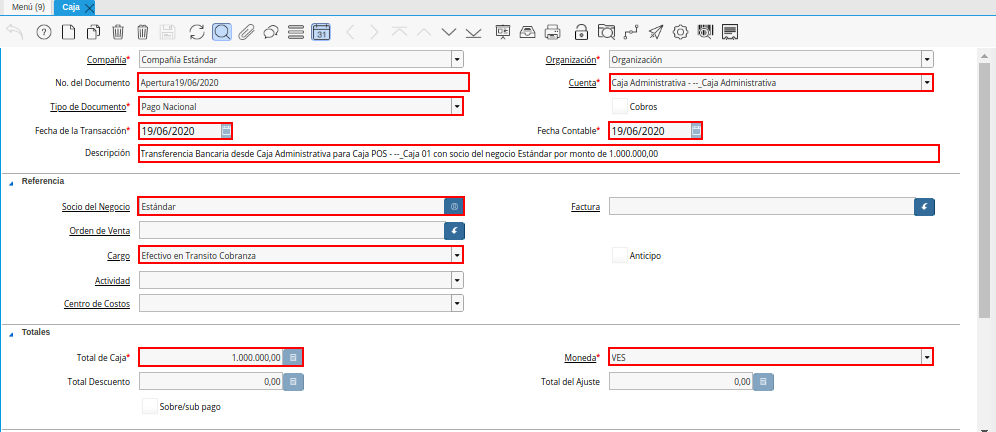

.. _ERPyA: http://erpya.com
.. |Menú de ADempiere| image:: resources/bank-transfer-menu.png
.. |Ventana Transferencia Bancaria| image:: resources/bank-transfer-window.png

.. |Ingreso Generado de la Transferencia Bancaria de Apertura de Caja| image:: resources/income-generated-from-the-bank-transfer-to-open-the-cash-register.png

.. _documento/apertura-de-caja:

**Transferencia Bancaria**
==========================

#. Ubique y seleccione en el menú de ADempiere, la carpeta "**Gestión de Saldos Pendientes**", luego seleccione el proceso "**Transferencia Bancaria**".

    |Menú de ADempiere|

    Imagen 1. Menú de ADempiere

#. Podrá visualizar la ventana "**Transferencia Bancaria**", con diferentes campos que permiten simular las transferencias monetarias entre las cuantas bancarias y cajas registradas en ADempiere.

    |Ventana Transferencia Bancaria|

    Imagen 2. Ventana Transferencia Bancaria

    #. Realice el proceso regular para generar una transferencia bancaria, dicho procedimiento se encuentra explicado en el documento :ref:`documento/procedimiento-para-realizar-una-transferencia-bancaria`, elaborado por `ERPyA`_. 
    
    #. Para la apertura de una caja, es necesario que sean cumplidas las siguientes restricciones en la ventana "**Transferencia Bancaria**".

        #. En el campo **Cuenta Bancaria Desde**", se debe seleccionar la cuenta caja origen desde la cual se realizará la transferencia. En este caso, se debe seleccionar la cuenta "**Caja Administrativa - --_Caja Administrativa**".
            
        #. En el campo "**Cuenta Bancaria a Transferir**", se debe seleccionar la cuenta caja destino a la cual se realizará la transferencia. En este caso, un ejemplo sería: "**Caja POS - --_Caja 01**".

            .. note::

                Recuerde que la cuenta a seleccionar debe ser la cuenta correspondiente a la caja donde realizará las operaciones de ventas el socio del negocio empleado.
            
        #. En el campo "**Socio del Negocio**", se debe seleccionar el socio del negocio empleado que realizará las operaciones en la caja seleccionada en el campo "**Cuenta Bancaria a Transferir**". En este caso, un ejemplo sería: "**Estándar**".

        #. En el campo "**Moneda**", se debe seleccionar la moneda utilizada en la transferencia del dinero.

        #. En el campo "**Cargo**", se debe seleccionar el cargo "**Efectivo en Transito Cobranza**".

        #. En el campo "**No. del Documento**", se debe ingresar el nombre seguido de la fecha del proceso que esta registrando. En este caso, un ejemplo sería: "**Apertura19/06/2020**".

        #. En el campo "**Documento Destino**", se debe ingresar el nombre seguido de la fecha del proceso que esta registrando. En este caso, un ejemplo sería: "**Apertura19/06/2020**".

        #. En el campo "**Monto**", se debe ingresar el monto total de la transferencia en la moneda seleccionada. En este caso, un ejemplo sería: "**1.000.000,00**.

        #. En el campo "**Descripción**", se debe ingresar una descripción breve que explique de forma puntual la transferencia. En este caso, un ejemplo sería: "**Transferencia Bancaria desde Caja Administrativa para Caja POS - --_Caja 01 con socio del negocio Estándar por monto de 1.000.000,00**".
        
        #. En el campo "**Fecha de Estado de Cuenta**", la fecha en la que se esta realizando la transacción.

        #. En el campo "**Fecha Contable**", la fecha en la que se esta realizando la transacción.

        |Transferencia Bancaria de Apertura de Caja|

        Imagen 3. Transferencia Bancaria de Apertura de Caja

        .. note::

            Recuerde seleccionar la opción "**OK**", ubicada en la parte inferior de la ventana "**Transferencia Bancaria**", para completar el proceso y simular en ADempiere el movimiento monetario realizado.

**Consultar Egreso e Ingreso Generado de la Transferencia Bancaria**
====================================================================

#. Al buscar entre los registros de la ventana "**Caja**", el valor "**Apertura19/06/2020**" ingresado en el campo "**No. del Documento**", se pueden visualizar dos (2) registros resultantes de la transferencia bancaria, entre ellos se encuentran.

    #. El egreso generado en la cuenta "**Caja Administrativa**" como pago nacional, con toda la información suministrada en el proceso ejecutado en la ventana "**Transferencia Bancaria**".

        |Egreso Generado de la Transferencia Bancaria de Apertura de Caja|

        Imagen 4. Egreso Generado de la Transferencia Bancaria de Apertura de Caja

    #. El ingreso generado en la cuenta "**Caja POS - --_Caja 01**" como cobro nacional, con toda la información suministrada en el proceso ejecutado en la ventana "**Transferencia Bancaria**".

        |Ingreso Generado de la Transferencia Bancaria de Apertura de Caja|

        Imagen 5. Ingreso Generado de la Transferencia Bancaria de Apertura de Caja
