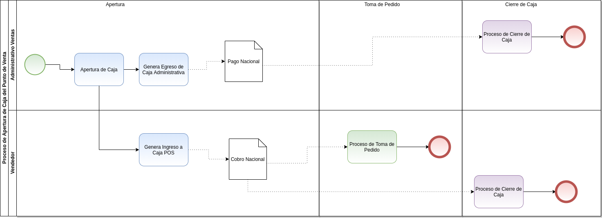

.. _ERPyA: http://erpya.com

.. |Menú de ADempiere| image:: resources/menu-opening-point-of-sale.png
.. |Ventana Apertura de Punto de Venta| image:: resources/window-opening-point-of-sale.png
.. |Transferencia Bancaria de Apertura de Caja| image:: resources/cash-transfer-bank-opening.png
.. |Egreso Generado de la Transferencia Bancaria de Apertura de Caja| image:: resources/outflow-generated-from-the-bank-transfer-to-open-the-cash-register.png
.. |Ingreso Generado de la Transferencia Bancaria de Apertura de Caja| image:: resources/income-generated-from-the-bank-transfer-to-open-the-cash-register.png
.. |Registro del Cierre de Caja Administrativa| image:: resources/registration-of-the-administrative-cash-closure.png
.. |Pestaña Línea de Cierre de Caja Administrativa| image:: resources/administrative-cash-closing-line-tab.png
.. |Registro del Cierre de Caja 04| image:: resources/cash-closure-record-04.png
.. |Pestaña Línea de Cierre de Caja 04| image:: resources/cash-closure-line-04-tab.png

.. _documento/apertura-de-caja:

**Apertura de Caja**
====================

El proceso de apertura de caja consta en realizar una transferencia bancaria desde un proceso específico del punto de venta. Permitiendo con ello, realizar un egreso de la caja administrativa del punto de venta y posteriormente, un ingreso a la caja en la cual serán realizadas las operaciones de venta. Dichos movimientos son reflejados en la ventana "**Caja**", por medio de los documentos "**Pago Nacional**" y "**Cobro Nacional**".

Este procedimiento crea un registro en la ventana "**Cierre de Caja**", con la cuenta "**Caja Administrativa**", desde la cual egresa el dinero. En la línea del mismo, se asocia el registro de "**Pago Nacional**", generado en la ventana "**Caja**" por la apertura.

Adicional a ello, crea un registro en dicha ventana "**Cierre de Caja**", con la cuenta "**Caja POS**", a la cual ingresa el dinero. De igual manera, se asocia en la línea del registro, el "**Cobro Nacional**", generado en "**Caja**" por la apertura.

Para mejor referencia de lo explicado anteriormente, se presenta a continuación el diagrama del proceso "**Apertura de Caja POS**", con la finalidad dar a conocer el comportamiento de ADempiere ante dicho proceso.

    .. note::

        Recuerde que este proceso se debe realizar antes de iniciar las ventas del día. Adicional a ello, es un proceso necesario al momento del cierre de caja.

    |diagrama de apertura de caja pos|

    Imagen 1. Diagrama de Apertura de Caja POS

.. warning::

    No debe realizar el proceso de apertura de caja si no es entregado fisicamente el dinero en la respectiva caja. De lo contrario, los saldos de la caja en ADempiere no tendrán ninguna coincidencia con los saldos que existen fisicamente en la caja.

**Ejecución del Proceso**
-------------------------

#. Ubique y seleccione en el menú de ADempiere, la carpeta "**Gestión de Ventas**", luego seleccione la carpeta "**Órdenes de Venta**", por último seleccione la carpeta "**Punto de Venta**". Para finalizar, seleccione el proceso "**Apertura de Punto de Venta**".

    |Menú de ADempiere|

    Imagen 2. Menú de ADempiere

#. Podrá visualizar la ventana "**Apertura de Punto de Venta**", con diferentes campos que permiten simular las transferencias monetarias entre las cuentas bancarias y cajas registradas en ADempiere.

    |Ventana Apertura de Punto de Venta|

    Imagen 3. Ventana Apertura de Punto de Venta

    #. Realice en la ventana "**Apertura de Punto de Venta**", el proceso regular para generar una transferencia bancaria, dicho procedimiento se encuentra explicado en el documento :ref:`documento/procedimiento-para-realizar-una-transferencia-bancaria`, elaborado por `ERPyA`_. 
    
    #. Para la apertura de una caja, es necesario que sean cumplidas las siguientes restricciones en la ventana "**Apertura de Punto de Venta**".

        #. En el campo **Terminal PDV**, se encuentran los diferentes terminales configurados para los socios del negocio que cumplen con el rol de empleados de la organización. En este campo se debe seleccionar el terminal al cual se le realizará la apertura de la caja. Un ejemplo sería "**PDV Caja 01 **".

        #. En el campo **Caja**", se debe seleccionar la cuenta caja origen desde la cual se realizará la transferencia. En este caso, se debe seleccionar la cuenta caja "**Administración POS**".
            
        #. En el campo "**Caja a Transferir**", se encuentra la cuenta caja destino seleccionada en el terminal PDV como cuenta bancaria a la cual se realizará la transferencia. El valor de este campo se carga de manera automática, al seleccionar el terminal de la caja en el campo "**Terminal PDV**". En este caso, un ejemplo sería: "**Caja 01**".

            .. note::

                Recuerde que el terminal a seleccionar en el campo "**Terminal PDV**", debe ser el terminal correspondiente a la caja donde realizará las operaciones de ventas el socio del negocio empleado.
            
        #. En el campo "**Socio del Negocio**", se carga de manera automática el socio del negocio empleado que realizará las operaciones en la caja indicada en el campo "**Caja a Transferir**", previamente configurado en el terminal seleccionado en el campo "**Terminal PDV**". En este caso, un ejemplo sería: "**Vendedor**".

        #. En el campo "**Tipo de Conversión**", se carga de manera automática el tipo de conversión establecido en el terminal de la caja. 

        #. En el campo "**Moneda**", se debe seleccionar la moneda a ser utilizada en la transferencia del dinero. En este caso, un ejemplo sería: "**USD**"

            .. note::

                Se debe realizar una transferencia por moneda, cuando se necesite aperturar la caja con más de una moneda.

        #. En el campo "**Cargo**", se debe seleccionar el cargo "**Efectivo en Tránsito Administración**".

        #. En el campo "**No. del Documento**", se debe ingresar el número de documento con el cual será generado el egreso monetario por el proceso que esta registrando. En este caso, un ejemplo sería: "**Egreso-Apertura10/02/2021**".

        #. En el campo "**Documento Destino**", se debe ingresar el número de documento con el cual será generado el ingreso monetario por el proceso que esta registrando. En este caso, un ejemplo sería: "**Ingreso-Apertura10/02/2021**".

        #. En el campo "**Monto**", se debe ingresar el monto total de la transferencia en la moneda seleccionada. En este caso, un ejemplo sería: "**100,00**.

        #. En el campo "**Descripción**", se debe ingresar una descripción breve que explique de forma puntual la transferencia. En este caso, un ejemplo sería: "**Apertura de Caja 1 del 10/02/2021 por 100 USD**".
        
        #. En el campo "**Fecha de Estado de Cuenta**", ADempiere establece la fecha en la que se esta realizando la transacción. Esta indica la fecha en la cual será generado el estado de cuenta que se encuentra procesando. 

        #. En el campo "**Fecha Contable**", ADempiere establece la fecha en la que se esta realizando la transacción. Esta indica la fecha a ser usada en las cuentas de contabilidad general generadas desde este proceso.

        |Transferencia Bancaria de Apertura de Caja|

        Imagen 4. Transferencia Bancaria de Apertura de Caja

        .. note::

            Recuerde seleccionar la opción "**OK**", ubicada en la parte inferior de la ventana "**Transferencia Bancaria**", para completar el proceso y simular en ADempiere el movimiento monetario realizado.

**Consultar Egreso e Ingreso Generado de la Apertura de Punto de Venta**
------------------------------------------------------------------------

#. Al buscar entre los registros de la ventana "**Caja**", los valores ingresados en los campos "**No. del Documento**" y "**Documento Destino**", de la ventana "**Apertura de Punto de Venta**", se pueden visualizar dos (2) registros resultantes de la transferencia bancaria, entre ellos se encuentran.

    #. El egreso generado en la cuenta "**Caja Administrativa**" como pago nacional, con toda la información suministrada en el proceso ejecutado en la ventana "**Apertura de Punto de Venta**".

        |Egreso Generado de la Transferencia Bancaria de Apertura de Caja|

        Imagen 5. Egreso Generado de la Transferencia Bancaria de Apertura de Caja

    #. El ingreso generado en la cuenta "**Caja 04**" como cobro nacional, con toda la información suministrada en el proceso ejecutado en la ventana "**Apertura de Punto de Venta**".

        |Ingreso Generado de la Transferencia Bancaria de Apertura de Caja|

        Imagen 6. Ingreso Generado de la Transferencia Bancaria de Apertura de Caja

**Consultar Registros Creados en la Ventana Cierre de Caja**
------------------------------------------------------------

Al realizar una apertura de caja se crean dos registros en estado "**Borrador**", en la ventana "**Cierre de Caja**", uno para cada caja involucrada en el proceso ejecutado en la ventana "**Apertura de Punto de Venta**".

**Caja Administración POS**
***************************

#. El registro con la cuenta "**Caja Administración POS**", se crea automáticamente con las siguientes restricciones:

    - **Cuenta**: La cuenta "**Caja Administración Ventas - --_Administración POS**", previamente seleccionada en el campo "**Caja**" de la ventana "**Apertura de Punto de Venta**". 
    - **Nombre**: La descripción "**Apertura de Caja 1 del 10/02/2021 por 100 USD**", previamente ingresada en el campo "**Descripción**" de la ventana "**Apertura de Punto de Venta**".
    - **Fecha del Registro**: La fecha "**10/02/2021**", en la cual fue ejecutado el proceso de apertura desde la ventana "**Apertura de Punto de Venta**".
    - **Saldo Inicial**: El saldo "**0,00**", con el que inicia la caja.
    - **Diferencia Edo. De Cuenta**: El monto de "**-193.349.343,00**", de diferencia entre el saldo final del estado de cuentas y el saldo final actual.
    - **Saldo Final**: El monto de "**-193.349.343,00**", correspondiente al saldo final o al cierre. El saldo final es el resultado de ajustar el saldo inicial por cualquier pago o desembolso.

    |Registro del Cierre de Caja Administrativa|

    Imagen 7. Registro del Cierre de Caja Administración POS

    El mismo contiene en la pestaña "**Línea de Cierre de Caja**", el registro del egreso por la apertura de caja realizada y contiene asociado el documento de egreso generado en la ventana "**Caja**".

    |Pestaña Línea de Cierre de Caja Administrativa|

    Imagen 8. Pestaña Línea de Cierre de Caja Administración POS

**Caja 01**
***********

#. El registro con la cuenta "**Caja 01**", se crea automáticamente con las siguientes restricciones:

    - **Cuenta**: La cuenta "**Caja POS - --_Caja PDV 01**", previamente seleccionada en el campo "**Caja a Transferir**" de la ventana "**Apertura de Punto de Venta**".
    - **Nombre**: La descripción "**Apertura de Caja 1 del 10/02/2021 por 100 USD**", previamente ingresada en el campo "**Descripción**" de la ventana "**Apertura de Punto de Venta**".
    - **Fecha del Registro**: La fecha "**01/09/2020**", en la cual fue ejecutado el proceso de apertura desde la ventana "**Apertura de Punto de Venta**".
    - **Saldo Inicial**: El saldo "**0,00**", con el que inicia la caja.
    - **Diferencia Edo. De Cuenta**: El monto de "**193.349.343,00**", de diferencia entre el saldo final del estado de cuentas y el saldo final actual.
    - **Saldo Final**: El monto de "**193.349.343,00**", correspondiente al saldo final o al cierre. El saldo final es el resultado de ajustar el saldo inicial por cualquier pago o desembolso.

    |Registro del Cierre de Caja 04|

    Imagen 9. Registro del Cierre de Caja 01

    El mismo contiene en la pestaña "**Línea de Cierre de Caja**", el registro del ingreso por la apertura de caja realizada y contiene asociado el documento de ingreso generado en la ventana "**Caja**".

    |Pestaña Línea de Cierre de Caja 04|

    Imagen 10. Pestaña Línea de Cierre de Caja 01