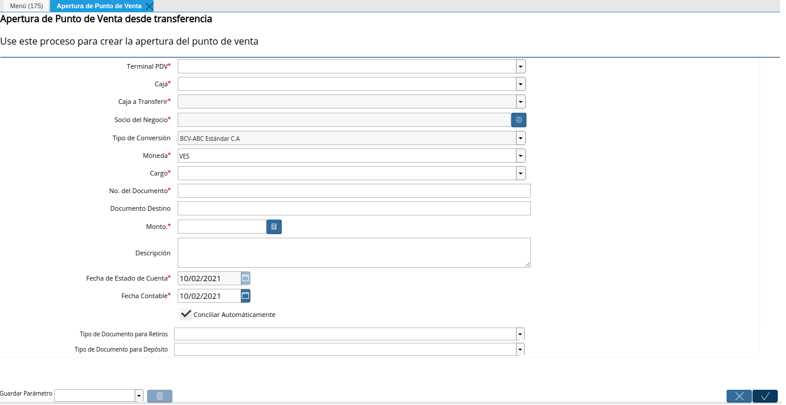
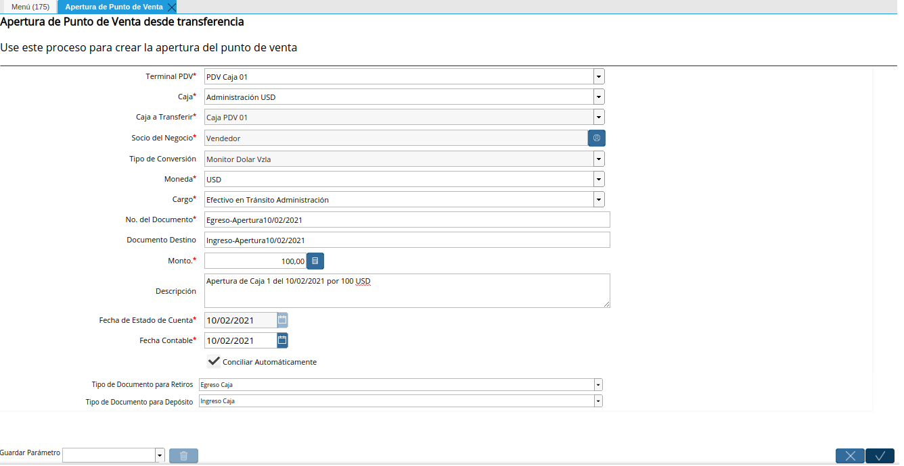
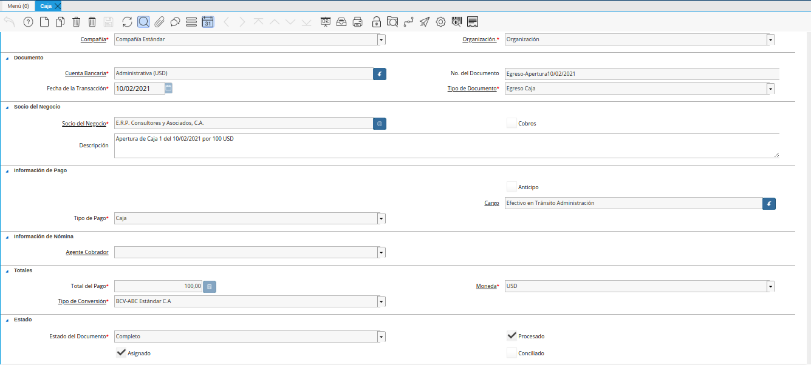
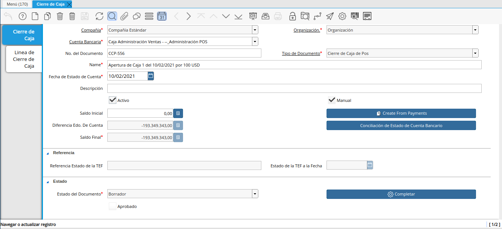
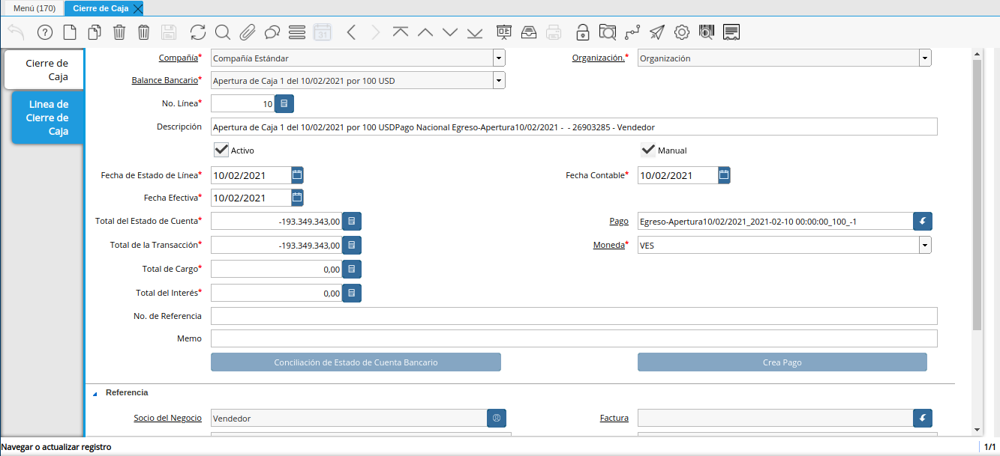
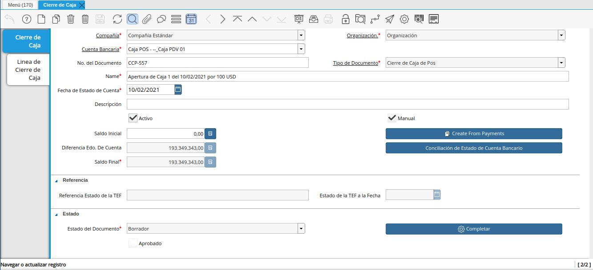
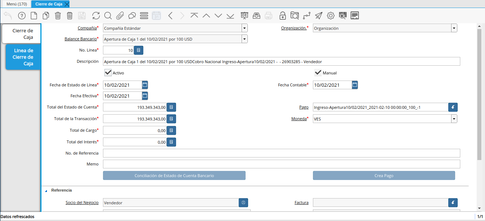

.. _ERPyA: http://erpya.com

.. _documento/apertura-de-caja:

**Apertura de Caja**
====================

#. Ubique y seleccione en el menú de ADempiere, la carpeta "**Gestión de Ventas**", luego seleccione la carpeta "**Órdenes de Venta**", por último seleccione la carpeta "**Punto de Venta**". Para finalizar, seleccione el proceso "**Apertura de Punto de Venta**".

    |Menú de ADempiere|

    Imagen 1. Menú de ADempiere

#. Podrá visualizar la ventana "**Apertura de Punto de Venta**", con diferentes campos que permiten simular las transferencias monetarias entre las cuentas bancarias y cajas registradas en ADempiere.

    |Ventana Apertura de Punto de Venta|

    Imagen 2. Ventana Apertura de Punto de Venta

    #. Realice en la ventana "**Apertura de Punto de Venta**", el proceso regular para generar una transferencia bancaria, dicho procedimiento se encuentra explicado en el documento :ref:`documento/procedimiento-para-realizar-una-transferencia-bancaria`, elaborado por `ERPyA`_. 
    
    #. Para la apertura de una caja, es necesario que sean cumplidas las siguientes restricciones en la ventana "**Apertura de Punto de Venta**".

        #. En el campo **Terminal PDV**, se encuentra el terminal configurado para el socio del negocio empleado.

        #. En el campo **Cuenta Bancaria**", se debe seleccionar la cuenta caja origen desde la cual se realizará la transferencia. En este caso, se debe seleccionar la cuenta "**Caja Administrativa**".
            
        #. En el campo "**Cuenta Bancaria a Transferir**", se encuentra la cuenta caja destino seleccionada en el terminal PDV como cuenta bancaria a la cual se realizará la transferencia. En este caso, un ejemplo sería: "**Caja 04**".

            .. note::

                Recuerde que la cuenta a seleccionar debe ser la cuenta correspondiente a la caja donde realizará las operaciones de ventas el socio del negocio empleado.
            
        #. En el campo "**Socio del Negocio**", se debe seleccionar el socio del negocio empleado que realizará las operaciones en la caja seleccionada en el campo "**Cuenta Bancaria a Transferir**". En este caso, un ejemplo sería: "**Vendedor**".

        #. En el campo "**Moneda**", se debe seleccionar la moneda utilizada en la transferencia del dinero.

        #. En el campo "**Cargo**", se debe seleccionar el cargo "**Efectivo en Tránsito Administración Ventas**".

        #. En el campo "**No. del Documento**", se debe ingresar el nombre seguido de la fecha del proceso que esta registrando. En este caso, un ejemplo sería: "**Egreso-Apertura01/09/2020**".

        #. En el campo "**Documento Destino**", se debe ingresar el nombre seguido de la fecha del proceso que esta registrando. En este caso, un ejemplo sería: "**Ingreso-Apertura01/09/2020**".

        #. En el campo "**Monto**", se debe ingresar el monto total de la transferencia en la moneda seleccionada. En este caso, un ejemplo sería: "**1.000.000,00**.

        #. En el campo "**Descripción**", se debe ingresar una descripción breve que explique de forma puntual la transferencia. En este caso, un ejemplo sería: "**Transferencia para Caja 04 por Apertura01/09/2020**".
        
        #. En el campo "**Fecha de Estado de Cuenta**", la fecha en la que se esta realizando la transacción.

        #. En el campo "**Fecha Contable**", la fecha en la que se esta realizando la transacción.

        |Transferencia Bancaria de Apertura de Caja|

        Imagen 3. Transferencia Bancaria de Apertura de Caja

        .. note::

            Recuerde seleccionar la opción "**OK**", ubicada en la parte inferior de la ventana "**Transferencia Bancaria**", para completar el proceso y simular en ADempiere el movimiento monetario realizado.

**Consultar Egreso e Ingreso Generado de la Apertura de Punto de Venta**
------------------------------------------------------------------------

#. Al buscar entre los registros de la ventana "**Caja**", los valores ingresados en los campos "**No. del Documento**" y "**Documento Destino**", de la ventana "**Apertura de Punto de Venta**", se pueden visualizar dos (2) registros resultantes de la transferencia bancaria, entre ellos se encuentran.

    #. El egreso generado en la cuenta "**Caja Administrativa**" como pago nacional, con toda la información suministrada en el proceso ejecutado en la ventana "**Apertura de Punto de Venta**".

        |Egreso Generado de la Transferencia Bancaria de Apertura de Caja|

        Imagen 4. Egreso Generado de la Transferencia Bancaria de Apertura de Caja

    #. El ingreso generado en la cuenta "**Caja 04**" como cobro nacional, con toda la información suministrada en el proceso ejecutado en la ventana "**Apertura de Punto de Venta**".

        |Ingreso Generado de la Transferencia Bancaria de Apertura de Caja|

        Imagen 5. Ingreso Generado de la Transferencia Bancaria de Apertura de Caja

**Consultar Registros Creados en la Ventana Cierre de Caja**
------------------------------------------------------------

Al realizar una apertura de caja se crean dos registros en estado "**Borrador**", en la ventana "**Cierre de Caja**", uno para cada caja involucrada en el proceso ejecutado en la ventana "**Apertura de Punto de Venta**".

**Caja Administrativa**
***********************

#. El registro con la cuenta "**Caja Administrativa**", se crea automáticamente con las siguientes restricciones:

    - **Cuenta**: La cuenta "**Caja Administrativa**", previamente seleccionada en el campo "**Cuenta Bancaria**" de la ventana "**Apertura de Punto de Venta**". 
    - **Nombre**: La descripción "**Transferencia para Caja 04 por Apertura01/09/2020**", previamente ingresada en el campo "**Descripción**" de la ventana "**Apertura de Punto de Venta**".
    - **Fecha del Registro**: La fecha "**01/09/2020**", en la cual fue ejecutado el proceso de apertura desde la ventana "**Apertura de Punto de Venta**".
    - **Saldo Inicial**: El saldo "**0,00**", con el que inicia la caja.
    - **Diferencia Edo. De Cuenta**: El monto de "**-1.000.000,00**", de diferencia entre el saldo final del estado de cuentas y el saldo final actual.
    - **Saldo Final**: El monto de "**-1.000.000,00**", correspondiente al saldo final o al cierre. El saldo final es el resultado de ajustar el saldo inicial por cualquier pago o desembolso.

    |Registro del Cierre de Caja Administrativa|

    Imagen 6. Registro del Cierre de Caja Administrativa

    El mismo contiene en la pestaña "**Línea de Cierre de Caja**", el registro del egreso por la apertura de caja realizada y contiene asociado el documento de egreso generado en la ventana "**Caja**".

    |Pestaña Línea de Cierre de Caja Administrativa|

    Imagen 7. Pestaña Línea de Cierre de Caja Administrativa

**Caja 04**
***********

#. El registro con la cuenta "**Caja 04**", se crea automáticamente con las siguientes restricciones:

    - **Cuenta**: La cuenta "**Caja 04**", previamente seleccionada en el campo "**Cuenta Bancaria a Transferir**" de la ventana "**Apertura de Punto de Venta**".
    - **Nombre**: La descripción "**Transferencia para Caja 04 por Apertura01/09/2020**", previamente ingresada en el campo "**Descripción**" de la ventana "**Apertura de Punto de Venta**".
    - **Fecha del Registro**: La fecha "**01/09/2020**", en la cual fue ejecutado el proceso de apertura desde la ventana "**Apertura de Punto de Venta**".
    - **Saldo Inicial**: El saldo "**0,00**", con el que inicia la caja.
    - **Diferencia Edo. De Cuenta**: El monto de "**1.000.000,00**", de diferencia entre el saldo final del estado de cuentas y el saldo final actual.
    - **Saldo Final**: El monto de "**1.000.000,00**", correspondiente al saldo final o al cierre. El saldo final es el resultado de ajustar el saldo inicial por cualquier pago o desembolso.

    |Registro del Cierre de Caja 04|

    Imagen 8. Registro del Cierre de Caja 04

    El mismo contiene en la pestaña "**Línea de Cierre de Caja**", el registro del ingreso por la apertura de caja realizada y contiene asociado el documento de ingreso generado en la ventana "**Caja**".

    |Pestaña Línea de Cierre de Caja 04|

    Imagen 9. Pestaña Línea de Cierre de Caja 04