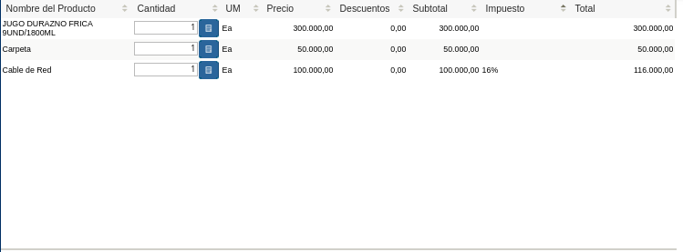

.. _ERPyA: http://erpya.com
.. |Menú de ADempiere| image:: resources/point-of-sale-menu.png
.. |Ventana Selecciona Terminal PDV| image:: resources/window-select-terminal-pdv.png
.. |Seleccionar Terminal PDV| image:: resources/select-terminal-pdv.png

.. |Icono Registro Nuevo de la Barra de Herramientas del Punto de Venta| image:: resources/new-record-icon.png
.. |Icono Imprimir de la Barra de Herramientas del Punto de Venta| image:: resources/print-icon.png
.. |Icono Imprimir de la Ventana Informe| image:: resources/report-window-print-icon.png
.. |Icono Tipo de Documento de la Barra de Herramientas del Punto de Venta| image:: resources/document-type-icon.png

.. |Icono Información de Producto de la Barra de Herramientas del Punto de Venta| image:: resources/product-information-icon.png

.. |Opción Cerrar Caja del Punto de Venta del Icono Proceso de la Barra de Herramientas del Punto de Venta| image:: resources/option-close-point-of-sale-box.png
.. |Opción Generar Factura Inmediata del Icono Proceso de la Barra de Herramientas del Punto de Venta| image:: resources/option-to-generate-immediate-invoice.png
.. |Opción Completar Orden Preparada del Icono Proceso de la Barra de Herramientas del Punto de Venta| image:: resources/option-to-complete-prepaid-order.png

.. |Opción Crear Retiro de POS del Icono Proceso de la Barra de Herramientas del Punto de Venta| image:: resources/option-to-create-pos-withdrawal.png
.. |Opción Imprimir del Icono Proceso de la Barra de Herramientas del Punto de Venta| image:: resources/print-option.png

.. |Icono Registros Históricos de la Barra de Herramientas del Punto de Venta| image:: resources/historical-records-icon.png

.. |Campo Documento Nro del Grupo de Campos Entrar Consulta de la Ventana Orden de Venta Desplegada por el Icono Registros Históricos| image:: resources/document-field-number-of-the-group-of-fields-enter-consultation-of-the-sales-order-window-displayed-by-the-historical-records-icon-of-the-point-of-sale-toolbar.png
.. |Campo Socio del Negocio del Grupo de Campos Entrar Consulta de la Ventana Orden de Venta Desplegada por el Icono Registros Históricos| image:: resources/business-partner-field-of-the-group-of-fields-enter-query-of-the-sales-order-window-displayed-by-the-historical-records-icon-of-the-point-of-sale-toolbar.png
.. |Campos Fecha Desde Hasta del Grupo de Campos Entrar Consulta de la Ventana Orden de Venta Desplegada por el Icono Registros Históricos| image:: resources/date-from-and-to-fields-of-the-group-of-fields-enter-query-of-the-sales-order-window-displayed-by-the-historical-records-icon-of-the-point-of-sale-toolbar.png
.. |Checklist Procesado del Grupo de Campos Entrar Consulta de la Ventana Orden de Venta Desplegada por el Icono Registros Históricos| image:: resources/processed-checklist-of-the-group-of-fields-enter-query-of-the-sales-order-window-displayed-by-the-historical-records-icon-of-the-point-of-sale-toolbar.png
.. |Checklist Vendedor de Pasillo del Grupo de Campos Entrar Consulta de la Ventana Orden de Venta Desplegada por el Icono Registros Históricos| image:: resources/aisle-vendor-checklist-of-the-group-of-fields-enter-query-of-the-sales-order-window-displayed-by-the-historical-records-icon-of-the-point-of-sale-toolbar.png

.. |Icono Registro Anterior de la Barra de Herramientas del Punto de Venta| image:: resources/previous-record-icon.png
.. |Icono Próximo Registro de la Barra de Herramientas del Punto de Venta| image:: resources/next-record-icon.png
.. |Icono Pago de la Barra de Herramientas del Punto de Venta| image:: resources/payment-icon.png
.. |Icono Cancel Order de la Barra de Herramientas del Punto de Venta| image:: resources/cancel-order-icon.png

.. |Carga de Productos en el Panel de Búsqueda de Productos| image:: resources/product-loading-by-search.png

.. |Icono Añadir de la Barra de Edición de Productos| image:: resources/add-icon.png
.. |Icono Menos de la Barra de Edición de Productos| image:: resources/minus-icon.png
.. |Icono Registro Anterior de la Barra de Edición de Productos| image:: resources/previous-record-icon-2.png
.. |Icono Próximo Registro de la Barra de Edición de Productos| image:: resources/next-record-icon-2.png
.. |Campo Cantidad Ordenada de la Barra de Edición de Productos| image:: resources/ordered-quantity-field.png
.. |Campo Precio Actual de la Barra de Edición de Productos| image:: resources/current-price-field.png
.. |Campo Descuentos de la Barra de Edición de Productos| image:: resources/discounts-field.png

.. |Columna Nombre del Producto| image:: resources/product-name-column.png
.. |Columna Cantidad Ordenada| image:: resources/column-quantity-ordered.png
.. |Columna Unidad de Medida| image:: resources/column-unit-of-measure.png
.. |Columna Precio Actual| image:: resources/current-price-column.png
.. |Columna Descuentos| image:: resources/discounts-column.png
.. |Columna Neto de Línea| image:: resources/line-net-column.png

.. |Grupo de Campos Información de Orden| image:: resources/field-group-order-information.png
.. |Campo Documento No| image:: resources/document-field-no.png
.. |Campo Tipo de Documento| image:: resources/document-type-field.png
.. |Campo Estado del Documento| image:: resources/document-status-field.png
.. |Campo Agente Comercial| image:: resources/commercial-agent-field.png

.. |Campo Fecha de la Orden| image:: resources/order-date-field.png

.. |Campo Impuesto| image:: resources/tax-field.png
.. |Campo Gran Total| image:: resources/grand-total-field.png
.. |Información del Socio del Negocio Cliente| image:: resources/client-business-partner-information.png
.. |Catálogo de Productos| image:: resources/product-catalog.png

.. _documento/interfaz-del-punto-de-venta:

**Interfaz de Punto de Venta**
==============================

Ubique y seleccione en el menú de ADempiere, la carpeta "**Gestión de Ventas**", luego seleccione la carpeta "**Órdenes de Venta**", por último seleccione la carpeta "**Punto de Venta**", finalmente seleccione la ventana "**Punto de Venta**".

    |Menú de ADempiere|

    Imagen 1. Menú de ADempiere

Podrá visualizar la ventana "**Selecciona Terminal PDV**", con la opción para seleccionar el terminal previamente configurado con el cual va a trabajar el vendedor.

    |Ventana Selecciona Terminal PDV|

    Imagen 2. Ventana Terminal PDV

Navegue entre las opciones disponibles en la ventana "**Selecciona Terminal PDV**", seleccionando el terminal correspondiente en el cual va a trabajar el vendedor.

    |Seleccionar Terminal PDV|

    Imagen 3. Seleccionar Terminal PDV

Seleccione la opción "**OK**", para acceder al punto de venta correspondiente al terminal PDV seleccionado.

    |Seleccionar la Opción OK|

    Imagen 4. Seleccionar la Opción OK

Podrá visualizar la ventana "**Punto de Venta**" con diferentes iconos, campos y opciones, que permiten el correcto funcionamiento del mismo. 
    
    |Ventana Punto de Venta|
        
    Imagen 5. Ventana Punto de Venta

.. _documento/paso-barra-de-herramientas:

**Barra de Herramientas del Punto de Venta**
--------------------------------------------

Contiene los iconos principales de las ventanas de ADempiere para realizar una gestión exitosa del punto de venta al momento de la venta de los productos. Dicha ventana cuenta con los siguientes iconos explicados a continuación.

    |Barra de Herramientas del Punto de Venta|

    Imagen 6. Barra de Herramientas del Punto de Venta

"**Icono Registro Nuevo**": Permite crear un nuevo registro de orden de venta en el punto de venta configurado para el vendedor, la forma más facil de realizar este proceso es por medio de la tecla de acceso directo "**F2**".

    |Icono Registro Nuevo de la Barra de Herramientas del Punto de Venta|

    Imagen 7. Icono Registro Nuevo de la Barra de Herramientas del Punto de Venta

"**Icono Imprimir**": Permite visualizar en la ventana "**Informe**", el reporte de la orden de venta que esta realizando, en la cual cuenta con diferentes opciones por medio de las cuales el usuario puede acercar, alejar, guardar e imprimir el documento de orden de venta creado en el punto de venta previmente configurado para el vendedor. Esta acción se puede ejecutar por medio de la tecla de acceso directo "**F12**".

    |Icono Imprimir de la Barra de Herramientas del Punto de Venta|

    Imagen 8. Icono Imprimir de la Barra de Herramientas del Punto de Venta

    Al generar el reporte, tendrá la posibilidad de imprimir la orden de venta seleccionando el icono "**Imprimir**", de la ventana "**Informe**".

        |Icono Imprimir de la Ventana Informe|

        Imagen 9. Icono Imprimir de la Ventana Informe

"**Icono Tipo de Documento**": Permite cambiar el tipo de documento cargado por defecto, el mismo define el comportamiento del documento que se esta generando y se encuentra explicado en el material **Tipo de Documento** elaborado por `ERPyA`_. Adicional a ello, se puede ejecutar esta acción seleccionando la tecla "**F10**".

    |Icono Tipo de Documento de la Barra de Herramientas del Punto de Venta|

    Imagen 10. Icono Tipo de Documento de la Barra de Herramientas del Punto de Venta

    La selección de este icono permite la visualización de la ventana "**Tipo de Documento**", para seleccionar el tipo de documento con el cual requiere generar el documento.

        |Ventana Tipo de Documento del Icono Tipo de Documento de la Barra de Herramientas del Punto de Venta|

        Imagen 11. Ventana Tipo de Documento del Icono Tipo de Documento de la Barra de Herramientas del Punto de Venta

"**Icono Información de Producto**": Permite realizar una búsqueda de los productos para consultar su información, en cuanto a categoría, código, nombre, UPC/EAN (código de barra), UM (unidad de medida), precios, disponibilidad, cantidad en existencia, cantidad reservada, cantidad ordenada y proveedor, por medio de la selección de los mismos en la ventana desplegada "**Información de Producto**". De igual manera, se puede ejecutar esta acción seleccionando la convinación de las teclas "**Alt+I**".

    |Icono Información de Producto de la Barra de Herramientas del Punto de Venta|

    Imagen 12. Icono Información de Producto de la Barra de Herramientas del Punto de Venta

    La selección de este icono permite la visualización de la ventana "**Información de Producto**", para buscar el producto con el cual requiere generar el documento.

    |Ventana Información de Producto del Icono Información de Producto de la Barra de Herramientas del Punto de Venta|

    Imagen 13. Ventana Información de Producto del Icono Información de Producto de la Barra de Herramientas del Punto de Venta

"**Icono Cliente**": Despliega una ventana que permite cambiar el cliente por defecto, con el fin de crear documentos personalizados. 

    |Icono Cliente de la Barra de Herramientas del Punto de Venta|

    Imagen 14. Icono Cliente de la Barra de Herramientas del Punto de Venta

    La selección de este icono permite la visualización de la ventana "**Socio del Negocio**", con diferentes campos que pueden ser utilizados como filtros de búsqueda de clientes ya registrados.

        |Ventana Socio del Negocio del Icono Cliente de la Barra de Herramientas del Punto de Venta|

        Imagen 15. Ventana Socio del Negocio del Icono Cliente de la Barra de Herramientas del Punto de Venta
    
    La información de los clientes puede ser visualizada debajo del grupo de campo "**Entrar Consulta**".
    
        |Información de los Clientes en la Ventana Socio del Negocio del Icono Cliente de la Barra de Herramientas del Punto de Venta|

        Imagen 16. Información de los Clientes en la Ventana Socio del Negocio del Icono Cliente de la Barra de Herramientas del Punto de Venta
    
    Adicional a ello, la ventana cuenta con seis (6) iconos que permiten el registro de un nuevo cliente, la modificación de los registros existentes, el borrado de la consulta o búsqueda realizada, la recarga de la ventana para que sean actualizados los registros, la aceptación del cliente seleccionado y la cancelación de la selección del cliente. Esta acción se puede ejecutar seleccionando la convinación de las teclas "**Alt+B**".

        |Iconos de la Ventana Socio del Negocio del Icono Cliente de la Barra de Herramientas del Punto de Venta|

        Imagen 17. Iconos de la Ventana Socio del Negocio del Icono Cliente de la Barra de Herramientas del Punto de Venta

"**Icono Proceso**": Permite realizar diversas acciones desde la selección de las diferentes opciones que contempla el menú de dicho icono. A continuación se explica cada una de las opciones del "**Icono Proceso**".

    |Icono Proceso de la Barra de Herramientas del Punto de Venta|

    Imagen 18. Icono Proceso de la Barra de Herramientas del Punto de Venta

    "**Opción Crear Retiro de POS**": Permite realizar un retiro detallado de los ingresos obtenidos en las ventas realizadas desde el punto de venta. Si requiere conocer el procedimiento que se debe realizar para ejecutar dicho proceso, puede consultar el material :ref:`documento/retiro-detallado-punto-de-venta`.

        |Opción Crear Retiro de POS del Icono Proceso de la Barra de Herramientas del Punto de Venta|

        Imagen 19. Opción Crear Retiro de POS del Icono Proceso de la Barra de Herramientas del Punto de Venta

    "**Opción Cerrar Caja del Punto de Venta**": Permite realizar el cierre de caja del punto de venta a través de la ventana de búsqueda inteligente "**Cierre del Punto de Ventas**". Si requiere conocer el procedimiento que se debe realizar para ejecutar dicho proceso, puede consultar el material :ref:`documento/cierre-de-caja-punto-de-venta`.

        |Opción Cerrar Caja del Punto de Venta del Icono Proceso de la Barra de Herramientas del Punto de Venta|

        Imagen 20. Cerrar Caja del Punto de Venta del Icono Proceso de la Barra de Herramientas del Punto de Venta

    "**Opción Generar Factura Inmediata**": Permite generar una factura desde el punto de venta. 

        |Opción Generar Factura Inmediata del Icono Proceso de la Barra de Herramientas del Punto de Venta|

        Imagen 21. Opción Generar Factura Inmediata del Icono Proceso de la Barra de Herramientas del Punto de Venta

    "**Opción Completar Orden Preparada**": Permite completar una orden preparada desde el punto de venta. Si requiere conocer el procedimiento que se debe realizar para ejecutar dicho proceso, puede consultar el material :ref:`documento/completar-orden-preparada`.

        |Opción Completar Orden Preparada del Icono Proceso de la Barra de Herramientas del Punto de Venta|

        Imagen 22. Opción Completar Orden Preparada del Icono Proceso de la Barra de Herramientas del Punto de Venta

    "**Opción Reversar Transacción de Venta**": Este proceso permite revertir la transaccion de venta. Si requiere conocer el procedimiento que se debe realizar para ejecutar dicho proceso, puede consultar el material :ref:`documento/anular-transacción-de-venta`.

        |Opción Reversar Transacción de Venta del Icono Proceso de la Barra de Herramientas del Punto de Venta|

        Imagen 23. Opción Reversar Transacción de Venta del Icono Proceso de la Barra de Herramientas del Punto de Venta

    "**Opción Imprimir**": Permite generar un reporte para visualizar la orden de venta que esta realizando en  el punto de venta. Dicho reporte es visualizado en la ventana "**Informe**". 

        |Opción Imprimir del Icono Proceso de la Barra de Herramientas del Punto de Venta|

        Imagen 24. Opción Imprimir del Icono Proceso de la Barra de Herramientas del Punto de Venta

    "**Copiar Registro Desde Orden**": Este proceso permite copiar las líneas de una orden de venta y partir de allí para realizar otras órdenes que involucran al mismo socio u otro diferente. Si requiere conocer el procedimiento que se debe realizar para ejecutar dicho proceso, puede consultar el material :ref:`documento/copiar-orden-desde-otra`.

    |opción copiar orden desde otra|

    Imagen 25. Opción Copiar Registro Desde Otra

"**Icono Registros Históricos**": Despliega una ventana que permite realizar una búsqueda de todas las órdenes de venta realizadas, según lo seleccionado en los campos o filtros de búsqueda de dicha desplegada por el icono "**Registros Históricos**". Esta acción se puede ejecutar seleccionando la tecla "**F9**".

    |Icono Registros Históricos de la Barra de Herramientas del Punto de Venta|

    Imagen 26. Icono Registros Históricos de la Barra de Herramientas del Punto de Venta

    La selección de este icono permite la visualización de la ventana "**Orden de Venta**", con diferentes campos que pueden ser utilizados como filtros de búsqueda de las órdenes ya registradas.

        |Ventana Orden de Venta Desplegada por el Icono Registros Históricos de la Barra de Herramientas del Punto de Venta|

        Imagen 27. Ventana Orden de Venta Desplegada por el Icono Registros Históricos de la Barra de Herramientas del Punto de Venta

    El grupo de campos "**Entrar Consulta**", permite filtrar la búsqueda de información de la siguiente manera:

        |Grupo de Campos Entrar Consulta de la Ventana Orden de Venta Desplegada por el Icono Registros Históricos|

        Imagen 28. Grupo de Campos Entrar Consulta de la Ventana Orden de Venta Desplegada por el Icono Registros Históricos

        - Se puede filtrar la información con ayuda del número de documento de la orden, ingresando en el mismo en el campo "**Documento No.**".

            |Campo Documento Nro del Grupo de Campos Entrar Consulta de la Ventana Orden de Venta Desplegada por el Icono Registros Históricos|

            Imagen 29. Campo Documento No. del Grupo de Campos Entrar Consulta de la Ventana Orden de Venta Desplegada por el Icono Registros Históricos

        - Se puede filtrar la información con ayuda del socio del negocio de la orden, ingresando en el mismo en el campo "**Socio del Negocio**".

            |Campo Socio del Negocio del Grupo de Campos Entrar Consulta de la Ventana Orden de Venta Desplegada por el Icono Registros Históricos|

            Imagen 30. Campo Socio del Negocio del Grupo de Campos Entrar Consulta de la Ventana Orden de Venta Desplegada por el Icono Registros Históricos

        - Se puede filtrar la información por rango de fecha, seleccionando el checklist "**Fecha**", para que se habiliten los campos "**Desde**" y "**Hasta**, e ingresando en dichos campos el rango de fecha para buscar la orden.

            |Campos Fecha Desde Hasta del Grupo de Campos Entrar Consulta de la Ventana Orden de Venta Desplegada por el Icono Registros Históricos|

            Imagen 31. Campos Fecha Desde Hasta del Grupo de Campos Entrar Consulta de la Ventana Orden de Venta Desplegada por el Icono Registros Históricos

        - Se puede filtrar la información por ordenes procesadas desde el punto de venta, seleccionando el checklist "**Procesado**".

            |Checklist Procesado del Grupo de Campos Entrar Consulta de la Ventana Orden de Venta Desplegada por el Icono Registros Históricos|

            Imagen 32. Checklist Procesado del Grupo de Campos Entrar Consulta de la Ventana Orden de Venta Desplegada por el Icono Registros Históricos

        - Se puede filtrar la información por las ordenes de venta realizadas por el socio del negocio tildado como vendedor de pasillo en la configuración del terminal, seleccionando el checklist "**Vendedor de Pasillo**".

            |Checklist Vendedor de Pasillo del Grupo de Campos Entrar Consulta de la Ventana Orden de Venta Desplegada por el Icono Registros Históricos|

            Imagen 33. Checklist Vendedor de Pasillo del Grupo de Campos Entrar Consulta de la Ventana Orden de Venta Desplegada por el Icono Registros Históricos

    Podrá visualizar el resultado de la búsqueda de las órdenes, debajo del grupo de campo "**Entrar Consulta**".

        |Resultado de Búsqueda de Registros Históricos|

        Imagen 34. Resultado de Búsqueda de Registros Históricos

    Adicional a ello, la ventana cuenta con seis (6) iconos que permiten un nuevo registro, la modificación de los registros existentes, el borrado de la consulta o búsqueda realizada, la recarga de la ventana para que sean actualizados los registros, la aceptación del registro seleccionado y la cancelación de la selección del registro.

        |Opciones de la Ventana Orden de Venta Desplegada por el Icono Registros Históricos|

        Imagen 35. Opciones de la Ventana Orden de Venta Desplegada por el Icono Registros Históricos

"**Icono Registro Anterior**": Es un icono de desplazamiento que permite navegar entre los registros que se encentran ubicados antes que el registro en el cual se encuentra el usuario. Esta acción se puede ejecutar seleccionando la convinación de las teclas "**Alt+Left**".

    |Icono Registro Anterior de la Barra de Herramientas del Punto de Venta|

    Imagen 36. Icono Registro Anterior de la Barra de Herramientas del Punto de Venta

"**Icono Próximo Registro**": Es un icono de desplazamiento que permite navegar entre los registros que se encentran ubicados despues que el registro en el cual se encuentra el usuario. Esta acción se puede ejecutar seleccionando la convinación de las teclas "**Alt+Right**".

    |Icono Próximo Registro de la Barra de Herramientas del Punto de Venta|

    Imagen 37. Icono Próximo Registro de la Barra de Herramientas del Punto de Venta

"**Icono Pago**": La selección de este icono permite ingresar los diferentes métodos de cobro utilizados en la venta. Esta acción se puede ejecutar seleccionando la tecla "**F4**". Para conocer el procedimiento regular para ingresar los diferentes métodos de cobro utilizados, puede consultar el material :ref:`documento/proceso-para-cobrar-pedido`.

    |Icono Pago de la Barra de Herramientas del Punto de Venta|

    Imagen 38. Icono Pago de la Barra de Herramientas del Punto de Venta

"**Icono Anular Orden**": Permite cancelar o anular la orden de venta que esta realizando el usuario vendedor, al seleccionar este icono dicha orden dejará de estar disponible. Esta acción se puede ejecutar seleccionando la tecla "**F3**".

    |Icono Cancel Order de la Barra de Herramientas del Punto de Venta|

    Imagen 39. Icono Cancel Order de la Barra de Herramientas del Punto de Venta

"**Icono Finalizar Ventana**": Permite cerrar la ventana "**Punto de Venta**" en la cual se encuentra el usuario vendedor. Esta acción se puede ejecutar seleccionando la convinación de las teclas "**Alt+L**".

    |Icono Finalizar Ventana de la Barra de Herramientas del Punto de Venta|

    Imagen 40. Icono Finalizar Ventana de la Barra de Herramientas del Punto de Venta

.. _documento/paso-panel-de-búsqueda-de-productos:

**Panel de Búsqueda de Productos**
----------------------------------

Permite realizar una búsqueda por código de producto, de todos los productos para la venta registrados en ADempiere que tengan coincidencia con lo que se introduzca en el campo "**Código**".

    |Carga de Productos en el Panel de Búsqueda de Productos|

    Imagen 41. Carga de Productos por Búsqueda

    .. note::

        Esta acción se ejecuta automáticamente al ingresar el código del producto en el campo "**Código**".

"**Coincidencia por Código de Producto**": Permite buscar el producto por el código de identificación del mismo.

"**Coincidencia por Nombre de Producto**": Permite buscar el producto por el nombre del mismo.

"**Coincidencia por Disponibilidad de Producto**": Muestra la disponibilidad del producto buscado.

"**Coincidencia por Precio Estándar de Producto**": Muestra el precio estándar del producto buscado.

"**Coincidencia por Precio de Lista de Producto**": Muestra el precio de lista del producto buscado.

    |Resultado de Búsqueda en el Panel de Búsqueda de Producto|

    Imagen 42. Resultado de Búsqueda en el Panel de Búsqueda de Producto

.. _documento/paso-sección-información-de-producto:

**Sección de Información de Producto**
--------------------------------------

Luego de incluir los productos a la orden de venta, se visualizará su información principal en la sección "**Información de Producto**" de la ventana "**Punto de Venta**".

    |Sección Información de Producto de la Ventana Punto de Venta|

    Imagen 43. Sección Información de Producto de la Ventana Punto de Venta

"**Código del Producto**": Muestra el código identificador del producto seleccionado.
    
    |Campo Código del Producto de la Sección Información de Producto de la Ventana Punto de Venta|

    Imagen 44. Campo Código del Producto de la Sección Información de Producto de la Ventana Punto de Venta

"**Precio del Producto**": Muestra los precios estándar y en lista de precios para la venta del producto seleccionado.

    |Campo Precio del Producto de la Sección Información de Producto de la Ventana Punto de Venta|

    Imagen 45. Campo Precio del Producto de la Sección Información de Producto de la Ventana Punto de Venta

"**Nombre del Producto**": Muestra el nombre del producto seleccionado.

    |Campo Nombre del Producto de la Sección Información de Producto de la Ventana Punto de Venta|

    Imagen 46. Campo Nombre del Producto de la Sección Información de Producto de la Ventana Punto de Venta

"**Unidad de Medida del Producto**": Muestra la unidad de medida en la que se presenta el producto seleccionado.

    |Campo Unidad de Medida del Producto de la Sección Información de Producto de la Ventana Punto de Venta|

    Imagen 47. Campo Unidad de Medida del Producto de la Sección Información de Producto de la Ventana Punto de Venta

"**Categoría del Producto**": Muestra la categoría a la que pertenece el producto seleccionado.

    |Campo Categoría del Producto de la Sección Información de Producto de la Ventana Punto de Venta|

    Imagen 48. Campo Categoría del Producto de la Sección Información de Producto de la Ventana Punto de Venta

"**Categoría del Impuesto del Producto**": Muestra la categoría del impuesto a la que pertenece el producto seleccionado.

    |Campo Categoría del Impuesto del Producto de la Sección Información de Producto de la Ventana Punto de Venta|

    Imagen 49. Campo Categoría del Impuesto del Producto de la Sección Información de Producto de la Ventana Punto de Venta

.. _documento/paso-barra-de-edición-de-productos:

**Barra de Edición de Productos**
---------------------------------

Contiene los campos para modificar la cantidad del producto a vender, el precio actual y el descuento del producto. Adicional a ello, contiene el icono para eliminar la línea de la orden donde se encuentra el producto, los iconos para sumar y restar la cantidad del producto a vender, los botones de navegación entre las líneas de la orden.

    |Barra de Edición de Productos de la Ventana Punto de Venta|

    Imagen 50. Barra de Edición de Productos de la Ventana Punto de Venta

"**Icono Borrar Línea**": Permite borrar el registro del producto creado en la línea seleccionada de la orden de venta. Esta acción se puede ejecutar seleccionando la convinación de las teclas "**Ctrl+F3**".

    |Icono Borrar Línea de la Barra de Edición de Productos|

    Imagen 51. Icono Borrar Línea de la Barra de Edición de Productos de la Ventana Punto de Venta

"**Icono Añadir**": Permite sumar a la cantidad ordenada del producto seleccionado, la cantidad ingresada en el campo "**Cantidad Ordenada**". Esta acción se puede ejecutar seleccionando la convinación de las teclas "**Ctrl+0**".

    |Icono Añadir de la Barra de Edición de Productos|

    Imagen 52. Icono Añadir de la Barra de Edición de Productos

"**Icono Menos**": Permite restar a la cantidad ordenada del producto seleccionado, la cantidad ingresada en el campo "**Cantidad Ordenada**". Esta acción se puede ejecutar seleccionando la convinación de las teclas "**Ctrl+0**".

    |Icono Menos de la Barra de Edición de Productos|

    Imagen 53. Icono Menos de la Barra de Edición de Productos

"**Icono Registro Anterior**": Es un icono de desplazamiento que permite navegar entre los registros que se encentran ubicados antes que el registro en el cual se encuentra el usuario. Esta acción se puede ejecutar seleccionando la convinación de las teclas "**Alt+Up**".

    |Icono Registro Anterior de la Barra de Edición de Productos|

    Imagen 54. Icono Registro Anterior de la Barra de Edición de Productos

"**Icono Próximo Registro**":  Es un icono de desplazamiento que permite navegar entre los registros que se encentran ubicados despues que el registro en el cual se encuentra el usuario. Esta acción se puede ejecutar seleccionando la convinación de las teclas "**Alt+Down**".

    |Icono Próximo Registro de la Barra de Edición de Productos|

    Imagen 55. Icono Próximo Registro de la Barra de Edición de Productos

"**Campo Cantidad Ordenada**": Corresponde a la cantidad de productos ordenados por el socio del negocio cliente, la misma puede modificarse desde los iconos "**Añadir**", "**Menos**" y "**Calculadora**", el último icono nombrado se encuentra ubicado del lado derecho del campo "**Cantidad Ordenada**".

    |Campo Cantidad Ordenada de la Barra de Edición de Productos|

    Imagen 56. Campo Cantidad Ordenada de la Barra de Edición de Productos

"**Campo Precio Actual**": Corresponde al precio unitario para la venta que tiene el producto seleccionado, el mismo puede ser modificado con ayuda del icono "**Calculadora**" que se encuentra ubicado del lado derecho del campo "**Precio Actual**".

    .. note::

        En la configuración realizada en el terminal del punto de venta, si el check "**Requiere PIN**" se encuentra activo, al cambiar los valores de este campo, ADempiere solicitará el código PIN del usuario supervisor de la caja. Para el presente ejemplo, dicho check no se encuentra activo.

    |Campo Precio Actual de la Barra de Edición de Productos|

    Imagen 57. Campo Precio Actual de la Barra de Edición de Productos

"**Campo Descuentos**": Corresponde al descuento que será aplicado al producto seleccionado al momento de la venta del mismo.

    .. note::

        En la configuración realizada en el terminal del punto de venta, si el check "**Requiere PIN**" se encuentra activo, al cambiar los valores de este campo, ADempiere solicitará el código PIN del usuario supervisor de la caja. Para el presente ejemplo, dicho check no se encuentra activo.

    |Campo Descuentos de la Barra de Edición de Productos|

    Imagen 58. Campo Descuentos de la Barra de Edición de Productos

.. _documento/paso-línea-de-la-orden-de-venta:

**Línea de la Orden de Venta**
------------------------------

Es el espacio establecido para el listado de los productos seleccionados o ingresados en la orden de venta, en el cual se detalla el nombre del producto, la cantidad ordenada, la unidad de medida del producto, el precio unitario, el descuento del mismo, el neto de la línea, el impuesto y el gran total de la cantidad ordenada del producto.

    |Grupo de Campos Línea de Productos|

    Imagen 59. Grupo de Campos Línea de Productos

    - "**Columna Nombre del Producto**": Columna en la cual se muestran los nombres de los productos agregados en las diferentes líneas de la orden de venta.

        |Columna Nombre del Producto|

        Imagen 60. Columna Nombre del Producto

    - "**Columna Cantidad Ordenada**": Columna en la cual se muestran las cantidades ordenadas de los productos agregados en las diferentes líneas de la orden de venta, las mismas pueden ser modificadas con ayuda del icono "**Calculadora**" ubicado del lado derecho del campo.

        |Columna Cantidad Ordenada|

        Imagen 61. Columna Cantidad Ordenada

    - "**Columna UM**": Columna en la cual se muestra la unidad de medida en la que se venderán los productos agregados en las diferentes líneas de la orden de venta.

        |Columna Unidad de Medida|

        Imagen 62. Columna Unidad de Medida

    - "**Columna Precio Actual**": Columna en la cual se muestra el precio unitario de los productos agregados en las diferentes líneas de la orden de venta.

        |Columna Precio Actual|

        Imagen 63. Columna Precio Actual

    - "**Columna Descuentos**": Columna en la cual se muestra el descuento de los productos agregados en las diferentes líneas de la orden de venta.

        |Columna Descuentos|

        Imagen 64. Columna Descuentos

    - "**Columna Neto de Línea**": Columna en la cual se muestra el monto total sin impuestos, de los productos agregados en las diferentes líneas la orden de venta.

        |Columna Neto de Línea|

        Imagen 65. Columna Neto de Línea

    - "**Columna Impuesto**": Columna en la cual se muestra el impuesto de las diferentes líneas de la orden de venta.

        |Columna Impuesto|

        Imagen 66. Columna Impuesto

    - "**Columna Gran Total**": Columna en la cual se muestra el monto total con impuestos, de las diferentes líneas de la orden de venta. 

        |Columna Gran Total|

        Imagen 67. Columna Gran Total

.. _documento/paso-información-de-la-orden:

**Información de la Orden**
---------------------------

Contiene la información relacionada al encabezado de la orden de venta que esta realizando el usuario vendedor.

    |Grupo de Campos Información de Orden|

    Imagen 68. Grupo de Campos Información de Orden

    - "**Documento No.**": Muestra el número de documento de la orden de venta que esta realizando el usuario vendedor. 

        |Campo Documento No|

        Imagen 69. Campo Documento No 

    - "**Tipo de Documento**": Muestra el tipo de documento con el cual fue creada la orden de venta desde el punto de venta.

        |Campo Tipo de Documento|

        Imagen 70. Campo Tipo de Documento

    - "**Estado del Documento**": Muestra el estado del documento en el que se encuentra la orden de venta que esta realizando el usuario vendedor.

        |Campo Estado del Documento|

        Imagen 71. Campo Estado del Documento

    - "**Agente Comercial**": Muestra el nombre y el apellido del usuario vendedor relacionado a la orden de venta.

        |Campo Agente Comercial|

        Imagen 72. Campo Agente Comercial

.. _documento/paso-totales-bs:

**Totales (Bs.S)**
------------------

Contiene la información detallada de los montos totales de la orden y la fecha de la creación de la misma.

    |Grupo de Campos Totales Bs.S|

    Imagen 73. Grupo de Campos Totales Bs.S 

    - "**Fecha de la Orden**": Muestra la fecha en la cual fue creada la orden de venta.

        |Campo Fecha de la Orden|

        Imagen 74. Campo Fecha de la Orden

    - "**Subtotal**": Muestra el total del pago sin impuestos de la orden de venta.

        |Campo Subtotal|

        Imagen 75. Campo Subtotal

    - "**Impuesto**": Muestra el total de impuestos de la orden de venta.

        |Campo Impuesto|

        Imagen 76. Campo Impuesto

    - "**Gran Total**": Muestra el total a pagar por el cliente, el mismo se compone de la sumatoria del monto del subtotal más el monto del impuesto.

        |Campo Gran Total|

        Imagen 77. Campo Gran Total

.. _documento/paso-panel-de-búsqueda-de-socio-cliente:

**Panel de Socio del Negocio Cliente**
--------------------------------------

Muestra la información del socio del negocio cliente que esta comprando los productos ingresados al documento "**Orden de Venta**" realizada por el usuario vendedor.

    |Información del Socio del Negocio Cliente|

    Imagen 78. Información del Socio del Negocio Cliente

.. _documento/paso-catálogo-de-productos:

**Catálogo de Productos**
-------------------------

Permite que los productos sean cargados a la orden de venta mediante la selección de los mismos. El catálogo de productos se puede configurar de manera que los mismos se agrupen por categoría, combos u ofertas, permitiendo un mejor orden y ubicación al momento de cargarlos a la orden de venta. Adicional a ello, el catálogo de productos se puede configurar de manera sencilla, sin agrupacipón, combos u ofertas.

    |Catálogo de Productos|

    Imagen 79. Catálogo de Productos

    - **Uso del Catálogo de Productos Agrupado**

        Para agregar un producto a las líneas de la orden desde el punto de venta mediante el catálogo de productos, se debe seleccionar la categoría o grupo al que pertenece dicho producto.

            |selección de categoría o grupo de productos|

            Imagen 80. Selección de Categoría o Grupo de Producto

        Luego debe seleccionar el recuadro con la opción del producto que requiere cargar a las líneas de la orden.

            |selección de producto desde categoría o grupo|

            Imagen 81. Selección de Producto

        Podrá visualizar el producto cargado de la siguiente manera.

            |producto cargado desde categoría o grupo|

            Imagen 82. Producto Cargado

        Para regresar al menú principal del catálogo de productos, seleccione el recuadro con la opción "**Regresar**".

            |opción regresar de categoría o grupo|

            Imagen 83. Opción Regresar
 
