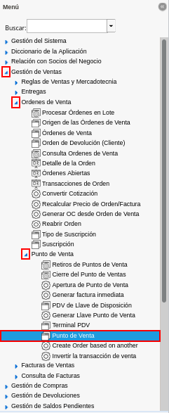
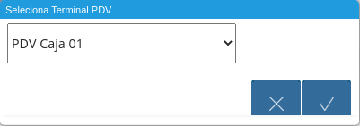
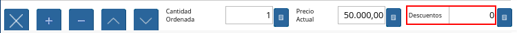
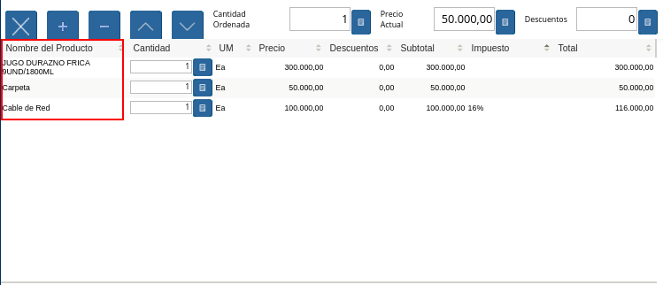

.. _ERPyA: http://erpya.com

.. |Seleccionar la Opción OK| image:: resources/select-the-ok-option-from-the-window-select-terminal-pdv.png
.. |Ventana Punto de Venta| image:: resources/point-of-sale-window.png
.. |Icono Registro Nuevo| image:: resources/new-record-icon.png

.. |Icono Cliente| image:: resources/customer-icon.png
.. |Icono Proceso| image:: resources/process-icon.png
.. |Opción Cerrar Caja del Punto de Venta| image:: resources/option-close-point-of-sale-box.png

.. |Opción Anular Transacción de Venta| image:: resources/option-to-cancel-sale-transaction.png

.. |Opción Imprimir| image:: resources/print-option.png

.. |Icono Finalizar Ventana| image:: resources/end-window-icon.png
.. |Icono Borrar Línea| image:: resources/delete-line-icon.png

.. |Campo Tipo de Documento| image:: resources/document-type-field.png
.. |Campo Estado del Documento| image:: resources/document-status-field.png

.. |Grupo de Campos Totales Bs.S| image:: resources/bs-s-total-field-group.png

.. |Campo Subtotal| image:: resources/subtotal-field.png

.. |Campo Gran Total| image:: resources/grand-total-field.png

.. |Campo Precio Actual| image:: resources/current-price-field.png

.. |Grupo de Campos Línea de Productos| image:: resources/group-of-fields-product-line.png
.. |Icono Eliminar Línea| image:: resources/delete-line-icon.png

.. |Columna Cantidad Ordenada| image:: resources/column-quantity-ordered.png

.. |Columna Impuesto| image:: resources/tax-column.png
.. |Columna Gran Total| image:: resources/grand-total-column.png

.. |Catálogo de Productos| image:: resources/product-catalog.png

.. _documento/interfaz-del-punto-de-venta:

**Interfaz de Punto de Venta**
==============================

#. Ubique y seleccione en el menú de ADempiere, la carpeta "**Gestión de Ventas**", luego seleccione la carpeta "**Órdenes de Venta**", por último seleccione la carpeta "**Punto de Venta**", finalmente seleccione la ventana "**Punto de Venta**".

    |Menú de ADempiere|

    Imagen 1. Menú de ADempiere

#. Podrá visualizar la ventana "**Selecciona Terminal PDV**", con la opción para seleccionar el terminal previamente configurado con el cual va a trabajar el vendedor.

    |Ventana Selecciona Terminal PDV|

    Imagen 2. Ventana Terminal PDV

#. Navegue entre las opciones disponibles en la ventana "**Selecciona Terminal PDV**", seleccionando el terminal correspondiente en el cual va a trabajar el vendedor.

    |Seleccionar Terminal PDV|

    Imagen 3. Seleccionar Terminal PDV

#. Seleccione la opción "**OK**", para acceder al punto de venta correspondiente al terminal PDV seleccionado.

    |Seleccionar la Opción OK|

    Imagen 4. Seleccionar la Opción OK

    #. Podrá visualizar la ventana "**Punto de Venta**" con diferentes iconos, campos y opciones, que permiten el correcto funcionamiento del mismo. 
    
        |Ventana Punto de Venta|
        
        Imagen 5. Ventana Punto de Venta
        
    #. La ventana "**Punto de Venta**", cuenta con los siguientes iconos explicados a continuación de manera detallada.

        - "**Registro Nuevo**": Permite crear un nuevo registro de orden de venta en el punto de venta configurado para el vendedor, la forma más facil de realizar este proceso es por medio de la tecla de acceso directo "**F2**".

            |Icono Registro Nuevo|

            Imagen 6. Icono Registro Nuevo

        - "**Imprimir**": Permite visualizar en una ventana diferente a la ventana "**Punto de Venta**", el reporte de la orden de venta que esta realizando con diferentes opciones por medio de las cuales el usuario puede acercar, alejar, guardar e imprimir el documento de orden de venta creado en el punto de venta previmente configurado para el vendedor. Esta acción se puede ejecutar por medio de la tecla de acceso directo "**F12**".

            |Icono Imprimir|

            Imagen 7. Icono Imprimir

        - "**Tipo de Documento**": Permite cambiar el tipo de documento cargado por defecto, el mismo define el comportamiento del documento que se esta generando y se encuentra explicado en el material :ref:`documento/tipo-documento` elaborado por `ERPyA`_. Adicional a ello, se puede ejecutar esta acción seleccionando la tecla "**F10**".

            |Icono Tipo de Documento|

            Imagen 8. Icono Tipo de Documento

        - "**Información de Producto**": Permite agregar los productos a la orden de venta que se esta realizando, por medio de la selección de los mismos en la ventana desplegada "**Información de Producto**". De igual manera, se puede ejecutar esta acción seleccionando la convinación de las teclas "**Alt+I**".

            |Icono Información de Producto|

            Imagen 9. Icono Información de Producto

        - "**Cliente**": Despliega una ventana que permite cambiar el cliente por defecto, con el fin de crear documentos personalizados. La selección de este icono permite la visualización de la ventana "**Socio del Negocio**", con diferentes campos que pueden ser utilizados como filtros de búsqueda de clientes ya registrados, la información de los mismos puede ser visualizada debajo del grupo de campo "**Entrar Consulta**". Adicional a ello, la ventana cuenta con seis (6) iconos que permiten el registro de un nuevo cliente, la modificación de los registros existentes, el borrado de la consulta o búsqueda realizada, la recarga de la ventana para que sean actualizados los registros, la aceptación del cliente seleccionado y la cancelación de la selección del cliente. Esta acción se puede ejecutar seleccionando la convinación de las teclas "**Alt+B**".

            |Icono Cliente|

            Imagen 10. Icono Cliente

        - "**Proceso**": Permite realizar diversas acciones desde la selección de las diferentes opciones que contempla el menú del icono. A continuación se explica cada una.

            |Icono Proceso|

            Imagen 11. Icono Proceso

            - "**Cerrar Caja Cerrar Caja del Punto de Venta**": Permite realizar el cierre del punto de venta a través de la ventana de búsqueda inteligente "**Cierre del Punto de Ventas**".

                |Opción Cerrar Caja del Punto de Venta|

                Imagen 12. Cerrar Caja del Punto de Venta

            - "**Generate Inmediate Invoice**":

                |Opción Generate Inmediate Invoice|

                Imagen 13. Opción Generate Inmediate Invoice

            - "**Completar Orden Prepagada**":

                |Opción Completar Orden Prepagada|

                Imagen 14. Opción Completar Orden Prepagada

            - "**Anular Transacción de Venta**": Este proceso permite revertir la transaccion de venta

                |Opción Anular Transacción de Venta|

                Imagen 15. Opción Anular Transacción de Venta

            - "**Crear Retiro de POS**":

                |Opción Crear Retiro de POS|

                Imagen 16. Opción Crear Retiro de POS 

            - "**&Imprimir**":

                |Opción Imprimir|

                Imagen 17. Opción &Imprimir

            - "**Crear Nueva Orden de Devolución**":

                |Opción Crear Nueva Orden de Devolución|

                Imagen 18. Opción Crear Nueva Orden de Devolución

        - "**Registros Históricos**": Permite realizar una búsqueda de todas las órdenes de venta realizadas, según lo seleccionado en los campos o filtros de búsqueda de la ventana "**Orden de Venta**" desplegada por el icono "**Registros Históricos**". Esta acción se puede ejecutar seleccionando la tecla "**F9**".

            |Icono Registros Históricos|

            Imagen 19. Icono Registros Históricos

        - "**Registro Anterior**": Es un icono de desplazamiento que permite navegar entre los registros que se encentran ubicados antes que el registro en el cual se encuentra el usuario. Esta acción se puede ejecutar seleccionando la convinación de las teclas "**Alt+Left**".

            |Icono Registro Anterior|

            Imagen 20. Icono Registro Anterior

        - "**Próximo Registro**": Es un icono de desplazamiento que permite navegar entre los registros que se encentran ubicados despues que el registro en el cual se encuentra el usuario. Esta acción se puede ejecutar seleccionando la convinación de las teclas "**Alt+Right**".

            |Icono Próximo Registro|

            Imagen 21. Icono Próximo Registro

        - "**Pago**": Esta acción se puede ejecutar seleccionando la tecla "**F4**".

            |Icono Pago|

            Imagen 22. Icono Pago

        - "**Anular Orden**": Permite cancelar o anular la orden de venta que esta realizando el usuario vendedor, al seleccionar este icono dicha orden dejará de estar disponible. Esta acción se puede ejecutar seleccionando la tecla "**F3**".

            |Icono Cancel Order|

            Imagen 23. Icono Cancel Order 

        - "**Finalizar Ventana**": Permite cerrar la ventana "**Punto de Venta**" en la cual se encuentra el usuario vendedor. Esta acción se puede ejecutar seleccionando la convinación de las teclas "**Alt+L**".

            |Icono Finalizar Ventana|

            Imagen 24. Icono Finalizar Ventana 
            
        - "**Borrar Línea**": Permite borrar el registro del producto creado en la línea seleccionada de la orden de venta. Esta acción se puede ejecutar seleccionando la convinación de las teclas "**Ctrl+F3**".

            |Icono Borrar Línea|

            Imagen 25. Icono Borrar Línea

        - "**Añadir**": Permite sumar a la cantidad ordenada del producto seleccionado, la cantidad ingresada en el campo "**Cantidad Ordenada**". Esta acción se puede ejecutar seleccionando la convinación de las teclas "**Ctrl+0**".

            |Icono Añadir|

            Imagen 26. Icono Añadir

        - "**Menos**": Permite restar a la cantidad ordenada del producto seleccionado, la cantidad ingresada en el campo "**Cantidad Ordenada**". Esta acción se puede ejecutar seleccionando la convinación de las teclas "**Ctrl+0**".

            |Icono Menos|

            Imagen 27. Icono Menos

        - "**Registro Anterior**": Es un icono de desplazamiento que permite navegar entre los registros que se encentran ubicados antes que el registro en el cual se encuentra el usuario. Esta acción se puede ejecutar seleccionando la convinación de las teclas "**Alt+Up**".

            |Icono Registro Anterior 2|

            Imagen 28. Icono Registro Anterior

        - "**Próximo Registro**":  Es un icono de desplazamiento que permite navegar entre los registros que se encentran ubicados despues que el registro en el cual se encuentra el usuario. Esta acción se puede ejecutar seleccionando la convinación de las teclas "**Alt+Down**".

            |Icono Próximo Registro 2|

            Imagen 29. Icono Próximo Registro

    #. Adicional a ello, la ventana "**Punto de Venta**", cuenta con los siguientes campos explicados de forma detallada.

        - "**Grupo de Campos Información de Orden**": Contiene la información relacionada al encabezado de la orden de venta que esta realizando el usuario vendedor.

            |Grupo de Campos Información de Orden|

            Imagen 30. Grupo de Campos Información de Orden

            - "**Documento No.**": Muestra el número de documento de la orden de venta que esta realizando el usuario vendedor. 

                |Campo Documento No|

                Imagen 31. Campo Documento No 

            - "**Tipo de Documento**": Muestra el tipo de documento con el cual fue creada la orden de venta desde el punto de venta.

                |Campo Tipo de Documento|

                Imagen 32. Campo Tipo de Documento

            - "**Estado del Documento**": Muestra el estado del documento en el que se encuentra la orden de venta que esta realizando el usuario vendedor.

                |Campo Estado del Documento|

                Imagen 33. Campo Estado del Documento

            - "**Agente Comercial**": Muestra el nombre y el apellido del usuario vendedor relacionado a la orden de venta.

                |Campo Agente Comercial|

                Imagen 34. Campo Agente Comercial

        - "**Grupo de Campos Totales (Bs.S)**": Contiene la información detallada de los montos totales de la orden y la fecha de la creación de la misma.

            |Grupo de Campos Totales Bs.S|

            Imagen 35. Grupo de Campos Totales Bs.S 

            - "**Fecha de la Orden**": Muestra la fecha en la cual fue creada la orden de venta.

                |Campo Fecha de la Orden|

                Imagen 36. Campo Fecha de la Orden

            - "**Subtotal**": Muestra el total del pago sin impuestos de la orden de venta.

                |Campo Subtotal|

                Imagen 37. Campo Subtotal

            - "**Impuesto**": Muestra el total de impuestos de la orden de venta.

                |Campo Impuesto|

                Imagen 38. Campo Impuesto

            - "**Gran Total**": Muestra el total a pagar por el cliente, el mismo se compone de la sumatoria del monto del subtotal más el monto del impuesto.

                |Campo Gran Total|

                Imagen 39. Campo Gran Total

        - "**Información del Socio del Negocio Cliente**": Muestra la información del socio del negocio cliente que esta comprando los productos ingresados al documento "**Orden de Venta**" realizada por el usuario vendedor.

            |Información del Socio del Negocio Cliente|

            Imagen 40. Información del Socio del Negocio Cliente

        - "**Cantidad Ordenada**": Corresponde a la cantidad de productos ordenados por el socio del negocio cliente, la misma puede modificarse desde los iconos "**Añadir**", "**Menos**" y "**Calculadora**", el último icono nombrado se encuentra ubicado del lado derecho del campo "**Cantidad Ordenada**".

            |Campo Cantidad Ordenada|

            Imagen 41. Campo Cantidad Ordenada

        - "**Precio Actual**": Corresponde al precio unitario para la venta que tiene el producto seleccionado, el mismo puede ser modificado con ayuda del icono "**Calculadora**" que se encuentra ubicado del lado derecho del campo "**Precio Actual**".

            |Campo Precio Actual|

            Imagen 42. Campo Precio Actual

        - "**Descuentos**": Corresponde al descuento que será aplicado al producto seleccionado al momento de la venta del mismo.

            |Campo Descuentos|

            Imagen 43. Campo Descuentos

        - "**Línea de Productos**": Es el espacio establecido para el listado de los productos seleccionados o ingresados en la orden de venta, en el cual se detalla el nombre del producto, la cantidad ordenada, la unidad de medida del producto, el precio unitario, el descuento del mismo, el neto de la línea, el impuesto y el gran total de la cantidad ordenada del producto.

            |Grupo de Campos Línea de Productos|

            Imagen 44. Grupo de Campos Línea de Productos

            - "**Icono Eliminar Línea**": Permite borrar el registro de la línea de la orden de venta.

                |Icono Eliminar Línea|

                Imagen 45. Icono Eliminar Línea

            - "**Columna Nombre del Producto**": Columna en la cual se muestran los nombres de los productos agregados en las diferentes líneas de la orden de venta.

                |Columna Nombre del Producto|

                Imagen 46. Columna Nombre del Producto

            - "**Columna Cantidad Ordenada**": Columna en la cual se muestran las cantidades ordenadas de los productos agregados en las diferentes líneas de la orden de venta, las mismas pueden ser modificadas con ayuda del icono "**Calculadora**" ubicado del lado derecho del campo.

                |Columna Cantidad Ordenada|

                Imagen 47. Columna Cantidad Ordenada

            - "**Columna UM**": Columna en la cual se muestra la unidad de medida en la que se venderán los productos agregados en las diferentes líneas de la orden de venta.

                |Columna Unidad de Medida|

                Imagen 48. Columna Unidad de Medida

            - "**Columna Precio Actual**": Columna en la cual se muestra el precio unitario de los productos agregados en las diferentes líneas de la orden de venta.

                |Columna Precio Actual|

                Imagen 49. Columna Precio Actual

            - "**Columna Descuentos**": Columna en la cual se muestra el descuento de los productos agregados en las diferentes líneas de la orden de venta.

                |Columna Descuentos|

                Imagen 50. Columna Descuentos

            - "**Columna Neto de Línea**": Columna en la cual se muestra el monto total sin impuestos, de los productos agregados en las diferentes líneas la orden de venta.

                |Columna Neto de Línea|

                Imagen 51. Columna Neto de Línea

            - "**Columna Impuesto**": Columna en la cual se muestra el impuesto de las diferentes líneas de la orden de venta.

                |Columna Impuesto|

                Imagen 52. Columna Impuesto

            - "**Columna Gran Total**": Columna en la cual se muestra el monto total con impuestos, de las diferentes líneas de la orden de venta. 

                |Columna Gran Total|

                Imagen 53. Columna Gran Total

    #. Finalmente, la ventana "**Punto de Venta**", cuenta con las siguientes opciones explicadas a continuación.

        - "**Carga de Productos por Búsqueda**": Permite realizar una búsqueda por código de producto, de todos los productos para la venta registrados en ADempiere que tengan coincidencia con lo que se introduzca en el campo "**Producto**". Esta acción se ejecuta automáticamente al ingresar el código del producto en el campo "**Código**".

            |Carga de Productos por Búsqueda|

            Imagen 54. Carga de Productos por Búsqueda

        - "**Catálogo de Productos**": Permite que los productos sean cargados a la orden de venta mediante la selección de los mismos.

            |Catálogo de Productos|

            Imagen 55. Catálogo de Productos
