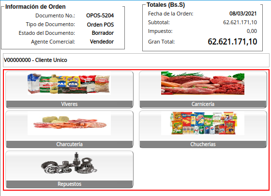

.. _ERPyA: http://erpya.com
.. |Menú de ADempiere| image:: resources/point-of-sale-menu.png
.. |ventana órdenes de venta del punto de venta| image:: resources/point-of-sale-sales-orders-window.png
.. |selección de formulario punto de venta| image:: resources/point-of-sale-form-selection.png
.. |ventana del formulario punto de venta| image:: resources/point-of-sale-form-window.png
.. |panel de socio de negocios| image:: resources/business-partner-panel.png
.. |icono buscar socio de negocios del formulario punto de venta| image:: resources/search-point-of-sale-form-business-partner-icon.png
.. |ventana de búsqueda de socios del negocio| image:: resources/business-partner-search-window.png
.. |campo de la ventana de búsqueda de socios del negocio| image:: resources/business-partner-search-window-field.png
.. |campo nombre de la ventana de búsqueda de socios del negocio| image:: resources/business-partner-search-window-name-field.png
.. |campo nombre dos de la ventana de búsqueda de socios del negocio| image:: resources/name-field-two-of-the-business-partner-search-window.png
.. |campo email de la ventana de búsqueda de socios del negocio| image:: resources/email-field-of-the-business-partner-search-window.png
.. |campo código postal de la ventana de búsqueda de socios del negocio| image:: resources/zip-code-field-of-the-business-partner-search-window.png
.. |campo teléfono de la ventana de búsqueda de socios del negocio| image:: resources/phone-field-of-the-business-partner-search-window.png
.. |resultado de búsqueda de información de socios del negocio| image:: resources/business-partner-information-search-result.png
.. |cliente desde icono buscar| image:: resources/client-from-search-icon.png
.. |búsqueda de socio por el campo socio del negocio| image:: resources/partner-search-by-business-partner-field.png
.. |cliente desde campo socio del negocio| image:: resources/customer-from-business-partner-field.png
.. |icono más para registro de socio del negocio| image:: resources/plus-icon-for-business-partner-registration.png
.. |ventana de registro de socio del negocio| image:: resources/business-partner-registration-window.png
.. |campo código del registro nuevo del cliente| image:: resources/code-field-of-the-new-customer-record.png
.. |campo nombre del registro nuevo del cliente| image:: resources/name field-of-the-new-customer-record.png
.. |campo nombre dos del registro nuevo del cliente| image:: resources/field-name-two-of-the-new-customer-record.png
.. |campo email del registro nuevo del cliente| image:: resources/email-field-of-the-new-customer-record.png
.. |campo teléfono del registro nuevo del cliente| image:: resources/phone-field-of-the-new-customer-record.png
.. |campo localización del registro nuevo del cliente| image:: resources/field-location-of-the-new-customer-record.png
.. |campo pais de localización del registro nuevo del cliente| image:: resources/country-field-of-location-of-the-new-customer-record.png
.. |campo región de localización del registro nuevo del cliente| image:: resources/location-region-field-of-the-new-customer-record.png
.. |campo ciudad de localización del registro nuevo del cliente| image:: resources/field-city-where-the-new-customer-record-is-located.png
.. |campo dirección uno de localización del registro nuevo del cliente| image:: resources/address-field-one-of-location-of-the-new-customer-record.png
.. |campo dirección dos de localización del registro nuevo del cliente| image:: resources/address-field-two-for-the-location-of-the-new-customer-record.png
.. |campo dirección tres de localización del registro nuevo del cliente| image:: resources/address-field-three-for-location-of-new-customer-record.png
.. |campo dirección cuatro de localización del registro nuevo del cliente| image:: resources/address-field-four-for-location-of-new-customer-record.png
.. |campo código postal de localización del registro nuevo del cliente| image:: resources/zip-code-field-of-location-of-the-new-customer-record.png
.. |opción cancelar del registro nuevo del cliente| image:: resources/cancel-option-from-new-customer-registration.png
.. |opción ok del registro nuevo del cliente| image:: resources/ok-option-of-the-new-customer-record.png
.. |cliente desde registro nuevo de socio del negocio| image:: resources/customer-from-new-business-partner-record.png
.. |panel de búsqueda de productos| image:: resources/product-search-panel.png
.. |resultado de búsqueda del producto del panel| image:: resources/dashboard-product-search-result.png
.. |icono buscar productos| image:: resources/search-products-icon.png
.. |resultado de búsqueda de productos por icono| image:: resources/product-search-result-by-icon.png
.. |resultado de búsqueda del producto del icono buscar| image:: resources/search-icon-product-search-result.png
.. |icono menor que del formulario punto de venta| image:: resources/icon-smaller-than-point-of-sale-form.png

.. |selección de categoría de producto| image:: resources/product-category-selection.png
.. |selección de producto en categoría| image:: resources/product-selection-in-category.png
.. |producto cargado desde catálogo de productos| image:: resources/product-loaded-from-product-catalog.png
.. |ocultar catálogo de productos| image:: resources/hide-product-catalog.png

.. _documento/interfaz-del-punto-de-venta:

**Interfaz de Punto de Venta**
==============================

#. Ubique y seleccione en el menú de ADempiere, la carpeta "**Gestión de Ventas**", luego seleccione la carpeta "**Órdenes de Venta**".

    |Menú de ADempiere|

    Imagen 1. Menú de ADempiere

#. Podrá visualizar la carpeta "**Órdenes de Venta**", con la ventana "**Órdenes de Venta**", que permite crear y modificar las mismas. Adicional a ello, también contiene la carpeta "**Punto de Venta**", con el formulario del punto de venta y el smart browser de cierre de caja.

    |ventana órdenes de venta del punto de venta|

    Imagen 2. Ventana Órdenes de Venta

#. Seleccione el formulario "**Punto de Venta**" que se encuentra dentro de la carpeta "**Punto de Ventas**".

    |selección de formulario punto de venta|

    Imagen 3. Selección de Formulario Punto de Venta

#. Podrá visualizar la ventana del formulario "**Punto de Venta**", con diferentes campos que permiten registrar en ADempiere de manera fácil y sencilla, la venta de los productos.

    |ventana del formulario punto de venta|

    Imagen 4. Ventana del Formulario Punto de Venta

.. _documento/paso-panel-de-socio-de-negocios:

**Panel de Socio de Negocios**
------------------------------

Permite realizar una búsqueda detallada de todos los socios del negocio registrados en ADempiere, que tengan coincidencia con lo que se introduzca en los campos o filtros de búsqueda. De igual manera, permite registrar en ADempiere, los socios del negocio.

    |panel de socio de negocios|

    Imagen 5. Panel de Socio de Negocios

.. note::

    La acción de búsqueda se ejecuta automáticamente al ingresar el valor en el campo o filtro de búsqueda.

**Búsqueda de Socio del Negocio**
*********************************

Para buscar un socio del negocio desde el formulario del punto de venta, se debe realizar el siguiente procedimiento.

#. Seleccione el icono "**Buscar**", ubicado en la parte superior del campo "**Socio de Negocios**".

    |icono buscar socio de negocios del formulario punto de venta|

    Imagen 6. Icono Buscar

    #. Podrá visualizar la ventana "**Socios del Negocio**", con diferentes campos que permiten filtrar la búsqueda del socio dependiendo de la información ingresada en los mismos.

        |ventana de búsqueda de socios del negocio|

        Imagen 7. Ventana de búsqueda de Socios del Negocio

    #. Introduzca en el campo "**Código**", el número de identificación del socio del negocio por el cual requiere filtrar la búsqueda.

        |campo de la ventana de búsqueda de socios del negocio|

        Imagen 8. Campo Código

    #. Introduzca en el campo "**Nombre**", el nombre del socio del negocio por el cual requiere filtrar la búsqueda.

        |campo nombre de la ventana de búsqueda de socios del negocio|

        Imagen 9. Campo Nombre

    #. Introduzca en el campo "**Nombre 2**", el apellido o el segundo nombre del socio del negocio por el cual requiere filtrar la búsqueda.

        |campo nombre dos de la ventana de búsqueda de socios del negocio|

        Imagen 10. Campo Nombre 2

    #. Introduzca en el campo "**Email**", la dirección de correo electrónico del socio del negocio por el cual requiere filtrar la búsqueda.

        |campo email de la ventana de búsqueda de socios del negocio|

        Imagen 11. Campo Email

    #. Introduzca en el campo "**Código Postal**", el código postal del socio del negocio por el cual requiere filtrar la búsqueda.

        |campo código postal de la ventana de búsqueda de socios del negocio|

        Imagen 12. Campo Código Postal

    #. Introduzca en el campo "**Teléfono**", el número de teléfono del socio del negocio por el cual requiere filtrar la búsqueda.

        |campo teléfono de la ventana de búsqueda de socios del negocio|

        Imagen 13. Campo Teléfono

    #. La búsqueda de información del socio del negocio es visualizada en la parte inferior de la ventana, debajo de los campos o filtros de búsqueda. Esta información puede variar, dependiendo de los valores ingresados en dichos campos o filtros de búsqueda.

        |resultado de búsqueda de información de socios del negocio|

        Imagen 14. Resultado de Búsqueda

    #. Al seleccionar el socio del negocio, este se carga a la orden de venta como cliente de dicha venta.

        |cliente desde icono buscar|

        Imagen 15. Cliente desde Icono Buscar

#. Adicional a ello, también se puede buscar el registro de un socio del negocio desde el formulario "**Punto de Venta**", ingresando en el campo "**Socio de Negocios**", el número de identificación, nombre o apellido del mismo.

    |búsqueda de socio por el campo socio del negocio|

    Imagen 16. Búsqueda por el campo Socio de Negocios

    #. Al seleccionar el socio del negocio, este se carga a la orden de venta como cliente de dicha venta.

        |cliente desde campo socio del negocio|

        Imagen 17. Cliente desde Campo Socio del Negocio

**Registro de Socio del Negocio**
*********************************

Para registrar un socio del negocio desde el formulario del punto de venta, se debe realizar el siguiente procedimiento.

#. Seleccione el icono "**Más**", ubicado en la parte superior del campo "**Socio de Negocios**".

    |icono más para registro de socio del negocio|

    Imagen 18. Icono Más

#. Podrá visualizar la ventana de registro del socio del negocio, con diferentes campos que permiten realizar un regitro rápido y sencillo del cliente.

    |ventana de registro de socio del negocio|

    Imagen 19. Ventana de Registro de Socio del Negocio

#. Introduzca en el campo "**Código**", el número de identificación del socio del negocio que se encuentra registrando.

    |campo código del registro nuevo del cliente|

    Imagen 20. Campo Código

#. Introduzca en el campo "**Nombre**", el nombre del socio del negocio que se encuentra registrando.

    |campo nombre del registro nuevo del cliente|

    Imagen 21. Campo Nombre

#. Introduzca en el campo "**Nombre 2**", el apellido o segundo nombre del socio del negocio que se encuentra registrando.

    |campo nombre dos del registro nuevo del cliente|

    Imagen 22. Campo Nombre 2

#. Introduzca en el campo "**Email**", el correo electrónico del socio del negocio que se encuentra registrando.

    |campo email del registro nuevo del cliente|

    Imagen 23. Campo Email 

#. Introduzca en el campo "**Teléfono**", el número de teléfono del socio del negocio que se encuentra registrando.

    |campo teléfono del registro nuevo del cliente|

    Imagen 24. Campo Teléfono

#. Seleccione el campo "**Localización/Dirección**", para que sean desplegados los campos necesarios para registrar la dirección del socio del negocio.

    |campo localización del registro nuevo del cliente|

    Imagen 25. Campo Localización / Dirección

    #. Seleccione en el campo "**País**", el país de localización del socio del negocio que se encuentra registrando.

        |campo pais de localización del registro nuevo del cliente|

        Imagen 26. Campo País 

    #. Seleccione en el campo "**Región**", la región de localización del socio del negocio que se encuentra registrando.

        |campo región de localización del registro nuevo del cliente|

        Imagen 27. Campo Región 

    #. Seleccione en el campo "**Ciudad**", la ciudad de localización del socio del negocio que se encuentra registrando.

        |campo ciudad de localización del registro nuevo del cliente|

        Imagen 28. Campo Ciudad

    #. Introduzca en el campo "**Dirección 1**", la dirección de localización del socio del negocio que se encuentra registrando.

        |campo dirección uno de localización del registro nuevo del cliente|

        Imagen 29. Campo Dirección 1

    #. Introduzca en el campo "**Dirección 2**", otra dirección de localización del socio del negocio que se encuentra registrando.

        |campo dirección dos de localización del registro nuevo del cliente|

        Imagen 30. Campo Dirección 2

    #. Introduzca en el campo "**Dirección 3**", otra dirección de localización del socio del negocio que se encuentra registrando.

        |campo dirección tres de localización del registro nuevo del cliente|

        Imagen 31. Campo Dirección 3

    #. Introduzca en el campo "**Dirección 4**", otra dirección de localización del socio del negocio que se encuentra registrando.

        |campo dirección cuatro de localización del registro nuevo del cliente|

        Imagen 32. Campo Dirección 4
    
    #. Introduzca en el campo "**Código Postal**", el código postal del socio del negocio que se encuentra registrando.

        |campo código postal de localización del registro nuevo del cliente|

        Imagen 33. Campo Código Postal

    #. Seleccione la opción "**Cancelar**", para cancelar el registro del socio del negocio que se encuentra registrando.

        |opción cancelar del registro nuevo del cliente|

        Imagen 34. Opción Cancelar

    #. Seleccione la opción "**OK**", para guardar el registro del socio del negocio que se encuentra registrando.

        |opción ok del registro nuevo del cliente|

        Imagen 35. Opción OK

#. Al guardar el socio del negocio, este se carga a la orden de venta como cliente de dicha venta.

    |cliente desde registro nuevo de socio del negocio|

    Imagen 36. Cliente desde Registro Nuevo de Socio del Negocio

.. _documento/paso-panel-de-búsqueda-de-productos:

**Panel de Búsqueda de Productos**
----------------------------------

Permite realizar una búsqueda rápida de todos los productos para la venta registrados en ADempiere, que tengan coincidencia con lo que se introduzca en el campo o filtro de búsqueda. Para buscar un producto desde el formulario del punto de venta, se debe realizar el siguiente procedimiento.

#. Introduzca el código o nombre del producto en el panel de búsqueda de productos.

    |panel de búsqueda de productos|

    Imagen 37. Panel de Búsqueda de Productos

    .. note::

        La acción de búsqueda se ejecuta automáticamente al ingresar el valor en el campo o filtro de búsqueda.

    #. Al seleccionar el producto buscado, se carga de manera automática a la línea de la orden que se encuentra realizando.

        |resultado de búsqueda del producto del panel|

        Imagen 38. Resultado de Búsqueda del Producto en el Panel

#. Adicional a ello, se puede realizar una búsqueda detallada de los productos para la venta, registrados en ADempiere. Para realizar dicha búsqueda se debe seleccionar el icono "**Buscar**", ubicado en la parte superior del campo "**Código Producto**". 

    |icono buscar productos|

    Imagen 39. Icono Buscar
    
    #. Podrá visualizar la ventana de búsqueda de productos con el campo o filtro de búsqueda "**Código Producto**", que permite realizar la búsqueda en base a los ingresado en el mismo. Además, contiene una tabla que detalla los resultados por coincidencias de la búsqueda.

        #. "**Coincidencia por Código de Producto**": Permite buscar el producto por el código de identificación del mismo.

        #. "**Coincidencia por Nombre de Producto**": Permite buscar el producto por el nombre del mismo.

        #. "**Coincidencia por Lista de Precio**": Muestra la lista de precio del producto buscado.

        #. "**Coincidencia por Precio**": Muestra el precio del producto buscado.

        .. note::

            La acción de búsqueda se ejecuta automáticamente al ingresar el valor en el campo o filtro de búsqueda.

        |resultado de búsqueda de productos por icono|

        Imagen 40. Resultado de Búsqueda en el Panel de Búsqueda de Producto

    #. Al seleccionar el producto buscado, se carga de manera automática a la línea de la orden que se encuentra realizando.

        |resultado de búsqueda del producto del icono buscar|

        Imagen 41. Resultado de Búsqueda del Producto en el Icono

.. _documento/paso-catálogo-de-productos:

**Catálogo de Productos**
-------------------------

El catálogo de productos en el punto de ventas, puede ser configurado dependiendo de los requerimientos del usuario, este se puede configurar por categorías o grupos de productos. Para ello es necesario crear las categorías on grupos de productos, registrando sus respectivos productos en cada uno y estableciendo el orden de los mismos.

Luego de crear y configurar las categorías o grupos de productos, se procede a crear el catálogo de productos y agregar al mismo las diferentes categorías o grupos creados anteriormente, estableciendo su respectivo orden.

Dicho catálogo permite que los productos sean cargados a la línea de la orden de venta mediante la selección de los mismos. Para ello, se debe realizar lo siguiente:

#. Seleccione el icono "**<**" ubicado del lado derecho del formulario "**Punto de Venta**", para mostrar el catálogo de productos previamente configurado.

    |icono menor que del formulario punto de venta|

    Imagen 42. Icono < 

#. Podrá visualizar un panel en la parte derecha del formulario "**Punto de Venta**", con el catálogo de productos previemante configurado.

    |catálogo de productos|

    Imagen 43. Catálogo de Productos

#. En el catálogo de productos se visualizan las categorías o grupos de productos, donde se debe seleccionar la categoría o grupo en el cual se encuentra el producto.

    |selección de categoría de producto|

    Imagen 44. Selección de Categoría de Producto

#. Seleccione el producto que requiere agregar a la línea de la orden que se encuentra realizando.

    |selección de producto en categoría|

    Imagen 45. Selección de Producto en la Categoría

#. Podrá visualizar de la siguiente manera el producto cargado a la línea de la orden desde el catálogo de productos.

    |producto cargado desde catálogo de productos|

    Imagen 46. Producto Cargado desde Catálogo de productos

#. Seleccione nuevamente el icono "**<**", para ocultar el catálogo de productos.

    |ocultar catálogo de productos|

    Imagen 47. Ocultar Catálogo de Productos