.. _ERPyA: http://erpya.com
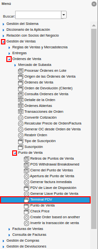
.. |carpeta órdenes de venta con carpeta punto de venta| image:: resources/sales-order-folder-with-point-of-sale-folder.png
.. |selección de la ventana terminal pdv| image:: resources/pdv-terminal-window-selection.png

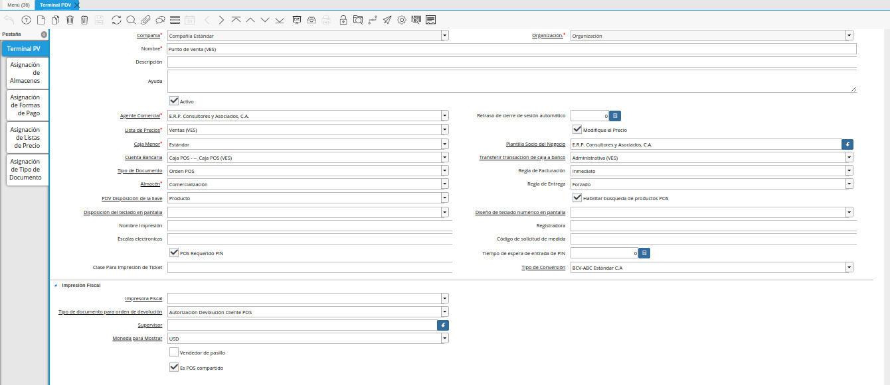

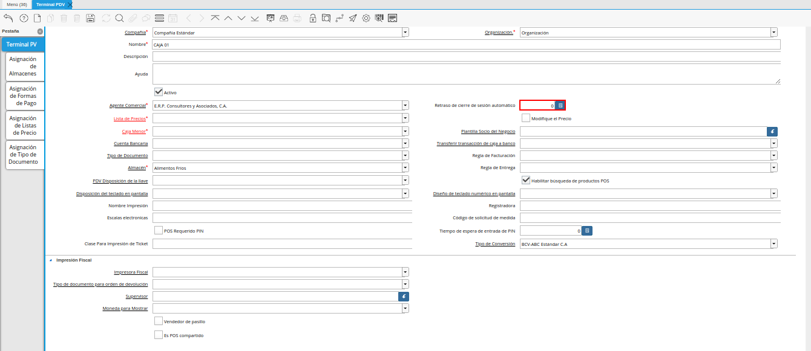

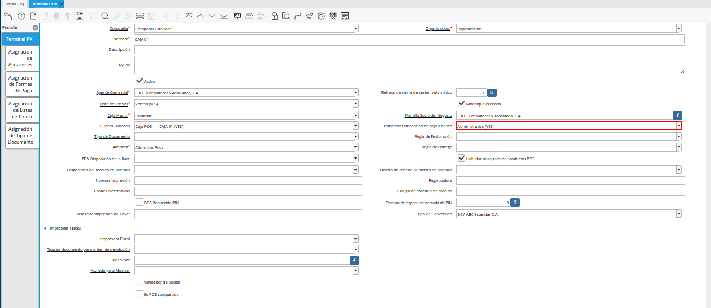

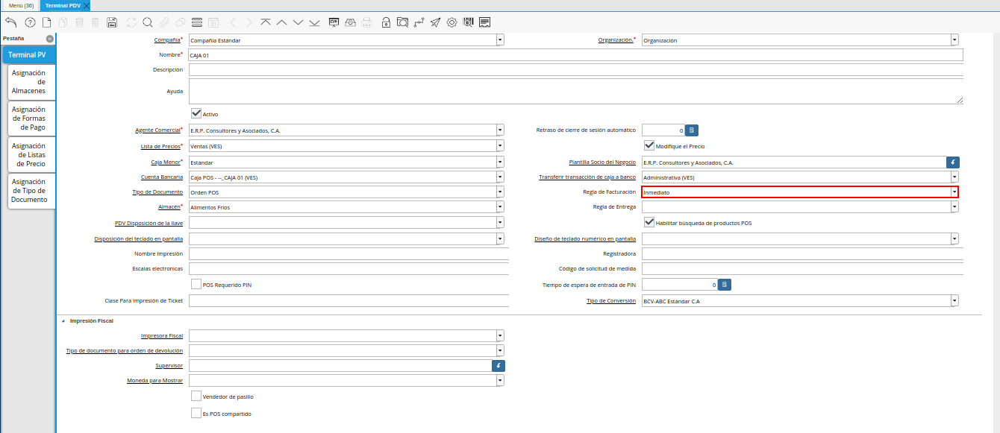

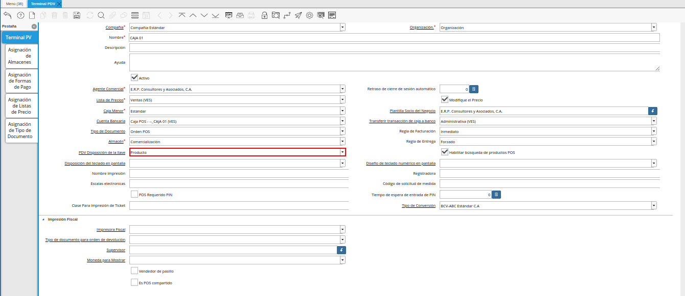

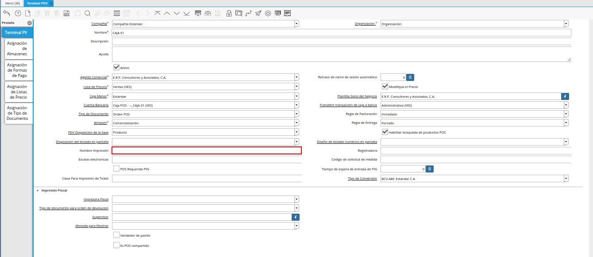

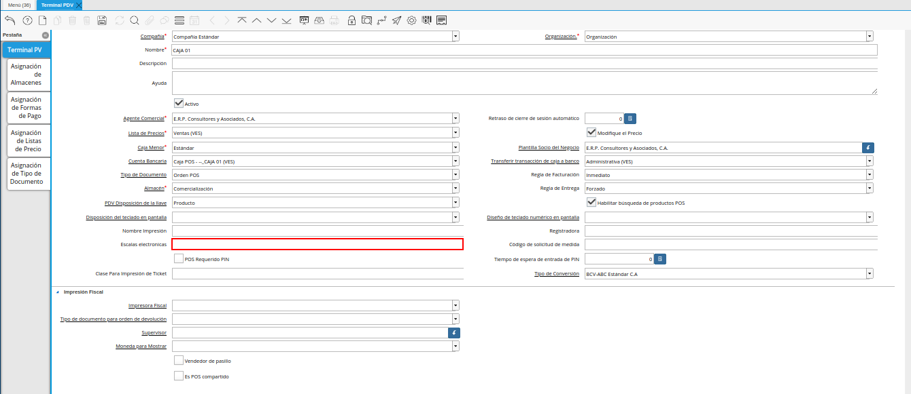
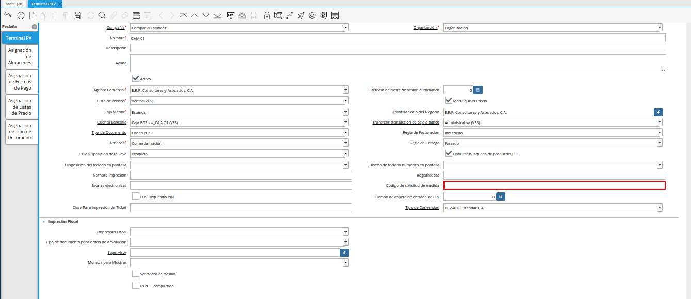

.. |Campo Tiempo de Entrada de PIN de la Ventana Terminal PDV| image:: resources/field-entry-time-of-window-terminal-point-of-sale.png

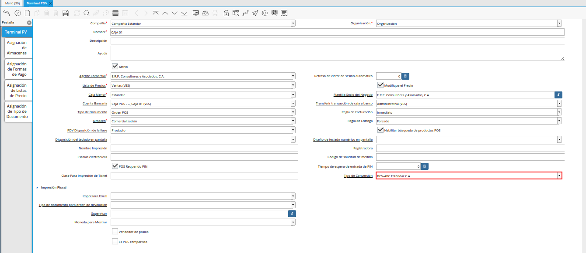
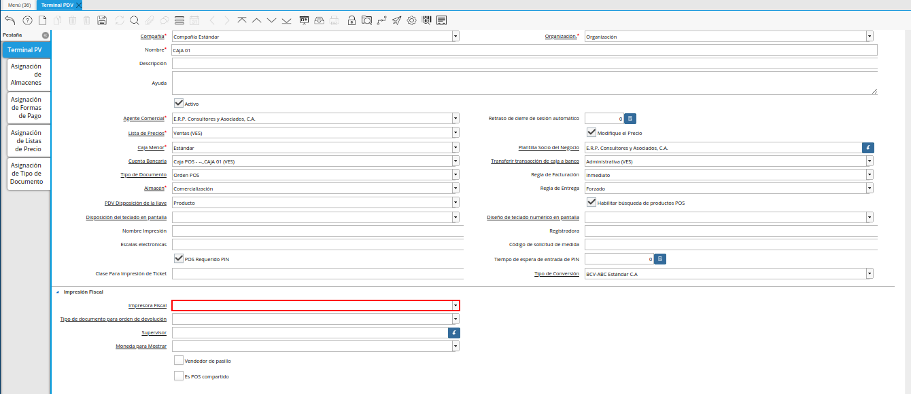

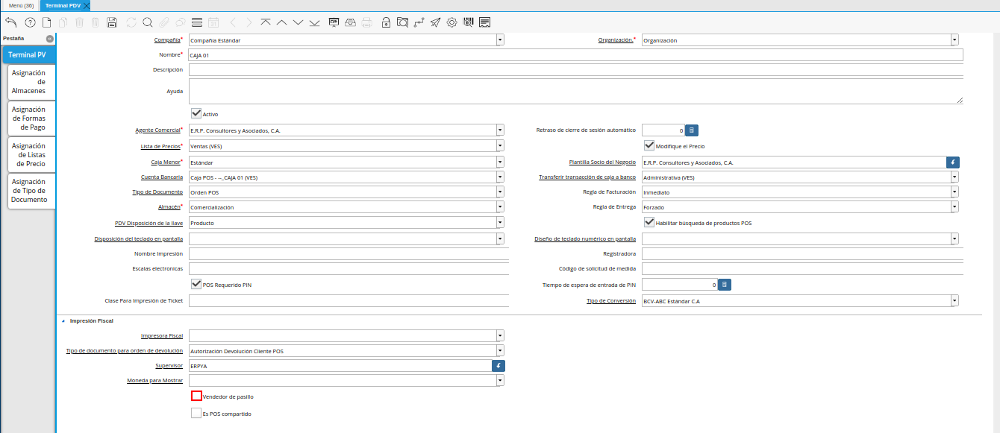

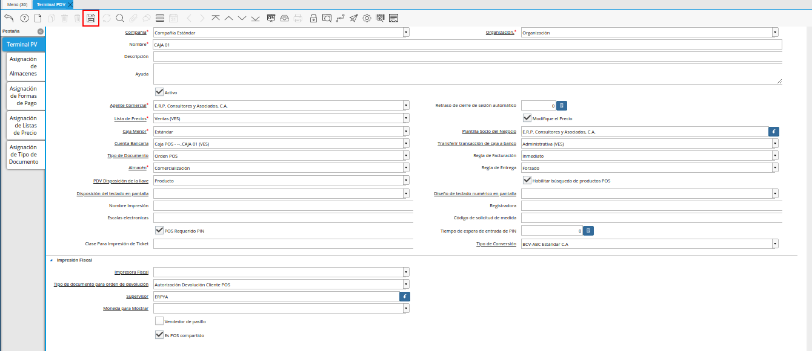

.. _documento/configuración-de-terminal-punto-de-venta:

**Configuración de Terminal PDV**
=================================

La configuración del terminal del punto de venta permite definir los parámetros con los que serán generados los egresos e ingresos de las cajas involucradas en el proceso de ventas. 

Adicional a ello, se define la impresora, el tipo de conversión, la lista de precios, almacén y supervisor de la caja en la cual serán realizadas las operaciones.

A continuación se explica el procedimiento a seguir para configurar correctamente el terminal del punto de venta.

#. Ubique y seleccione en el menú de ADempiere, la carpeta "**Gestión de Ventas**" y luego seleccione la carpeta "**Órdenes de Venta**".

    |Menú de terminal pdv|

    Imagen 1. Menú de ADempiere

#. Podrá visualizar la carpeta "**Órdenes de Venta**", con diferentes ventanas, procesos y reportes. Además, contiene la carpeta "**Punto de Venta**", que a su vez contiene ventanas, procesos y formularios.

    |carpeta órdenes de venta con carpeta punto de venta|

    Imagen 2. Carpeta Órdenes de Venta

#. Finalmente, seleccione la ventana "**Terminal PDV**", que se encuentra dentro de la carpeta "**Punto de Venta**".

    |selección de la ventana terminal pdv|

    Imagen 3. Selección de la Ventana Terminal PDV

#. Podrá visualizar la ventana "**Terminal PDV**" con diferentes campos que permiten una configuración de la caja, taquilla o auto-servicio en el cual se gestiona la orden, facturación y cobro de los productos por medio del punto de venta.

    |Ventana Terminal PDV|

    Imagen 2. Ventana Terminal PDV 

    #. La ventana "**Terminal PDV**" cuenta con los siguientes campos que son necesarios para realizar el proceso del punto de venta:

        #. Seleccione en el campo "**Organización**", la organización en la cual trabaja el vendedor para el cual se esta configurando el terminal del punto de venta.

            |Campo Organización de la Ventana Terminal PDV|

            Imagen 3. Campo Organización de la Ventana Terminal PDV

        #. Introduzca en el campo "**Nombre**", el nombre de la caja, taquilla o auto-servicio en el cual será realizada la gestión de orden, facturación y cobro de los productos.

            |Campo Nombre de la Ventana Terminal PDV|

            Imagen 4. Campo Nombre de la Ventana Terminal PDV

        #. Introduzca en el campo "**Descripción**", una breve descripción de la caja, taquilla o auto-servicio en el cual será realizada la gestión de orden, facturación y cobro de los productos.

            |Campo Descripción de la Ventana Terminal PDV|

            Imagen 5. Campo Descripción de la Ventana Terminal PDV

        #. Seleccione en el campo "**Agente Comercial**", el socio del negocio vendedor para el cual se esta configurando el terminal PDV.

            Este campo permite seleccionar el vendedor que realizará las operaciones de las ventas en la caja asociada al terminal PDV. 

            |Campo Agente Comercial de la Ventana Terminal PDV|

            Imagen 6. Campo Agente Comercial de la Ventana Terminal PDV

        #. Introduzca en el campo "**Retraso de Cierre de Sesión Automático**", el tiempo para el cierre de sesión automático cuando el terminal se encuentre inactivo.

            |Campo Retraso de Cierre de Sesión Automático de la Ventana Terminal PDV|

            Imagen 7. Campo Retraso de Cierre de Sesión Automático de la Ventana Terminal PDV

        #. Seleccione en el campo "**Lista de Precios**", la lista de precios establecida para las ventas de la organización.

            Este campo permite definir la lista de precios con la cual serán realizadas las operaciones de ventas en la caja asociada al terminal PDV.

            |Campo Lista de Precios de la Ventana Terminal PDV|

            Imagen 8. Campo Lista de Precios de la Ventana Terminal PDV

        #. Seleccione el check "**Modifique el Precio**", para permitir que los precios de venta puedan ser modificados en la caja que se encuentra configurando.

            La selección de este check, permite que el supervisor del vendedor asociado al terminal PDV pueda modificar los precios de los productos.

            |Checklist Modifique el Precio de la Ventana Terminal PDV|

            Imagen 9. Check Modifique el Precio de la Ventana Terminal PDV

        #. Seleccione en el campo "**Caja Menor**", la caja menor de la organización para registrar en ella las transacciones de caja chica.

            |Campo Caja Menor de la Ventana Terminal PDV|

            Imagen 10. Campo Caja Menor de la Ventana Terminal PDV

        #. Seleccione en el campo "**Plantilla Socio del Negocio**", el socio del negocio creado para ser utilizado en el registro de los nuevos clientes de forma rápida.

            |Campo Plantilla Socio del Negocio de la Ventana Terminal PDV|

            Imagen 11. Campo Plantilla Socio del Negocio de la Ventana Terminal PDV

        #. Seleccione en el campo "**Cuenta Bancaria**", la cuenta caja creada para registrar las transacciones efectuadas por el vendedor, durante la gestión de orden, facturación y cobro de los productos.

            |Campo Cuenta Bancaria de la Ventana Terminal PDV|

            Imagen 12. Campo Cuenta Bancaria de la Ventana Terminal PDV

        #. Seleccione en el campo "**Transferir transacción de caja a banco**", la cuenta a la cual serán transferidas todas las transacciones de la caja de ventas.

            |Campo Transferir transacción de caja a banco de la Ventana Terminal PDV|

            Imagen 13. Campo Transferir Transacción de Caja a Banco de la Ventana Terminal PDV

        #. Seleccione el tipo de documento a generar en el campo "**Tipo de Documento**", la selección de este define el comportamiento del documento que se esta elaborando, dicho comportamiento se encuentra explicado en el documento **Tipo de Documento** elaborado por `ERPyA`_. 

            Este campo permite definir el tipo de documento con el cual serán generadas las ventas desde el punto de venta. De igual manera, el comportamiento que este tendrá al completar el proceso.

            |Campo Tipo de Documento de la Ventana Terminal PDV|

            Imagen 14. Campo Tipo de Documento de la Ventana Terminal PDV

        #. Seleccione en el campo "**Regla de Facturación**", el método utilizado para generar las facturas a los clientes.

            Este campo establece una condición para facturar la venta en base a lo que se defina en el terminal PDV, el mismo no es obligatorio ya que la facturación puede depender de las reglas del negocio.

            |Campo Regla de Facturación de la Ventana Terminal PDV|

            Imagen 15. Campo Regla de Facturación de la Ventana Terminal PDV

        #. Seleccione en el campo "**Almacén**", el lugar de almacenamiento de los productos destinados para la venta.

            |Campo Almacén de la Ventana Terminal PDV|

            Imagen 16. Campo Almacén de la Ventana Terminal PDV

        #. Seleccione en el campo "**Regla de Entrega**", el método utilizado para generar las entregas de productos al cliente.

            Este campo establece una condición para entregar la venta en base a lo que se defina en el terminal PDV, el mismo no es obligatorio ya que la entrega puede depender de las reglas del negocio.

            |Campo Regla de Entrega de la Ventana Terminal PDV|

            Imagen 17. Campo Regla de Entrega de la Ventana Terminal PDV

        #. Seleccione en el campo "**PDV Disposición de la Llave**", la disposición de la llave para el funcionamiento del punto de venta.

            |Campo PDV Disposición de la Llave de la Ventana Terminal PDV|

            Imagen 18. Campo PDV Disposición de la Llave de la Ventana Terminal PDV
        
        #. El check "**Habilitar Búsqueda de Productos POS**", permite la búsqueda manual de los productos.

            |Checklist Habilitar Búsqueda de Productos POS de la Ventana Terminal PDV|

            Imagen 19. Check Habilitar Búsqueda de Productos POS de la Ventana Terminal PDV

        #. Seleccione en el campo "**Teclado en Pantalla**", el diseño clave para utilizar el teclado en pantalla para campos de texto.

            |Campo Diseño de Teclado en Pantalla de la Ventana Terminal PDV|

            Imagen 20. Campo Teclado en Pantalla de la Ventana Terminal PDV

            .. note::

                Si el campo se encuentra vacío, no se utilizará el teclado en pantalla.

        #. Seleccione en el campo "**Teclado Numérico en Pantalla**", el diseño clave para utilizar el teclado en pantalla para campos númericos.

            |Campo Diseño de Teclado Numérico en Pantalla de la Ventana Terminal PDV|

            Imagen 21. Campo Teclado Numérico en Pantalla de la Ventana Terminal PDV

            .. note::

                Si el campo se encuentra vacío, no se utilizará el teclado en pantalla.

        #. Introduzca en el campo "**Nombre Impresión**", el nombre de la impresora asignada para el terminal que esta configurando.

            |Campo Nombre Impresión de la Ventana Terminal PDV|

            Imagen 22. Campo Nombre Impresión de la Ventana Terminal PDV

            .. note::

                Si el campo se encuentra vacío, se utiliza la impresora por defecto.

        #. Introduzca en el campo "**Registradora**", la registradora asignada para el terminal que esta configurando.

            |Campo Registradora de la Ventana Terminal PDV|

            Imagen 23. Campo Registradora de la Ventana Terminal PDV

        #. Introduzca en el campo "**Peso Electrónico**", la ruta para las balanzas electrónicas del dispositivo.

            |Campo Escalas Electrónicas de la Ventana Terminal PDV|

            Imagen 24. Campo Escalas Electrónicas de la Ventana Terminal PDV

        #. Introduzca en el campo "**Código de Solicitud de Medida**, las medidas de balanzas electrónicas de dispositivos.

            |Campo Código de Solicitud de Medida de la Ventana Terminal PDV|

            Imagen 25. Campo Código de Solicitud de Medida de la Ventana Terminal PDV

        #. Seleccione el checklist "**PIN POS Requerido**", para indicar que un PIN de supervisor es obligatorio para ejecutar algunas tareas.

            |Campo PIN POS Requerido de la Ventana Terminal PDV|

            Imagen 26. Campo PIN POS Requerido de la Ventana Terminal PDV

        #. Introduzca en el campo "**Tiempo de Entrada de PIN**", la cantidad de tiempo desde la visualización inicial hasta que el cuadro de diálogo de entrada de PIN se agota.

            |Campo Tiempo de Entrada de PIN de la Ventana Terminal PDV|

            Imagen 27. Campo Tiempo de Entrada de PIN de la Ventana Terminal PDV

            .. note::

                La cantidad de tiempo debe ser ingresada en milisegundos.

        #. En el campo "**Clase Para Impresión de Ticket**", se debe ingresar el nombre de la clase para la impresión del ticket.

            |Campo Clase Para Impresión de Ticket de la Ventana Terminal PDV|

            Imagen 28. Campo Clase Para Impresión de Ticket de la Ventana Terminal PDV

            .. note::

                La información correspondiente a este campo debe ser ingresada por los consultores de `ERPyA`_.

        #. Seleccione en el campo "**Tipo de Conversión**", el tipo de conversión de moneda establecida para la lista de precios de venta seleccionada anteriormente.

            |Campo Tipo de Conversión de la Ventana Terminal PDV|

            Imagen 29. Campo Tipo de Conversión de la Ventana Terminal PDV

        #. Seleccione en el campo "**Impresora Fiscal**", la impresora fiscal asignada a la caja, taquilla o auto-servicio, para imprimir las diferentes facturas y notas de crédito emitidas por dicha caja.

            |Campo Impresora Fiscal de la Ventana Terminal PDV|

            Imagen 30. Campo Impresora Fiscal de la Ventana Terminal PDV

        #. Seleccione en el campo "**Tipo de Documento para Orden de Devolución**", el tipo de documento establecido para generar la orden de devoluciones de los clientes y finalmente poder generar la nota de crédito a partir de la misma.

            |Campo Tipo de Documento para Orden de Devolución de la Ventana Terminal PDV|

            Imagen 31. Campo Tipo de Documento para Orden de Devolución

        #. Seleccione en el campo "**Supervisor**", el supervisor del vendedor para el cual se esta configurando el terminal PDV. 

            |Campo Supervisor de la Ventana Terminal PDV|

            Imagen 32. Campo Supervisor de la Ventana Terminal PDV

        #. Seleccione el checklist "**Vendedor de Pasillo**", para indicar que el socio del negocio empleado es un vendedor de pasillo.

            |Checklist Vendedor de Pasillo de la Ventana Terminal PDV|

            Imagen 33. Checklist Vendedor de Pasillo de la Ventana Terminal PDV

        #. Seleccione el checklist "**POS Compartido**", para indicar que el punto de venta es compartido.

            |Checklist POS Compartido de la Ventana Terminal PDV|

            Imagen 34. Checklist POS Compartido de la Ventana Terminal PDV

        #. Seleccione el icono "**Guardar Cambios**", ubicado en la barra de herramientas de ADempiere para guardar el registro de los campos de la ventana "**Terminal PDV**".

            |Icono Guardar Cambios de la Ventana Terminal PDV|

            Imagen 35. Icono Guardar Cambios de la Ventana Terminal PDV