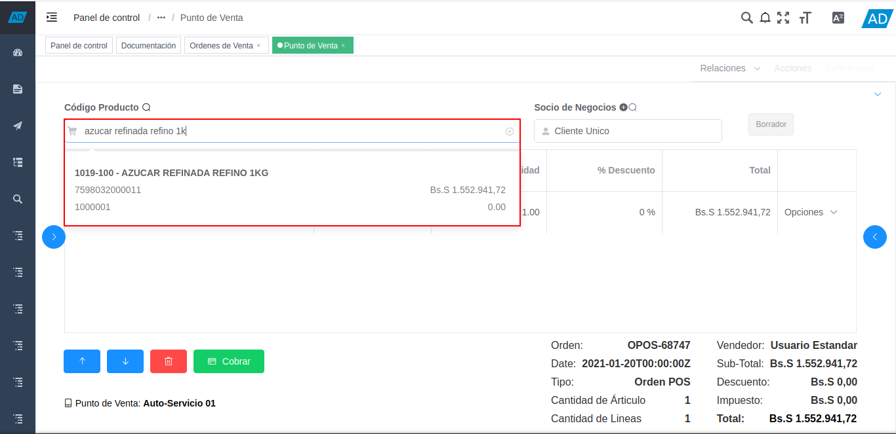

.. _ERPyA: http://erpya.com
.. |diagrama de toma de pedido pos| image:: resources/pos.png
.. |Menú de ADempiere| image:: resources/point-of-sale-menu.png
.. |ventana órdenes de venta del punto de venta| image:: resources/point-of-sale-sales-orders-window.png
.. |selección de formulario punto de venta| image:: resources/point-of-sale-form-selection.png
.. |ventana del formulario punto de venta| image:: resources/point-of-sale-form-window.png
.. |selección del cliente en el formulario punto de venta| image:: resources/customer-selection-in-the-point-of-sale-form.png
.. |carga de productos desde catálogo de productos del formulario punto de venta| image:: resources/product-catalog.png

.. |opción información del producto del formulario punto de venta| image:: resources/product-information-option-of-the-point-of-sale-form.png
.. |información del producto del formulario punto de venta| image:: resources/product-information-from-the-point-of-sale-form.png
.. |opción editar cantidades del producto del formulario punto de venta| image:: resources/option-edit-product-quantities-of-the-point-of-sale-form.png
.. |campo cantidad de la opción editar cantidades del producto| image:: resources/quantity-field-of-the-edit-product-quantities-option.png
.. |monto total de la orden de venta| image:: resources/total-amount-of-the-sales-order.png
.. |ventana con campo moneda para convertir| image:: resources/window-with-currency-field-to-convert.png
.. |monto total de la orden convertido| image:: resources/total-amount-of-the-converted-order.png
.. |opción eliminar producto del formulario punto de venta| image:: resources/option-remove-product-from-point-of-sale-form.png
.. |iconos de posicionamiento del formulario punto de venta| image:: resources/point-of-sale-form-positioning-icons.png
.. |icono eliminar producto del formulario punto de venta| image:: resources/icon-remove-product-from-point-of-sale-form.png
.. |información de la orden de venta del formulario punto de venta| image:: resources/sales-order-information-from-the-point-of-sale-form.png
.. |icono cobrar del formulario punto de venta| image:: resources/point-of-sale-window-collection-icon.png

.. _documento/punto-de-venta:

**Toma de Pedido**
==================

El proceso toma de pedido consiste en la venta de los productos por medio del documento "**Orden de Venta**", en el cual se cargan los datos del cliente, los productos y el cobro. Al realizar el cobro de la misma, se generan de manera automática los documentos "**Cobro**", "**Factura por Cobrar**" y "**Entrega**".

El documento del cobro se genera en la ventana "**Caja**", con la cuenta caja pos en la cual se realizó dicho cobro. Este es asociado a la línea del registro de cierre de caja de la cuenta "**Caja POS**", creado al momento de la apertura de caja.

Adicional a ello, el documento "**Factura por Cobrar**", es generado en la ventana "**Documentos por Cobrar**". Mientras que el documento "**Entrega**", es generado en la ventana "**Entrega (Cliente)**".

Para mejor referencia de lo explicado anteriormente, se presenta a continuación el diagrama del proceso "**Toma de Pedido POS**", con la finalidad dar a conocer el comportamiento de ADempiere ante dicho proceso.

    |diagrama de toma de pedido pos|

    Imagen 1. Diagrama de Toma de Pedido POS

**Ejecución del Proceso**
-------------------------

#. Ubique y seleccione en el menú de ADempiere, la carpeta "**Gestión de Ventas**", luego seleccione la carpeta "**Órdenes de Venta**".

    |Menú de ADempiere|

    Imagen 2. Menú de ADempiere

#. Podrá visualizar la carpeta "**Órdenes de Venta**", con la ventana "**Órdenes de Venta**", que permite crear y modificar las mismas. Adicional a ello, también contiene la carpeta "**Punto de Venta**", con el formulario del punto de venta y el smart browser de cierre de caja.

    |ventana órdenes de venta del punto de venta|

    Imagen 3. Ventana Órdenes de Venta

#. Seleccione el formulario "**Punto de Venta**" que se encuentra dentro de la carpeta "**Punto de Ventas**".

    |selección de formulario punto de venta|

    Imagen 4. Selección de Formulario Punto de Venta

#. Podrá visualizar la ventana del formulario "**Punto de Venta**", con diferentes campos que permiten registrar en ADempiere de manera fácil y sencilla, la venta de los productos.

    |ventana del formulario punto de venta|

    Imagen 5. Ventana del Formulario Punto de Venta

#. La interfaz de la ventana del formulario "**Punto de Venta**", se encuentra definida de forma específica en el documento :ref:`documento/interfaz-del-punto-de-venta`, elaborado por `ERPyA`_. Realice cada uno de los procesos explicados a continuación para obtener un resultado exitoso en la toma de pedido por el punto de venta.

    .. note::

        El formulario "**Punto de Venta**", crea de manera automática un registro nuevo de "**Orden de Venta**", al cargar un producto al mismo.

#. Ingrese la información del socio del negocio "**Cliente**", en el campo "**Socio de Negocios**". Dicho procedimiento se encuentra explicado en el proceso :ref:`documento/paso-panel-de-socio-de-negocios`, del material :ref:`documento/interfaz-del-punto-de-venta`, elaborado por `ERPyA`_.

    |selección del cliente en el formulario punto de venta|

    Imagen 6. Selección del Cliente en el Formulario Punto de Venta

#. Proceda a cargar los productos desde el catálogo de productos. Dicho procedimiento se encuentra explicado en el proceso :ref:`documento/paso-catálogo-de-productos`, del material :ref:`documento/interfaz-del-punto-de-venta`, elaborado por `ERPyA`_.

    |carga de productos desde catálogo de productos del formulario punto de venta|

    Imagen 7. Carga de Productos desde el Catálogo de Productos

    .. note::

        Recuerde que en el catálogo de productos, cada categoría, grupo y producto se encuentra identificado por su nombre e imagen correspondiente al mismo, según la configuración de llave de disposición establecida previamente para el punto de ventas. Dicha configuración se encuentra explicada de manera detallada en el material :ref:``, elaborado por `ERPyA`_.

#. Si lo desea, puede ingresar los productos a la orden de venta ingresando el código o nombre del mismo en el panel de búsqueda de productos. Dicho panel se encuentra explicado de manera detallada en el material :ref:`documento/paso-panel-de-búsqueda-de-productos`, elaborado por `ERPyA`_.

    |carga de productos desde el panel de búsqueda de productos del formulario punto de venta|

    Imagen 8. Carga de Productos desde el Panel de Búsqueda de Productos

#. Para visualizar la información del producto cargado a la línea de la orden, seleccione la opción "**Opciones**" al final de la lína del producto y luego seleccione la opción "**Información de Producto**".

    |opción información del producto del formulario punto de venta|

    Imagen 9. Opción Información del Producto

    #. Podrá visualizar la siguiente ventana con la información del producto.

        |información del producto del formulario punto de venta|

        Imagen 10. Información del Producto

#. Para modificar la cantidad del producto cargado a la línea de la orden, seleccione la opción "**Opciones**" al final de la lína del producto y luego seleccione la opción "**Editar Cantidades**".

    |opción editar cantidades del producto del formulario punto de venta|

    Imagen 11. Opción Editar Cantidades del Producto

    #. Podrá visualizar una ventana con el campo "**Cantidad**", donde puede modificar la cantidad del producto para ingresar la cantidad requerida.

        |campo cantidad de la opción editar cantidades del producto|

        Imagen 12. Campo Cantidad de la Opción Editar Cantidades del Producto

#. Para eliminar el producto de la línea de la orden, seleccione la opción "**Opciones**" al final de la lína del producto y luego seleccione la opción "**Eliminar**".

    |opción eliminar producto del formulario punto de venta|

    Imagen 13. Opción Eliminar Producto

#. En la parte inferior derecha del formulario "**Punto de Venta**", se puede visualizar la siguiente información:

    - El campo "**Orden**", indica el número de la orden que se encuentra realizando.
    - El campo "**Fecha**", indica la fecha en la cual se esta realizando la orden de venta. Esta fecha no puede ser modificada, recuerde que las transacciones realizadas desde el punto de venta serán generadas a la fecha que se indica en este campo.
    - El campo "**Tipo**", indica el tipo de documento con el cual se esta generando la orden de venta que se encuentra realizando.
    - El campo "**Cantidad de Árticulo**", la cantidad total de los árticulos que posee la orden de venta.
    - El campo "**Cantidad de Líneas**", la cantidad total de líneas de productos que posee la orden de venta.
    - El campo "**Vendedor**", indica el nombre del agente comercial (vendedor) que se encuentra realizando la orden de venta.
    - El campo "**Sub-Total**", indica el monto total de la orden sin impuestos.
    - El campo "**Descuento**", indica el monto total del descuento aplicado a la orden.
    - El campo "**Impuesto**", indica el monto total del impuesto aplicado a la orden.
    - El campo "**Total**", indica el monto total de la orden con descuento e impuestos.

    |información de la orden de venta del formulario punto de venta|

    Imagen 14. Información de la Orden de Venta

#. Para visualizar el monto total de la orden de venta convertido en otra moneda, haga clic sobre el monto de la orden en el campo "**Total**".

    |monto total de la orden de venta|

    Imagen 15. Campo Total  

    #. Podrá visualizar la ventana del total de la orden, con el campo "**Moneda**", donde debe seleccionar la moneda a la cual requiere realizar la conversión.

        |ventana con campo moneda para convertir|

        Imagen 16. Ventana Convertir Cantidad

    #. En el encabezado de la ventana, se muestra el monto total de la orden, convertido a la moneda seleccionada previamente.

        |monto total de la orden convertido|

        Imagen 17. Monto Total Convertido

#. Para posicionarse en cualquier línea de producto de la orden que se encuentra realizando, puede hacer clic sobre la misma o seleccionar los iconos de "**Posicionamiento**" ubicados en la parte inferior izquierda del formulario "**Punto de Venta**". Donde el primer icono permite posicionarse en el "**Registro Anterior**", y el segundo icono permite posicionarse en el "**Registro Siguiente**".

    |iconos de posicionamiento del formulario punto de venta|

    Imagen 18. Iconos de Posicionamiento

#. De igual manera, puede eliminar el registro del producto donde se encuentra posicionado, seleccionando el icono "**Eliminar**" ubicado en la parte inferior izquierda del formulario "**Punto de Venta**".

    |icono eliminar producto del formulario punto de venta|

    Imagen 19. Icono Eliminar 

#. Seleccione el icono "**Cobrar**", para realizar el cobro de la orden de venta que se encuentra realizando.

    |icono cobrar del formulario punto de venta|

    Imagen 20. Icono Cobrar