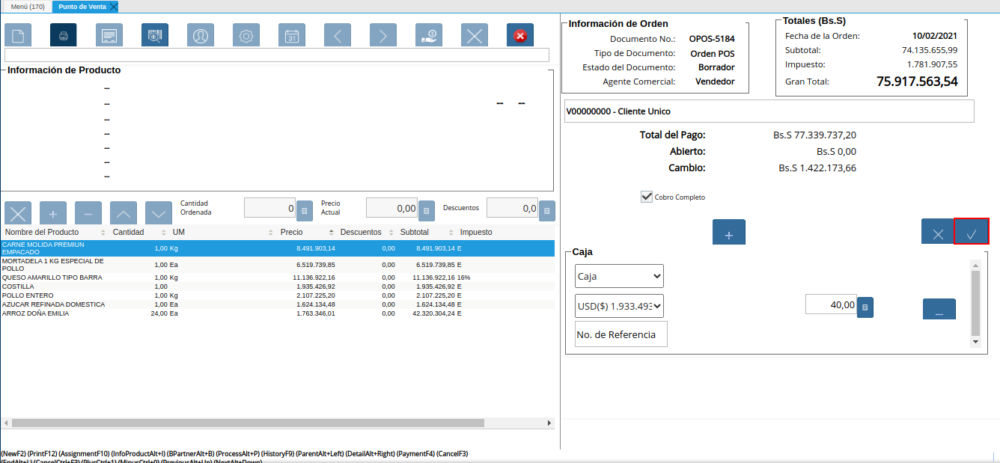
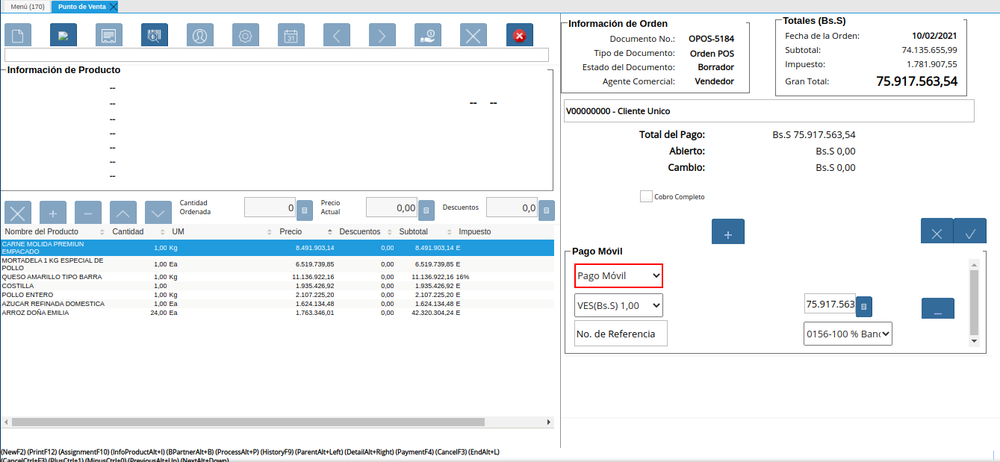
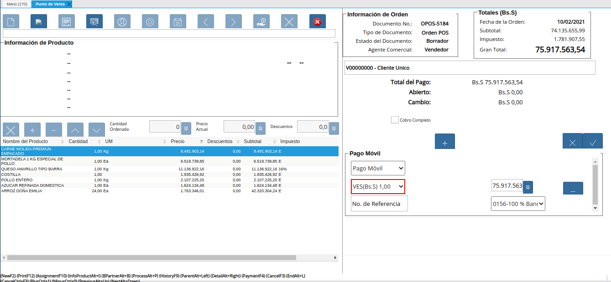
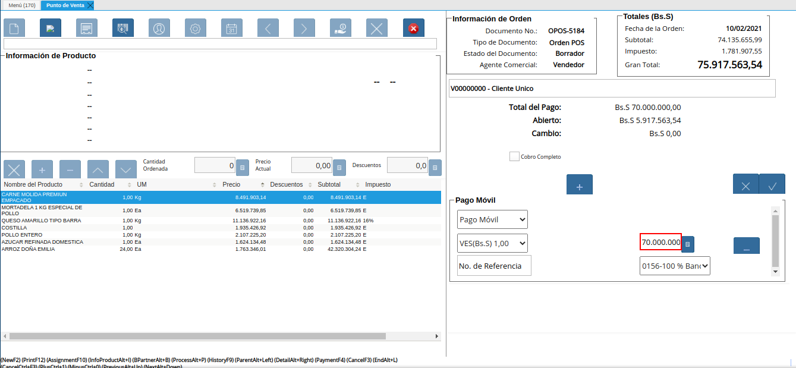
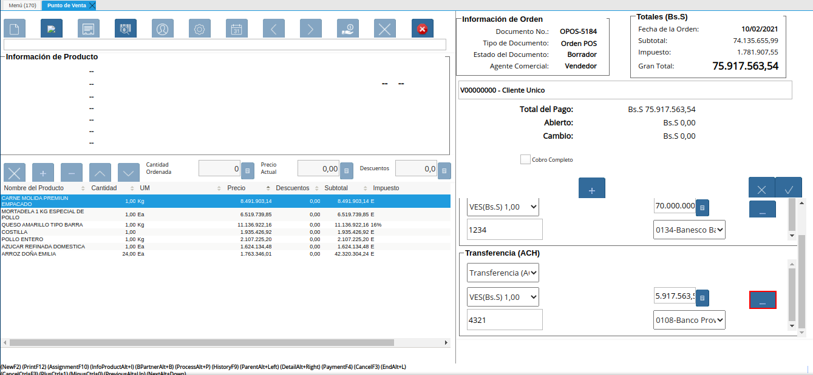
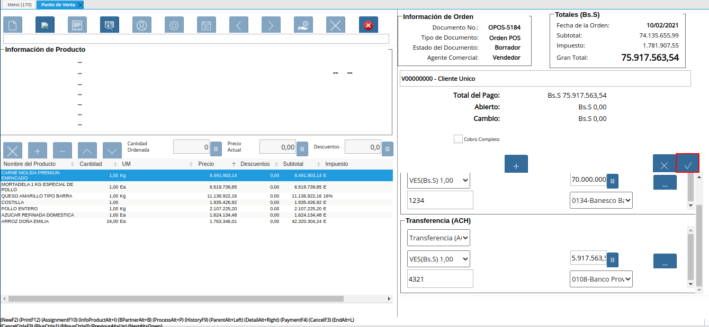
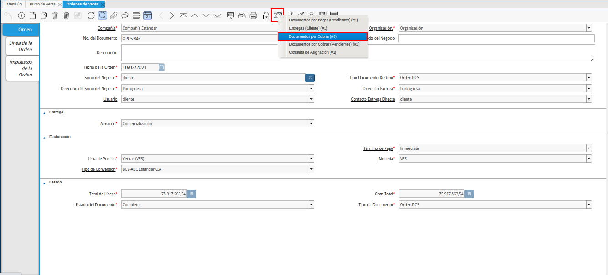
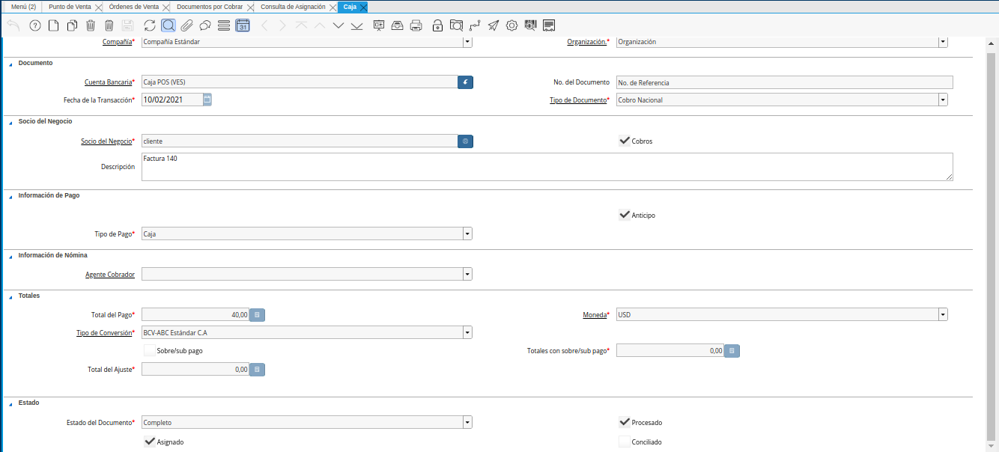

.. _ERPyA: http://erpya.com
.. |Menú de ADempiere| image:: resources/point-of-sale-menu.png
.. |Ventana Selecciona Terminal PDV| image:: resources/window-select-terminal-pdv.png
.. |Icono Registro Nuevo de la Ventana Punto de Venta| image:: resources/new-registration-icon-in-the-point-of-sale-window.png
.. |Verificar Valores por Defecto del Registro Nuevo| image:: resources/check-default-values-of-new-record.png
.. |Carga de Productos desde el Catálogo de Productos| image:: resources/loading-products-from-the-product-catalog.png
.. |Carga de Productos desde el Icono Información de Producto| image:: resources/loading-products-from-the-product-information-icon.png
.. |Información de los Productos Cargados a la Orden de Venta del Punto de Venta| image:: resources/information-of-the-products-loaded-to-the-point-of-sale-sales-order.png
.. |Sumar Restar o Ingresar Cantidad de Productos a Vender| image:: resources/add-subtract-or-enter-quantity-of-products-to-sell.png
.. |Precio Actual de Productos a Vender| image:: resources/current-price-of-products-to-sell.png
.. |Icono Pago de la Ventana Punto de Venta| image:: resources/point-of-sale-window-payment-icon.png

.. |Campo Monto del Pago Regular del Icono Pago de la Ventana Punto de Venta| image:: resources/regular-payment-amount-field-of-the-payment-icon-in-the-point-of-sale-window.png

.. |Icono Imprimir de la Ventana Punto de Venta| image:: resources/point-of-sale-window-print-icon.png
.. |Icono Imprimir de la Ventana Informe| image:: resources/report-window-print-icon.png
.. |Grupos de Campos Información de la Orden y Totales de la Ventana Punto de Venta| image:: resources/field-groups-order-information-and-point-of-sale-window-totals.png
.. |Reporte de la Factura de la Venta| image:: resources/sales-invoice-report.png

.. |Pestaña Facturas Pagadas de la Ventana Documentos por Cobrar| image:: resources/paid-invoices-tab-of-the-documents-receivable-window.png
.. |Opción Acercar el Campo Pago de la Pestaña Facturas Pagadas| image:: resources/option-zoom-the-payment-field-of-the-paid-invoices-tab.png

.. _documento/punto-de-venta:

**Toma de Pedido**
==================

#. Ubique y seleccione en el menú de ADempiere, la carpeta "**Gestión de Ventas**", luego seleccione la carpeta "**Órdenes de Venta**", por último seleccione la carpeta "**Punto de Venta**", finalmente seleccione la ventana "**Punto de Venta**".

    |Menú de ADempiere|

    Imagen 1. Menú de ADempiere

#. Podrá visualizar la ventana "**Selecciona Terminal PDV**", para seleccionar el terminal del punto de venta con el cual va a gestionar la toma de pedido y posteriormente la opción "**OK**" para cargar la ventana "**Punto de Venta**" para el terminal seleccionado.

    |Ventana Selecciona Terminal PDV|

    Imagen 2. Ventana Selecciona Terminal PDV

    .. note::

        Esta opción es habilitada cuando el socio del negocio vendedor tiene configurado más de un terminal de punto de venta.

#. La interfaz de la ventana "**Punto de Venta**", se encuentra definida de forma específica en el documento :ref:`documento/interfaz-del-punto-de-venta`, elaborado por `ERPyA`_. Realice cada uno de los procesos explicados a continuación para obtener un resultado exitoso en la toma de pedido por el punto de venta.

    #. Seleccione el icono "**Registro Nuevo**" para crear un nuevo registro de orden de venta en el punto de venta.

        |Icono Registro Nuevo de la Ventana Punto de Venta|

        Imagen 3. Icono Registro Nuevo de la Ventana Punto de Venta

        #. Verifique los valores que tiene por defecto la ventana "**Punto de Venta**", al crear un registro nuevo. Dichos valores pueden ser modificados según lo requerido.

            |Verificar Valores por Defecto del Registro Nuevo|

            Imagen 4. Verificar Valores por Defecto del Registro Nuevo

    #. Luego de que haya verificado o modificado el tipo de documento y la información del cliente, puede proceder a cargar los productos desde el catálogo de productos.

        |Carga de Productos desde el Catálogo de Productos|

        Imagen 5. Carga de Productos desde el Catálogo de Productos

        .. note::

            Recuerde que en el catálogo de productos, cada producto se encuentra identificado por su nombre e imagen correspondiente.

    #. Si lo desea, puede cargar los productos con ayuda del icono "**Información de Producto**".

        |Carga de Productos desde el Icono Información de Producto|

        Imagen 6. Carga de Productos desde el Icono Información de Producto

    #. Luego de cargar todos los productos a la orden de venta, la información detallada de los mismos podrá ser visualizada en el grupo de campos "**Línea de Productos**".

        |Información de los Productos Cargados a la Orden de Venta del Punto de Venta|

        Imagen 7. Información de los Productos Cargados a la Orden de Venta del Punto de Venta

    #. La cantidad a vender de cada producto puede ser modificada en la "**Barra de Edición de Productos**" de cada línea de la orden, la misma se puede sumar o restar seleccionando los iconos "**Añadir**" y "**Menos**". De igual manera se puede ingresar la cantidad con ayuda del icono "**Calculadora**" ubicado del lado derecho del campo "**Cantidad Ordenada**".

        |Sumar Restar o Ingresar Cantidad de Productos a Vender|

        Imagen 8. Sumar Restar o Ingresar Cantidad de Productos a Vender
    
        .. note::
        
            Las líneas de la orden pueden ser eliminadas seleccionando el icono "**Borrar Línea**" ubicado en la "**Barra de Edición de Productos**".

    #. El precio de venta del producto puede ser modificado con ayuda del icono "**Calculadora**" ubicado del lado derecho del campo "**Precio Actual**".

        |Precio Actual de Productos a Vender|

        Imagen 9. Precio Actual de Productos a Vender

**Cobrar Pedido**
-----------------

#. Luego de haber cargado todos los productos de la venta en la orden, debe seleccionar el icono "**Pago**" para generar el cobro de los mismos.

    |Icono Pago de la Ventana Punto de Venta|

    Imagen 10. Icono Pago de la Ventana Punto de Venta

    La selección de este icono, habilita el recuadro del cobro, mostrando el total a pagar de la orden, los campos para ingresar la forma de pago, la moneda y el monto. Así como también, las opciones para agregar otro pago o eliminar un pago existente.
    
    El cobro de los productos cargados en la orden de venta se puede ejecutar de diferentes formas explicadas a continuación.

    #. Procedimiento regular con una forma de pago y una moneda específica.

        #. Seleccione en el campo "**Forma de Pago**", la forma utilizada por el cliente para pagar los productos cargados en la orden de venta.

            |Campo Forma de Pago del Pago Regular del Icono Pago de la Ventana Punto de Venta|

            Imagen 11. Campo Forma de Pago del Pago Regular del Icono Pago de la Ventana Punto de Venta

        #. Seleccione en el campo "**Moneda**", la moneda utilizada por el cliente para pagar los productos cargados en la orden de venta.

            |Campo Moneda del Pago Regular del Icono Pago de la Ventana Punto de Venta|

            Imagen 12. Campo Moneda del Pago Regular del Icono Pago de la Ventana Punto de Venta

        #. Introduzca en el campo "**Monto**", el monto pagado por el cliente con la forma de pago y moneda seleccionada.

            |Campo Monto del Pago Regular del Icono Pago de la Ventana Punto de Venta|

            Imagen 13. Campo Monto del Pago Regular del Icono Pago de la Ventana Punto de Venta

        #. Seleccione la opción "**OK**", para generar el cobro de los productos cargados en la orden de venta.

            |Opción OK del Pago Regular del Icono Pago de la Ventana Punto de Venta|

            Imagen 14. Opción OK del Pago Regular del Icono Pago de la Ventana Punto de Venta

    #. Procedimiento especial con diferentes formas de pago y monedas.

        #. Seleccione en el campo "**Forma de Pago**", la forma utilizada por el cliente para pagar los productos cargados en la orden de venta.

            |Campo Forma de Pago del Pago Especial del Icono Pago de la Ventana Punto de Venta|

            Imagen 15. Campo Forma de Pago del Pago Especial del Icono Pago de la Ventana Punto de Venta

        #. Seleccione en el campo "**Moneda**", la moneda utilizada por el cliente para pagar los productos cargados en la orden de venta.

            |Campo Moneda del Pago Especial del Icono Pago de la Ventana Punto de Venta|

            Imagen 16. Campo Moneda del Pago Especial del Icono Pago de la Ventana Punto de Venta

        #. Introduzca en el campo "**Monto**", el monto pagado por el cliente con la forma de pago y moneda seleccionada.

            |Campo Monto del Pago Especial del Icono Pago de la Ventana Punto de Venta|

            Imagen 17. Campo Monto del Pago Especial del Icono Pago de la Ventana Punto de Venta

        #. Seleccione el icono "**Más**", para habilitar otro grupo de campos de pago e ingresar la otra forma de pago en el campo "**Forma de Pago**" y la otra moneda en el campo "**Moneda**", para terminar de cancelar el pago con el monto ingresado en el campo "**Monto**".

            |Otra Forma de Pago del Pago Especial del Icono Pago de la Ventana Punto de Venta|

            Imagen 18. Otra Forma de Pago del Pago Especial del Icono Pago de la Ventana Punto de Venta

        #. Para eliminar una forma de pago ya seleccionada previamente, seleccione el icono "**Menos**".

            |Eliminar una Forma de Pago del Icono Pago de la Ventana Punto de Venta|

            Imagen 19. Eliminar una Forma de Pago del Icono Pago de la Ventana Punto de Venta

        #. Seleccione la opción "**OK**", para generar el cobro de los productos cargados en la orden de venta.

            |Opción OK del Pago Especial del Icono Pago de la Ventana Punto de Venta|

            Imagen 20. Opción OK del Pago Especial del Icono Pago de la Ventana Punto de Venta

.. note::

    Al compltar el proceso para generar el cobro de los productos ingresados a la orden de venta POS, se crea automáticamente un documento de cobro en la ventana "**Caja**", por cada forma de pago utilizada.
    
    Adicional a ello, se crea una factura por cobrar en la ventana "**Documento por Cobrar**", asociada a la orden de venta POS y los diferentes cobros asignados a dicha orden. 
    
    Es importante resaltar que ambos documentos son generados en estado "**Completo**".

**Imprimir Pedido**
-------------------

#. Luego de haber generado el cobro de todos los productos de la venta, debe seleccionar el icono "**Imprimir**" para visualizar el reporte de la orden de venta en la ventana "**Informe**".

    |Icono Imprimir de la Ventana Punto de Venta|

    Imagen 21. Icono Imprimir de la Ventana Punto de Venta

    #. Al generar el reporte, tendrá la posibilidad de imprimir la orden de venta seleccionando el icono "**Imprimir**", de la ventana "**Informe**".

        |Icono Imprimir de la Ventana Informe|

        Imagen 22. Icono Imprimir de la Ventana Informe
    
#. Al mismo tiempo podrá visualizar la información de la orden y los totales de la misma, en los grupos de campos "**Información de Orden**" y "**Totales Bs.S**".

    |Grupos de Campos Información de la Orden y Totales de la Ventana Punto de Venta|

    Imagen 23. Grupos de Campos Información de la Orden y Totales de la Ventana Punto de Venta

#. Adicional a ello, al culminar el proceso de cobro de pedido explicado anteriormente, se genera automáticamente el reporte de la factura de la venta en la ventana "**Informe**". 

    |Reporte de la Factura de la Venta|

    Imagen 24. Reporte de la Factura de la Venta

**Consultar Factura Generada**
------------------------------

#. Ubique el documento de cobro generado en la ventana "**Documentos por Cobrar**", ingresando el número de documento mostrado en el reporte de la factura de la venta en el campo "**No. del Documento**".

    |Documento de Cobro Generado en la Ventana Documentos por Cobrar|

    Imagen 25. Documento de Cobro Generado en la Ventana Documentos por Cobrar

**Consultar Cobro Generado**
----------------------------

#. Ubique el documento de cobro generado en la ventana "**Documentos por Cobrar**" y luego seleccione la pestaña "**Facturas Pagadas**", para visualizar las asignaciones de los diferentes documentos de cobro generados en la ventana caja.

    |Pestaña Facturas Pagadas de la Ventana Documentos por Cobrar|

    Imagen 26. Pestaña Facturas Pagadas de la Ventana Documentos por Cobrar

#. En la línea del registro de asignación del cobro que requiere visualizar, haga clic contrario sobre el campo "**Pago**" y seleccione la opción "**Acercar**"

    |Opción Acercar el Campo Pago de la Pestaña Facturas Pagadas|

    Imagen 27. Opción Acercar el Campo Pago de la Pestaña Facturas Pagadas

#. Podrá visualizar de la siguiente manera el registro del cobro en la ventana "**Caja**".

    |Documento de Cobro Generado en Caja|

    Imagen 28. Documento de Cobro Generado en Caja