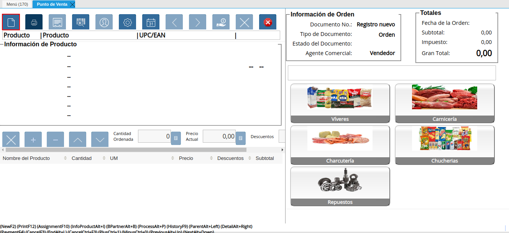

.. |Menú de ADempiere| image:: resources/point-of-sale-menu.png

.. |Verificar Valores por Defecto del Registro Nuevo| image:: resources/check-default-values-of-new-record.png
.. |Carga de Productos desde el Catálogo de Productos| image:: resources/loading-products-from-the-product-catalog.png
.. |Carga de Productos desde el Icono Información de Producto| image:: resources/loading-products-from-the-product-information-icon.png
.. |Información de los Productos Cargados a la Orden de Venta del Punto de Venta| image:: resources/information-of-the-products-loaded-to-the-point-of-sale-sales-order.png
.. |Sumar Restar o Ingresar Cantidad de Productos a Vender| image:: resources/add-subtract-or-enter-quantity-of-products-to-sell.png
.. |Precio Actual de Productos a Vender| image:: resources/current-price-of-products-to-sell.png
.. |Icono Pago de la Ventana Punto de Venta| image:: resources/point-of-sale-window-payment-icon.png

.. |Campo Forma de Pago del Pago Regular del Icono Pago de la Ventana Punto de Venta| image:: resources/
.. |Campo Moneda del Pago Regular del Icono Pago de la Ventana Punto de Venta| image:: resources/
.. |Campo Monto del Pago Regular del Icono Pago de la Ventana Punto de Venta| image:: resources/
.. |Opción OK del Pago Regular del Icono Pago de la Ventana Punto de Venta| image:: resources/
.. |Campo Forma de Pago del Pago Especial del Icono Pago de la Ventana Punto de Venta| image:: resources/
.. |Campo Moneda del Pago Especial del Icono Pago de la Ventana Punto de Venta| image:: resources/
.. |Campo Monto del Pago Especial del Icono Pago de la Ventana Punto de Venta| image:: resources/
.. |Otra Forma de Pago del Pago Especial del Icono Pago de la Ventana Punto de Venta| image:: resources/
.. |Eliminar una Forma de Pago del Icono Pago de la Ventana Punto de Venta| image:: resources/
.. |Opción OK del Pago Especial del Icono Pago de la Ventana Punto de Venta| image:: resources/
.. |Icono Imprimir de la Ventana Punto de Venta| image:: resources/point-of-sale-window-print-icon.png
.. |Icono Imprimir de la Ventana Informe| image:: resources/report-window-print-icon.png
.. |Grupos de Campos Información de la Orden y Totales de la Ventana Punto de Venta| image:: resources/field-groups-order-information-and-point-of-sale-window-totals.png

.. _documento/punto-de-venta:

**Toma de Pedido**
==================

#. Ubique y seleccione en el menú de ADempiere, la carpeta "**Gestión de Ventas**", luego seleccione la carpeta "**Órdenes de Venta**", por último seleccione la carpeta "**Punto de Venta**", finalmente seleccione la ventana "**Punto de Venta**".

    |Menú de ADempiere|

    Imagen 1. Menú de ADempiere

    #. Seleccione el icono "**Registro Nuevo**" para crear un nuevo registro de orden de venta en el punto de venta.

        |Icono Registro Nuevo de la Ventana Punto de Venta|

        Imagen 2. Icono Registro Nuevo de la Ventana Punto de Venta

        #. Verifique los valores que tiene por defecto la ventana "**Punto de Venta**", al crear un registro nuevo. Dichos valores pueden ser modificados según lo requerido.

            |Verificar Valores por Defecto del Registro Nuevo|

            Imagen 3. Verificar Valores por Defecto del Registro Nuevo

    #. Luego de que haya verificado o modificado el tipo de documento y la información del cliente, puede proceder a cargar los productos desde el catálogo de productos.

        |Carga de Productos desde el Catálogo de Productos|

        Imagen 4. Carga de Productos desde el Catálogo de Productos

        .. note::

            Recuerde que en el catálogo de productos, cada producto se encuentra identificado por su nombre e imagen correspondiente.

    #. Si lo desea, puede cargar los productos con ayuda del icono "**Información de Producto**".

        |Carga de Productos desde el Icono Información de Producto|

        Imagen 5. Carga de Productos desde el Icono Información de Producto

    #. Luego de cargar todos los productos a la orden de venta, la información detallada de los mismos podrá ser visualizada en el grupo de campos "**Línea de Productos**".

        |Información de los Productos Cargados a la Orden de Venta del Punto de Venta|

        Imagen 6. Información de los Productos Cargados a la Orden de Venta del Punto de Venta

    #. La cantidad a vender de cada producto puede ser modificada en la "**Barra de Edición de Productos**" de cada línea de la orden, la misma se puede sumar o restar seleccionando los iconos "**Añadir**" y "**Menos**". De igual manera se puede ingresar la cantidad con ayuda del icono "**Calculadora**" ubicado del lado derecho del campo "**Cantidad Ordenada**".

        |Sumar Restar o Ingresar Cantidad de Productos a Vender|

        Imagen 7. Sumar Restar o Ingresar Cantidad de Productos a Vender
    
        .. note::
        
            Las líneas de la orden pueden ser eliminadas seleccionando el icono "**Borrar Línea**" ubicado en la "**Barra de Edición de Productos**".

    #. El precio de venta del producto puede ser modificado con ayuda del icono "**Calculadora**" ubicado del lado derecho del campo "**Precio Actual**".

        |Precio Actual de Productos a Vender|

        Imagen 8. Precio Actual de Productos a Vender

    #. Luego de haber cargado todos los productos de la venta en la orden, debe seleccionar el icono "**Pago**" para generar el cobro de los mismos.

        |Icono Pago de la Ventana Punto de Venta|

        Imagen 9. Icono Pago de la Ventana Punto de Venta

        La selección de este icono, habilita el recuadro del cobro, mostrando el total a pagar de la orden, los campos para ingresar la forma de pago, la moneda y el monto. Así como también, las opciones para agregar otro pago o eliminar un pago existente.
        
        El cobro de los productos cargados en la orden de venta se puede ejecutar de diferentes formas explicadas a continuación.

        #. Procedimiento regular con una forma de pago y una moneda específica.

            #. Seleccione en el campo "**Forma de Pago**", la forma utilizada por el cliente para pagar los productos cargados en la orden de venta.

                |Campo Forma de Pago del Pago Regular del Icono Pago de la Ventana Punto de Venta|

                Imagen 10. Campo Forma de Pago del Pago Regular del Icono Pago de la Ventana Punto de Venta

            #. Seleccione en el campo "**Moneda**", la moneda utilizada por el cliente para pagar los productos cargados en la orden de venta.

                |Campo Moneda del Pago Regular del Icono Pago de la Ventana Punto de Venta|

                Imagen 11. Campo Moneda del Pago Regular del Icono Pago de la Ventana Punto de Venta

            #. Introduzca en el campo "**Monto**", el monto pagado por el cliente con la forma de pago y moneda seleccionada.

                |Campo Monto del Pago Regular del Icono Pago de la Ventana Punto de Venta|

                Imagen 12. Campo Monto del Pago Regular del Icono Pago de la Ventana Punto de Venta

            #. Seleccione la opción "**OK**", para generar el cobro de los productos cargados en la orden de venta.

                |Opción OK del Pago Regular del Icono Pago de la Ventana Punto de Venta|

                Imagen 13. Opción OK del Pago Regular del Icono Pago de la Ventana Punto de Venta

        #. Procedimiento especial con diferentes formas de pago y monedas.

            #. Seleccione en el campo "**Forma de Pago**", la forma utilizada por el cliente para pagar los productos cargados en la orden de venta.

                |Campo Forma de Pago del Pago Especial del Icono Pago de la Ventana Punto de Venta|

                Imagen 14. Campo Forma de Pago del Pago Especial del Icono Pago de la Ventana Punto de Venta

            #. Seleccione en el campo "**Moneda**", la moneda utilizada por el cliente para pagar los productos cargados en la orden de venta.

                |Campo Moneda del Pago Especial del Icono Pago de la Ventana Punto de Venta|

                Imagen 15. Campo Moneda del Pago Especial del Icono Pago de la Ventana Punto de Venta

            #. Introduzca en el campo "**Monto**", el monto pagado por el cliente con la forma de pago y moneda seleccionada.

                |Campo Monto del Pago Especial del Icono Pago de la Ventana Punto de Venta|

                Imagen 16. Campo Monto del Pago Especial del Icono Pago de la Ventana Punto de Venta

            #. Seleccione el icono "**Más**", para habilitar otro grupo de campos de pago e ingresar la otra forma de pago en el campo "**Forma de Pago**" y la otra moneda en el campo "**Moneda**", para terminar de cancelar el pago con el monto ingresado en el campo "**Monto**".

                |Otra Forma de Pago del Pago Especial del Icono Pago de la Ventana Punto de Venta|

                Imagen 17. Otra Forma de Pago del Pago Especial del Icono Pago de la Ventana Punto de Venta

            #. Seleccione el icono "**Menos**", para eliminar una forma de pago ya seleccionada previamente.

                |Eliminar una Forma de Pago del Icono Pago de la Ventana Punto de Venta|

                Imagen 18. Eliminar una Forma de Pago del Icono Pago de la Ventana Punto de Venta

            #. Seleccione la opción "**OK**", para generar el cobro de los productos cargados en la orden de venta.

                |Opción OK del Pago Especial del Icono Pago de la Ventana Punto de Venta|

                Imagen 19. Opción OK del Pago Especial del Icono Pago de la Ventana Punto de Venta

    #. Luego de haber generado el pago de todos los productos de la venta, debe seleccionar el icono "**Imprimir**" para visualizar el reporte de la orden de venta en la ventana "**Informe**".

        |Icono Imprimir de la Ventana Punto de Venta|

        Imagen 20. Icono Imprimir de la Ventana Punto de Venta

        #. Al generar el reporte, tendrá la posibilidad de imprimir la orden de venta seleccionando el icono "**Imprimir**", de la ventana "**Informe**".

            |Icono Imprimir de la Ventana Informe|

            Imagen 21. Icono Imprimir de la Ventana Informe
        
    #. Al mismo tiempo podrá visualizar la información de la orden y los totales de la misma, en los grupos de campos "**Información de Orden**" y "**Totales Bs.S**".

        |Grupos de Campos Información de la Orden y Totales de la Ventana Punto de Venta|

        Imagen 22. Grupos de Campos Información de la Orden y Totales de la Ventana Punto de Venta