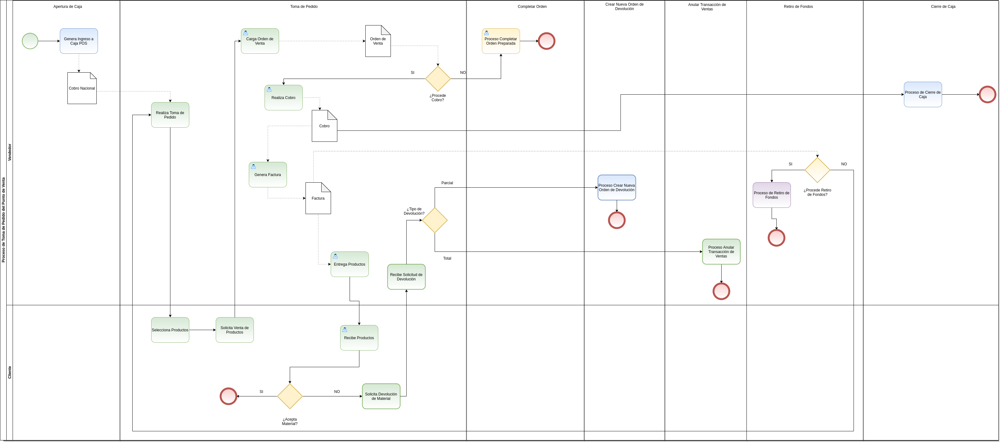

.. _ERPyA: http://erpya.com

.. |Menú de ADempiere| image:: resources/point-of-sale-menu.png
.. |ventana órdenes de venta del punto de venta| image:: resources/point-of-sale-sales-orders-window.png
.. |selección de formulario punto de venta| image:: resources/point-of-sale-form-selection.png
.. |ventana del formulario punto de venta| image:: resources/point-of-sale-form-window.png
.. |selección del cliente en el formulario punto de venta| image:: resources/customer-selection-in-the-point-of-sale-form.png
.. |carga de productos desde catálogo de productos del formulario punto de venta| image:: resources/product-catalog.png
.. |carga de productos desde el panel de búsqueda de productos del formulario punto de venta| image:: resources/loading-products-from-the-product-search-panel-of-the-point-of-sale-form.png
.. |líneas de la orden de venta en el formulario| image:: resources/sales-order-lines-in-the-form.png
.. |opciones del formulario del punto de venta| image:: resources/point-of-sale-form-options.png
.. |información de la orden de venta| image:: resources/sales-order-information.png

.. _documento/punto-de-venta:

**Toma de Pedido**
==================

El proceso toma de pedido consiste en la venta de los productos por medio del documento "**Orden de Venta**", en el cual se cargan los datos del cliente, los productos y el cobro. Al realizar el cobro de la misma, se generan de manera automática los documentos "**Cobro**", "**Factura por Cobrar**" y "**Entrega**".

El documento del cobro se genera en la ventana "**Caja**", con la cuenta caja pos en la cual se realizó dicho cobro. Este es asociado a la línea del registro de cierre de caja de la cuenta "**Caja POS**", creado al momento de la apertura de caja.

Adicional a ello, el documento "**Factura por Cobrar**", es generado en la ventana "**Documentos por Cobrar**". Mientras que el documento "**Entrega**", es generado en la ventana "**Entrega (Cliente)**".

Para mejor referencia de lo explicado anteriormente, se presenta a continuación el diagrama del proceso "**Toma de Pedido POS**", con la finalidad dar a conocer el comportamiento de ADempiere ante dicho proceso.

    |diagrama de toma de pedido pos|

    Imagen 1. Diagrama de Toma de Pedido POS

**Ejecución del Proceso**
-------------------------

#. Ubique y seleccione en el menú de ADempiere, la carpeta "**Gestión de Ventas**", luego seleccione la carpeta "**Órdenes de Venta**".

    |Menú de ADempiere|

    Imagen 2. Menú de ADempiere

#. Podrá visualizar la carpeta "**Órdenes de Venta**", con la ventana "**Órdenes de Venta**", que permite crear y modificar las mismas. Adicional a ello, también contiene la carpeta "**Punto de Venta**", con el formulario del punto de venta y el smart browser de cierre de caja.

    |ventana órdenes de venta del punto de venta|

    Imagen 3. Ventana Órdenes de Venta

#. Seleccione el formulario "**Punto de Venta**" que se encuentra dentro de la carpeta "**Punto de Ventas**".

    |selección de formulario punto de venta|

    Imagen 4. Selección de Formulario Punto de Venta

#. Podrá visualizar la ventana del formulario "**Punto de Venta**", con diferentes campos que permiten registrar en ADempiere de manera fácil y sencilla, la venta de los productos.

    |ventana del formulario punto de venta|

    Imagen 5. Ventana del Formulario Punto de Venta

#. La interfaz de la ventana del formulario "**Punto de Venta**", se encuentra definida de forma específica en el documento :ref:`documento/interfaz-del-punto-de-venta`, elaborado por `ERPyA`_. Realice cada uno de los procesos explicados a continuación para obtener un resultado exitoso en la toma de pedido por el punto de venta.

    .. note::

        El formulario "**Punto de Venta**", crea de manera automática un registro nuevo de "**Orden de Venta**", al cargar un producto al mismo.

#. Ingrese la información del socio del negocio "**Cliente**", en el campo "**Socio de Negocios**". Dicho procedimiento se encuentra explicado en el proceso :ref:`documento/paso-panel-de-socio-de-negocios`, del material :ref:`documento/interfaz-del-punto-de-venta`, elaborado por `ERPyA`_.

    |selección del cliente en el formulario punto de venta|

    Imagen 6. Selección del Cliente en el Formulario Punto de Venta

#. Proceda a cargar los productos desde el catálogo de productos. Dicho procedimiento se encuentra explicado en el proceso :ref:`documento/paso-catálogo-de-productos`, del material :ref:`documento/interfaz-del-punto-de-venta`, elaborado por `ERPyA`_.

    |carga de productos desde catálogo de productos del formulario punto de venta|

    Imagen 7. Carga de Productos desde el Catálogo de Productos

    .. note::

        Recuerde que en el catálogo de productos, cada categoría, grupo y producto se encuentra identificado por su nombre e imagen correspondiente al mismo, según la configuración de llave de disposición establecida previamente para el punto de ventas. Dicha configuración se encuentra explicada de manera detallada en el material :ref:``, elaborado por `ERPyA`_.

#. Si lo desea, puede ingresar los productos a la orden de venta ingresando el código o nombre del mismo en el panel de búsqueda de productos. Dicho panel se encuentra explicado de manera detallada en el material :ref:`documento/paso-panel-de-búsqueda-de-productos`, elaborado por `ERPyA`_.

    |carga de productos desde el panel de búsqueda de productos del formulario punto de venta|

    Imagen 8. Carga de Productos desde el Panel de Búsqueda de Productos

#. Podrá visualizar en las líneas de la orden, los productos cargados con su respesctivo precio, cantidad, porcentaje de descuento y total del producto. Esta sección se encuentra explicada de manera detallada en el material :ref:`documento/paso-líneas-de-la-orden`, elaborado por `ERPyA`_.

    |líneas de la orden de venta en el formulario|

    Imagen 9. Líneas de la Orden

#. Para posicionarse sobre un registro de la línea de la orden, eliminar el mismo o cobrar la orden de venta, puede realizarlo con ayuda de las opciones que contiene el punto de venta. Dichas opciones se encuentran explicadas en el material :ref:`documento/paso-opciones-del-punto-de-ventas`, elaborado por `ERPyA`_.

    |opciones del formulario del punto de venta|

    Imagen 10. Opciones del Punto de Venta

#. La información del registro de la orden en el que se encuentra, puede ser visualizada en la parte inferior derecha del formulario. Dicha sección se encuentra explicada de el material :ref:`documento/paso-información-de-la-orden`, elaborado por `ERPyA`_.

    |información de la orden de venta|

    Imagen 11. Información de la Orden