.. _ERPyA: http://erpya.com

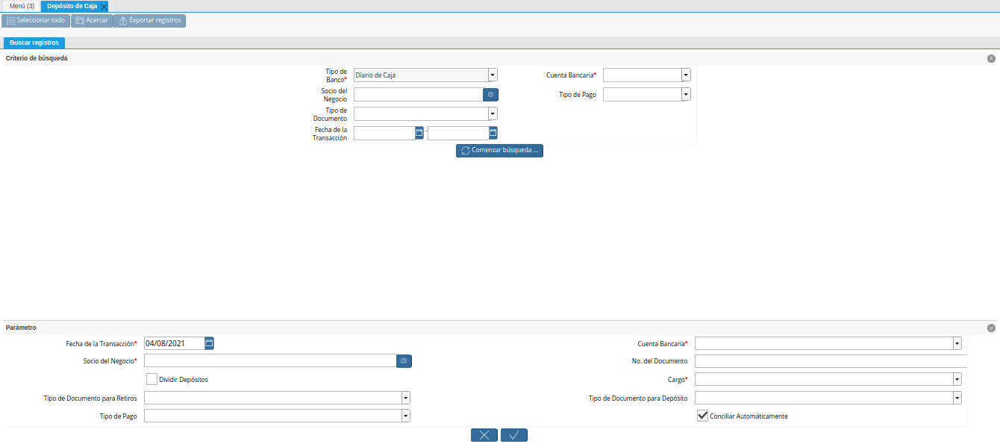

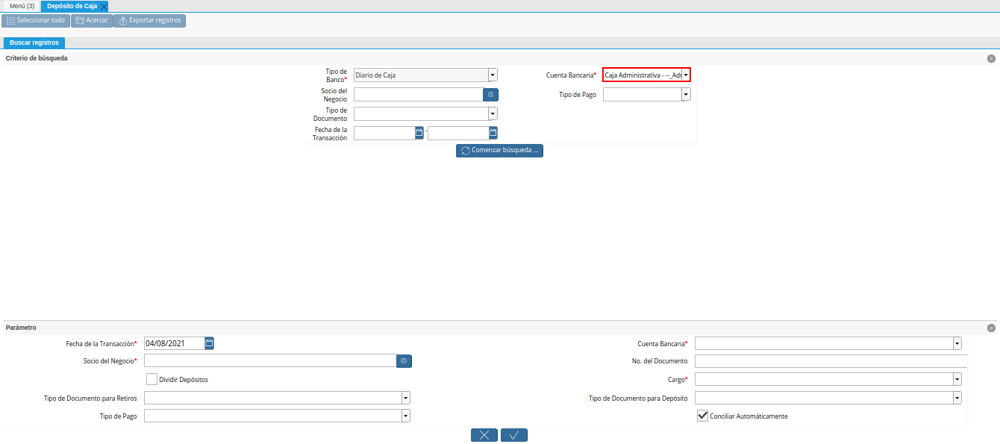
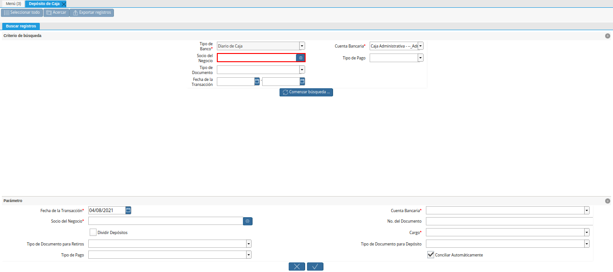
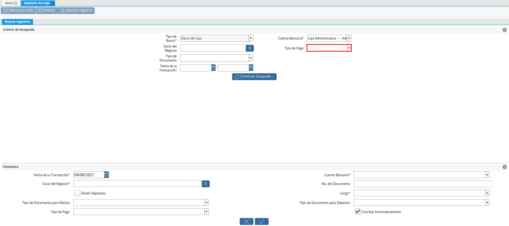
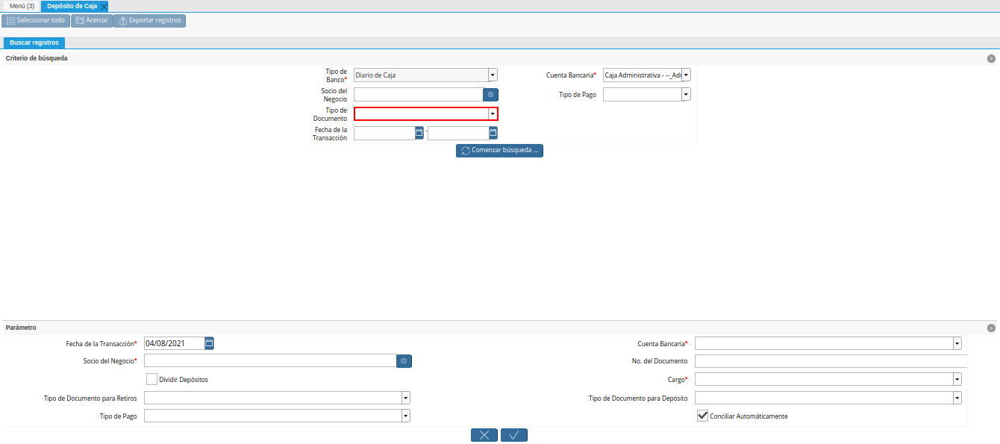

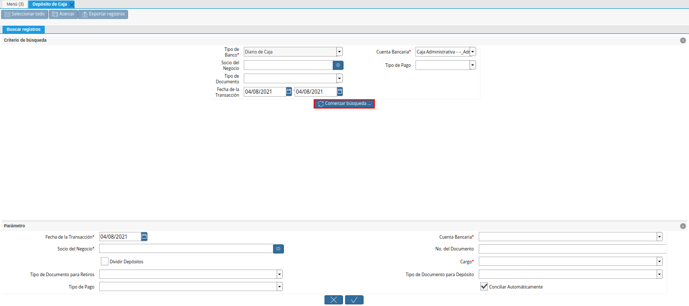

.. |seleccion de movimiento a depositar de la ventana deposito a caja| image:: resources/selection-of-movement-to-deposit-from-the-deposit-to-cash-window.png
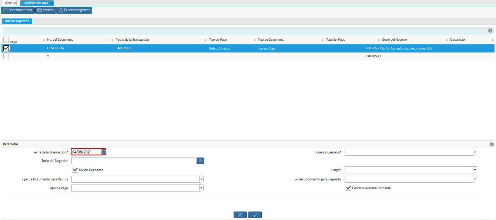
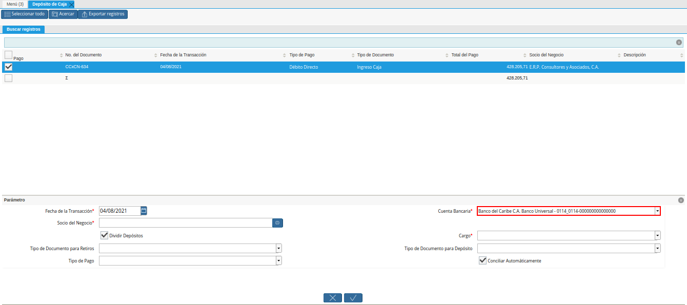

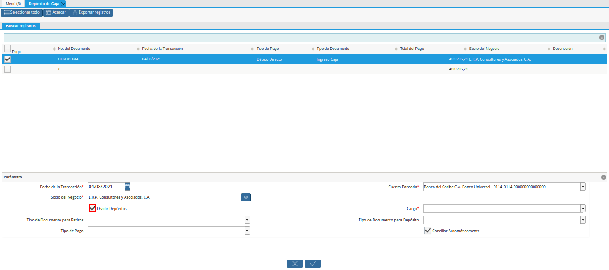
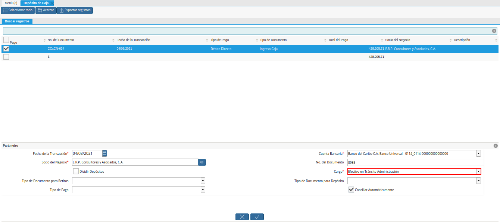
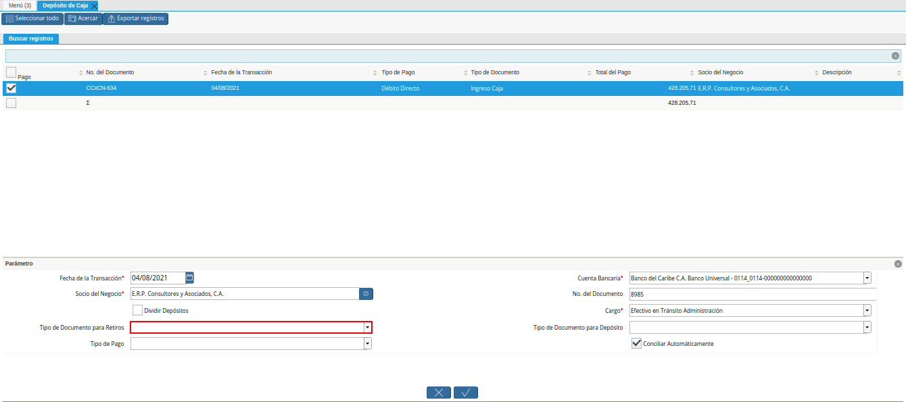
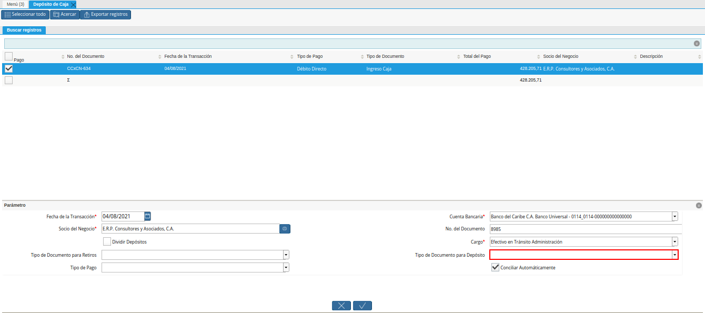
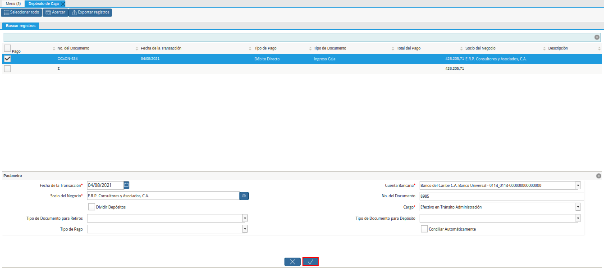
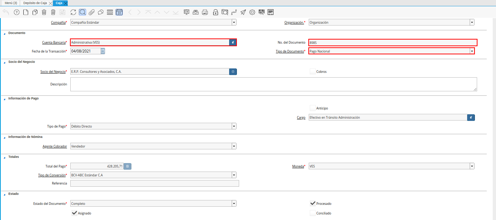
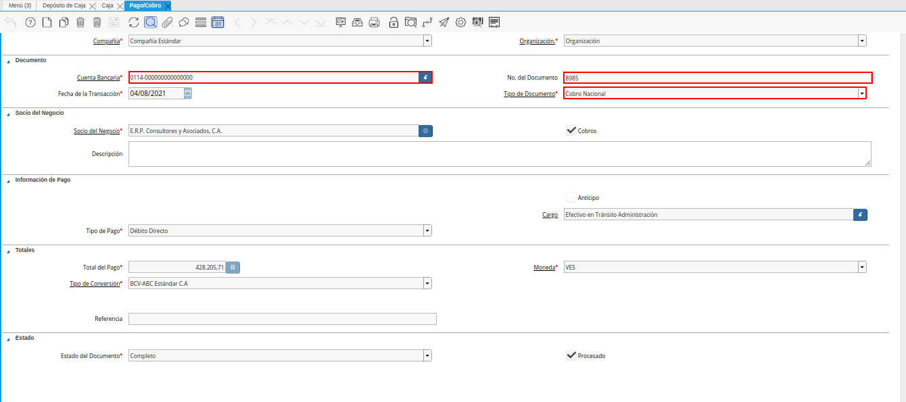
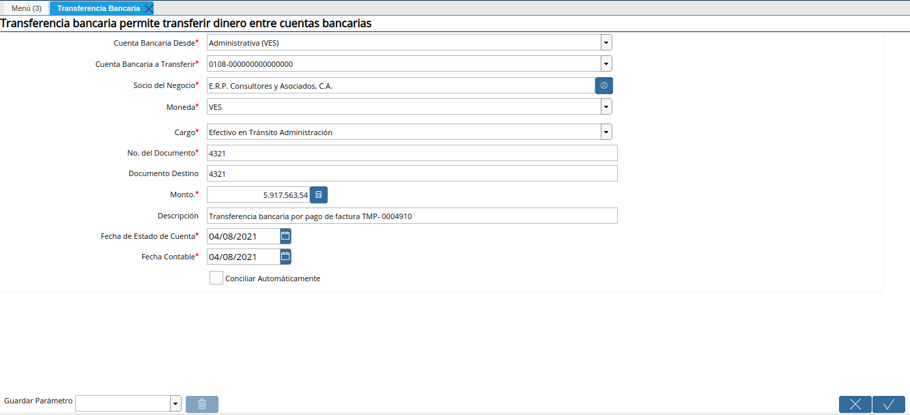
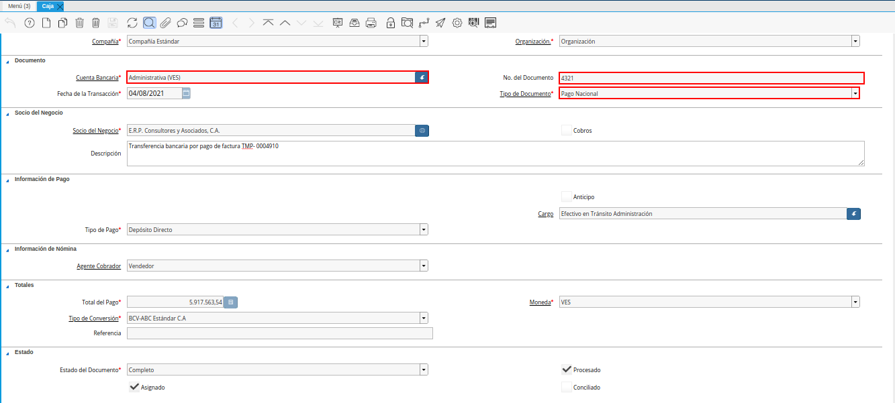
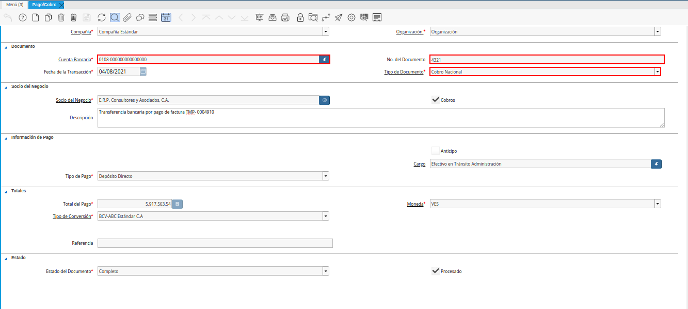

.. _documento/traspaso-a-banco:

**Traspaso a Banco**
====================

El procedimiento para registrar en ADempiere un traspaso monetario desde una caja a un banco determinado, se debe realizar de la siguiente manera.

Cuando se tiene solamente transacciones por tarjeta de débito o crédito, efectuadas por medio del punto de venta. Se debe realizar el proceso :ref:`documento/deposito-a-caja` y por último el proceso :ref:`documento/cierre-de-caja-por-depositos`, para llevar la caja a cero (0) nuevamente.

Si por el contrario, se tiene solamente transacciones por pago móvil y transferencia bancaria. Se debe realizar el proceso :ref:`documento/transferencia-bancaria-por-depositos` y por último el proceso :ref:`documento/cierre-de-caja-por-depositos`, para llevar la caja a cero (0) nuevamente.

Finalmente, se puede presentar el caso en el que se tengan todos los tipos de pago anteriormente nombrados. Para ello se debe realizar primeramente el proceso :ref:`documento/deposito-a-caja`, para reflejar en ADempiere las transacciones por tarjeta de débito o crédito. Luego se debe realizar el proceso :ref:`documento/transferencia-bancaria-por-depositos`, para reflejar en ADempiere las transacciones por pago móvil y transferencia bancaria. Por último el proceso :ref:`documento/cierre-de-caja-por-depositos`, para ejecutar el cruce de los saldos y poder llevar la cuenta caja a cero (0) nuevamente.

Para mejor referencia de lo explicado anteriormente, se presenta a continuación el diagrama del proceso "**Traspaso a Banco**", con la finalidad dar a conocer el comportamiento de ADempiere ante dicho proceso.

    |diagrama de traspaso a banco pos|

    Imagen 1. Diagrama de Traspaso a Banco POS

Cada uno de los procesos nombrados anteriormente son explicados a continuación.

.. _documento/deposito-a-caja:

**Depósito de Caja**
--------------------

#. Ubique y seleccione en el menú de ADempiere, la carpeta "**Gestión de Saldos Pendientes**", luego seleccione la carpeta "**Diario de Caja**", por último seleccione la ventana "**Depósito de Caja**".

    |menu deposito a caja|

    Imagen 2. Menú de ADempiere

#. Podrá visualizar la ventana de búsqueda inteligente "**Depósito de Caja**", que permite realizar el proceso de depósito de las diferentes cajas registradas en ADempiere. Esta ventana cuenta con diferentes campos que le permiten al ususario filtrar la búsqueda de registros en base a lo que sea seleccionado en los mismos.

    |ventana deposito a caja|

    Imagen 3. Ventana de Depósito a Caja

#. Podrá visualizar en el campo "**Tipo de Banco**", el tipo de banco que define el comportamiento de la ventana de búsqueda inteligente "**Depósito de Caja**".

    |campo tipo de banco de la ventana deposito a caja|

    Imagen 4. Campo Tipo de Banco

#. Seleccione en el campo "**Cuenta Bancaria**", la cuenta caja por la cual requiere filtar la búsqueda de la información. 

    |campo cuenta bancaria de la ventana deposito a caja|

    Imagen 5. Campo Cuenta Bancaria

    .. note::

        Para el realizar el depósito de caja a banco, se debe seleccionar la cuenta caja administrativa en la cual se encuentran los registros de los monto que serán transferidos a banco.

#. Seleccione en el campo "**Socio del Negocio**", el socio del negocio por el cual requiere filtar la búsqueda de la información.

    |campo socio del negocio de la ventana deposito a caja|

    Imagen 6. Campo Socio del Negocio 

#. Seleccione en el campo "**Tipo de Pago**", el tipo de pago por el cual requiere filtrar la búsqueda de la información.

    |campo tipo de pago de la ventana deposito a caja|

    Imagen 7. Campo Tipo de Pago

#. Seleccione en el campo "**Tipo de Documento**", el tipo de documento por el cual requiere filtar la búsquedade de la información.

    |campo tipo de documento de la ventana deposito a caja|

    Imagen 8. Campo Tipo de Documento

#. Seleccione en el campo "**Fecha de la Transacción**", la fecha de la transacción por la cual requiere filtrar la búsqueda de la información.

    |campo fecha de la transaccion de la ventana deposito a caja|

    Imagen 9. Campo Fecha de la Transacción

#. Seleccione la opción "**Comenzar Búsqueda**", para filtrar la búsqueda de la información en base a lo seleccionado en los campos anteriormente explicados.

    |opcion comenzar busqueda de la ventana deposito a caja|

    Imagen 10. Opción Comenzar Búsqueda

#. Podrá visualizar el listado de las transacciones registradas en ADempiere, en base a lo seleccionado en los campos anteriormente explicados.

    |listado de movimientos de la ventana deposito a caja|

    Imagen 11. Listado de Transacciones de ADempiere

#. Seleccione la transacción involucrada en el depósito que se encuentra realizando.

    |seleccion de movimiento a depositar de la ventana deposito a caja|

    Imagen 12. Selección de Transacción a Depositar 

#. Seleccione en el campo "**Fecha de la Transacción**", la fecha con la cual se va a generar el depósito de caja que se encuentra realizando.

    |campo fecha para la transaccion de la ventana deposito a caja|

    Imagen 13. Campo Fecha de la Transacción

#. Seleccione en el campo "**Cuenta Bancaria**", la cuenta bancaria a la cual se va a realizar el depósito de caja que se encuentra realizando.

    |campo cuenta bancaria a depositar de la ventana deposito a caja|

    Imagen 14. Campo Cuenta Bancaria

#. Seleccione en el campo "**Socio del Negocio**", el socio del negocio involucrado en el depósito que se encuentra realizando.

    |campo socio del negocio a depositar de la ventana deposito a caja|

    Imagen 15. Campo Socio del Negocio

#. Introduzca en el campo "**No. del Documento**", el número de documento con el cual se va a generar el depósito de caja que se encuentra realizando.

    |campo nro del documento de la ventana deposito a caja|

    Imagen 16. Campo No. de Documento

#. Seleccione el checklist "**Dividir Depósito**", si requiere dividir el depósito de caja que se encuentra realizando. Para este caso, no es necesario tildar el checklist "**Dividir Depósito**".

    |checklist dividir deposito de la ventana deposito a caja|

    Imagen 17. Checklist Dividir Depósito

#. Seleccione en el campo "**Cargo**", el cargo correspondiente al depósito de caja que se encuentra realizando. Para este caso se utiliza el cargo "**Efectivo en Transito Administración Ventas**".

    |campo cargo de la ventana deposito a caja|

    Imagen 18. Campo Cargo

#. Seleccione en el campo "**Tipo de Documento para Retiros**", el tipo de documento para retiros. Para este caso, no es necesario seleccionar el tipo de documento para retiros.

    |campo tipo de documento para retiros de la ventana deposito a caja|

    Imagen 19. Campo Tipo de Documento para Retiros

#. Seleccione en el campo "**Tipo de Documento para Depósito**", el tipo de documento para depósito. Para este caso, no es necesario seleccionar el tipo de documento para depósito.

    |campo tipo de documento para deposito de la ventana deposito a caja|

    Imagen 20. Campo Tipo de Documento

#. Seleccione la opción "**OK**", para ejecutar el proceso y realizar el depósito de caja a banco.

    |opcion ok de la ventana deposito a caja|

    Imagen 21. Opción OK

**Consultar Egreso e Ingreso Generado del Depósito**
****************************************************

#. Al consultar el documento de egreso generado en la ventana "**Caja**", con ayuda del número de documento ingresado en el campo "**No. del Documento**" de la ventana "**Depósito de Caja**".

    |consulta de egreso en caja por deposito|

    Imagen 22. Egreso Generado en Caja 

#. Al consultar el documento de ingreso generado en la ventana "**Pago/Cobro**", con ayuda del número de documento ingresado en el campo "**No. del Documento**" de la ventana "**Depósito de Caja**".

    |consulta de ingreso en banco por deposito|

    Imagen 23. Ingreso Generado en Banco

.. _documento/transferencia-bancaria-por-depositos:

**Transferencia Bancaria**
--------------------------

#. Realice el procedimiento regular para registrar una transferencia bancaria en ADempiere, el mismo se encuentra explicado de manera detallada en el documento :ref:`documento/procedimiento-para-realizar-una-transferencia-bancaria`, elaborado por `ERPyA`_. Considerando las siguientes restricciones:

    - "**Cuenta Bancaria Desde**": La caja desde la cual requiere realizar la transferencia. Para este ejemplo es utilizada la caja "**Caja Administrativa**".
    - "**Cuenta Bancaria a Transferir**": El banco al cual requiere realizar la transferencia. Para este ejemplo es utilizado el banco "**Mercantil**".
    - "**Socio del Negocio**": El socio del negocio involucrado en la transferencia bancaria. Para este ejemplo es utilizado el socio "**Estándar**".
    - "**Moneda**": La moneda con la cual requiere realizar la transferencia. Para este ejemplo es utilizada la moneda "**VES**".
    - "**Cargo**": El cargo que jistifica el movimiento monetario. Para este ejemplo es utilizado el cargo "**Efectivo en Tránsito Administración Venta**".
    - "**No. del Documento**": El número de documento con el que será generado el egreso de la caja. Para este ejemplo es utilizado el número "**0003**".
    - "**Documento Destino**": El número de documento con el que será generado el ingreso del banco. Para este ejemplo es utilizado el número "**0004**".
    - "**Monto**": El monto correspondiente a la transferencia bancaria que requiere generar. Para este ejemplo es utilizado el monto "**348.000,00**".
    - "**Descripción**": Una breve descripción relacionada a la transferencia que requiere generar. Para este ejemplo es utilizado como descripción "**Transferencia de caja a banco**".
    - "**Fecha de Estado de Cuenta**": La fecha en la cual se encuentra realizando la transferencia bancaria.
    - "**Fecha Contable**": La fecha en la cual se encuentra realizando la transferencia bancaria.

    |transferencia bancaria de caja a banco por depositos|

    Imagen 24. Transferencia Bancaria 

    .. warning::

        Recuerde que se debe realizar una transferencia bancaria por cada pago móvil y transferencia bancaria recibida.

**Consultar Egreso e Ingreso Generado de la Transferencia**
***********************************************************

#. Al consultar el documento de egreso generado en la ventana "**Caja**", con ayuda del número de documento ingresado en el campo "**No. del Documento**" de la ventana "**Transferencia Bancaria**".

    |consulta de egreso en caja por transferencia de deposito|

    Imagen 25. Egreso Generado en Caja 

#. Al consultar el documento de ingreso generado en la ventana "**Pago/Cobro**", con ayuda del número de documento ingresado en el campo "**Documento Destino**" de la ventana "**Transferencia Bancaria**".

    |consulta de ingreso en banco por por transferencia de deposito|

    Imagen 26. Ingreso Generado en Banco

.. _documento/cierre-de-caja-por-depositos:

**Cierre de Caja**
------------------

#. Realice el procedimiento regular para registrar un cierre de caja en ADempiere, el mismo se encuentra explicado de manera detallada en el documento :ref:`documento/procedimiento-para-realizar-un-cierre-de-caja`, elaborado por `ERPyA`_. 

    .. note::

        Se selecciona la caja administrativa para llevar esta a cero (0) nuevamente, transfiriendo el saldo de la caja al banco.

    En la ejecución del procedimiento de cierre de caja, se debe considerar las siguientes restricciones:

    - "**Cuenta**": Caja Administrativa.
    - "**Tipo de Documento**": Extracto Bancario

    .. warning::

        Recuerde cargar las transacciones seleccionando la opción "**Crear a Partir de Caja**", donde debe seleccionar los movimientos creados en la ventana "**Caja**", obtenidos como resultado de los procesos :ref:`documento/deposito-a-caja` y :ref:`documento/transferencia-bancaria-por-depositos`, previamente realizados.

    |cierre de caja completo por traspaso a banco|

    Imagen 27. Cierre de Caja