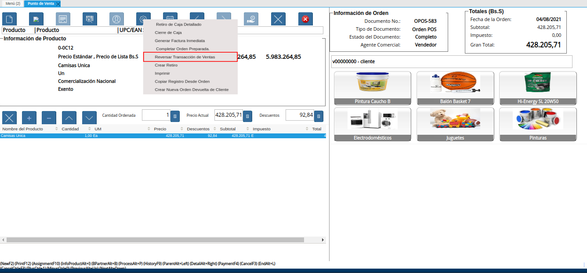

.. _ERPyA: http://erpya.com
.. |Menú de ADempiere| image:: resources/point-of-sale-menu.png

.. |Nota de Crédito Generada| image:: resources/credit-note-generated.png

.. |consulta de devolución generada| image:: resources/return-query-generated.png
.. |consulta de nota de crédito generada| image:: resources/credit-note-query-generated.png
.. |consulta de pago nacional generado en caja| image:: resources/checkout-generated-national-payment-query.png

.. _documento/anular-transacción-de-venta:

**Anular Transacción de Venta**
===============================

El proceo "**Anular Transacción de Venta**", permite realizar la devolución total de la venta, generando de manera automática y en estado "**Completo**", los documentos "**Orden de Devolución**", "**Devolución**" y "**Nota de Crédito**", para ello se debe realizar el siguiente procedimiento.

#. Ubique y seleccione en el menú de ADempiere, la carpeta "**Gestión de Ventas**", luego seleccione la carpeta "**Órdenes de Venta**", por último seleccione la carpeta "**Punto de Venta**". Para finalizar, seleccione la ventana "**Punto de Venta**".

    |Menú de ADempiere|

    Imagen 1. Menú de ADempiere

#. La interfaz de la ventana "**Punto de Venta**", se encuentra definida de forma específica en el documento :ref:`documento/interfaz-del-punto-de-venta`, elaborado por `ERPyA`_. Realice cada uno de los procesos explicados a continuación para obtener un resultado exitoso en la anulación de la transacción de venta por el punto de venta.

#. Realice la búsqueda de registros de órdenes de venta generadas desde el punto de venta, seleccionando el icono "**Registros Históricos**" de la barra de herramientas de la ventana "**Punto de Venta**", dicho proceso se encuentra explicado en el documento :ref:`documento/paso-barra-de-herramientas`, elaborado por `ERPyA`_.

    #. Seleccione en la ventana "**Orden de Venta**", generada del icono "**Registros Históricos**", la orden de venta que requiere anular.

        |Selección de Orden de Venta a Anular|

        Imagen 2. Selección de Orden de Venta a Anular

    #. Por último, seleccione la opción "**OK**" para ubicar en la ventana "**Punto de Venta**", el registro de la orden de venta realizada desde el punto de venta.

        |Selección de la Opción OK de la Orden de Venta a Anular|

        Imagen 3. Selección de la Opción OK de la Orden de Venta a Anular

#. Luego de ubicar la orden de venta que requiere anular, seleccione la opción "**Anular Transacción de Venta**", ubicada en el menú desplegado por el icono "**Proceso**" de la barra de herramientas de la ventana "**Punto de Venta**", explicada en el documento :ref:`documento/paso-barra-de-herramientas` elaborado por `ERPyA`_.

    |Opción Anular Transacción de Venta del Icono Proceso de la Barra de Herramientas del Punto de Venta|

    Imagen 4. Opción Anular Transacción de Venta del Icono Proceso de la Barra de Herramientas del Punto de Venta

#. Al seleccionar el proceso "**Anular Transacción de Venta**", ADempiere muestra el mensaje para la confirmación de la ejecución del proceso, en el cual se debe seleccionar la opción "**OK**", para ejecutar el mismo.

    |Mensaje de Confirmación|
    
    Imagen 5. Mensaje para Confirmación de Proceso

#. Luego de ejecutar la acción anteriormente explicada, ADempiere muestra un mensaje con el resultado del proceso.

    |Resultado del Proceso Anular Transacción de Venta|

    Imagen 6. Resultado del Proceso Anular Transacción de Venta

#. Por último, se muestra el reporte del documento "**Nota de Crédito de CxC**" generada automáticamente desde el proceso "**Anular Transacción de Venta**".

    |Nota de Crédito Generada|

    Imagen 7. Nota de Crédito de CxC Generada Automáticamente

**Consulta de Documentos Generados**
------------------------------------

#. En la ventana "**Orden de Devolución (Cliente)**", se puede visualizar el registro de la orden de devolución con ayuda del número de documento "**OPOS-36106**" generado en el reporte de la nota de crédito mostrada anteriormente.
    
    |consulta de orden de devolución generada|

    Imagen 8. Consulta de Orden de Devolución Generada 

#. De igual manera, se puede visualizar en la ventana "**Devolución Cliente**", el registro generado desde el proceso anteriormente explicado.

    |consulta de devolución generada|

    Imagen 9. Consulta de Devolución Generada

#. Finalmente, se puede visualizar en la ventana "**Documentos por Cobrar**", el registro de la nota de crédito generado automáticamente desde el proceso anteriormente explicado.

    |consulta de nota de crédito generada|

    Imagen 10. Consulta de Nota de Crédito Generada

#. Adicional a ello, se genera un egreso en caja con el tipo de documento "**Pago Nacional**", para reflejar el movimiento de egreso realizado automáticamente al ejecutar el proceso "**Anular Transacción de Venta**".

    |consulta de pago nacional generado en caja|

    Imagen 11. Consulta de Pago Nacional Generado en Caja