.. |Menú de ADempiere| image:: resources/point-of-sale-menu.png
.. |Opción Crear Retiro de POS| image:: resources/point-of-sale-window.png
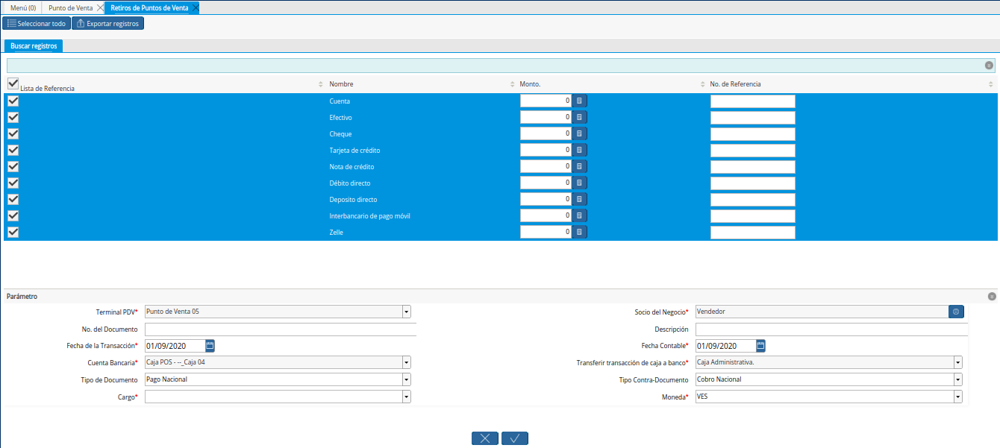

.. |Campo de la Ventana Retiros de Puntos de Venta| image:: resources/
.. |Campo de la Ventana Retiros de Puntos de Venta| image:: resources/

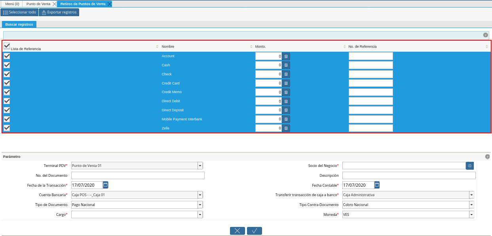
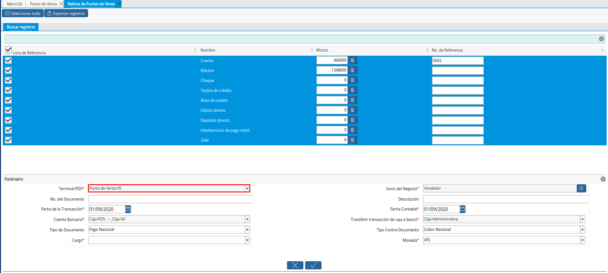
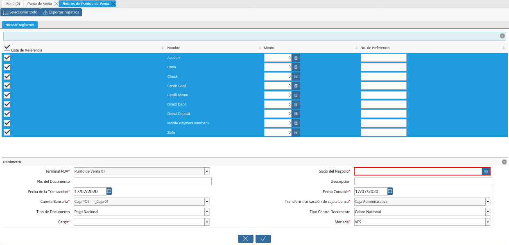
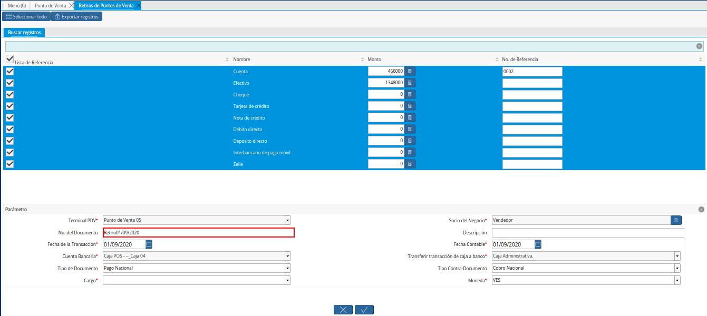
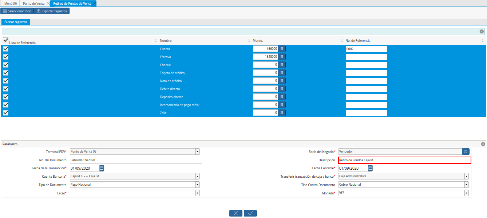
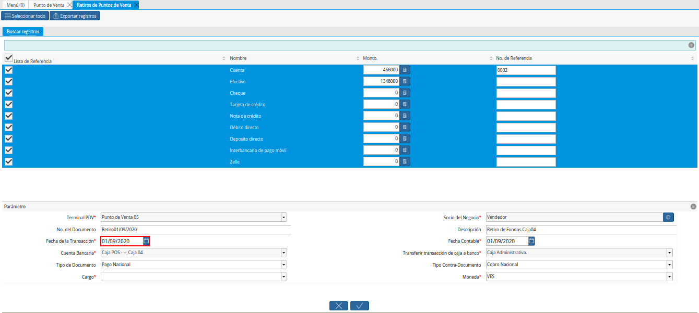
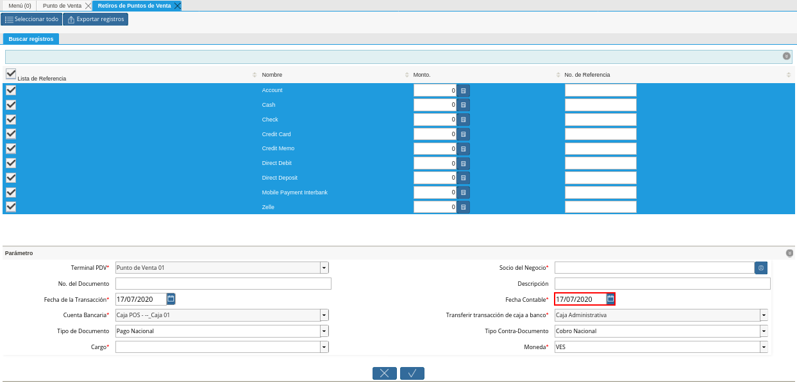
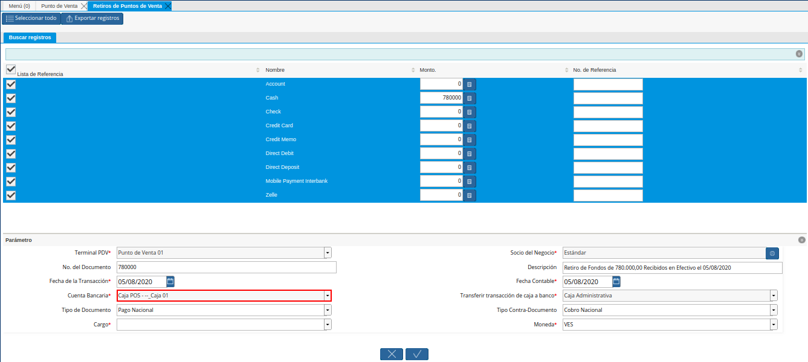
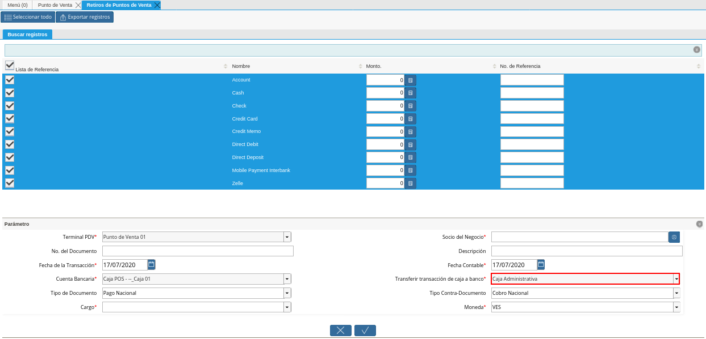

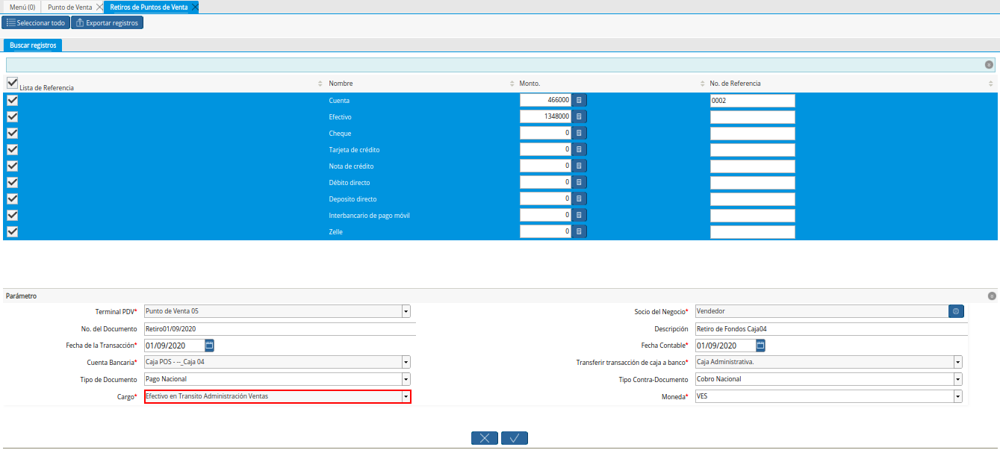
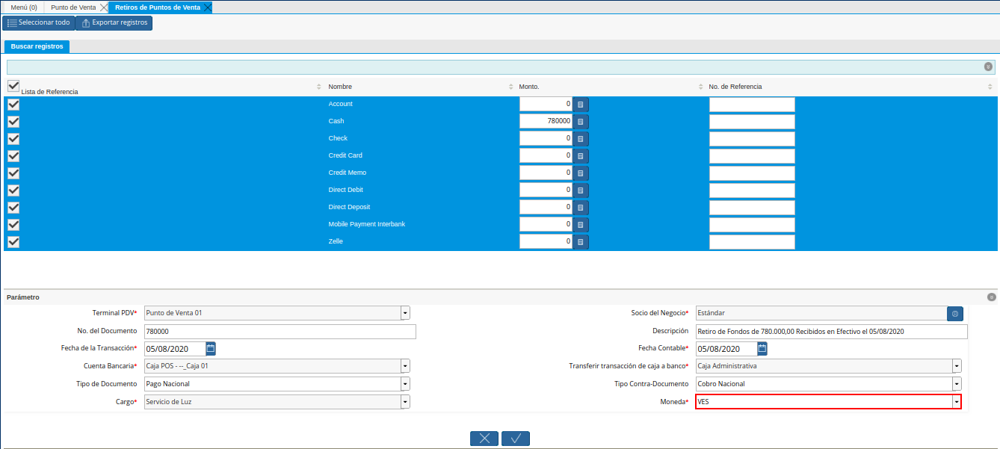
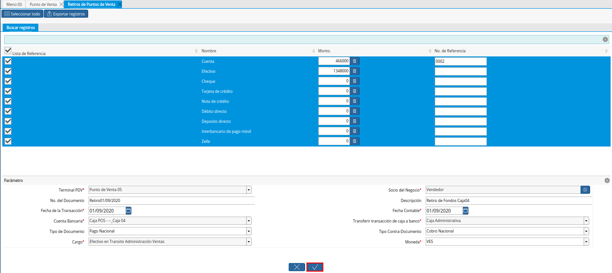
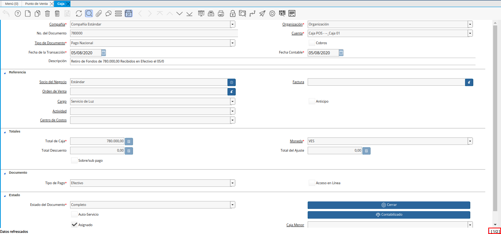

.. _documento/retiro-de-fondos-de-punto-de-venta:

**Retiro de Fondos de Punto de Venta**
======================================

#. Ubique y seleccione en el menú de ADempiere, la carpeta "**Gestión de Ventas**", luego seleccione la carpeta "**Órdenes de Venta**", por último seleccione la carpeta "**Punto de Venta**". Para finalizar, seleccione la ventana "**Punto de Venta**".

    |Menú de ADempiere|

    Imagen 1. Menú de ADempiere

#. Luego de realizar desde el punto de venta todas las tomas de pedido del día, seleccione la opción "**Crear Retiro de POS**", ubicada en el menú desplegado por el icono "**Proceso**" de la barra de herramientas de la ventana "**Punto de Venta**".

    |Opción Crear Retiro de POS|

    Imagen 2. Opción Crear Retiro de POS

#. Podrá visualizar la ventana "**Retiros de Puntos de Venta**", con diferentes campos que permiten filtrar la búsqueda de información según lo requerido por el socio del negocio vendedor que esta realizando el retiro de fondos.

    |Ventana Retiros de Puntos de Venta|

    Imagen 3. Ventana Retiros de Puntos de Venta

    #. Seleccione en el campo 

        |Campo de la Ventana Retiros de Puntos de Venta|

        Imagen 4. Campo de la Ventana Retiros de Puntos de Venta

    #. Seleccione en el campo 

        |Campo de la Ventana Retiros de Puntos de Venta|

        Imagen 5. Campo de la Ventana Retiros de Puntos de Venta

#. Podrá visualizar un listado de referencia con los diferentes tipos de pagos que contempla ADempiere, donde debe indicar el monto recibido por cada forma de pago.

    |Listado de Referencia de la Ventana Retiros de Puntos de Venta|

    Imagen 6. Listado de Referencia de la Ventana Retiros de Puntos de Venta

    .. note::

        Es importante que este procedimiento sea realizado por moneda, es dicir, que sean ingresados los montos recibidos por cada forma de pago en una misma moneda. 

        Para cargar los montos recibidos por cada forma de pago en una moneda diferente se debe realizar otro retiro de fondos.

#. En el grupo de campos "**Parámetro**", podrá visualizar los siguientes campos:

    #. En el campo "**Terminal PDV**", podrá visualizar el terminal configurado para el socio del negocio vendedor.

        |Campo Terminal PDV de la Ventana Retiros de Puntos de Venta|

        Imagen 7. Campo Terminal PDV de la Ventana Retiros de Puntos de Venta

    #. En el campo "**Socio del Negocio**", debe seleccionar el socio del negocio.

        |Campo Socio del Negocio de la Ventana Retiros de Puntos de Venta|

        Imagen 8. Campo Socio del Negocio de la Ventana Retiros de Puntos de Venta

    #. En el campo "**No. del Documento**", se debe ingresar el número de documento con el cual se va a generar el documento "**Pago**" en la ventana "**Caja**".

        |Campo No del Documento de la Ventana Retiros de Puntos de Venta|

        Imagen 9. Campo No. del Documento de la Ventana Retiros de Puntos de Venta

    #. En el campo "**Descripción**", se debe ingresar una breve descripción del retiro de punto de venta que esta realizando.

        |Campo Descripción de la Ventana Retiros de Puntos de Venta|

        Imagen 10. Campo Descripción de la Ventana Retiros de Puntos de Venta

    #. En el campo "**Fecha de la Transacción**", podrá visualizar la fecha en la cual se esta realizando el retiro de fondos de punto de venta.

        |Campo Fecha de la Transacción de la Ventana Retiros de Puntos de Venta|

        Imagen 11. Campo Fecha de la Transacción de la Ventana Retiros de Puntos de Venta

    #. En el campo "**Fecha Contable**", podrá visualizar la fecha en la cual se esta realizando el retiro de fondos de punto de venta.

        |Campo Fecha Contable de la Ventana Retiros de Puntos de Venta|

        Imagen 12. Campo Fecha Contable de la Ventana Retiros de Puntos de Venta

    #. En el campo "**Cuenta Bancaria**", podrá visualizar la cuenta caja asociada al socio del negocio vendedor en la configuración del terminal PDV.

        |Campo Cuenta Bancaria de la Ventana Retiros de Puntos de Venta|

        Imagen 13. Campo Cuenta Bancaria de la Ventana Retiros de Puntos de Venta

    #. En el campo "**Transferir Transacción de Caja a Banco**", podrá visualizar la cuenta a la cual serán transferidas todas las transacciones de la caja.

        |Campo Transferir Transacción de Caja a Banco de la Ventana Retiros de Puntos de Venta|

        Imagen 14. Campo Transferir Transacción de Caja a Banco de la Ventana Retiros de Puntos de Venta

    #. En el campo "**Tipo de Documento**", podrá visualizar el tipo de documento con el cual será generado el documento "**Pago**" en la ventana "**Caja**".

        |Campo Tipo de Documento de la Ventana Retiros de Puntos de Venta|

        Imagen 15. Campo Tipo de Documento de la Ventana Retiros de Puntos de Venta

    #. En el campo "**Tipo Contra-Documento**", podrá visualizar el tipo de contra documento con el cual será generado el documento "**Pago**" en la ventana "**Caja**".

        |Campo Tipo Contra Documento de la Ventana Retiros de Puntos de Venta|

        Imagen 16. Campo Tipo Contra-Documento de la Ventana Retiros de Puntos de Venta

    #. Seleccione en el campo "**Cargo**", el cargo correspondiente al retiro de fondos que se encuentra realizando desde el punto de venta.

        |Campo Cargo de la Ventana Retiros de Puntos de Venta|

        Imagen 17. Campo Cargo de la Ventana Retiros de Puntos de Venta

    #. Seleccione en el campo "**Moneda**", la moneda correspondiente al retiro de fondos que se encuentra realizando desde el punto de venta.

        |Campo Moneda de la Ventana Retiros de Puntos de Venta|

        Imagen 18. Campo Moneda de la Ventana Retiros de Puntos de Venta

#. Seleccione la opción "**OK**", para realizar el retiro de fondos del punto de venta con los cobros seleccionados y generar el documento "**Pago**", en la ventana "**Caja**".

    |Opción OK de la Ventana Retiros de Puntos de Venta|

    Imagen 19. Opción OK de la Ventana Retiros de Puntos de Venta

.. note::

    Todos los retiros de fondos realizados en el punto de venta, crean un documento de pago en la ventana "**Caja**".

**Consulta de Retiro de Fondos de Punto de Venta**
--------------------------------------------------

#. Ubique el documento de pago generado en la ventana "**Caja**", con ayuda del número de documento ingresado en el campo "**No. del Documento**", de la ventana "**Retiros de Puntos de Venta**".

    |Documento de Pago Generado en Caja|

    Imagen 20. Documento de Pago Generado en Caja