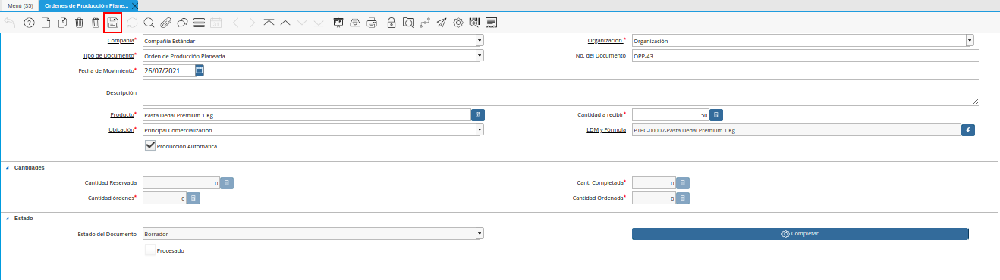
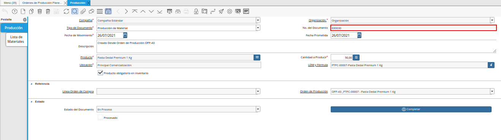

.. _ERPyA: http://erpya.com
.. |Menú de orden de producción planeada| image:: resources/menu-of-planned-production-orders.png
.. |Ventana Órdenes de Producción Planeadas| image:: resources/planned-production-order-window.png
.. |Icono Registro Nuevo de la ventana órdenes de producción planeadas| image:: resources/new-record-icon.png
.. |Campo Organización de la Ventana Órdenes de Producción Planeadas| image:: resources/field-organization-of-planned-production-orders-window.png
.. |Campo Tipo de Documento de la Ventana Órdenes de Producción Planeadas| image:: resources/document-type-field-in-the-planned-production-orders-window.png
.. |Campo No del Documento de la Ventana Órdenes de Producción Planeadas| image:: resources/field-no-the-planned-production-orders-window-document.png
.. |Campo Fecha de Movimiento de la Ventana Órdenes de Producción Planeadas| image:: resources/planned-move-orders-window-move-date-field.png
.. |Campo Descripción de la Ventana Órdenes de Producción Planeadas| image:: resources/description-field-of-the-planned-production-orders-window.png
.. |Campo Producto de la Ventana Órdenes de Producción Planeadas| image:: resources/product-field-from-the-planned-production-orders-window.png
.. |Campo Cantidad a Recibir de la Ventana Órdenes de Producción Planeadas| image:: resources/quantity-field-to-receive-from-the-planned-production-orders-window.png
.. |Checklist Producción Automática de la Ventana Órdenes de Producción Planeadas| image:: resources/automatic-production-checklist-from-planned-production-orders-window.png
.. |Campo Ubicación de la Ventana Órdenes de Producción Planeadas| image:: resources/planned-production-orders-window-location-field.png
.. |Campo LDM y Fórmula de la Ventana Órdenes de Producción Planeadas| image:: resources/ldm-field-and-formula-for-planned-production-orders-window.png
.. |Campo Cantidad Ordenada de la Ventana Órdenes de Producción Planeadas| image:: resources/ordered-quantity-field-in-the-planned-production-orders-window.png

.. |Campo Cantidad Completada de la Ventana Órdenes de Producción Planeadas| image:: resources/quantity-completed-field-of-planned-production-orders-window.png
.. |Campo Cantidad Órdenes de la Ventana Órdenes de Producción Planeadas| image:: resources/field-orders-quantity-from-the-planned-production-orders-window.png
.. |Opción Completar de la Pestaña Lote de Producción de la Ventana Órdenes de Producción Planeadas| image:: resources/complete-option-from-the-production-batch-tab-of-the-planned-production-orders-window.png
.. |Acción Completar y Opción OK| image:: resources/action-complete-and-option-ok.png
.. |Campo Cantidad Ordenada Luego de Completar el Documento| image:: resources/field-ordered-quantity-set-to-complete-the-document.png

.. _documento/orden-de-producción-planeada:

**Orden de Producción Planeada**
================================

Una orden de producción parte del proceso de planificación de producción de una determinada empresa, es elaborada basandose en los materiales o insumos de producción con los que cuenta la misma. Una vez ya planificada la producción se procede a realizar la autorización, o bien, la orden de producción.

Por medio de este documento se lleva un control de los materiales, gastos, y el tiempo empleado por los trabajadores o maquinarias. Adicional a ello, indica los productos y la cantidad que se debe producir en un tiempo estimado.

Una vez definida y cargada la lista de materiales en ADempiere, se puede ejecutar una producción para así dar existencia al producto terminado. Para ello, primeramente se debe crear una orden de producción, que no es más que la planificación o estimación de lo que se desea producir.

**¿Por que crear una orden de producción planeada?** por que en muchos casos las compañías suelen planificar cual va a ser la cantidad a producir en un tiempo predeterminado, pero pueden ser muchos los escenarios (pocos insumos de producción, daños en los equipos de producción, pocos recursos de horas hombres para llevar a cabo el seguimiento de producción, entre otros), que no permitan aplicar o realizar por completo la producción planeada. Es por ello que se realiza la "**Orden de Producción Planeada**", para comprender mejor este proceso se presenta el siguiente escenario:

    - La empresa "**ABC Estándar C.A**" desea producir para el día "**26/07/2021**", "**50 Unidades**" del producto "**Pasta Dedal Premium 1 Kg**".

Para poder crear una "**Orden de Producción Planeda**" en ADempiere se requieren aplicar los siguientes pasos:

**Registro de Orden de Producción Planeada**
--------------------------------------------

Ubique y seleccione en el menú de ADempiere, la carpeta "**Gestión de Materiales**", luego seleccione la carpeta "**Producción Ligera**", por último seleccione la ventana "**Órdenes de Producción Planeadas**".

    |Menú de orden de producción planeada|

    Imagen 1. Menú de ADempiere

Podrá visualizar la ventana "**Órdenes de Producción Planeadas**", con todos los registros de órdenes de producción planeadas.

    |Ventana Órdenes de Producción Planeadas|

    Imagen 2. Ventana Órdenes de Producción Planeadas

Seleccione en el icono "**Registro Nuevo**", ubicado en la barra de herramientas de ADempiere, para crear un nuevo registro en la ventana "**Órdenes de Producción Planeadas**".

    |Icono Registro Nuevo de la ventana órdenes de producción planeadas|

    Imagen 3. Icono Registro Nuevo

Seleccione en el campo "**Organización**, la organización para la cual esta realizando el documento.

    |Campo Organización de la Ventana Órdenes de Producción Planeadas|

    Imagen 4. Campo Organización de la Ventana Órdenes de Producción Planeadas

Seleccione el tipo de documento a generar en el campo "**Tipo de Documento Destino**", la selección de este define el comportamiento del documento que se esta elaborando, dicho comportamiento se encuentra explicado en el documento **Tipo de Documento** elaborado por `ERPyA`_. Para este caso el tipo de documento a seleccionar es "**Orden de Producción Planeada**".

    |Campo Tipo de Documento de la Ventana Órdenes de Producción Planeadas|

    Imagen 5. Campo Tipo de Documento de la Ventana Órdenes de Producción Planeadas

Introduzca en el campo "**No. del Documento**", el número de secuencia correspondiente al documento que esta realizando.

    |Campo No del Documento de la Ventana Órdenes de Producción Planeadas|

    Imagen 6. Campo No del Documento de la Ventana Órdenes de Producción Planeadas

    .. note::

        Si no es ingresado ningún valor en este campo, ADempiere tomará el número de documento correspondiente a la secuencia que tiene el tipo de documento establecido.

Seleccione en el campo "**Fecha de Movimiento**", la fecha en la cual se esta realizando la producción. Continuando con el ejemplo planteado, la fecha a ingresar es "**26/07/2021**".

    |Campo Fecha de Movimiento de la Ventana Órdenes de Producción Planeadas|

    Imagen 7. Campo Fecha de Movimiento de la Ventana Órdenes de Producción Planeadas

    .. note::

        Este campo tomará automáticamente la fecha del día en que se este trabajando en ADempiere, si la producción a registrar o realizar en ADempiere pertenece a una fecha anterior, este campo puede ser modificable para colocar la fecha real.

Introduzca en el campo "**Descripción**", una breve descripción de la orden de producción que se encuentra realizando. Este campo no es un campo obligatorio así que de no poseer alguna información descriptiva de la producción a realizar se puede dejar en blanco.

    |Campo Descripción de la Ventana Órdenes de Producción Planeadas|

    Imagen 8. Campo Descripción de la Ventana Órdenes de Producción Planeadas

Seleccione en el campo "**Producto**", el producto terminado involucrado en la orden de producción que se encuentra realizando. Siguiendo el escenario planteado en esta documentación, el producto terminado a seleccionar es "**Pasta Dedal Premium 1 Kg**"

    |Campo Producto de la Ventana Órdenes de Producción Planeadas|

    Imagen 9. Campo Producto de la Ventana Órdenes de Producción Planeadas

Introduzca en el campo "**Cantidad a Recibir**", la cantidad a producir del producto seleccionado. En el escenario expuesto en el presente documento, se comenta que se desea producir "**50 Unidades**", por lo que la cantidad a ingresar en este caso es "**50**".

    |Campo Cantidad a Recibir de la Ventana Órdenes de Producción Planeadas|

    Imagen 10. Campo Cantidad a Recibir de la Ventana Órdenes de Producción Planeadas

Seleccione en el campo "**Ubicación**", la ubicación exacta en el almacén en la cual se encontrará el producto terminado una vez se cumpla la producción.

    |Campo Ubicación de la Ventana Órdenes de Producción Planeadas|

    Imagen 11. Cam Ubicación de la Ventana Órdenes de Producción Planeadas

Seleccione en el campo "**LDM y Fórmula**", la lista de materiales que tenga asociado el producto terminado y la fórmula necesaria para la producción de dicho producto. Continuando con el ejemplo expuesto anteriormente, se debe seleccionar la :ref:`documento/lista-de-materiales` que el producto terminado "**Pasta Dedal Premium 1 Kg**", tiene asociada.

    |Campo LDM y Fórmula de la Ventana Órdenes de Producción Planeadas|

    Imagen 12. Campo LDM y Fórmula de la Ventana Órdenes de Producción Planeadas

El check "**Producción Automática**", indica que a partir de este registro de la "**Orden de Producción**" se generará automáticamente la producción del producto terminado. Para que la producción se cumpla de manera automática, este check debe estar siempre activo, de lo contrario no se cumplirá la producción en su totalidad.

    |Checklist Producción Automática de la Ventana Órdenes de Producción Planeadas|

    Imagen 13. Checklist Producción Automática de la Ventana Órdenes de Producción Planeadas

Podrá visualizar en el campo "**Cant. Completada**", la cantidad realizada por completo del producto terminado.

    |Campo Cantidad Completada de la Ventana Órdenes de Producción Planeadas|

    Imagen 14. Campo Cant Completada de la Ventana Órdenes de Producción Planeadas

Podrá visualizar en el campo "**Cantidad Órdenes**", la cantidad solicitada del producto en órdenes.

    |Campo Cantidad Órdenes de la Ventana Órdenes de Producción Planeadas|

    Imagen 15. Campo Cantidad Órdenes de la Ventana Órdenes de Producción Planeadas

Podrá visualizar en el campo "**Cantidad Ordenada**", la cantidad ordenada del producto.

    |Campo Cantidad Ordenada de la Ventana Órdenes de Producción Planeadas|

    Imagen 16. Campo Cantidad Ordenada de la Ventana Órdenes de Producción Planeadas

Seleccione el icono "**Guardar Cambios**", ubicado en la barra de herramientas de ADempiere, para guardar el registro de los campos.

    |Icono Guardar Cambios de la Ventana Órdenes de Producción Planeadas|

    Imagen 17. Icono Guardar Cambios de la Ventana Órdenes de Producción Planeadas

Seleccione la opción "**Completar**", para completar el documento "**Orden de Producción Planeada**" realizado.

    |Opción Completar de la Pestaña Lote de Producción de la Ventana Órdenes de Producción Planeadas|

    Imagen 18. Opción Completar de la Pestaña Lote de Producción de la Ventana Órdenes de Producción Planeadas

Seleccione la acción "**Completar**" y la opción "**OK**", para completar el proceso.

    |Acción Completar y Opción OK|

    Imagen 19. Acción Completar y Opción OK de la Pestaña Lote de Producción de la Ventana Órdenes de Producción Planeadas

Luego de completar el registro, podrá visualizar en el campo "**Cantidad Ordenada**", la cantidad de productos ordenados en el documento "**Orden de Producción Planeada**".

    |Campo Cantidad Ordenada Luego de Completar el Documento|

    Imagen 20. Campo Cantidad Ordenada Luego de Completar el Documento

Para ubicar desde el registro de "**Orden de Producción Planeada**", el registro de producción generado, se debe seleccionar en la ventana "**Órdenes de Producción Planeadas**", el icono "**Visualiza Detalle (Donde es Usado)**" ubicado en la barra de herramientas de ADempiere. Luego se debe seleccionar la opción "**Producción**", para acercar el registro de producción generado desde la orden de producción. Dicho registro podrá ser visualizado de la siguiente manera.

    |producción desde orden de producción planeada|

    Imagen 21. Producción desde Orden de Producción Planeada

.. note::

    El registro de producción se genera en estado "**En Proceso**", para permitir que sean realizados cambios en dicho registro ya que suelen suceder diferentes escenarios que alteran el valor real de los campos que contiene el registro.