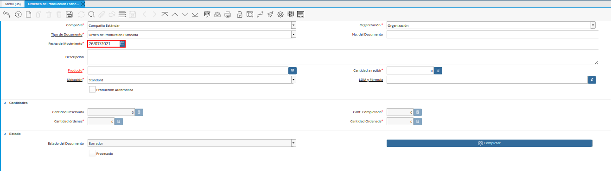
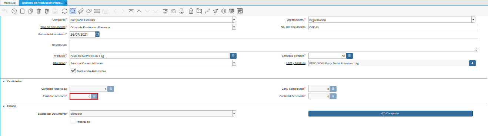
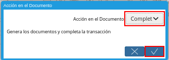

.. _ERPyA: http://erpya.com

.. |Icono Registro Nuevo| image:: resources/new-record-icon.png
.. |Campo Organización de la Ventana Órdenes de Producción Planeadas| image:: resources/field-organization-of-planned-production-orders-window.png
.. |Campo Tipo de Documento de la Ventana Órdenes de Producción Planeadas| image:: resources/document-type-field-in-the-planned-production-orders-window.png

.. |Campo Descripción de la Ventana Órdenes de Producción Planeadas| image:: resources/description-field-of-the-planned-production-orders-window.png

.. |Campo Cantidad a Recibir de la Ventana Órdenes de Producción Planeadas| image:: resources/quantity-field-to-receive-from-the-planned-production-orders-window.png
.. |Checklist Producción Automática de la Ventana Órdenes de Producción Planeadas| image:: resources/automatic-production-checklist-from-planned-production-orders-window.png

.. |Campo LDM y Fórmula de la Ventana Órdenes de Producción Planeadas| image:: resources/ldm-field-and-formula-for-planned-production-orders-window.png
.. |Campo Cantidad Ordenada de la Ventana Órdenes de Producción Planeadas| image:: resources/ordered-quantity-field-in-the-planned-production-orders-window.png
.. |Campo Cantidad Completada de la Ventana Órdenes de Producción Planeadas| image:: resources/quantity-completed-field-of-planned-production-orders-window.png

.. |Icono Guardar Cambios en la Pestaña Lote de Producción de la Ventana Órdenes de Producción Planeadas| image:: resources/save-changes-icon-from-the-production-batch-tab-of-the-planned-production-orders-window.png

.. |Campo Cantidad Ordenada Luego de Completar el Documento| image:: resources/field-ordered-quantity-set-to-complete-the-document.png
.. |Pestaña Producción de la Ventana Órdenes de Producción Planeadas| image:: resources/
.. |Pestaña Línea de Producción de la Ventana Órdenes de Producción Planeadas| image:: resources/
.. _documento/orden-de-producción-planeada:

**Orden de Producción Planeada**
================================

#. Ubique y seleccione en el menú de ADempiere, la carpeta "**Gestión de Materiales**", luego seleccione la carpeta "**Producción Ligera**", por último seleccione la ventana "**Órdenes de Producción Planeadas**".

    |Menú de ADempiere|

    Imagen 1. Menú de ADempiere

#. Podrá visualizar la ventana "**Órdenes de Producción Planeadas**", con todos los registros de órdenes de producción planeadas.

    |Ventana Órdenes de Producción Planeadas|

    Imagen 2. Ventana Órdenes de Producción Planeadas

    #. Seleccione en el icono "**Registro Nuevo**", ubicado en la barra de herramientas de ADempiere, para crear un nuevo registro en la ventana "**Órdenes de Producción Planeadas**".

        |Icono Registro Nuevo|

        Imagen 3. Icono Registro Nuevo

        #. Seleccione en el campo "**Organización**, la organización para la cual esta realizando el documento.

            |Campo Organización de la Ventana Órdenes de Producción Planeadas|

            Imagen 4. Campo Organización de la Ventana Órdenes de Producción Planeadas

        #. Seleccione el tipo de documento a generar en el campo "**Tipo de Documento Destino**", la selección de este define el comportamiento del documento que se esta elaborando, dicho comportamiento se encuentra explicado en el documento :ref:`documento/tipo-documento` elaborado por `ERPyA`_. 

            |Campo Tipo de Documento de la Ventana Órdenes de Producción Planeadas|
            
            Imagen 5. Campo Tipo de Documento de la Ventana Órdenes de Producción Planeadas

        #. Introduzca en el campo "**No. del Documento**", el número de secuencia correspondiente al documento que esta realizando.

            |Campo No del Documento de la Ventana Órdenes de Producción Planeadas|

            Imagen 6. Campo No del Documento de la Ventana Órdenes de Producción Planeadas

            .. note::

                Si no es ingresado ningún valor en este campo, ADempiere tomará el número de documento correspondiente a la secuencia que tiene el tipo de documento establecido.

        #. Seleccione en el campo "**Fecha de Movimiento**", la fecha en la cual fue realizado el movimiento.

            |Campo Fecha de Movimiento de la Ventana Órdenes de Producción Planeadas|

            Imagen 7. Campo Fecha de Movimiento de la Ventana Órdenes de Producción Planeadas

        #. Introduzca en el campo "**Descripción**", una breve descripción de la orden de producción que se encuentra realizando.

            |Campo Descripción de la Ventana Órdenes de Producción Planeadas|

            Imagen 8. Campo Descripción de la Ventana Órdenes de Producción Planeadas

        #. Seleccione en el campo "**Producto**", el producto involucrado en la orden de producción que se encuentra realizando.

            |Campo Producto de la Ventana Órdenes de Producción Planeadas|

            Imagen 9. Campo Producto de la Ventana Órdenes de Producción Planeadas

        #. Introduzca en el campo "**Cantidad a Recibir**", la cantidad a producir del producto seleccionado.

            |Campo Cantidad a Recibir de la Ventana Órdenes de Producción Planeadas|

            Imagen 10. Campo Cantidad a Recibir de la Ventana Órdenes de Producción Planeadas

        #. Destilde el checklist "**Producción Automática**", para que no sean creadas las producciones automáticamente.

            |Checklist Producción Automática de la Ventana Órdenes de Producción Planeadas|

            Imagen 11. Checklist Producción Automática de la Ventana Órdenes de Producción Planeadas

        #. Seleccione en el campo "**Ubicación**", la ubicación exacta en la cual se encontrará el producto en el almacén.

            |Campo Ubicación de la Ventana Órdenes de Producción Planeadas|

            Imagen 12. Cam Ubicación de la Ventana Órdenes de Producción Planeadas

        #. Seleccione en el campo "**LDM y Fórmula**", la lista de materiales y la fórmula necesaria para la producción del producto.

            |Campo LDM y Fórmula de la Ventana Órdenes de Producción Planeadas|

            Imagen 13. Campo LDM y Fórmula de la Ventana Órdenes de Producción Planeadas

        #. Podrá visualizar en el campo "**Cantidad Ordenada**", la cantidad ordenada del producto.

            |Campo Cantidad Ordenada de la Ventana Órdenes de Producción Planeadas|

            Imagen 14. Campo Cantidad Ordenada de la Ventana Órdenes de Producción Planeadas

        #. Podrá visualizar en el campo "**Cant. Completada**", la cantidad realizada por completo del producto.

            |Campo Cantidad Completada de la Ventana Órdenes de Producción Planeadas|

            Imagen 15. Campo Cant Completada de la Ventana Órdenes de Producción Planeadas

        #. Podrá visualizar en el campo "**Cantidad Órdenes**", la cantidad solicitada del producto en órdenes.

            |Campo Cantidad Órdenes de la Ventana Órdenes de Producción Planeadas|

            Imagen 16. Campo Cantidad Órdenes de la Ventana Órdenes de Producción Planeadas

    #. Seleccione el icono "**Guardar Cambios**", ubicado en la barra de herramientas de ADempiere, para guardar el registro de los campos de la pestaña **Lote de Producción**".

        |Icono Guardar Cambios en la Pestaña Lote de Producción de la Ventana Órdenes de Producción Planeadas|

        Imagen 17. Icono Guardar Cambios en la Pestaña Lote de Producción de la Ventana Órdenes de Producción Planeadas

#. Seleccione la opción "**Completar**", para completar el documento "**Orden de Producción Planeada**" realizado.

    |Opción Completar de la Pestaña Lote de Producción de la Ventana Órdenes de Producción Planeadas|

    Imagen 18. Opción Completar de la Pestaña Lote de Producción de la Ventana Órdenes de Producción Planeadas

#. Seleccione la acción "**Completar**" y la opción "**OK**", para completar el proceso.

    |Acción Completar y Opción OK|

    Imagen 19. Acción Completar y Opción OK de la Pestaña Lote de Producción de la Ventana Órdenes de Producción Planeadas

#. Podrá visualizar en el campo "**Cantidad Ordenada**", la cantidad de productos ordenados en el documento "**Orden de Producción Planeada**".

    |Campo Cantidad Ordenada Luego de Completar el Documento|

    Imagen 20. Campo Cantidad Ordenada Luego de Completar el Documento

**Producción**
--------------

#. Por cada producción completada en la pestaña "**Encabezado de Producción**", de la ventana "**Producción**", es generado automáticamente un registro general en la pestaña "**Producción**", de la ventana "**Órdenes de Producción Planeadas**".

    |Pestaña Producción de la Ventana Órdenes de Producción Planeadas|

    Imagen 21. Pestaña Producción de la Ventana Órdenes de Producción Planeadas

**Línea de Producción**
***********************

#. De igual manera, es generado automáticamente un registro detallado en la pestaña "**Línea de Producción**", de la ventana "**Órdenes de Producción Planeadas**", por cada producto asociado a la producción.

    |Pestaña Línea de Producción de la Ventana Órdenes de Producción Planeadas|

    Imagen 22. Pestaña Línea de Producción de la Ventana Órdenes de Producción Planeadas