.. _ERPyA: http://erpya.com
.. |Menú de Producción| image:: resources/production-menu.png
.. |Ventana Producción| image:: resources/production-window.png
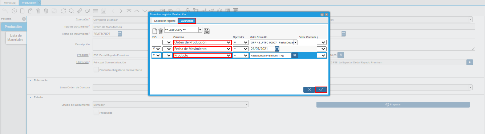

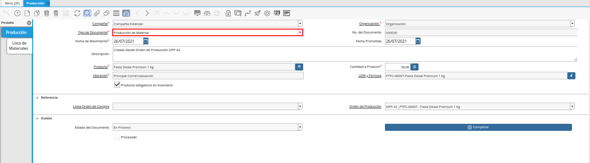
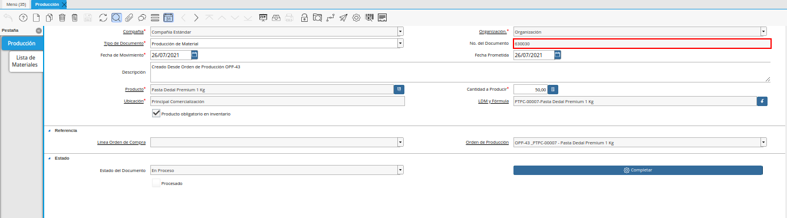
.. |Campo Fecha de Movimiento de la Ventana Producción| image:: resources/production-window-movement-date-field.png
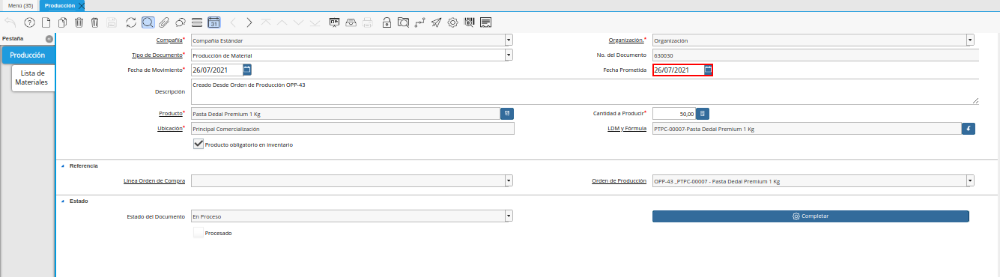
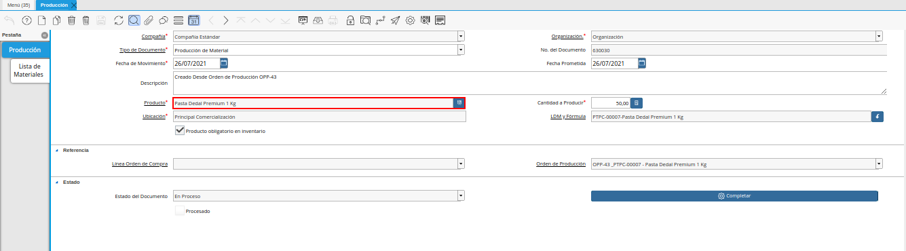
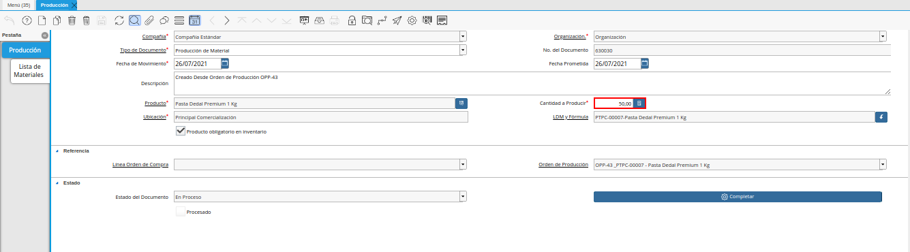
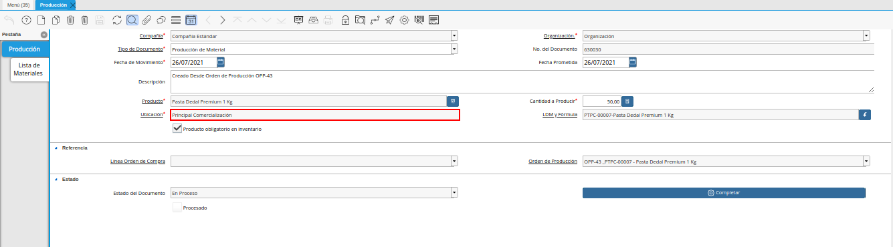
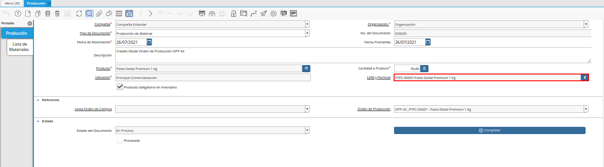
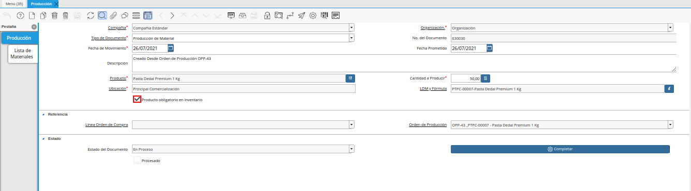
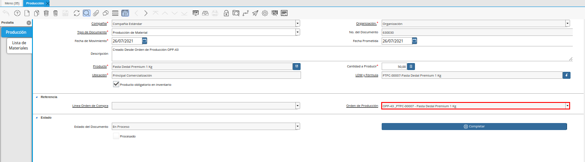
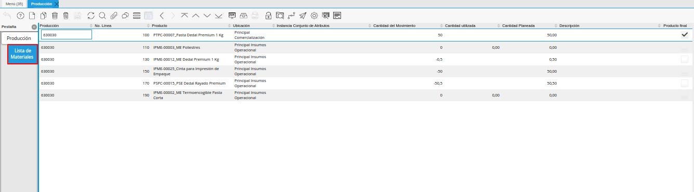
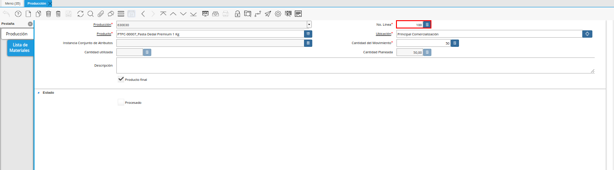
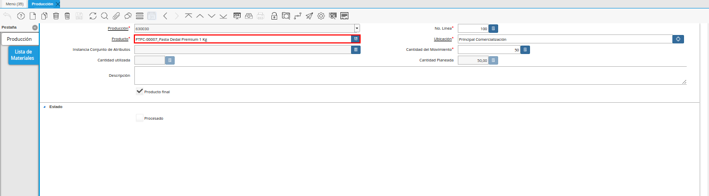
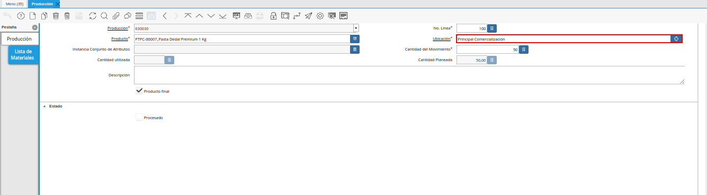
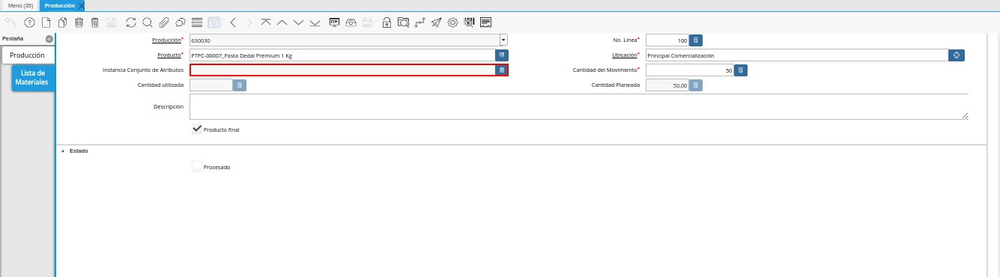
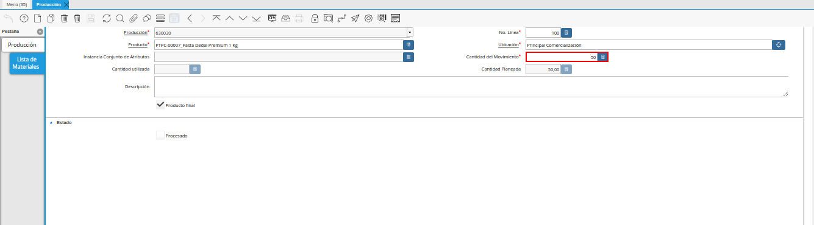
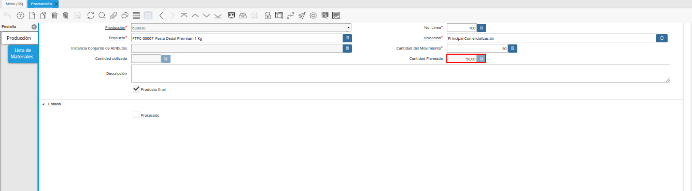
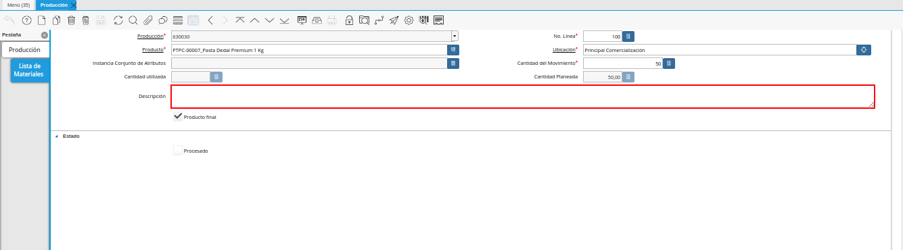
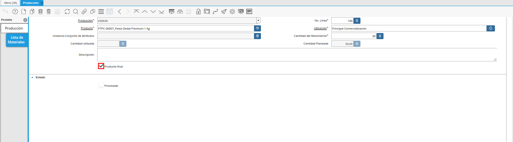
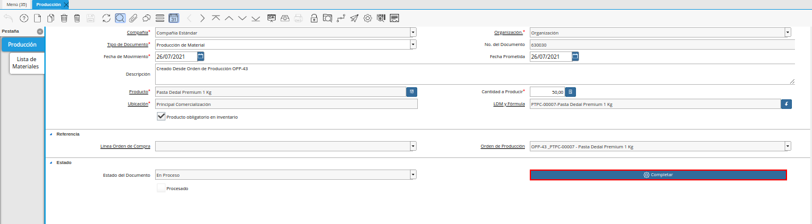
.. |Acción Completar y Opción OK| image:: resources/action-complete-and-option-ok.png
.. _documento/producción:

**Producción**
==============

Es el resultado de varias fases de trabajo que se llevan a cabo en una determinada empresa, también es llamado proceso de manufactura, esta es la base o el recurso principal para el ingreso monetario.

Todos los procesos que se llevan a cabo en una empresa estan relacionados directa o indirectamente con el mismo, en tal sentido, la mano de obra puede ser considerada como directa o indirecta dentro del proceso.

La manufactura es originada desde una planificación previa, estimando metas u objetivos de producción que serán producto de control dentro de los turnos que conforman la producción, el resultado de los mismos determinan la estabilidad de una empresa y la disponibilidad de los productos terminados para la venta.

Una vez realizada la "**Orden de Producción Planeada**", al ser completada generará un registro de producción que validará y ejecutará la producción del producto terminado en ADempiere, dando así la entrada o existencia de dicho producto y las salidas de los componentes utilizados para la producción del mismo; El registro de producción es donde se definirá la cantidad a producir real, ya que al momento de ejecutar una producción suele suceder varios escenarios que pueden alterar la cantidad a producir y esta puede ser menor a la que se estimaba en la "**Orden de Producción Planeada**". A continuación se presenta el siguiente escenario para comprender mejor el procedimiento de la producción:

    La empresa "**ABC Estándar C.A**", ha realizado la "**Orden de Producción Planeada**" número "**OPP-43**" por el producto "**Pasta Dedal Premium 1 Kg**", dicha empresa estima producir para el día "**26/07/2021**" un total de "**50 Unidades**". La producción se ejecutó dentro de la compañía por el total estimado (50 Unidades) y se requiere reflejar en el registro de producción la producción total del producto terminado.

Para ubicar el registro de la producción generada desde la "**Orden de Producción Planeada**" se deben realizar los siguientes pasos:

Ubique y seleccione en el menú de ADempiere, la carpeta "**Gestión de Materiales**", luego seleccione la ventana "**Producción**".

    |Menú de Producción|

    Imagen 1. Menú de ADempiere

Podrá visualizar la ventana "**Producción**", con diferentes registros de producción.

    |Ventana Producción|

    Imagen 2. Ventana Producción

Para ubicar el registro de producción generado desde la orden de producción, se selecciona el icono "**Buscar**" ubicado en la barra de herramientas de ADempiere, al visualizar la ventana de búsqueda, se selecciona la pestaña "**Avanzado**", para filtrar la búsqueda por las siguientes opciones en base a la información que posea en su momento de la producción:

    - Orden de Producción: Si posee información del número de documento de la "**Orden de Producción Planeada**" se puede utilizar este criterio de búsqueda para ubicar la producción generada desde ese registro, ejemplo:

        - Siguiendo el escenario comentado en esta documentación, se tiene la orden de producción planeada "**OPP-43**" por lo que el valor a colocar en este campo sería "**OPP-43**".

    - Fecha del Movimiento o Fecha Prometida: Si posee la información de la fecha que tiene asociada la orden de producción planeada, esta podría ser utilizada para ubicar el registro de producción generado desde ese registro, ejemplo:

        - Siguiendo el escenario comentado en esta documentación, la orden de producción planeada fue realizada y completada el día "**26/07/2021**", lo que generó el registro de producción a la misma fecha.

    - Producto: Este criterio de búsqueda puede ser utilizado para filtrar en base a los registros de producción que tengan asociados dicho producto, ejemplo:

        - Siguiendo el escenario comentado en esta documentación, la orden de producción planeada fue realizada y completada con el producto terminado "**Pasta Dedal Premium 1 Kg**", por lo que este sería el valo a ingresar en dicho campo.

        .. note::

            Si desea utilizar ese único parámetro como criterio de búsqueda, ADempiere mostrará todos los registros que estén en la ventana "**Producción**" que tengan asociado dicho producto, por ello recomendamos que la búsqueda sea mas directa, esto se puede hacer agregando otro criterio de búsqueda como lo es la "**Fecha del Movimiento o Fecha Prometida**".

    |búsqueda de registro de producción|

    Imagen 3. Búsqueda de Registro de Producción

La pestaña "**Avanzado**" de la opción de búsqueda de ADempiere, cuenta con muchos más filtros que pueden servir para encontrar el registro de producción.

.. note::

    Del mismo modo, otra manera de ubicar el registro de "**Producción**" es seleccionando el icono "**Visualiza Detalle (Donde es Usado)**" ubicado en la barra de herramientas de ADempiere, desde la ventana "**Orden de Producción Planeada**", para más información puede consultar el material :ref:`documento/orden-de-producción-planeada`.

Al ubicar el registro de producción, podrá observar que este se encuentra en estado "**En Proceso**" ya que algunos datos pueden ser modificados. A continuación se detallan los siguientes campos que posee la ventana "**Producción**".

    |registro de producción desde orden|

    Imagen 4. Registro de Producción

El campo "**Tipo de Documento**" indica el tipo de documento que identifica el registro de la producción. En este caso el tipo de documento a mostrar es "**Producción de Material**".

    |campo tipo de documento de la ventana producción|

    Imagen 5. Campo Tipo de Documento

El campo "**No. del Documento**" es un valor único, asignado a los registros que se encuentran en la ventana "**Producción**", este se genera de manera automática en ADempiere y a medida que se realicen y guarden los registros la secuencia del número de documento ira incrementado.

    |Campo No del Documento de la Ventana Producción|

    Imagen 6. Campo No. del Documento

El campo "**Fecha de Movimiento**", indica la fecha en la cual se realizó o ejecutó la producción realmente, reflejando a esta fecha en ADempiere la salida de los insumos de producción y la entrada del producto terminado. Siguiendo el escenario comentado en esta documentación, se tiene una "**Orden de Producción Planeada**" con fecha del "**26/07/2021**" y la producción se ejecutó ese mismo día. Es decir, que la fecha que se encuentra en el campo "**Fecha de Movimiento**" del registro de producción no será modificado por que cumple con lo realizado en sitio. 

    .. note::
    
        Es muy importante reflejar en ADempiere las fechas reales ya que al momento de realizar una auditoría los registros que se encuentren en ADempiere deben coincidir con la realidad, ejemplo:

        - Al completar la "**Orden de Producción Planeada**" si esta tiene fecha del "**26/07/2021**" el registro de producción generado desde esa orden tomará la misma fecha (26/07/2021). Sin embargo, si suele suceder alguna eventualidad que no permite ejecutar en sitio la producción, esa fecha puede ser modificada y ajustada a la fecha real de la producción.

    |Campo Fecha de Movimiento de la Ventana Producción|

    Imagen 7. Campo Fecha de Movimiento de la Ventana Producción

El campo "**Fecha Prometida**", indica la fecha para la cual fue prometida la producción del producto. Esta fecha debe ser siempre la misma que la de la "**Orden de Producción Planeada**". Aun así la producción no se ejecute a la misma fecha que se estimó en la orden de producción, este campo mantendrá su fecha. Siguiendo el escenario de la documentación, la "**Orden de Producción Planeada**" se realizó con fecha del "**26/07/2021**" lo que el registro de producción generado desde esa orden de producción tomará y deberá mantener esa misma fecha.

    .. note::

        Si la producción en sitio no fue realizada a la misma fecha de la producción, la fecha de este campo "**Fecha Prometida**" no será modificada, se mantendrá la misma fecha de la "**Orden de Producción**" que tenga asociada, y en tal caso la fecha que se tendría que modificar es la del campo "**Fecha del Movimiento**".

    |Campo Fecha Prometida de la Ventana Producción|

    Imagen 8. Campo Fecha Prometida de la Ventana Producción

Podrá visualizar que el campo "**Producto**", donde se debe ingresar el producto correspondiente a la producción que se requiere, se encuentra en sólo lectura ya que su valor será ingresado automáticamente desde la orden de producción.

    |Campo Producto de la Ventana Producción|

    Imagen 9. Campo Producto de la Ventana Producción

En el campo "**Cantidad a Producir**", se mostrará o se agregará la cantidad a producir realmente del producto terminado; la cantidad de la producción mostrada en este campo debe ser la cantidad ingresada en la "**Orden de Producción Planeada**". 

    .. note::

        Sin embargo, si la producción presenta alguna eventualidad por la cual no se pudo ejecutar el total de la producción, podrá ser modificado el valor en dicho campo. Si la cantidad es modificada, el registro de la producción debe ser "**Completado**" o "**Preparado**" para que este calcule nuevamente la cantidad de insumos a utilizar y la cantidad del producto terminado. Es muy importante tener en cuenta que, si es utilizada la acción de documento "**Preparar**", el registro de producción aún quedará activo y modificable lo que para ADempiere aun ese registro de producción no es válido. Sin embargo, el registro puede pasar a ser válido si este es completado, lo que para ADempiere daría la entrada al producto terminado y la salida a los insumos de producción.

    |Campo Cantidad a Producir de la Ventana Producción|

    Imagen 10. Campo Cantidad a Producir

    .. note::

        Al encontrarse la producción en estado "**Proceso**", los insumos de producción estarán como cantidad reservada y el producto terminado como cantidad ordenada.

En el campo "**Ubicación**", se visualiza la ubicación exacta donde se encontrará el producto terminado una vez se cumpla la producción, esta ubicación la tomará automáticamente de la orden de producción.

    |campo ubicación de la ventana producción|

    Imagen 11. Campo Ubicación

En el campo "**LDM y Fórmula**", se visualiza la lista de materiales que tiene asociada el producto terminado, esta :ref:`documento/lista-de-materiales` es definida en el producto y asociada en la :ref:`documento/orden-de-producción-planeada`.

    |campo ldm y fórmula de la ventana producción|

    Imagen 12. Campo LDM y Fórmula

El check "**Producto obligatorio en inventario**", al estar activo válida que todos los insumos de producción en ADempiere tengan cantidades en existencia, al estar desactivado no valida que los insumos tengan cantidades en existencia.

    |check producto obligatorio en inventario de la ventana producción|

    Imagen 13. Check Producto Obligatorio en Inventario

En el campo "**Orden de Producción**", se visualiza el número de la orden de producción desde la cual fue realizado el registro de producción. Siguiendo el escenario de la documentación la "**Orden de Producción Planeada**" que generó el registro de producción es la "**OPP-43**".

    |campo orden de producción de la ventana producción|

    Imagen 14. Campo Orden de Producción

Hasta este punto se visualiza solo el encabezado de la producción, para ver el detalle de los insumos asociados la producción y el producto terminado se debe posicionar en la pestaña "**Lista de Materiales**" de la ventana "**Producción**"

.. note::

    En el campo "**Producción**", se indica el número de la producción donde se encuentra trabajando.

    |pestaña lista de materiales de la ventana producción|

    Imagen 15. Pestaña Lista de Materiales

    .. note::

        Para cambiar la vista de la pestaña "**Lista de Materiales**", se debe seleccionar el icono "**Cambiar Mono/Multi Registro**".

En el campo "**No. Línea**", se indica el número de línea correspondiente al registro que está realizando. En este caso, como es el primer registro el número registro a observar es el "**10**" ya que ADempiere trabaja la enumeración de registro de 10 en 10.

    |campo número de línea de la ventana producción|

    Imagen 16. Campo No. Línea

En el campo "**Producto**", se visualiza el nombre del producto que se encuentra asociado a la línea de la producción este puede ser el nombre del insumo de producción o el producto terminado.

    |campo producto de línea de la ventana producción|

    Imagen 17. Campo Producto

En el campo "**Ubicación**", podrá visualizar el nombre de la ubicación donde se trabajará el producto. Si el producto es terminado la ubicación a mostrar es la misma que la seleccionada en la orden de producción lo que indica que en esa ubicación se almacenará y se encontrará la existencia del producto terminado. Si el producto es un insumo de producción la ubicación a mostrar es la que tiene configurada el producto en la ventana producto, lo que quiere decir que desde esa ubicación se generará la salida del insumo para la producción. Ejemplo:

    - En el encabezado de la ventana "Producción " se encuentra la ubicación "Principal Comercialización" esta es la ubicación donde se almacenará el producto terminado y es la  misma ubicación que tomará el producto terminado en el campo ubicación e la pestaña "Lista de Materiales".

    - Al momento de crear los insumos de producción en la ventana "Producto" se le asigna una ubicación, esta ubicación será la utilizada en la producción para sacar las cantidades y poder generar el producto terminado.

    |campo ubicación de la línea de la ventana producción|

    Imagen 18. Campo Ubicación

El valor en el campo "**Instancia Conjunto de Atributos**", es la instancia o característica única que se le asigna al producto terminado, estas instancias comúnmente son utilizadas para identificar con una característica única y especial el producto, ejemplo:

    - El número de lote de la fabricación de ese producto es una instancia de conjunto de atributos, ya que se producirá el mismo producto pero con una instancia o característica diferente que es el número de lote de ese producto.

    |campo instancia conjunto de atributos de la ventana producción|

    Imagen 19. Campo Instancia Conjunto de Atributos

El campo "**Cantidad del Movimiento**", indica la cantidad real a producir o utilizar para la producción, ejemplo:

    - Si la cantidad esta asociada a la línea del registro del producto terminado entonces la "**Cantidad en Movimiento**" es la cantidad a producir de ese producto y esta se mostrará en positivo.

    - Si la cantidad esta asociada a la línea del registro del insumo de producción entonces la "**Cantidad en Movimiento**" es la cantidad a utilizar para producir el producto terminado, esta se mostrará con un signo negativo porque es la salida del insumo.

    .. note::

        La cantidad en este campo puede cambiar o variar según lo realizado en sitio.

    |campo cantidad del movimiento de la ventana producción|

    Imagen 20. Campo Cantidad del Movimiento

El campo "**Cantidad Planeada**", indica la cantidad planeada a producir.

    |campo cantidad planeada de la ventana producción|

    Imagen 21. Campo Cantidad Planeada

En el campo "**Descripción**" se puede agregar alguna descripción o información que sea necesaria para el detalle del registro por línea el producto terminado o del registro del insumo de producción. Este se puede dejar en blanco ya que no es obligatorio.

    |campo descripción de la ventana producción|

    Imagen 22. Campo Descripción

El check "**Producto Final**", indica si el producto asociado al registro de la línea es el producto terminado. Todos los productos terminados tendrán activo este check para indicar en ADempiere que es el producto a producir.

    |check producto final de la ventana producción|

    Imagen 23. Check Producto Final

El check "**Procesado**" se activará una vez la producción se complete, lo cual indica que todo ha sido procesado.

Regrese a la pestaña principal "**Producción**" y seleccione la opción "**Completar**", para completar el documento "**Producción**" realizado.

    |Opción Completar de la Ventana Producción|

    Imagen 24. Opción Completar de la Ventana Producción

Seleccione la acción "**Completar**" y la opción "**OK**", para completar el proceso.

    |Acción Completar y Opción OK|

    Imagen 25. Acción Completar y Opción OK